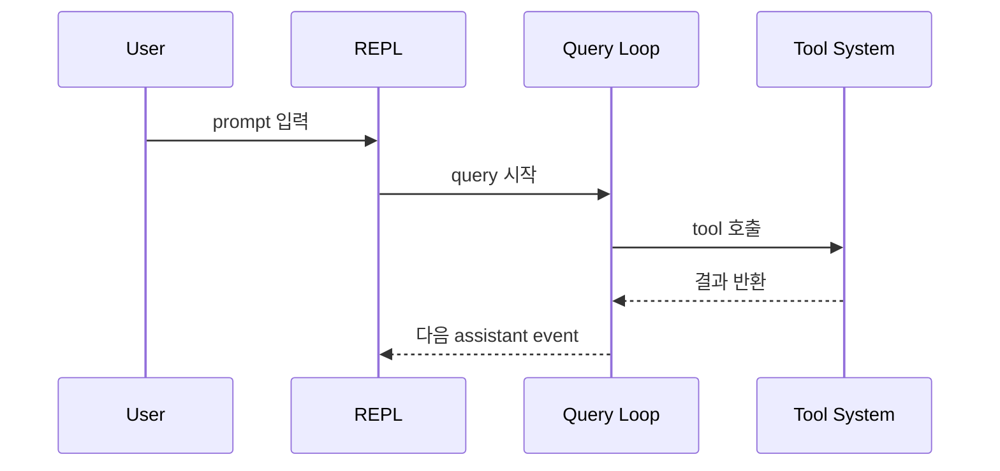

# 01. 이 책을 읽는 법

> Why this chapter exists: 이 문서세트를 source 해설 메모가 아니라 harness engineering 교재로 읽기 위한 독서 규칙을 고정한다.
> Reader level: beginner / advanced / reviewer
> Last verified: 2026-04-06
> Freshness class: medium
> Reader path tags: `first-pass` / `builder` / `reviewer` / `source-first` / `volatile re-check`
> Source tier focus: Tier 1-3 external sources로 claim 무게를 잡고, Tier 6 observed artifact로 사례를 닫는다.
> Reference scaffolds: [README.md](../README.md), [02-source-analysis-method.md](02-source-analysis-method.md), [03-references.md](03-references.md), [../08-reference/](../08-reference/)

## 장 요약

이 문서는 이 문서 세트를 책으로 읽기 위한 서문이자 독서 규칙집이다. 이 책은 Claude Code를 대표 사례로 삼지만, 궁극적으로는 장기 실행형 에이전트 하네스를 설계하고 평가하는 언어를 독자에게 넘기는 것을 목표로 한다. 따라서 독자는 각 장을 읽을 때 "이 파일이 무엇을 하는가"만 묻지 않고, "이 구조가 어떤 운영 문제를 해결하는가", "이 문제를 일반적인 하네스 설계 언어로 어떻게 바꿔 읽을 수 있는가", "내 시스템과 비교할 때 어떤 benchmark 질문을 던져야 하는가"까지 함께 물어야 한다.

이 장은 다섯 가지를 먼저 고정한다. 첫째, 독자용 출판 범위와 내부 작업 문서의 경계를 나눈다. 둘째, `README`, 이 문서, 방법론 문서, references, glossary의 역할을 구분한다. 셋째, 이 책이 사용하는 주장 층위와 출처 규칙을 설명한다. 넷째, 원칙 spine과 사례 spine을 어떻게 왕복할지 정리한다. 다섯째, 코드 블록과 Mermaid를 어떤 증거 규칙 아래 읽어야 하는지 짚는다.

## Reader-path baseline

- `first-pass`: [README.md](../README.md) -> 이 장 -> [02-source-analysis-method.md](02-source-analysis-method.md) -> [03-references.md](03-references.md) -> foundations -> 관심 있는 Part guide
- `builder`: foundations 핵심 장 뒤에 관련 Part guide와 Claude Code 사례 장을 바로 붙여 읽는다.
- `reviewer`: [03-references.md](03-references.md), [../08-reference/01-glossary.md](../08-reference/01-glossary.md), [../08-reference/02-key-file-index.md](../08-reference/02-key-file-index.md)를 옆에 두고 claim tier와 provenance를 같이 본다.
- `source-first`: [../07-evaluation-and-synthesis/08-benchmark-oriented-code-reading-guide.md](../07-evaluation-and-synthesis/08-benchmark-oriented-code-reading-guide.md)에서 질문을 고르고, 필요한 appendix와 사례 장으로 들어간다.
- `volatile re-check`: settings, MCP, tracing, remote, eval tooling처럼 drift 가능성이 큰 주제를 만질 때는 [03-references.md](03-references.md)의 watchlist와 proposal `S*` IDs를 먼저 다시 확인한다.

## 5분 멘탈 모델

처음 읽는 독자는 아래 한 장면부터 고정하면 된다.

1. session start
2. context assembly
3. control loop
4. tool and operator surface
5. state, resumability, and boundaries
6. eval and synthesis

이 책의 각 Part는 이 여섯 조각 중 하나를 자세히 설명한다. Claude Code 사례 장은 그 조각이 실제 제품 runtime에서 어떻게 드러나는지 보여 주는 절단면이다.

## 처음 읽는 독자를 위한 아주 짧은 시작점

이 장이 길게 느껴진다면 먼저 아래 다섯 가지만 잡고 시작해도 된다.

1. 이 책은 Claude Code를 정답으로 찬양하는 문서가 아니라, 하네스 설계 사례를 읽는 책이다.
2. `관찰`은 코드에서 직접 확인한 사실이고, `해석`은 그 사실을 설계 언어로 올린 문장이다.
3. giant file은 처음부터 끝까지 읽지 말고, 질문에 맞는 절단면만 읽는다.
4. 처음에는 [README.md](../README.md), 이 문서, [02-source-analysis-method.md](02-source-analysis-method.md), [03-references.md](03-references.md)를 함께 놓고 보는 편이 안전하다.
5. substantive chapter update는 proposal에 정리된 공식 출처를 먼저 다시 확인한 뒤 반영해야 한다.

나머지 본문은 이 다섯 문장을 더 엄밀하게 풀어 쓴 규칙집이라고 생각하면 된다.

## 독자용 범위

이 장이 전제하는 독자용 범위는 `README.md`가 가리키는 reader-facing corpus 전체다. 다음 경로는 이 책의 내부 제작 산출물로 간주하며 독자용 독서 경로에서 제외한다.

- `superpowers/**`

즉, 이 문서는 "무슨 파일이 문서 루트 아래에 존재하는가"를 다루는 것이 아니라, "어떤 문서가 이 책의 출판 범위를 이루는가"를 먼저 고정한다.

## Freshness baseline

- reader-entry layer는 `README`, 이 장, [02-source-analysis-method.md](02-source-analysis-method.md), [03-references.md](03-references.md), 각 `00-part-guide.md`, `08-reference/**`가 함께 맡는다.
- volatile topic은 Part guide에서 먼저 경고하고, 장별 세부 확인 내역은 `Sources / evidence notes`에 남긴다.
- major edit에서는 checked docs list, checked release notes window, observed artifact snapshot identifiers, changed chapters를 evidence-pack 메모로 남긴다.

## 왜 이 장이 필요한가

이 책은 코드 설명과 설계 교재를 동시에 수행한다. 코드는 구체적이고 지역적이며, 설계 원칙은 추상적이고 횡단적이다. Claude Code 같은 큰 하네스 사례를 읽을 때는 두 층을 어떻게 왕복할지 먼저 배워야 한다. 그렇지 않으면 독자는 제품 사실을 곧바로 설계 권고로 오해하거나, 반대로 일반 원칙을 제품 사실처럼 읽게 된다.

이 장을 떠받치는 자료 범주는 세 가지다.

1. 제품-근접 공개 원칙
2. 공식 제품 문서와 프로토콜 사양
3. 연구 보강 자료

대표 자료 목록과 canonical source registry는 [03-references.md](03-references.md)에 모아 두었다. 이 장의 역할은 개별 source를 모두 다시 나열하는 데 있지 않다. 더 중요한 일은 "이 책이 무엇을 근거로 무엇을 말하는가"를 독자가 헷갈리지 않게 만드는 것이다.

## 이 장의 범위

- `README.md`, 이 문서, 방법론 문서, references, glossary의 역할 구분
- 독자용 출판 범위와 제외 범위
- 원칙 spine과 사례 spine을 함께 읽는 기본 규칙
- 제품 사실, 공개 설계 원칙, 저자 해석, 설계 권고의 구분
- 외부 1차 자료의 인용과 버전 고정 규칙
- 코드 블록과 Mermaid를 읽는 법
- 독자 목적별 최소 독서 경로

## 이 장을 읽기 위한 최소 환경

이 장은 독자가 별도 source tree 없이도 읽을 수 있다고 가정한다. 필요한 것은 reader-facing corpus 자체뿐이다.

- [README.md](../README.md)와 본문, 부록 링크를 따라갈 수 있다
- 본문에 인용된 코드 블록과 표를 근거로 읽을 수 있다
- 필요할 때만 provenance label을 "원 upstream 공개 사본의 위치 메모"로 해석하면 된다

## 이 장의 비범위

- Claude Code 각 서브시스템의 완전한 구현 설명
- 특정 source file의 전수 조사
- 구현 변경 제안 자체
- 벤치마크 루브릭의 완전한 제시

## 먼저 알아둘 역할 분담

이 책의 입구에서는 다섯 문서가 서로 다른 역할을 맡는다.

- [README.md](../README.md)
  메인 인덱스다. 독자용 범위, Part 지도, 시작 경로, volatile topic 경고를 가장 빨리 보여준다.
- [01-how-to-read-this-book.md](01-how-to-read-this-book.md)
  서문이자 독서 규칙 장이다. reading model, claim status, reader path를 설명한다.
- [02-source-analysis-method.md](02-source-analysis-method.md)
  source weight, freshness class, evidence protocol, diagram discipline을 설명한다.
- [03-references.md](03-references.md)
  공식 문서, 엔지니어링 글, 사양, 프레임워크 문서, 연구 자료의 canonical registry다.
- [01-glossary.md](../08-reference/01-glossary.md)
  반복되는 핵심 용어를 정의와 차이, confusable terms와 함께 모은다.

즉, `README`는 길 안내를 하고, `01`은 읽는 법을 가르치며, `02`는 근거 규칙을 설명하고, `03`은 source를 고정하며, glossary는 용어를 정리한다.

## 원칙 spine과 사례 spine을 함께 읽는 법

이 책에는 두 개의 spine이 동시에 존재한다.

1. 원칙 spine
   `01-foundations/**`부터 `07-evaluation-and-synthesis/**`까지의 일반론과 synthesis 장들이다. 하네스 설계의 일반 언어를 만든다.
2. 사례 spine
   각 Part 안의 `claude-code-` 사례 장들과 종합 시나리오 장이다. Claude Code 공개 사본에서 그 언어가 실제로 어떻게 드러나는지 보여준다.

처음 읽는 독자에게는 원칙 spine이 개념을 세우고, 사례 spine이 그 개념을 코드 절단면에 붙이는 구조라고 생각하면 가장 안전하다. 이미 코드를 읽는 중인 독자라면 반대로 사례 spine에서 질문을 발견하고 원칙 spine으로 되돌아가도 된다.

간단한 예시는 다음과 같다.

| 문제 영역 | 원칙 spine | 사례 spine |
| --- | --- | --- |
| context와 control | [01-context-as-an-operational-resource.md](../03-context-and-control/01-context-as-an-operational-resource.md) | [05-claude-code-context-assembly-and-query-pipeline.md](../03-context-and-control/05-claude-code-context-assembly-and-query-pipeline.md), [06-claude-code-query-engine-and-turn-lifecycle.md](../03-context-and-control/06-claude-code-query-engine-and-turn-lifecycle.md) |
| tool과 permission | [01-tool-contracts-and-the-agent-computer-interface.md](../04-interfaces-and-operator-surfaces/01-tool-contracts-and-the-agent-computer-interface.md), [02-tool-shaping-permissions-and-capability-exposure.md](../04-interfaces-and-operator-surfaces/02-tool-shaping-permissions-and-capability-exposure.md) | [07-claude-code-tool-system-and-permissions.md](../04-interfaces-and-operator-surfaces/07-claude-code-tool-system-and-permissions.md) |
| evaluator-driven harness | [05-evaluator-driven-harness-design.md](../01-foundations/05-evaluator-driven-harness-design.md), [06-contract-based-qa-and-skeptical-evaluators.md](../07-evaluation-and-synthesis/06-contract-based-qa-and-skeptical-evaluators.md) | [07-claude-code-end-to-end-scenarios.md](../07-evaluation-and-synthesis/07-claude-code-end-to-end-scenarios.md), [08-benchmark-oriented-code-reading-guide.md](../07-evaluation-and-synthesis/08-benchmark-oriented-code-reading-guide.md) |
| end-to-end synthesis | [03-benchmarking-long-running-agent-harnesses.md](../07-evaluation-and-synthesis/03-benchmarking-long-running-agent-harnesses.md) | [07-claude-code-end-to-end-scenarios.md](../07-evaluation-and-synthesis/07-claude-code-end-to-end-scenarios.md) |

Part 지도와 reader-facing 범위는 항상 [README.md](../README.md)를 우선 기준으로 본다.

## 근거의 종류와 문장의 종류를 함께 읽는 법

이 장에는 두 개의 분류 체계가 나온다.

1. 근거의 종류
   제품-근접 공개 원칙, 공식 제품 문서, 연구 보강 자료
2. 문장의 종류
   관찰, 원칙, 해석, 권고, 확인 불가

이 둘은 같은 분류표가 아니다. 첫째는 "무슨 자료를 읽는가"를, 둘째는 "그 자료를 바탕으로 어떤 문장을 쓰는가"를 뜻한다.

| 근거의 종류 | 주로 정당화하는 문장 | 주의점 |
| --- | --- | --- |
| 제품 사실을 담은 공개 스냅샷 | `관찰:` | 스냅샷 밖의 구현을 단정하지 않는다 |
| 제품-근접 공개 원칙 | `원칙:` | 스냅샷 사실을 덮어쓰지 않는다 |
| 공식 제품 문서 | `원칙:` 또는 보조 설명 | 제품 surface 설명에 유용하지만 운영 현실과 직접 같다고 단정하지 않는다 |
| 연구 보강 자료 | `해석:`을 넓히는 보강 | 사례에 바로 덮어쓰지 않고 비교 프레임으로 쓴다 |

저자 작업은 별도로 읽어야 한다.

| 저자 작업 | 보통 만들어지는 문장 | 주의점 |
| --- | --- | --- |
| 근거 결합 | `해석:` | 최소 하나 이상의 관찰 또는 원칙과 연결한다 |
| 독자 질문 생성 | `권고:` 또는 벤치마크 질문 | 정답이 아니라 점검 질문으로 읽는다 |

즉, `원칙:`은 주로 외부 자료에 기대고, `관찰:`은 스냅샷에 기대며, `해석:`과 `권고:`는 앞선 층위를 연결해 만들어진다.

## 이 판이 전제하는 것

1. 분석 대상은 완전한 개발 저장소가 아니라 공개 사본의 source tree 중심 스냅샷이다.
2. 스냅샷에 없는 테스트 인프라, 배포 설정, 과거 git 이력은 문서의 핵심 근거가 아니다.
3. Claude Code는 사례이지 정답이 아니다.
4. 이 책은 사례 설명 위에 일반 원칙과 벤치마크 질문을 겹쳐 쓰는 방식으로 전개된다.
5. 같은 source file이 여러 장에 등장할 수 있지만, 장마다 설명하려는 설계 문제가 다르다.

## 출처와 버전 고정 규칙

이 책은 "무슨 텍스트를 기준으로 읽는가"를 명시하려고 한다.

### 코드 스냅샷

- 커밋 해시나 태그가 제공되면 그것을 쓴다.
- 커밋 해시가 없는 공개 배포본이면 `현재 공개 사본`과 기준 날짜를 함께 적는다.
- git 이력이 없는 배포본에서는 "커밋 의도"를 본문 주장의 근거로 삼지 않는다.

### 외부 1차 자료

- URL과 발행일 또는 접근 시점을 함께 적는다.
- 제목이 바뀔 수 있으므로, 링크를 제목과 함께 남긴다.
- canonical registry는 [03-references.md](03-references.md)에 유지한다.
- 외부 원칙이 local code 사실을 덮어쓰지 않게, 항상 `관찰`과 `원칙`을 분리한다.

## 주장 층위 네 가지와 보조 표지 하나

이 책을 읽을 때 가장 먼저 익혀야 할 것은 "문장이 같은 종류가 아니다"라는 사실이다. 기술 교재에서 흔히 생기는 오해는 제품 사실, 저자 해석, 일반화된 권고를 모두 같은 수준의 진술처럼 읽는 데서 나온다. 이 책은 네 층의 문장을 구분해서 읽는 것을 기본 규칙으로 삼는다. 여기에 더해, 스냅샷이나 외부 자료만으로는 확정할 수 없는 내용을 표시하는 `확인 불가:`라는 보조 표지를 함께 쓴다.

### 제품 사실

공개 사본 source tree에서 직접 확인 가능한 사실이다.

예:

- 특정 함수가 존재한다
- 특정 분기나 기능 게이트가 있다
- 어떤 상태 값이 query loop 안에서 갱신된다
- 어떤 파일이 어떤 다른 파일을 import한다

이 책에서는 제품 사실을 실제 문장으로 적을 때 보통 `관찰:` 표지로 드러낸다. 즉, `제품 사실`은 개념 이름이고, `관찰:`은 그 개념을 문장으로 표기할 때 쓰는 표지어다.

### 공개 설계 원칙

Anthropic engineering 글이나 공식 문서가 직접 설명하는 원칙이다.

요약 예시:

- long-running agents는 clean state와 handoff artifact가 중요하다는 원칙
- agent와 workflow를 구분해야 한다는 원칙
- eval에서 transcript와 task definition이 중요하다는 원칙

이 층위는 코드가 아니라 외부 1차 자료가 근거다. 이 책에서 외부 1차 자료의 우선순위는 다음과 같다.

1. Anthropic engineering 글
2. Anthropic 공식 플랫폼 문서

이 우선순위를 두는 이유는, 제품에 가까운 공개 원칙일수록 용어 정의의 일관성과 운영 제약의 명시성이 높고, 사례와 더 직접적으로 대조할 수 있기 때문이다.

연구 논문은 이 층위와 같은 것이 아니라, 이미 정리된 제품 사실과 공개 원칙을 더 넓은 비교 프레임으로 올려 읽게 만드는 보강 자료로 사용한다.

### 저자 해석

제품 사실과 공개 설계 원칙을 종합해 내린 구조적 해석이다.

예:

- `src/query.ts`는 단순 API wrapper가 아니라 제어 루프 orchestration 파일에 가깝다는 판단
- Claude Code의 permission 모델을 경계 공학 사례로 읽는 판단

이 층위는 사실에서 바로 나오지 않는다. 따라서 `해석:` 표지를 붙여 읽는 편이 맞다.

### 설계 권고

독자가 자기 하네스를 설계할 때 사용할 일반화된 질문이나 지침이다.

예:

- context overflow 시 compaction만 쓸지, handoff artifact를 둘지 먼저 결정하라
- tool surface를 넓히기 전에 capability exposure와 permission boundary를 분리해서 생각하라

이 층위는 제품 사실보다 한 단계 더 멀리 간다. 따라서 권고로 읽어야지, Claude Code가 이미 증명한 정답으로 읽으면 안 된다.

## 증거 블록 템플릿

이 책에서 코드 블록이나 메르메이드 같은 증거 블록은 가능하면 아래 메타데이터를 함께 가진다.

1. 출처
   파일 경로, 함수/구간 이름
2. 스냅샷 기준
   현재 공개 사본인지, 특정 커밋/태그인지
3. 발췌 규칙
   생략 여부, 합성 여부, 설명 주석 여부
4. 출처 단서
   `rg` 패턴, 심볼명, 또는 다시 찾는 최소 단서

코드 블록과 다이어그램은 이 템플릿을 최대한 따르는 쪽이 맞다.

기본 마크다운 템플릿은 다음처럼 잡는다.

```md
출처:
- `파일 경로`, `함수/구간 이름`
- 스냅샷 기준: `현재 공개 사본`
- 발췌 규칙: `중간 생략 있음/없음`, `합성 예시 여부`
- 출처 단서: `src/entrypoints/cli.tsx`, `main()`의 version fast-path 분기
```

## 문장 수준의 표기 규칙

- `관찰:`은 local code에서 직접 확인한 사실일 때 쓴다.
- `원칙:`은 외부 1차 자료가 직접 말하는 내용을 요약할 때 쓴다.
- `해석:`은 여러 근거를 종합한 구조적 판단일 때 쓴다.
- `권고:`는 독자가 자기 하네스에 적용할 일반화된 질문이나 지침일 때 쓴다.
- `확인 불가:`는 스냅샷 밖 정보나 확정할 수 없는 연결고리를 표시할 때 쓴다.

## 코드 블록과 Mermaid를 읽는 법

- code block은 장문 복사본이 아니라 증거다.
- 한 block은 한 주장에 대응시키고, 바로 아래에 해설을 붙인다.
- Mermaid는 구조와 관계를 압축하는 도구이지 구현 디테일의 증거 그 자체가 아니다.
- 흐름 중심 장에서는 Mermaid가 유용하지만, 다이어그램만 있고 본문 해설이 없는 상태는 허용하지 않는다.

## 세 가지 읽기 모드

### 처음부터 끝까지 읽는 모드

1. [README.md](../README.md)
2. [01-how-to-read-this-book.md](01-how-to-read-this-book.md)
3. [02-source-analysis-method.md](02-source-analysis-method.md)
4. [03-references.md](03-references.md)
5. Part 1-7의 원칙 장과 synthesis 장
6. Part별 Claude Code 사례 장과 [07-claude-code-end-to-end-scenarios.md](../07-evaluation-and-synthesis/07-claude-code-end-to-end-scenarios.md)

### 비교 독서 모드

원칙 장 하나 또는 관련 장 묶음과 대응하는 사례 장 하나를 짝지어 읽는다.

- context: [01-context-as-an-operational-resource.md](../03-context-and-control/01-context-as-an-operational-resource.md) -> [05-claude-code-context-assembly-and-query-pipeline.md](../03-context-and-control/05-claude-code-context-assembly-and-query-pipeline.md)
- tools: [01-tool-contracts-and-the-agent-computer-interface.md](../04-interfaces-and-operator-surfaces/01-tool-contracts-and-the-agent-computer-interface.md) -> [07-claude-code-tool-system-and-permissions.md](../04-interfaces-and-operator-surfaces/07-claude-code-tool-system-and-permissions.md)
- long-running execution: [02-task-orchestration-and-long-running-execution.md](../05-execution-continuity-and-integrations/02-task-orchestration-and-long-running-execution.md) -> [06-claude-code-task-model-and-background-execution.md](../05-execution-continuity-and-integrations/06-claude-code-task-model-and-background-execution.md)
- eval artifact: [01-model-evals-vs-harness-evals.md](../07-evaluation-and-synthesis/01-model-evals-vs-harness-evals.md) -> [07-claude-code-end-to-end-scenarios.md](../07-evaluation-and-synthesis/07-claude-code-end-to-end-scenarios.md)
- evaluator-driven harness: [05-evaluator-driven-harness-design.md](../01-foundations/05-evaluator-driven-harness-design.md), [06-contract-based-qa-and-skeptical-evaluators.md](../07-evaluation-and-synthesis/06-contract-based-qa-and-skeptical-evaluators.md) -> [07-claude-code-end-to-end-scenarios.md](../07-evaluation-and-synthesis/07-claude-code-end-to-end-scenarios.md)

### source-first 모드

1. [08-benchmark-oriented-code-reading-guide.md](../07-evaluation-and-synthesis/08-benchmark-oriented-code-reading-guide.md)
2. [02-key-file-index.md](../08-reference/02-key-file-index.md)
3. 필요한 사례 장
4. 대응하는 원칙 장

## 마무리

이 책을 잘 읽는 핵심은 "구조를 코드에서 바로 설계 권고로 점프하지 않는 것"이다. 먼저 `관찰`을 고정하고, 그다음 `원칙`과 `해석`을 분리하고, 마지막에만 `권고`로 일반화해야 한다. 이 장은 바로 그 독서 리듬을 세우기 위한 장이다.

층위 구분은 장르 설명으로만 끝나면 약하다. 실제 문장도 그 차이를 드러내야 한다. 이 책은 가능하면 문단의 첫 문장이나 예시 문장에 다음 표지어를 직접 붙인다.

- `관찰:`
  코드나 스냅샷에서 직접 확인 가능한 사실
- `원칙:`
  외부 1차 자료가 직접 설명한 설계 원칙
- `해석:`
  사실과 원칙을 종합해 내린 구조적 추론
- `권고:`
  독자가 자기 시스템에 적용할 일반화된 질문이나 지침
- `확인 불가:`
  스냅샷이나 외부 자료만으로는 확정할 수 없는 내용

예시, 경고, 권고, 충돌 처리 규칙에서는 이 표지어를 반드시 붙인다.

`확인 불가:`는 다음 경우에 붙인다.

1. 공개 스냅샷 밖의 구현을 추정해야 할 때
2. 외부 원칙과 제품 사실이 충돌하지만 스냅샷만으로는 어느 쪽이 현재 상태인지 확정할 수 없을 때
3. 서버 측/배포 측/내부 운영 데이터가 없어서 결론을 낼 수 없을 때

이 표지를 붙였을 때는 가능하면 "추가로 무엇을 확인해야 하는가"도 함께 적는다.

## 한 문장을 읽는 실제 예

예를 들어 실행 분기 장에서 아래 같은 code block을 본다고 하자.

```ts
// ... 분기 이전 setup 코드 생략 ...
if (args.length === 1 && (args[0] === '--version' || args[0] === '-v' || args[0] === '-V')) {
  console.log(`${MACRO.VERSION} (Claude Code)`);
  return;
}
```

출처:

- `src/entrypoints/cli.tsx`, `main()`의 version fast-path 분기
- 스냅샷 기준: `현재 공개 사본`
- 발췌 규칙: `분기 이전 setup 코드 생략 있음`, `합성 예시 아님`
- 출처 단서: `src/entrypoints/cli.tsx`, `main()`의 version fast-path 분기

관찰:

1. `--version` 계열 인자가 들어오면 이 분기는 `console.log()` 후 즉시 `return`한다.
2. 이 분기는 `main()` 내부의 다른 fast-path 분기보다 먼저 실행된다.

해석:

- entrypoint 수준의 빠른 종료 경로도 하네스 설계의 일부다.

권고:

- 하네스를 설계할 때는 "어떤 경로가 전체 대화 루프까지 내려가지 않고 끝날 수 있는가"를 먼저 확인하라.

두 번째 예시는 `src/query.ts`의 loop state 초기화다.

```ts
// ... state 필드 일부 앞뒤 생략 ...
let state: State = {
  messages: params.messages,
  toolUseContext: params.toolUseContext,
  maxOutputTokensOverride: params.maxOutputTokensOverride,
  autoCompactTracking: undefined,
  stopHookActive: undefined,
  maxOutputTokensRecoveryCount: 0,
  hasAttemptedReactiveCompact: false,
  turnCount: 1,
  pendingToolUseSummary: undefined,
  transition: undefined,
}
const budgetTracker = feature('TOKEN_BUDGET') ? createBudgetTracker() : null
```

출처:

- `src/query.ts`, `queryLoop()`의 초기 mutable state 설정 구간
- 스냅샷 기준: `현재 공개 사본`
- 발췌 규칙: `state 필드 일부 앞뒤 생략 있음`, `합성 예시 아님`
- 출처 단서: `src/query.ts`, `queryLoop()`의 초기 mutable state 설정 구간

관찰:

- query loop는 반복 사이에 유지되는 mutable state를 명시적으로 가진다.
- `transition`은 첫 iteration에서 `undefined`로 시작한다.
- token budget tracker는 feature gate 아래에서만 생성된다.

해석:

- 이 loop는 continuation과 recovery 이유를 추적하는 제어 루프에 가깝다.

권고:

- 장기 실행 하네스를 설계할 때는 "왜 다음 iteration이 이어졌는가"를 state 차원에서 기록할지 먼저 결정하라.

마지막으로 외부 1차 자료와 제품 사실을 함께 읽는 간단한 예를 들어 보자.

원칙:

- Anthropic, `Demystifying evals for AI agents`, URL: `https://www.anthropic.com/engineering/demystifying-evals-for-ai-agents`, 접근 시점 2026-04-01.
  task, trial, transcript를 분리해 평가 단위를 정의해야 한다고 설명한다.

관찰:

- `src/query.ts`는 한 번의 loop 안에서 transition reason과 tool orchestration 흐름을 직접 다룬다.

해석:

- 이 책은 Claude Code를 "평가 가능한 제어 루프 사례"로 읽는다.

확인 불가:

- 공개 스냅샷만으로는 Anthropic 내부에서 실제 어떤 grader가 사용되는지 확정할 수 없다.

추가 확인:

- 서버 측 eval harness
- 내부 grader 구현 문서
- 공식 평가 아키텍처 설명 자료

권고:

- 하네스를 평가할 때는 모델 품질만이 아니라 loop와 transcript 구조까지 함께 측정하라.

이 마지막 예시는 연구 논문이 아니라 공개 설계 원칙과 제품 사실을 어떻게 접합하는지 보여주기 위한 것이다.

## 코드 블록 읽는 법

이 책의 코드 블록은 원칙적으로 원문에서 정확히 발췌한 증거다. 다만 출판용 설명을 위해 아래 편집은 허용한다.

1. 중간 생략
   `// ... 생략 ...`처럼 명시적으로 표시할 때만 허용한다.
2. 공백과 들여쓰기 정리
   의미를 바꾸지 않는 범위에서만 허용한다.
3. 설명 주석 추가
   원문이 아닌 설명 주석임을 분명히 드러낼 때만 허용한다.
4. 설명용 합성 예시
   실제 코드를 그대로 쓰지 않는 경우에는 반드시 "합성 예시" 또는 "가상 예시"라고 표기한다.

설명 주석을 붙일 때는 가능하면 `// NOTE(book): ...`처럼 저자 삽입임이 분명한 표식을 쓴다.

즉, 독자가 "원문에서 어떻게 잘라 왔는가"를 알 수 있어야 한다. 긴 함수를 통째로 붙이는 대신, 해당 장의 주장을 지지하는 핵심 절단면만 가져오며, 생략이 있으면 본문이나 block 안에서 분명히 표시한다. 독자는 코드 블록을 볼 때 다음 순서를 따르면 된다.

1. 이 코드는 실제로 무엇을 하고 있는가
2. 이 코드에서 직접 확인 가능한 사실은 무엇인가
3. 저자가 여기서 어떤 구조적 해석을 하고 있는가
4. 이 장이 왜 이 코드 블록을 골랐는가
5. 실제 파일에서 앞뒤 대략 20~40줄, 또는 필요한 만큼 더 보면 무엇이 보강되거나 제한되는가

예를 들어 `src/entrypoints/cli.tsx`에서 version fast-path를 보는 것은 "빠른 종료 경로도 진입점 설계의 일부"라는 사실을 읽기 위해서다. 반면 `src/query.ts`의 state와 recovery path를 보는 것은 "제어 루프는 continuation과 recovery 이유를 명시적으로 관리할 수 있다"는 사실을 읽기 위해서다.

이 과정을 거치면 저자의 문장과 실제 코드 사이의 거리를 더 쉽게 가늠할 수 있다.

## 메르메이드 다이어그램 읽는 법

메르메이드 다이어그램(Mermaid)은 구조와 흐름을 압축해서 보여주는 도구다. 하지만 모든 장이 메르메이드를 쓰는 것은 아니다. 포털이나 참조형 장처럼 상태와 독서 경로 안내가 중심인 문서는 표와 목록이 더 낫다. 반대로 runtime topology(런타임 위상), turn loop(턴 루프), permission boundary(권한 경계), task lifecycle(작업 생애주기)처럼 구조와 순서가 핵심인 장은 메르메이드가 유용하다.

이 책에서 메르메이드는 추상 구조 지도의 역할을 하고, 표와 코드 블록은 더 구체적인 근거 역할을 한다. 따라서 메르메이드를 볼 때는 다음 질문을 던지면 좋다.

1. 이 다이어그램은 무엇을 생략하고 있는가
2. 이 다이어그램 아래에서 어떤 코드 블록이나 표가 실제 근거를 제공하는가
3. 이 다이어그램은 구조 관계를 요약하는가, sequence를 요약하는가, 상태 흐름을 요약하는가

이 책에서 메르메이드를 사용할 때는 주로 다음 문법을 쓴다.

- `flowchart`
  runtime topology나 계층 관계 설명
- `sequenceDiagram`
  turn lifecycle, tool-call path, remote session 흐름 설명
- `stateDiagram-v2`
  task lifecycle, permission gate, recovery path 설명

실무적으로는 다이어그램 아래에 표나 코드 블록을 붙여 "지도"와 "근거"를 분리하는 방식을 기본으로 한다.

이 책에서는 각 메르메이드 아래에 가능하면 최소 1개의 코드 블록, 표, 또는 근거 링크를 붙이는 것을 기본 편집 규칙으로 삼는다.

메르메이드 작성 규격의 최소 세트는 다음과 같다.

1. 현재 웹판에서는 GitHub/Markdown 렌더링을 기준으로 작성한다.
2. 다이어그램 위나 아래에 출처, 스냅샷 기준, 합성 여부를 적는다.
3. 노드와 participant 이름은 가능한 한 짧고 일관되게 유지한다.
4. 생략된 error/recovery path는 본문이나 주석으로 명시한다.
5. 구현 확정처럼 보이는 생략은 금지하고, 불확실성은 `%%` 또는 `확인 불가:`로 남긴다.

간단한 예시는 다음과 같다. 이 예시는 특정 파일을 그대로 옮긴 것이 아니라, 규칙 설명을 위해 축약한 합성 예시다.



이 다이어그램을 읽을 때의 규칙은 다음과 같다.

1. 화살표는 "실제로 코드에서 확인 가능한 호출 또는 메시지 흐름"인지 본문에서 확인한다.
2. 생략된 recovery path나 error path가 있으면 본문에 따로 명시한다.
3. 확정할 수 없는 edge는 본문에 `확인 불가:` 또는 메르메이드 주석(`%%`)으로 남긴다.
4. 다이어그램 하나로 구현을 확정하지 않고, 아래 코드 블록이나 표에서 근거를 다시 찾는다.

메르메이드는 구현을 확정하는 도구가 아니라, 독자가 "지금 어떤 관계를 머릿속에 잡아야 하는가"를 빠르게 파악하게 만드는 도구다.

## 용어와 표기 원칙

이 장에서는 가능한 한 한국어를 기본으로 쓰고, 필요한 경우에만 첫 등장 시 영문을 괄호로 병기한다.

예:

- 빠른 종료 경로(fast-path)
- 진입점(entrypoint)
- 제어 루프(control loop)
- 경계 공학(boundary engineering)

파일 경로, 코드 식별자, Mermaid 문법 이름은 원문 표기를 유지한다. 설명 문장에서는 한국어 표현을 우선한다.

## 벤치마크 질문이란 무엇인가

이 책에서 말하는 벤치마크 질문은 대개 `권고:` 층위에 속한다. 이는 정답을 선언하는 문장이 아니라, 독자가 자기 시스템을 평가할 때 반드시 던져야 할 질문을 뜻한다.

예:

- context overflow를 어떻게 처리할 것인가
- tool surface는 얼마나 명확하고 중복이 적은가
- recovery 이유를 state 차원에서 추적할 것인가

이 질문들에 답할 때는 제품 사실과 해석을 먼저 분리해야 한다. 즉, 벤치마크 질문은 스스로 증거가 아니라, 어떤 증거를 더 모아야 하는지 알려주는 장치다.

## 사례 장과 원칙 장을 왕복하는 방법

이 책은 새 Part I-VI 원칙 장과 기존 Part VII 사례 연구 장을 함께 갖는다. 현재 공개 사본 기준으로는 사례 연구 장이 먼저 더 많이 읽히고, 원칙 장은 뒤에서 보강된다. 따라서 다음 방식으로 읽는 것이 가장 안전하다.

1. `README`와 `00`, source-analysis-method를 먼저 읽는다.
2. 그다음 사례 장을 읽되, 장마다 "이 구조가 어떤 하네스 문제를 다루는가"를 메모한다.
3. 이후 해당 주제의 원칙 장을 읽으면서, 같은 사례 장을 다시 읽으며 자신의 메모를 수정한다.

즉, 현재 공개 사본 기준으로는 사례가 먼저 오고 원칙이 나중에 보강되는 비대칭 상태이므로, 독자가 스스로 질문을 들고 사례 장에 들어가야 한다.

## 이 판의 최소 독서 경로

### 가장 짧은 경로

1. [README.md](../README.md)
2. [01-how-to-read-this-book.md](01-how-to-read-this-book.md)
3. [02-source-analysis-method.md](02-source-analysis-method.md)
4. [03-claude-code-project-overview.md](../02-runtime-and-session-start/03-claude-code-project-overview.md)

### 하네스 설계 관점으로 읽고 싶을 때

1. [README.md](../README.md)
2. [01-how-to-read-this-book.md](01-how-to-read-this-book.md)
3. [02-source-analysis-method.md](02-source-analysis-method.md)
4. [04-claude-code-architecture-map.md](../02-runtime-and-session-start/04-claude-code-architecture-map.md)
5. [05-claude-code-context-assembly-and-query-pipeline.md](../03-context-and-control/05-claude-code-context-assembly-and-query-pipeline.md)
6. [07-claude-code-tool-system-and-permissions.md](../04-interfaces-and-operator-surfaces/07-claude-code-tool-system-and-permissions.md)
7. [06-claude-code-task-model-and-background-execution.md](../05-execution-continuity-and-integrations/06-claude-code-task-model-and-background-execution.md)

### evaluator-heavy harness를 읽고 싶을 때

1. [README.md](../README.md)
2. [03-references.md](03-references.md)
3. [05-evaluator-driven-harness-design.md](../01-foundations/05-evaluator-driven-harness-design.md)
4. [03-compaction-memory-and-handoff-artifacts.md](../03-context-and-control/03-compaction-memory-and-handoff-artifacts.md)
5. [02-tasks-trials-transcripts-and-graders.md](../07-evaluation-and-synthesis/02-tasks-trials-transcripts-and-graders.md)
6. [06-contract-based-qa-and-skeptical-evaluators.md](../07-evaluation-and-synthesis/06-contract-based-qa-and-skeptical-evaluators.md)
7. [03-benchmarking-long-running-agent-harnesses.md](../07-evaluation-and-synthesis/03-benchmarking-long-running-agent-harnesses.md)

### 실제 코드 독해를 빨리 시작하고 싶을 때

주의:

- 이 경로는 이미 `README`, `00`, source-analysis-method를 읽어 근거 층위 규칙을 이해한 독자에게 더 적합하다.

1. [08-benchmark-oriented-code-reading-guide.md](../07-evaluation-and-synthesis/08-benchmark-oriented-code-reading-guide.md)
2. [02-key-file-index.md](../08-reference/02-key-file-index.md)
3. [05-claude-code-runtime-modes-and-entrypoints.md](../02-runtime-and-session-start/05-claude-code-runtime-modes-and-entrypoints.md)
4. [05-claude-code-context-assembly-and-query-pipeline.md](../03-context-and-control/05-claude-code-context-assembly-and-query-pipeline.md)

## 장 간 이동 규칙

이 문서 세트는 같은 파일을 여러 번 다루더라도 장마다 다른 설계 문제를 설명하는 방식으로 중복을 통제한다.

- `03`은 실행 분기와 runtime family를 다룬다.
- `04`는 startup, trust, approval gate를 다룬다.
- `05`는 context assembly와 query preparation을 다룬다.
- `06`은 turn lifecycle과 control loop를 다룬다.
- `08`은 tool contract와 permission boundary를 다룬다.
- `10`은 service composition을 다룬다.
- `11`은 extension/delegation/MCP를 다룬다.
- `12`는 task와 long-running execution을 다룬다.
- `14`는 remote/network/deployment boundary를 다룬다.

이 규칙을 이해하면 같은 source file이 다시 나와도 "중복 설명"이 아니라 "다른 질문으로 다시 읽는 것"임을 더 쉽게 납득할 수 있다.

## 실제 코드와 함께 읽는 팁

1. 먼저 장의 문제 정의와 범위를 읽는다.
2. 그다음 그 장이 어떤 주장 층위를 주로 다루는지 확인한다.
3. code block을 읽을 때는 관찰과 해석을 분리한다.
4. 메르메이드가 있다면 구조를 먼저 잡고, 그 다음 코드 블록이나 표로 내려간다.
5. 장 끝의 독해 순서를 따라 실제 source를 연다.

이 순서를 따르면, 큰 파일을 처음부터 끝까지 읽다가 길을 잃는 일을 줄일 수 있다.

## 요약

이 책은 단순한 source 해설서가 아니라, 사례 기반 하네스 엔지니어링 교재를 지향한다. 따라서 독자는 각 장을 읽을 때 제품 사실, 공개 설계 원칙, 저자 해석, 설계 권고를 구분해야 한다. 코드 블록은 증거이고, 메르메이드는 구조 지도이며, 벤치마크 질문은 이 책이 사례를 교재로 바꾸는 핵심 장치다. 실제 분석 전제와 발췌 원칙은 [02-source-analysis-method.md](02-source-analysis-method.md)를 함께 보면 더 분명해진다.
