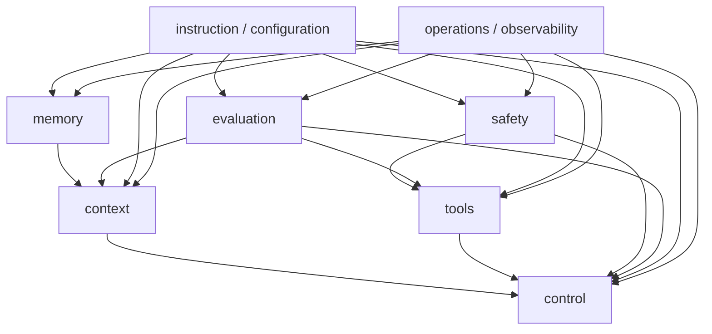

# 04. 하네스 설계의 여섯 축과 두 개의 가로축

> Why this chapter exists: context, control, tools, memory, safety, evaluation의
> 여섯 축을 고정하되, instruction/configuration과 operations/observability를
> 전 축을 가로지르는 설계면으로 명시한다.
> Reader level: beginner / advanced / reviewer
> Last verified: 2026-04-06
> Freshness class: medium
> Verified canonical registry sources: `S4`, `S6`, `S7`, `S21`, `S22`, `S23`, `S29`, `S30`

## Core claim

하네스를 읽는 가장 빠른 방법은 기능 이름을 세는 것이 아니라 설계 축을 먼저
고정하는 것이다. 이 책은 여섯 축을 중심에 둔다. context, control, tools,
memory, safety, evaluation. 다만 이 여섯 축만으로는 실제 운영 복잡도가 다
보이지 않는다. instruction/configuration surface와
operations/observability surface가 모든 축을 가로지르기 때문이다.

`S4`는 context engineering을 finite resource 관리 문제로 설명한다. `S21`과
`S22`는 tools, handoffs, traces가 실행 구조 안에 함께 들어간다고 말한다.
`S23`과 `S7`은 evaluation이 사후 QA가 아니라 workflow-level artifact를
조직하는 설계 문제임을 보여 준다. 그래서 이 장의 좌표계는 여섯 축과 두 개의
가로축으로 읽는 편이 가장 실용적이다.

## What this chapter is not claiming

- 이 taxonomy가 유일한 정답 체계라는 주장
- 가로축 둘을 별도 파트로 반드시 분리해야 한다는 주장
- 각 축의 구현 세부를 이 장에서 모두 설명하겠다는 주장

## Mental model

이 다이어그램은 벽을 세우기 위한 것이 아니라, 어디를 먼저 읽고 어떤 축끼리
긴장 관계가 있는지 보여 주는 지도다.

## 여섯 기본 축

| 축 | 핵심 질문 | 대표 artifact |
| --- | --- | --- |
| context | 무엇을 언제 model-visible set에 넣을 것인가 | context pack, retrieval result, compaction summary |
| control | 한 turn은 왜 이어지고 왜 멈추는가 | loop state, stop rule, handoff decision |
| tools | agent는 어떤 capability에 어떤 계약으로 접근하는가 | tool schema, permission contract, call log |
| memory | 무엇을 durable artifact로 남기고 다시 읽는가 | transcript, handoff note, session state |
| safety | autonomy를 어디서 제한하고 trust를 어디서 확인하는가 | approval rule, sandbox, escalation surface |
| evaluation | 이 전체 구조를 어떻게 비교하고 측정할 것인가 | trial record, grader criteria, outcome artifact |

## 가로축 A. instruction / configuration

같은 여섯 축이라도 어떤 instruction surface와 configuration precedence가
깔렸는지에 따라 실제 동작은 크게 달라진다.

이 가로축은 보통 아래 질문으로 드러난다.

- 어떤 rule이 repo, run, tool, evaluator 수준에서 우선권을 가지는가
- 어떤 config가 context packing과 tool exposure를 바꾸는가
- 어떤 contract가 "done"과 "fail"을 정의하는가
- handoff artifact 안에 어떤 next-step instruction이 포함되는가

instruction/configuration은 독립 축이라기보다 모든 축의 shape를 정하는
표면이다.

## 가로축 B. operations / observability

운영 artifact가 없으면 나머지 여섯 축은 reviewable system이 되지 못한다.

이 가로축은 보통 아래 artifact로 보인다.

- trace와 span
- transcript와 handoff note
- result packet과 grader output
- cost / latency record
- approval, denial, escalation log

`S22`와 `S29`는 trace vocabulary를 제공하지만, `S29`가 아직 Development
status이므로 schema를 rulebook처럼 고정하기보다 freshness-sensitive vocabulary로
읽는 편이 맞다.

## 축들이 왜 서로 얽히는가

- context는 memory와 분리될 수 없다. 무엇을 보여 줄지 정하면 무엇을 durable
  artifact로 남길지도 함께 정해야 한다.
- tools는 safety와 분리될 수 없다. capability exposure는 언제나 permission과
  trust 문제를 부른다.
- control은 context, tools, safety를 동시에 만난다. turn continuation은
  context pressure, tool result, permission outcome, stop rule을 함께 받는다.
- evaluation은 앞의 다섯 축이 남긴 artifact가 있어야만 가능하다.
- instruction/configuration은 여섯 축의 precedence와 threshold를 정한다.
- operations/observability는 여섯 축을 skeptical reviewer가 다시 읽게 만드는
  증거면이다.

## Design implications

- 설계할 때는 "중심 축 + 충돌 축"뿐 아니라, 어떤 instruction surface와 어떤
  operations artifact가 그 선택을 떠받치는지도 같이 적어야 한다.
- evaluation을 마지막 QA로 미루면, 필요한 transcript/trace/handoff artifact를
  초기에 남기지 못한다.
- operations/observability를 독립 파트로만 밀어 두면 foundations에서 economics와
  reviewability가 늦게 드러난다.
- governance review를 하려면 축별 artifact가 실제로 남는지부터 확인해야 한다.

## What to measure

- 축별로 남는 핵심 artifact의 존재 여부
- instruction/configuration drift가 결과에 미친 영향
- trace/span coverage와 missing review artifact 비율
- cost, latency, approval churn이 어느 축에서 주로 발생하는지

## Failure signatures

- context, memory, handoff를 같은 문제로 뭉뚱그린다.
- tool 설계인데 permission과 trust surface를 따로 떼어 둔다.
- evaluation을 QA로만 읽어 workflow artifact 설계를 놓친다.
- instruction/configuration drift를 기록하지 않아 같은 harness를 비교하지 못한다.
- observability를 나중에 붙일 telemetry로만 보고 reviewability를 만들지 못한다.

## Review questions

1. 이 시스템은 여섯 축 중 어디에 가장 많은 설계 복잡도를 쏟는가.
2. instruction/configuration이 어느 축의 precedence를 바꾸는지 설명할 수 있는가.
3. operations/observability artifact가 없다면 어떤 review가 불가능해지는가.
4. evaluation이 사후 QA가 아니라 control loop와 artifact 설계에 들어와 있는가.

## Sources / evidence notes

- `S4`는 context engineering을 finite resource 관리 문제로 설명한다. context
  축을 memory와 함께 읽는 근거다.
- `S21`은 tools, handoffs, traces가 agent execution 구조 안에 함께 있음을 보여 준다.
- `S22`는 trace/span과 sensitive-data capture를 runtime artifact로 설명한다.
- `S23`과 `S7`은 evaluation이 workflow-level artifact와 grader structure를
  조직하는 문제임을 보여 준다.
- `S29`는 GenAI events, metrics, model spans, agent spans vocabulary를
  제공하지만 아직 Development status다. operations/observability 가로축을
  freshness-sensitive하게 다루는 근거다.
- `S30`은 trustworthiness considerations를 design/development/use/evaluation에
  걸쳐 반영하라고 말한다. 여섯 축을 governance review와 연결하는 근거다.
