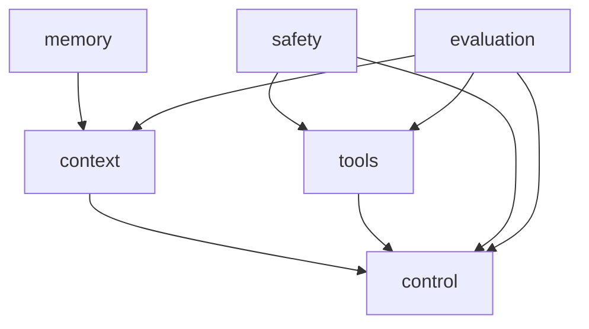

# 04. 하네스 설계의 여섯 축

## 장 요약

하네스를 읽는 가장 빠른 방법은 기능 이름을 세는 것이 아니라 설계 축을 먼저 고정하는 것이다. 이 책은 여섯 축을 중심에 둔다. context, control, tools, memory, safety, evaluation. Claude Code 사례를 읽을 때도 이 여섯 축이 각각 어느 artifact와 책임에 대응하는지 먼저 잡으면 구조가 훨씬 선명해진다. 이 장은 이후 Part II-VI 전체의 좌표계를 제공한다.

## 범위와 비범위

이 장이 다루는 것:

- 책 전체를 관통하는 여섯 설계 축
- 각 축이 local artifact와 어떻게 연결되는지
- 축 사이의 대표 인접 관계와 trade-off

이 장이 다루지 않는 것:

- 각 축의 구현 세부 전부
- 이 taxonomy를 유일한 정답 체계로 확정하는 일
- 구체적인 benchmark procedure 자체

이 장은 coordinate system을 주는 foundations 장이다. 자세한 설명은 각 파트에서 다시 확대된다.
따라서 아래 여섯 축은 코드에 박힌 공식 taxonomy가 아니라, 현재 공개 스냅샷의 분산된 artifact를 묶어 읽기 위한 synthesis frame이라는 점을 전제로 한다.

## 자료와 독서 기준

대표 발췌 출처:

- `src/context.ts`
- `src/query.ts`
- `src/Tool.ts`
- `src/Task.ts`
- `src/utils/sessionStorage.ts`
- `src/utils/permissions/permissions.ts`
- `src/QueryEngine.ts`

외부 프레이밍:

- Anthropic, [Effective context engineering for AI agents](https://www.anthropic.com/engineering/effective-context-engineering-for-ai-agents), 2025-09-29
- Anthropic, [Effective harnesses for long-running agents](https://www.anthropic.com/engineering/effective-harnesses-for-long-running-agents), 2025-11-26
- Anthropic, [Demystifying evals for AI agents](https://www.anthropic.com/engineering/demystifying-evals-for-ai-agents), 2026-01-09
- Anthropic, [Harness design for long-running application development](https://www.anthropic.com/engineering/harness-design-long-running-apps), 2026-03-24

함께 읽으면 좋은 장:

- [../context/](../03-context-and-control)
- [../interfaces/](../04-interfaces-and-operator-surfaces)
- [../execution/](../05-execution-continuity-and-integrations)
- [../safety/](../06-boundaries-deployment-and-safety)
- [../evaluation/](../07-evaluation-and-synthesis)

## 여섯 축

이 다이어그램은 벽을 세우는 것이 아니라, 어디를 먼저 읽고 어떤 축끼리 긴장 관계가 있는지 보여 주는 지도다.

## 각 축의 의미를 artifact와 함께 잡아라

| 축 | 핵심 질문 | Claude Code에서 먼저 볼 artifact |
| --- | --- | --- |
| context | 무엇을 언제 모델에게 보여 줄 것인가 | `src/context.ts`, `src/query.ts`, compaction path |
| control | 한 turn은 왜 이어지고 왜 멈추는가 | `src/query.ts`, `src/QueryEngine.ts`, stop hooks |
| tools | 모델은 컴퓨터 기능에 어떤 계약으로 접근하는가 | `src/Tool.ts`, tool permission surface |
| memory | 무엇을 세션 밖으로 남기고 다시 읽는가 | transcript, memory dir, task artifact |
| safety | autonomy를 어디서 제한하고 trust를 어디서 확정하는가 | permissions, trust dialog, sandbox surface |
| evaluation | 이 전체 구조를 어떻게 비교하고 측정할 것인가 | result packet, transcript, cost, graders/input |

이 표가 중요한 이유는 local artifact를 바로 떠올리게 하기 때문이다. 축이 추상어로만 남으면 이후 장과 연결되지 않는다.

## 왜 이 축들이 서로 엮이는가

이 여섯 축은 독립적인 체크리스트가 아니다.

- context는 memory와 분리될 수 없다.  
  무엇을 보여 줄지 정하면 무엇을 밖으로 내보낼지도 결정해야 한다.
- tools는 safety와 분리될 수 없다.  
  capability exposure는 언제나 permission/trust 문제를 부른다.
- control은 context, tools, safety를 동시에 만난다.  
  turn continuation은 context pressure와 tool result, stop hook, permission outcome을 함께 받기 때문이다.
- evaluation은 앞의 다섯 축이 남긴 artifact가 있어야만 가능하다.  
  transcript, result packet, cost, denial, diagnostics가 모두 필요하다.

즉 축을 나눈다는 것은 분할정복의 편의를 얻기 위한 것이지, 실제 시스템이 분리돼 있다는 뜻은 아니다.

## 이후 파트와의 대응

| Part | 주된 축 |
| --- | --- |
| Part II Context | context + memory의 접점 |
| Part III Interfaces | tools + safety의 접점 |
| Part IV Execution | control + memory + operator surface |
| Part V Safety | safety + autonomy boundary |
| Part VI Evaluation | evaluation + reproducibility + outcome artifact |

이 대응 관계를 알고 읽으면, 책의 목차가 단순 카테고리 나열이 아니라 설계 축 확장의 순서라는 점이 드러난다.

## 설계할 때는 "중심 축 + 충돌 축"을 고르라

여섯 축을 동시에 최적화하려 하면 대부분 실패한다. 실전에서는 다음 순서가 더 유용하다.

1. 지금 문제를 가장 직접적으로 떠안는 중심 축을 고른다.
2. 반드시 충돌하거나 비용을 요구하는 인접 축을 고른다.
3. 그 두 축 사이의 trade-off를 어떤 artifact나 boundary로 조절할지 정한다.

예시:

- context를 강화하면 memory와 evaluation을 같이 생각해야 한다.
- tools를 넓히면 safety와 operator control을 같이 생각해야 한다.
- control을 더 자율적으로 만들면 oversight와 recoverability를 같이 생각해야 한다.

즉 좋은 harness 설계는 여섯 축 모두를 균등하게 키우는 일이 아니라, 지금 중심 축과 그 대가를 함께 선택하는 일이다.

## 대표 오해

1. context와 memory를 같은 축으로 보는 것  
   하나는 model-visible working set이고, 다른 하나는 durable artifact 설계에 가깝다.
2. tools와 safety를 별도 문제로 완전히 떼어 놓는 것  
   실제 capability exposure는 항상 permission/trust와 함께 움직인다.
3. evaluation을 나중 QA로 미루는 것  
   artifact를 남기는 설계가 처음부터 없으면 evaluation readiness는 뒤늦게 붙지 않는다.

## evaluation은 마지막 QA가 아니라 실행 제어 루프다

Anthropic의 2026-03-24 글이 추가로 보여 주는 것은 evaluation 축이 단지 run 끝의 grading 문제가 아니라는 점이다. evaluator가 외부 feedback loop를 만들기 시작하면, evaluation은 control 축 안으로 더 깊게 들어온다.

- contract가 먼저 정의되고
- generator가 그 contract 아래서 일을 하고
- evaluator가 criterion과 threshold로 통과 여부를 정하며
- 그 결과가 다음 build round의 입력으로 다시 돌아온다

이 구조에서는 evaluation이 사후 판정기가 아니라 execution scaffold의 일부다. 따라서 evaluation 축을 설계할 때는 transcript, outcome, grader input뿐 아니라 contract, threshold, failure routing까지 함께 적는 편이 맞다.

## subjective quality를 gradable criteria로 바꾸는 법

하네스가 다루는 일이 모두 binary correctness로 닫히는 것은 아니다. design quality, originality, product depth처럼 인간적 판단이 들어가는 영역에서는 "좋은가?"라는 질문을 그대로 던지면 grader가 쉽게 흔들린다. 더 나은 방법은 subjective judgment를 criteria 묶음으로 다시 적는 것이다.

- 무엇을 보는가: design quality, originality, craft, functionality
- 무엇을 더 중요하게 보는가: 기본 craft보다 originality를 더 세게 본다
- 무엇을 실패로 볼 것인가: generic template, default-heavy output, shallow interaction

즉 evaluation 축은 pass/fail artifact를 남기는 축이면서, 동시에 taste와 quality judgment를 gradable language로 바꾸는 축이기도 하다. 이런 criteria가 있어야 skeptical evaluator도 drift를 줄일 수 있다.

## 관찰, 원칙, 해석, 권고

관찰:

- Claude Code의 주요 artifact는 여섯 축 중 하나 이상에 동시에 걸쳐 있다.
- evaluation은 별도 벤치마크 파트에만 있는 주제가 아니라, 전체 설계 축을 다시 읽는 방법이다.
- safety와 control, context와 memory는 특히 자주 얽힌다.
- evaluator-heavy harness에서는 evaluation과 control이 특히 강하게 얽힌다.

원칙:

- 축은 taxonomy가 아니라 reading guide로 써야 한다.
- 각 축은 local artifact와 함께 설명해야 한다.
- 설계할 때는 중심 축과 충돌 축을 함께 선택해야 한다.
- evaluation 축에는 grader input뿐 아니라 criteria와 threshold도 포함된다.

해석:

- 이 여섯 축은 임의의 분류표가 아니라, Claude Code와 같은 coding harness에서 반복적으로 나타나는 seam을 압축한 좌표계다.
- Anthropic의 context, long-running harness, eval 글을 함께 읽으면 이 축들이 서로 어떻게 이어지는지 더 분명해진다.
- evaluator-driven harness는 evaluation 축이 control 축을 어떻게 재형성하는지 보여 주는 좋은 사례다.

권고:

- 새 harness를 읽을 때 먼저 여섯 축 표를 그리고, 각 칸에 evidence file을 하나씩 채워 보라.
- 특정 기능을 설명할 때 "이 기능은 어느 축의 load-bearing part인가"를 먼저 적어라.
- evaluation 축을 마지막 QA가 아니라 설계 초기부터 고려해 artifact를 남겨라.
- subjective task를 다룬다면 criteria language와 weighting을 축 설명에 명시하라.

## benchmark 질문

1. 이 시스템은 여섯 축 중 어디에 가장 많은 설계 복잡도를 쏟는가.
2. 특정 기능을 설명할 때 그 기능이 어느 축의 load-bearing part인지 말할 수 있는가.
3. context, tools, safety를 분리하지 못해서 생기는 혼동은 없는가.
4. evaluation이 뒤늦은 QA가 아니라 설계 축으로 들어와 있는가.

## 요약

하네스를 읽는 일은 곧 여섯 설계 축을 읽는 일이다. context, control, tools, memory, safety, evaluation이라는 좌표계가 서면, Claude Code 같은 복잡한 사례도 훨씬 선명하게 보인다. 이후 장들은 이 축을 더 구체적인 사례와 benchmark 언어로 확장한다.

## 대표 근거 읽기 순서

아래 라벨은 독자가 별도 source를 열어야 한다는 뜻이 아니라, 이 장에서 이미 인용하고 설명한 코드 발췌가 어떤 구현 단면을 대표하는지 다시 묶어 주는 provenance 메모다.

1. `src/context.ts`
   context 축의 대표 절단면을 본다.
2. `src/query.ts`
   control 축이 context/tools와 어디서 얽히는지 본다.
3. `src/Tool.ts`
   tools 축의 계약을 본다.
4. `src/utils/sessionStorage.ts`
   memory 축이 durable artifact로 어떻게 남는지 본다.
5. `src/utils/permissions/permissions.ts`
   safety 축이 어디서 개입하는지 확인한다.
6. `src/QueryEngine.ts`
   evaluation-ready outcome artifact를 확인한다.
