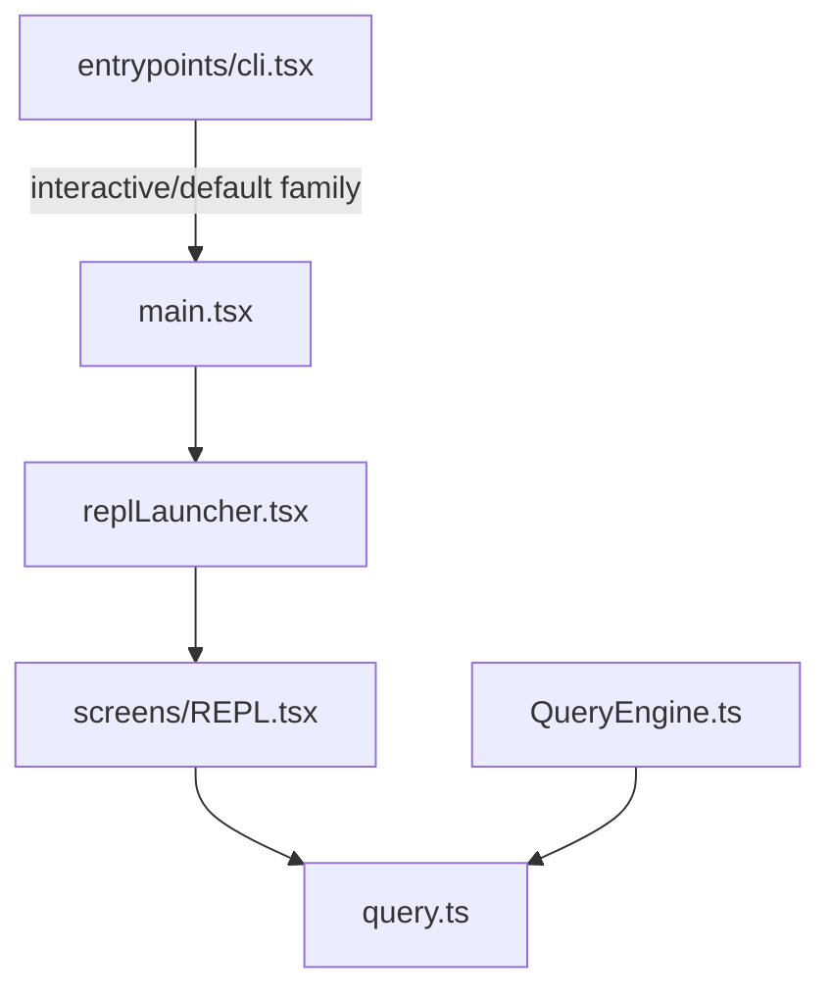

# 04. Claude Code 아키텍처 지도

## 장 요약

하네스의 거시 구조도는 디렉터리 소개문이 아니라 dispatch, ownership, control seam를 먼저 고정하는 도구여야 한다. 이 장은 그 질문을 Claude Code 사례에 적용한다. 여기서는 오직 여섯 개 파일, 즉 `src/entrypoints/cli.tsx`, `src/main.tsx`, `src/replLauncher.tsx`, `src/screens/REPL.tsx`, `src/query.ts`, `src/QueryEngine.ts`만으로 구조 지도를 그린다. 이 제한은 의도적이다. 거시 지도를 그릴 때 중요한 것은 모든 하위 디렉터리를 나열하는 일이 아니라, dispatch, runtime assembly, launch seam, operator surface, turn-local control, mode-specific state ownership이 어디에 놓이는지를 먼저 고정하는 일이다.

해석: Claude Code의 전체 복잡도는 많은 파일에 흩어져 있지만, 거시 구조의 방향성은 이 여섯 파일에 가장 압축적으로 드러난다. 따라서 이 장은 "어떤 디렉터리가 있는가"보다 "어떤 구조적 역할이 어떤 파일에 모이는가"를 먼저 묻는다.

## 원칙: 하네스 거시 구조도는 무엇을 보여줘야 하는가

원칙: Anthropic의 [Building effective agents](https://www.anthropic.com/engineering/building-effective-agents) (2024-12-19)는 agent system을 복잡한 거대 틀보다 단순하고 조합 가능한 패턴으로 설계하는 편이 낫다고 설명한다. 거시 구조도는 바로 그 조합 단위가 어디서 갈라지고 다시 만나는지를 보여줘야 한다.

원칙: Anthropic의 [Effective harnesses for long-running agents](https://www.anthropic.com/engineering/effective-harnesses-for-long-running-agents) (2025-11-26)는 장기 실행 하네스에서 compaction만으로는 충분하지 않으며, 새 context window가 시작될 때도 이전 작업의 상태를 이해하고 incremental progress를 이어갈 수 있어야 한다고 지적한다. 따라서 구조도는 단순 호출 순서가 아니라 상태를 이어 주는 경계를 보여줘야 한다.

원칙: Pan et al.의 [Natural-Language Agent Harnesses](https://arxiv.org/abs/2603.25723) (submitted 2026-03-26)는 harness engineering을 controller 안에 숨은 구현이 아니라 explicit contract, durable artifact, lightweight adapter를 가진 비교 가능한 실행 구조로 읽자고 제안한다. 이 관점에서 좋은 구조도는 "어디가 제어를 담당하고 어디가 상태를 소유하는가"를 분명히 드러내야 한다.

해석: 그래서 하네스의 거시 구조도는 최소한 세 질문에 답해야 한다. 어디서 실행 경로가 갈라지는가, 누가 세션 상태를 소유하는가, 그리고 운영자 개입과 다음 turn으로의 이어짐이 어떤 경계에서 관리되는가. Claude Code는 이 세 질문에 대해 비교적 뚜렷한 대답을 주는 사례다.

## 이 장의 직접 근거와 비범위

### 직접 근거

#### 제품 사실

- `src/entrypoints/cli.tsx`
- `src/main.tsx`
- `src/replLauncher.tsx`
- `src/screens/REPL.tsx`
- `src/query.ts`
- `src/QueryEngine.ts`

#### 공개 설계 원칙

- Anthropic, [Building effective agents](https://www.anthropic.com/engineering/building-effective-agents), 2024-12-19
- Anthropic, [Effective harnesses for long-running agents](https://www.anthropic.com/engineering/effective-harnesses-for-long-running-agents), 2025-11-26

#### 연구 확장 근거

- Pan et al., [Natural-Language Agent Harnesses](https://arxiv.org/abs/2603.25723), submitted 2026-03-26

이 장의 모든 관찰은 2026-04-01 기준 현재 공개 사본에 한정한다. 커밋 해시가 제공되지 않았으므로, 파일 경로와 재검증 가능한 코드 절단면을 근거의 기본 단위로 사용한다.

Sources / evidence notes:
이 장의 reader-facing 외부 근거 표시는 [../00-front-matter/03-references.md](../00-front-matter/03-references.md)의 `S6`, `S8`, `S10`, `S13`, `S14`, `S15`, `S24`를 따른다. `P1`은 보조 비교 프레임으로만 사용한다.

### 이 장에서 다루지 않는 것

- `src/entrypoints/cli.tsx`의 개별 flag와 모든 runtime family의 세부 분기 조건
- trust dialog와 approval 정책의 세부 로직
- tool/task/command의 상세 동작
- `src/query.ts` 전체 상태 전이의 완전한 추적
- remote transport와 MCP 하위 구현의 내부 프로토콜

이 비범위는 중요하다. entrypoint 세부는 [03-runtime-modes-and-entrypoints.md](05-claude-code-runtime-modes-and-entrypoints.md), startup/trust는 [04-session-startup-trust-and-initialization.md](06-claude-code-session-startup-trust-and-initialization.md), control plane 상세는 [05-context-assembly-and-query-pipeline.md](../03-context-and-control/05-claude-code-context-assembly-and-query-pipeline.md)와 [06-query-engine-and-turn-lifecycle.md](../03-context-and-control/06-claude-code-query-engine-and-turn-lifecycle.md)에서 따로 다룬다.

## 분석 용어 여섯 가지

이 장에서 반복해서 쓸 용어는 먼저 짧게 고정해 두는 편이 좋다.

| 용어 | 이 장에서의 의미 |
| --- | --- |
| dispatch layer | 어떤 실행 경로를 어디서 갈라 보낼지 결정하는 층 |
| runtime assembly | 설정, 정책, launch 준비를 한곳에서 조립하는 층 |
| launch seam | assembly가 interactive session mount로 넘어가는 접점 |
| operator surface | 사용자가 상태를 보고 개입하는 interactive 표면 |
| control plane | 한 turn 안에서 query, tool, attachment, continuation을 조율하는 층 |
| state owner | 특정 실행 모드에서 여러 turn에 걸쳐 상태를 보존하는 객체 또는 경계 |

이 장은 여섯 파일을 이 여섯 용어로 읽는다.

추가로 이 장에서는 reader-facing shorthand로 다섯 가지 태그를 함께 쓴다.

- `source of truth`: 특정 경계의 authoritative routing 또는 sequencing이 처음 결정되는 위치
- `adapter`: 상위 조립 결과를 실제 mount 또는 호출 형식으로 바꾸는 얇은 접점
- `orchestrator`: 여러 하위 단계의 순서와 전이를 조정하는 조립자
- `operator surface`: 사람이 상태를 보고 개입하는 표면
- `persistence substrate`: turn 밖으로 이어질 상태를 붙잡는 바닥층

## 러닝 예시를 이 장에서 읽는 법

[01-project-overview.md](03-claude-code-project-overview.md)에서 제시한 러닝 예시를 이 장에서는 여섯 파일에 배치해 본다.

1. `src/entrypoints/cli.tsx`: 사용자가 `claude`를 실행했을 때 어디서 family가 갈라지는가
2. `src/main.tsx`: 일반 interactive/default family가 어디서 조립되는가
3. `src/replLauncher.tsx`: 조립된 세션이 어디서 실제 REPL mount로 넘어가는가
4. `src/screens/REPL.tsx`: operator surface와 message state가 어디서 만나는가
5. `src/query.ts`: 한 turn 안에서 어떤 control plane이 동작하는가
6. `src/QueryEngine.ts`: 같은 core loop를 headless path가 어떻게 다른 owner 아래서 감싸는가

이렇게 읽으면 이 장의 구조도는 단순 분류표가 아니라 "한 세션이 어떤 파일 경계를 건너며 조립되는가"를 보여 주는 지도 역할을 한다.

## Claude Code의 여섯 파일 구조도

아래 그림은 전체 CLI 분기도를 모두 그린 것이 아니다. 이 장이 직접 추적하는 `interactive/default family`와 `headless query entry`만을 그린다. `src/entrypoints/cli.tsx`가 분기하는 다른 fast-path family는 [03-runtime-modes-and-entrypoints.md](05-claude-code-runtime-modes-and-entrypoints.md)에서 따로 다룬다.



제품 사실: 이 그림의 모든 노드는 실제 파일이다. 일부 노드 안에는 더 많은 하위 모듈이 숨겨져 있지만, 이 장은 우선 여섯 파일이 담당하는 거시 역할만 고정한다. 위쪽 주의문에서 밝혔듯이, `src/entrypoints/cli.tsx`가 dispatch하는 다른 fast-path family는 이 도식에서 의도적으로 생략했다.

해석: 이 구조도는 Claude Code를 하나의 중심 파일로 읽지 않게 만든다. `src/entrypoints/cli.tsx`는 dispatch layer이고, `src/main.tsx`는 runtime assembly이며, `src/replLauncher.tsx`는 launch seam, `src/screens/REPL.tsx`는 interactive operator surface, `src/query.ts`는 control plane, `src/QueryEngine.ts`는 headless state owner다. 즉, Claude Code의 거시 구조는 "단일 main loop"보다 "서로 다른 책임을 가진 composition root들의 연결"에 가깝다.

## 제품 사실 1: dispatch layer는 `src/main.tsx`보다 앞에 있다

출처:

- `src/entrypoints/cli.tsx`
- 출처 단서: `src/entrypoints/cli.tsx`의 fast-path dispatch 분기

```ts
if (feature('BRIDGE_MODE') && (args[0] === 'remote-control' || args[0] === 'rc' || args[0] === 'remote' || args[0] === 'sync' || args[0] === 'bridge')) {
  await bridgeMain(args.slice(1));
  return;
}

if (feature('DAEMON') && args[0] === 'daemon') {
  await daemonMain(args.slice(1));
  return;
}
```

제품 사실: `src/entrypoints/cli.tsx`는 bridge와 daemon 같은 경로를 `src/main.tsx`보다 먼저 분기한다.  
해석: 따라서 `src/main.tsx`는 모든 경로의 유일한 시작점이 아니라, dispatch layer를 통과한 뒤 도달하는 일반 assembly stage다.

거시 구조를 그릴 때 `src/main.tsx` 하나만 기준점으로 삼으면 Claude Code가 하나의 runtime처럼 보이기 쉽다. 그러나 실제로는 그보다 앞선 dispatch layer가 존재한다.

## 제품 사실 2: `src/main.tsx`는 runtime assembly를 맡는다

출처:

- `src/main.tsx`
- 출처 단서: `src/main.tsx`의 startup prefetch와 trust-gated assembly 구간

```ts
profileCheckpoint('main_tsx_entry');
startMdmRawRead();
startKeychainPrefetch();
```

제품 사실: `src/main.tsx`는 모듈 로드 직후부터 profiling과 prefetch를 시작한다.  
해석: 이 파일은 단순한 옵션 파서의 본문이 아니라, startup latency를 고려한 runtime assembly 파일이다.

같은 파일에서 trust gate와 외부 자원 연결 순서도 조정된다.

```ts
const onboardingShown = await showSetupScreens(root, permissionMode, allowDangerouslySkipPermissions, commands, enableClaudeInChrome, devChannels);

const localMcpPromise = isNonInteractiveSession ? Promise.resolve({
  clients: [],
  tools: [],
  commands: []
}) : prefetchAllMcpResources(regularMcpConfigs);
```

제품 사실: interactive MCP prefetch는 `showSetupScreens()` 이후에 시작된다.  
해석: Claude Code는 startup을 "기술 초기화"와 "정책 개시"가 만나는 조립 구간으로 다룬다. 즉, 비용이 큰 외부 연결을 시작하기 전에 trust 경계를 먼저 지난다.

같은 assembly 파일 안에는 alternative session path도 있다.

```ts
const session = await createDirectConnectSession({
  serverUrl: _pendingConnect.url,
  authToken: _pendingConnect.authToken,
  cwd: getOriginalCwd(),
  dangerouslySkipPermissions: _pendingConnect.dangerouslySkipPermissions
});
await launchRepl(root, {
  getFpsMetrics,
  stats,
  initialState
}, {
  debug: debug || debugToStderr,
  commands,
  initialTools: [],
  initialMessages: [connectInfoMessage],
```

제품 사실: `src/main.tsx`는 direct-connect session을 조립한 뒤에도 같은 launch seam으로 들어간다.  
해석: `src/main.tsx`의 핵심 역할은 화면을 직접 그리는 것이 아니라, 서로 다른 session path를 공통 launch 구조에 태우는 assembly에 있다.

## 제품 사실 3: `src/screens/REPL.tsx`는 interactive operator surface이자 message state holder다

출처:

- `src/replLauncher.tsx`
- `src/screens/REPL.tsx`
- 출처 단서: `src/replLauncher.tsx`와 `src/screens/REPL.tsx`의 interactive launch seam

```ts
await renderAndRun(root, <App {...appProps}>
    <REPL {...replProps} />
  </App>);
```

```tsx
const [messages, rawSetMessages] = useState<MessageType[]>(initialMessages ?? []);
```

```tsx
const onQueryEvent = useCallback((event: Parameters<typeof handleMessageFromStream>[0]) => {
  handleMessageFromStream(event, newMessage => {
```

제품 사실: interactive path는 `launchRepl()`을 거쳐 `<App><REPL /></App>`을 mount하고, `src/screens/REPL.tsx`는 message state를 직접 들고 있으면서 query event를 받아 그 상태를 갱신한다.  
해석: `src/screens/REPL.tsx`는 단순 view가 아니다. interactive 세션에서는 operator surface와 message state holder 역할이 한 파일 안에 결합되어 있다.

이 점은 바로 다음 절과 함께 읽어야 한다. `src/query.ts`는 control plane을 맡지만, interactive mode의 message state는 `src/screens/REPL.tsx`가 직접 관리한다.

## 제품 사실 4: `src/query.ts`는 turn-local control plane이다

출처:

- `src/query.ts`
- 출처 단서: `src/query.ts`의 mutable turn state 구성 구간

```ts
let state: State = {
  messages: params.messages,
  toolUseContext: params.toolUseContext,
  maxOutputTokensOverride: params.maxOutputTokensOverride,
  autoCompactTracking: undefined,
  stopHookActive: undefined,
  maxOutputTokensRecoveryCount: 0,
  hasAttemptedReactiveCompact: false,
  turnCount: 1,
  pendingToolUseSummary: undefined,
  transition: undefined,
}
```

```ts
const next: State = {
  messages: [...messagesForQuery, ...assistantMessages, ...toolResults],
  toolUseContext: toolUseContextWithQueryTracking,
  autoCompactTracking: tracking,
  turnCount: nextTurnCount,
  maxOutputTokensRecoveryCount: 0,
  hasAttemptedReactiveCompact: false,
  pendingToolUseSummary: nextPendingToolUseSummary,
  maxOutputTokensOverride: undefined,
  stopHookActive,
  transition: { reason: 'next_turn' },
}
state = next
```

제품 사실: `src/query.ts`는 한 turn 안에서 mutable state를 유지하고, assistant message와 tool result를 합쳐 다음 turn 상태를 만든다.  
해석: 이 파일은 단순 API wrapper가 아니라 turn-local control plane이다. tool 실행, attachment 추가, continuation 준비, recovery 조건 같은 운영 로직이 여기서 함께 조율된다.

원칙: long-running harness에서 중요한 것은 단순히 모델을 한 번 더 부르는 일이 아니라, 다음 turn이 어떤 상태에서 시작될지를 관리하는 일이다.  
해석: `src/query.ts`의 거시 역할은 바로 그 "다음 turn으로의 넘어감"을 조립하는 데 있다.

## 제품 사실 5: `src/QueryEngine.ts`는 headless mode의 state owner다

출처:

- `src/QueryEngine.ts`
- 출처 단서: `src/QueryEngine.ts`의 conversation state ownership 설명 구간

```ts
/**
 * One QueryEngine per conversation. Each submitMessage() call starts a new
 * turn within the same conversation. State (messages, file cache, usage, etc.)
 * persists across turns.
 */
export class QueryEngine {
  private mutableMessages: Message[]
  private abortController: AbortController
  private permissionDenials: SDKPermissionDenial[]
  private totalUsage: NonNullableUsage
```

```ts
for await (const message of query({
  messages,
  systemPrompt,
  userContext,
  systemContext,
  canUseTool: wrappedCanUseTool,
  toolUseContext: processUserInputContext,
  querySource: 'sdk',
```

제품 사실: `QueryEngine`은 conversation 단위 상태를 보존하면서도 실제 turn 실행은 `query()`에 위임한다.  
해석: 따라서 Claude Code의 여섯 파일 구조에서 확인되는 것은 "공유된 control plane과 mode-specific state owner"다. interactive mode에서는 `src/screens/REPL.tsx`가 message state를 직접 쥐고, headless mode에서는 `src/QueryEngine.ts`가 conversation state를 직접 쥔다.

## 여섯 파일의 거시 역할 요약

| 파일 | 거시 역할 | 태그 | 이 장에서 직접 확인한 사실 |
| --- | --- | --- | --- |
| `src/entrypoints/cli.tsx` | dispatch layer | `source of truth`, `orchestrator` | `src/main.tsx` 이전에 bridge/daemon 같은 경로를 분기한다 |
| `src/main.tsx` | runtime assembly | `source of truth`, `orchestrator` | prefetch, trust gate, external 연결, direct-connect 조립을 담당한다 |
| `src/replLauncher.tsx` | launch seam | `adapter` | interactive session을 `<App><REPL /></App>` 구조로 mount한다 |
| `src/screens/REPL.tsx` | interactive operator surface + message state holder | `operator surface` | message state를 들고 query event를 소비하며 interactive 세션을 운영한다 |
| `src/query.ts` | turn-local control plane | `orchestrator` | turn state를 누적하고 다음 turn 상태를 만든다 |
| `src/QueryEngine.ts` | headless conversation state owner | `orchestrator`, `persistence substrate` | 여러 turn에 걸친 message/usage/permission denial을 보존하고 `query()`를 호출한다 |

해석: 이 여섯 파일만으로도 Claude Code 거시 구조의 핵심 seam 몇 가지는 식별된다. 복잡도는 더 넓게 분산되어 있지만, 이 장의 범위 안에서는 dispatch, assembly, launch, interactive surface, control plane, mode-specific state ownership이라는 축을 확인할 수 있다. 위 태그를 붙여 보면 무엇이 authoritative source이고 무엇이 adapter이며 무엇이 persistence substrate인지 더 빨리 구분된다.

## 이 장에서 직접 확인 가능한 품질 속성

이 장에서는 과장하지 않고, 위 여섯 파일에서 직접 확인되는 품질 속성만 다룬다.

| 품질 속성 | 직접 근거 | 구조적 이점 | 동반 비용 |
| --- | --- | --- | --- |
| startup latency | `src/main.tsx`의 top-level prefetch | 무거운 초기화 이전에 준비 작업을 겹쳐 시작할 수 있다 | assembly file의 sequencing 복잡도가 커진다 |
| policy steerability | `showSetupScreens()` 이후에 MCP prefetch를 시작하는 순서 | trust 경계 뒤에서만 더 비싼 연결과 기능 노출을 시작할 수 있다 | startup 경로가 단순하지 않다 |
| operator visibility | `src/screens/REPL.tsx`가 `query()` event stream을 직접 소비 | interactive 세션에서 진행 상태와 개입 지점을 가까이 둘 수 있다 | UI와 control plane의 결합 비용이 생긴다 |
| cross-turn continuity | `src/query.ts`의 next-state 구성과 `src/QueryEngine.ts`의 persistent conversation state | 여러 turn에 걸쳐 상태를 잇는 구조를 만들기 쉽다 | control logic과 state management가 커지고 회귀 면적이 넓어진다 |

원칙: 하네스의 거시 구조는 예쁜 계층도보다 어떤 품질 속성을 우선시했는지를 더 잘 드러내야 한다.  
해석: 이 범위에서 보면 Claude Code는 빠른 시작, 정책 개입 가능성, 운영자 가시성, turn 간 이어짐을 중요한 속성으로 삼고 있으며, 그 대가로 assembly와 control file의 비대함을 감수한다.

## 새 하네스를 설계할 때 던질 벤치마크 질문

1. dispatch layer, runtime assembly, control plane, state owner를 한 파일에 모두 밀어 넣고 있지는 않은가?
2. trust나 permission 같은 정책 경계는 비싼 외부 연결보다 앞에 놓여 있는가?
3. interactive 제품이라면 operator surface가 단순 출력기가 아니라 개입 가능한 제어 표면으로 설계돼 있는가?
4. interactive path와 headless path가 control plane을 공유하더라도 상태 소유권은 분리돼 있는가?
5. 다음 turn으로 넘어갈 상태를 어디에서 조립하고 누가 그것을 보존하는가?

## 마무리

이 장의 결론은 다음과 같다. Claude Code의 거시 구조는 하나의 중심 파일로 설명되지 않는다. `src/entrypoints/cli.tsx`의 dispatch, `src/main.tsx`의 assembly, `src/replLauncher.tsx`의 launch seam, `src/screens/REPL.tsx`의 interactive surface와 state, `src/query.ts`의 control plane, `src/QueryEngine.ts`의 headless state가 서로 다른 역할을 나눠 가진다. 이 지도를 먼저 고정해 두어야 다음 장에서 entrypoint, startup, query lifecycle을 더 자세히 읽을 때 세부 구현이 어느 경계에 속하는지 안정적으로 따라갈 수 있다.

## 대표 근거 읽기 순서

아래 라벨은 독자가 별도 source를 열어야 한다는 뜻이 아니라, 이 장에서 이미 인용하고 설명한 코드 발췌가 어떤 구현 단면을 대표하는지 다시 묶어 주는 provenance 메모다.

1. `src/entrypoints/cli.tsx`
   dispatch layer를 먼저 확인한다.
2. `src/main.tsx`
   runtime assembly와 trust gate가 어디에 놓이는지 본다.
3. `src/replLauncher.tsx`
   interactive path가 어떤 seam을 통해 REPL로 넘어가는지 본다.
4. `src/screens/REPL.tsx`
   interactive state owner가 무엇을 직접 들고 있는지 본다.
5. `src/query.ts`
   shared control plane이 어디에 있는지 본다.
6. `src/QueryEngine.ts`
   headless path가 같은 loop를 어떻게 감싸는지 비교한다.
