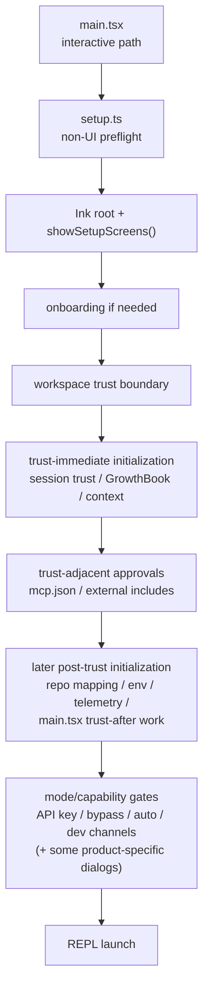

# 06. Claude Code 세션 시작, 신뢰, 초기화

## 장 요약

session startup은 단순 온보딩 UX가 아니라 세션이 어떤 trust 가정과 정책 조건 아래에서 열리는지를 고정하는 계약이다. 이 장은 그 계약을 Claude Code 사례에서 읽는다. 여기서 핵심은 `REPL` 이전에 무엇이 일어나는가다. 어떤 preflight가 먼저 실행되고, 어떤 trust boundary가 interactive path를 열며, trust가 확인된 직후 어떤 초기화가 즉시 시작되고, 어떤 capability 또는 mode gate가 그 뒤에 조건적으로 이어지는가를 구분해야 한다. 즉 startup trust는 "처음 화면을 어떻게 보여 주는가"보다 "첫 turn 이전에 어떤 제약과 입력면이 이미 묶였는가"를 설명하는 문제다.

이 startup contract에는 prompt text만이 아니라 settings scope, `CLAUDE.md`, hooks, skills, subagents, CLI system prompt flags 같은 instruction surface도 걸려 있다. 이 장은 그중 "세션이 열리기 전에 어떤 gate가 적용되는가"에 집중하고, scope/preference/discovery 자체는 [09-instruction-surfaces-settings-hooks-claude-md-subagents.md](../04-interfaces-and-operator-surfaces/09-instruction-surfaces-settings-hooks-claude-md-subagents.md)에서 따로 다룬다.

해석: Claude Code의 startup은 하나의 직선형 마법 절차가 아니다. `src/main.tsx`는 먼저 `src/setup.ts`로 non-UI preflight를 수행하고, interactive path에서만 `showSetupScreens()`를 호출한다. 그러나 `showSetupScreens()` 내부에서도 흐름은 단순히 `onboarding -> trust -> approvals -> post-trust initialization`으로 끝나지 않는다. trust가 확인되면 곧바로 시작되는 초기화가 있고, workspace content와 가까운 approval이 그 뒤를 잇고, 그 후에 더 넓은 post-trust initialization과 mode/capability gate가 이어진다. 따라서 startup은 온보딩 화면 묶음이 아니라, startup contract를 코드로 구성하는 policy layer다.

## 원칙: startup gate는 왜 하네스 문제인가

원칙: Anthropic의 [Making Claude Code more secure and autonomous with sandboxing](https://www.anthropic.com/engineering/claude-code-sandboxing) (2025-10-20)는 자율성과 안전을 함께 높이려면 모델만이 아니라 실행 경계와 permission surface를 함께 설계해야 한다고 설명한다. 이 글은 특히 boundary design과 approval fatigue 문제를 강조한다.  
해석: 이 장은 그 관점을 startup으로 끌어온다. 즉, 세션이 어떤 조건 아래에서 시작되는지도 boundary design의 일부라고 본다.

원칙: Anthropic의 [Effective harnesses for long-running agents](https://www.anthropic.com/engineering/effective-harnesses-for-long-running-agents) (2025-11-26)는 long-running agent가 discrete session 사이의 단절을 다뤄야 하며, 새 세션이 이어받을 수 있는 환경과 상태를 정돈해 두는 것이 중요하다고 말한다.  
해석: 이 장은 session start 자체를 하나의 운영 단위로 읽는다. 즉, startup은 "모델 호출 전 UX"가 아니라, 이후 세션 전체가 어떤 상태에서 시작되는지를 고정하는 구조다.

원칙: Anthropic의 settings 문서는 user/project/local project/managed scope를 별도로 두고, managed settings가 override 불가능한 상위 제약이 될 수 있음을 분명히 한다. 또한 hooks, subagent configuration, plugin configuration 역시 같은 configuration surface 안에 놓는다. Anthropic의 CLI reference는 `--append-system-prompt` 같은 prompt overlay와 permission 관련 CLI flag가 세션 시작 시점에 binding되는 입력면임을 보여 준다. OpenAI의 `AGENTS.md` 문서는 repo root에서 현재 작업 디렉터리까지 instruction chain을 다시 구성하는 방식을 문서화한다.
해석: Claude Code의 startup contract를 읽을 때는 trust dialog만 보면 부족하다. settings precedence, managed policy, repo instruction discovery, CLI prompt overlay 같은 pre-turn input surface도 함께 봐야 한다.

원칙: Pan et al.의 [Natural-Language Agent Harnesses](https://arxiv.org/abs/2603.25723) (submitted 2026-03-26)는 harness behavior를 explicit contract와 runtime 구조로 다루자고 제안한다. 이 논문은 아직 under review이므로, 여기서는 Claude Code의 local sequencing을 증명하는 근거가 아니라 "startup contract를 runtime 구조로 읽을 수 있다"는 framing으로만 사용한다.  
해석: 이 장은 startup, trust, approval, post-trust initialization을 바로 그런 runtime contract의 일부로 읽는다.

## 이 장의 직접 근거와 범위

### 직접 근거

#### 제품 사실

- `src/main.tsx`
- `src/setup.ts`
- `src/interactiveHelpers.tsx`

#### 공개 설계 원칙

- Anthropic, [Making Claude Code more secure and autonomous with sandboxing](https://www.anthropic.com/engineering/claude-code-sandboxing), 2025-10-20
- Anthropic, [Effective harnesses for long-running agents](https://www.anthropic.com/engineering/effective-harnesses-for-long-running-agents), 2025-11-26
- Anthropic, [Claude Code settings](https://docs.anthropic.com/en/docs/claude-code/settings), verified 2026-04-06
- Anthropic, [CLI reference](https://docs.anthropic.com/en/docs/claude-code/cli-reference), verified 2026-04-06

#### 추가 자료

- OpenAI, [Custom instructions with AGENTS.md](https://developers.openai.com/codex/guides/agents-md/), verified 2026-04-06
- Pan et al., [Natural-Language Agent Harnesses](https://arxiv.org/abs/2603.25723), submitted 2026-03-26

이 장의 관찰은 2026-04-01 기준 현재 공개 사본에 한정한다.

### 이 장의 범위

- `src/main.tsx`가 interactive startup에서 `setup()`과 `showSetupScreens()`를 언제 호출하는지
- `src/setup.ts`가 맡는 non-UI preflight와 startup safety check
- `src/interactiveHelpers.tsx`가 맡는 onboarding, trust, trust-adjacent approval, post-trust initialization, mode/capability gate
- settings precedence, `CLAUDE.md`, CLI prompt flags가 startup contract에 어떤 종류의 입력면을 제공하는지
- interactive path와 non-interactive path의 다른 trust contract

### 이 장에서 다루지 않는 것

- runtime mode 전체 topology
- tool-time permission recheck의 상세 규칙
- sandbox adapter와 실제 tool execution enforcement
- query pipeline과 turn loop
- skill, subagent, plugin, MCP의 전체 instruction stack

이 비범위는 중요하다. runtime family는 [05-claude-code-runtime-modes-and-entrypoints.md](05-claude-code-runtime-modes-and-entrypoints.md), tool-time permission surface는 [07-claude-code-tool-system-and-permissions.md](../04-interfaces-and-operator-surfaces/07-claude-code-tool-system-and-permissions.md), query lifecycle은 [05-claude-code-context-assembly-and-query-pipeline.md](../03-context-and-control/05-claude-code-context-assembly-and-query-pipeline.md)와 [06-claude-code-query-engine-and-turn-lifecycle.md](../03-context-and-control/06-claude-code-query-engine-and-turn-lifecycle.md)에서 더 자세히 다룬다. settings scope, `CLAUDE.md`, hooks, skills, subagents, CLI prompt flags의 결합은 [09-instruction-surfaces-settings-hooks-claude-md-subagents.md](../04-interfaces-and-operator-surfaces/09-instruction-surfaces-settings-hooks-claude-md-subagents.md)에서 별도로 다룬다.

## startup path를 읽는 여섯 가지 구분

| 구분 | 이 장에서의 의미 |
| --- | --- |
| preflight | UI를 띄우기 전에 실행되는 non-UI 준비 단계 |
| trust boundary | 현재 workspace를 세션 수준에서 신뢰할지 결정하는 경계 |
| trust-immediate initialization | trust가 확인되자마자 바로 시작되는 초기화 |
| trust-adjacent approval | workspace content와 가까운 위험 표면을 확인하는 단계 |
| later post-trust initialization | trust 이후, 더 늦은 startup 구간에서 계속되는 초기화 |
| mode/capability gate | 특정 모드나 capability를 이번 세션에서 켤지 확인하는 단계 |

이 장의 핵심은 이 여섯 구분을 섞어 읽지 않는 데 있다. 특히 trust boundary와 tool permission, trust-immediate initialization과 later post-trust initialization, 그리고 trust-adjacent approval과 mode/capability gate는 서로 다른 층위다.

## startup contract 입력면은 모두 같은 층이 아니다

공개 코드 snapshot은 startup sequencing을 잘 보여 주지만, 어떤 입력이 어디서 우선권을 갖는지의 전체 규칙은 공식 문서를 함께 봐야 더 선명해진다.

| 입력면 | 대표 source of truth | 언제 binding되는가 | 이 장에서의 읽는 법 |
| --- | --- | --- | --- |
| managed, user, project, local project settings | Anthropic settings docs | 세션 시작 전 config resolution | pre-turn constraint. trust dialog보다 앞선 상위 제약이 될 수 있다 |
| CLI prompt/permission flags | Anthropic CLI reference | process launch 시점 | 이번 실행만의 startup overlay |
| `CLAUDE.md`와 external includes | local repo content + runtime discovery | 첫 turn 이전 context discovery | trust-adjacent content surface. include 경고가 붙는 이유가 여기 있다 |
| hooks | settings docs + local config | lifecycle event 직전/직후 | pre-turn과 post-turn 양쪽에 걸치지만, startup 시점에 어떤 hook 체계를 로드할지는 이미 정해진다 |
| skills/subagents | settings docs, Agent SDK docs | session assembly 및 owner selection 시점 | 첫 turn 이후에도 쓰이지만, 어떤 owner variant를 허용할지는 startup contract의 일부다 |

해석:

- startup trust는 "workspace를 신뢰할 것인가"만이 아니다.
- 더 정확히는 "어떤 입력면이 이 세션의 첫 turn을 합법적으로 형성할 수 있는가"를 가르는 pre-turn constraint다.

## interactive startup topology

아래 그림은 interactive path만을 그린다. non-interactive `--print` 계열 경로는 별도 trust contract를 갖는다. interactive path처럼 trust dialog를 렌더링하지는 않지만, 그 대신 trust가 암묵적으로 성립한다고 보고 일부 환경 적용과 context prefetch를 더 이른 단계에서 수행한다.



제품 사실: `src/main.tsx`는 interactive path에서 먼저 `setup()`을 실행하고, Ink root를 만든 뒤 `showSetupScreens()`를 호출한다. `showSetupScreens()` 안에서는 onboarding, trust 확인, trust 직후 곧바로 시작되는 초기화, trust-adjacent approval, 그 뒤에도 이어지는 post-trust initialization, 그리고 일부 mode/capability dialog가 겹쳐 나타난다. `src/main.tsx`로 돌아온 뒤에도 trust 이후에만 허용되는 후속 초기화가 계속된다.  
해석: startup은 단순한 선형 onboarding이 아니라, trust 확인을 기준으로 여러 종류의 gate와 initialization이 교차하는 구조다.

## 러닝 예시에서 이 장이 담당하는 구간

[01-project-overview.md](03-claude-code-project-overview.md)의 러닝 예시에서 이 장은 다음 구간만 본다.

1. `src/entrypoints/cli.tsx`와 `src/main.tsx`가 interactive/default family를 선택한 뒤
2. REPL을 바로 띄우지 않고 `setup()`과 `showSetupScreens()`를 통해
3. 어떤 trust 가정, approval, post-trust initialization 아래에서 세션을 열지 결정하는 단계

즉, 이 장은 "첫 prompt가 어떻게 처리되는가"보다 "그 첫 prompt를 처리해도 되는 세션인가"를 먼저 확정하는 장이다. 이 관점이 잡히면 startup을 단순 onboarding UI로 오독할 가능성이 줄어든다.

## 제품 사실 1: `src/main.tsx`는 interactive startup을 두 단계로 나누고, non-interactive에는 다른 trust 계약을 쓴다

출처:

- `src/main.tsx`

```ts
const setupPromise = setup(preSetupCwd, permissionMode, allowDangerouslySkipPermissions, worktreeEnabled, worktreeName, tmuxEnabled, sessionId ? validateUuid(sessionId) : undefined, worktreePRNumber, messagingSocketPath);
...
await setupPromise;
```

```ts
if (!isNonInteractiveSession) {
  ...
  const onboardingShown = await showSetupScreens(root, permissionMode, allowDangerouslySkipPermissions, commands, enableClaudeInChrome, devChannels);
```

```ts
// In non-interactive mode (--print), trust dialog is skipped and
// execution is considered trusted
if (isNonInteractiveSession) {
  ...
  void getSystemContext();
```

```ts
if (getIsNonInteractiveSession()) {
  ...
  applyConfigEnvironmentVariables();
```

제품 사실: `src/main.tsx`는 먼저 `setup()`을 호출하고, interactive path에서만 `showSetupScreens()`를 호출한다. 반대로 non-interactive path는 trust를 암묵적으로 성립된 것으로 간주하고 system context prefetch와 full environment 적용을 더 이른 단계에서 수행한다.  
해석: Claude Code는 non-interactive path를 단순한 "gate skip"으로 다루지 않는다. interactive path와 non-interactive path는 서로 다른 trust contract를 갖는다.

## 제품 사실 2: `src/setup.ts`는 non-UI preflight와 일부 startup safety check를 맡는다

출처:

- `src/setup.ts`

```ts
export async function setup(
  cwd: string,
  permissionMode: PermissionMode,
  allowDangerouslySkipPermissions: boolean,
  worktreeEnabled: boolean,
  worktreeName: string | undefined,
  tmuxEnabled: boolean,
  ...
): Promise<void> {
```

```ts
if (!isBareMode() || messagingSocketPath !== undefined) {
  if (feature('UDS_INBOX')) {
    const m = await import('./utils/udsMessaging.js')
    await m.startUdsMessaging(
      messagingSocketPath ?? m.getDefaultUdsSocketPath(),
```

```ts
initSinks()
logEvent('tengu_started', {})
void prefetchApiKeyFromApiKeyHelperIfSafe(getIsNonInteractiveSession())
```

제품 사실: `src/setup.ts`는 messaging socket, teammate snapshot, background jobs, plugin hook prefetch, sink attach, started beacon, API key helper prefetch 같은 non-UI 준비를 수행한다.  
해석: `src/setup.ts`의 역할은 화면을 띄우는 것이 아니라, 세션이 운영 가능한 기반을 먼저 마련하는 것이다.

이 preflight에는 일부 safety check도 포함된다.

```ts
if (
  permissionMode === 'bypassPermissions' ||
  allowDangerouslySkipPermissions
) {
  ...
  if (!isSandboxed || hasInternet) {
    console.error(
      `--dangerously-skip-permissions can only be used in Docker/sandbox containers with no internet access ...`,
    )
    process.exit(1)
  }
}
```

제품 사실: `src/setup.ts`는 bypass 계열 모드에 대해 root/sudo 사용 여부와 sandbox/internet 조건을 선행 검증한다.  
해석: 일부 permission-related safety check는 tool execution 단계까지 미뤄지지 않고 startup preflight 안에서 먼저 enforce된다.

## 제품 사실 3: trust boundary는 permission mode와 별개다

출처:

- `src/interactiveHelpers.tsx`

```ts
// Always show the trust dialog in interactive sessions, regardless of permission mode.
// The trust dialog is the workspace trust boundary ...
if (!checkHasTrustDialogAccepted()) {
  const { TrustDialog } = await import('./components/TrustDialog/TrustDialog.js');
  await showSetupDialog(root, done => <TrustDialog commands={commands} onDone={done} />);
}
```

```ts
setSessionTrustAccepted(true);
resetGrowthBook();
void initializeGrowthBook();
void getSystemContext();
```

제품 사실: `src/interactiveHelpers.tsx`는 trust dialog가 permission mode와 별개라고 직접 설명하고, trust가 확인된 직후 session trust 상태, GrowthBook 재초기화, system context prefetch를 시작한다. 다만 이 block은 이미 trusted workspace에서는 fast-path로 dialog render를 건너뛸 수 있고, `CLAUBBIT` 환경에서는 생략될 수 있다.  
해석: 핵심은 dialog가 항상 렌더링되느냐가 아니라, interactive startup이 workspace trust boundary를 별도 계층으로 가진다는 점이다.

## 제품 사실 4: trust-adjacent approval과 mode/capability gate는 다르다

출처:

- `src/interactiveHelpers.tsx`

```ts
const { errors: allErrors } = getSettingsWithAllErrors();
if (allErrors.length === 0) {
  await handleMcpjsonServerApprovals(root);
}

if (await shouldShowClaudeMdExternalIncludesWarning()) {
  ...
  await showSetupDialog(root, done => <ClaudeMdExternalIncludesDialog ... />);
}
```

```ts
if (process.env.ANTHROPIC_API_KEY && !isRunningOnHomespace()) {
  ...
  await showSetupDialog(root, done => <ApproveApiKey ... />);
}

if ((permissionMode === 'bypassPermissions' || allowDangerouslySkipPermissions) && !hasSkipDangerousModePermissionPrompt()) {
  ...
  await showSetupDialog(root, done => <BypassPermissionsModeDialog onAccept={done} />);
}
```

```ts
if (permissionMode === 'auto' && !hasAutoModeOptIn()) {
  ...
  await showSetupDialog(root, done => <AutoModeOptInDialog ... />);
}
```

제품 사실: `mcp.json` 승인과 `CLAUDE.md` external include 경고는 workspace content와 직접 맞닿아 있는 trust-adjacent approval이다. 반면 custom API key 승인, bypass mode 확인, auto mode opt-in, dev channel 확인은 이번 세션에서 어떤 capability나 위험 모드를 열지 묻는 mode/capability gate다.  
해석: 이 둘을 모두 "approval"이라고 부를 수는 있지만, 같은 종류의 gate로 합치면 startup policy layer의 구조가 흐려진다.

## 제품 사실 5: post-trust initialization은 단계적으로 열린다

출처:

- `src/interactiveHelpers.tsx`
- `src/main.tsx`

```ts
// This must happen AFTER trust to prevent untrusted directories from poisoning the mapping
void updateGithubRepoPathMapping();
...
applyConfigEnvironmentVariables();
setImmediate(() => initializeTelemetryAfterTrust());
```

```ts
// Initialize LSP manager AFTER trust is established (or in non-interactive mode
// where trust is implicit). This prevents plugin LSP servers from executing
// code in untrusted directories before user consent.
initializeLspServerManager();
```

```ts
// Now that trust is established and GrowthBook has auth headers,
// resolve the --remote-control / --rc entitlement gate.
if (feature('BRIDGE_MODE') && remoteControlOption !== undefined) {
```

제품 사실: trust가 확인되면 `src/interactiveHelpers.tsx` 안에서 먼저 session trust 상태, GrowthBook, system context 같은 trust-immediate initialization이 시작된다. 그다음 `mcp.json`과 external include 같은 trust-adjacent approval이 이어지고, 이후 repo-path mapping, full environment 적용, telemetry 초기화가 계속된다. `src/main.tsx`로 복귀한 뒤에도 LSP 초기화와 일부 entitlement 해석처럼 trust 이후에만 안전한 작업이 추가로 이어진다.  
해석: post-trust initialization은 하나의 block이 아니라 단계적으로 열리는 초기화 집합이다.

이 점이 중요하다. approval dialog 몇 개가 남아 있다고 해서 post-trust initialization이 아직 시작되지 않은 것이 아니다. Claude Code의 실제 ordering은 `trust 확인 -> trust-immediate initialization -> trust-adjacent approval -> later post-trust initialization -> mode/capability gate와 main.tsx 후속 초기화`에 더 가깝다.

## interactive와 non-interactive는 서로 다른 startup contract다

이 장의 중심은 interactive startup이지만, 대비축 하나를 먼저 고정해 두는 편이 좋다.

제품 사실: non-interactive mode에서는 trust가 암묵적으로 성립한다고 간주되어 system context prefetch와 full environment 적용이 더 이른 단계에서 일어난다. interactive mode에서는 같은 작업이 trust 확인 이후로 밀린다.  
해석: Claude Code는 "interactive가 정상, non-interactive는 예외"라는 식으로만 구조를 짜지 않는다. 두 경로는 서로 다른 startup contract를 가지며, 그 차이는 신뢰 가정과 초기화 순서에서 드러난다.

## startup policy layer 요약표

| 층위 | 대표 위치 | 핵심 질문 | REPL 이전 효과 |
| --- | --- | --- | --- |
| non-UI preflight | `src/setup.ts` | 세션이 기본적으로 실행 가능한가 | socket, hooks, sinks, prefetch, safety check 준비 |
| workspace trust boundary | `src/interactiveHelpers.tsx` | 현재 작업 맥락을 이 세션에서 신뢰할 수 있는가 | trust 확인 전후 sequencing을 나눈다 |
| trust-immediate initialization | `src/interactiveHelpers.tsx` | trust가 확인되자마자 어떤 초기화를 바로 열 수 있는가 | session trust, GrowthBook, system context를 곧바로 시작한다 |
| trust-adjacent approval | `src/interactiveHelpers.tsx` | workspace content가 여는 위험 표면을 허용할 것인가 | MCP/include 같은 content-adjacent 위험을 점검한다 |
| later post-trust initialization | `src/interactiveHelpers.tsx`, `src/main.tsx` | trust 이후 조금 더 늦은 구간에서 어떤 초기화가 계속되는가 | repo mapping, env, telemetry, LSP, 일부 entitlement를 연다 |
| mode/capability gate | `src/interactiveHelpers.tsx` | 특정 모드와 capability를 이번 세션에 켤 것인가 | API key, bypass, auto, dev channels 같은 gate와 일부 제품별 onboarding dialog를 조건부로 연다 |

해석: 이 표를 보면 Claude Code의 startup은 "하나의 온보딩 단계"가 아니라, 서로 다른 정책 층위가 REPL 이전에 겹쳐 적용되는 구조임을 알 수 있다.

## 점검 질문

- startup 이전의 non-UI preflight와 interactive trust gate를 한 덩어리로 섞어 두고 있지는 않은가?
- workspace trust boundary와 tool permission mode를 개념적으로 분리했는가?
- trust-adjacent approval과 mode/capability gate를 구분하고 있는가?
- bypass나 auto 같은 위험한 모드의 safety check를 tool-time에만 미루고 있지는 않은가?
- settings precedence, managed policy, `CLAUDE.md`, CLI prompt flags, hooks 같은 입력면이 첫 turn 이전 contract에 묶인다는 사실이 드러나는가?
- interactive path와 non-interactive path가 서로 다른 trust contract를 갖는다는 사실을 구조적으로 드러내고 있는가?

## 마무리

이 장의 결론은 다음과 같다. Claude Code의 interactive startup은 REPL 이전에 정책을 적용하지만, 그 순서는 단순한 선형 체인이 아니다. `src/setup.ts`는 non-UI preflight를 맡고, `src/interactiveHelpers.tsx`는 onboarding과 trust boundary를 처리한 뒤 trust-immediate initialization, trust-adjacent approval, later post-trust initialization, mode/capability gate를 조건적으로 섞어 실행하며, `src/main.tsx`는 그 뒤에도 trust 이후에만 안전한 후속 초기화를 이어간다. 따라서 startup은 단순 UX가 아니라, 세션이 어떤 trust 가정과 정책 상태 아래에서 열리는지를 정하는 startup contract로 읽는 편이 맞다.

## 대표 근거 읽기 순서

아래 라벨은 독자가 별도 source를 열어야 한다는 뜻이 아니라, 이 장에서 이미 인용하고 설명한 코드 발췌가 어떤 구현 단면을 대표하는지 다시 묶어 주는 provenance 메모다.

1. `src/setup.ts`
   non-UI preflight가 어디까지를 담당하는지 본다.
2. `src/interactiveHelpers.tsx`
   trust boundary, onboarding, approval, post-trust initialization 순서를 따라간다.
3. `src/main.tsx`
   trust 이후에만 열리는 후속 초기화가 무엇인지 확인한다.
4. 필요하면 `src/utils/permissions/`
   startup trust와 tool-time permission이 어떻게 다른 층위인지 비교한다.
