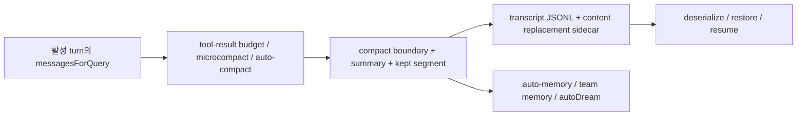

# 03. compaction, memory, handoff artifact

## 장 요약

긴 세션을 운영한다는 것은 결국 무엇을 버리고 무엇을 남길지 결정하는 일이다. Claude Code는 이 문제를 하나의 "memory 기능"으로 뭉개지 않고, 현재 turn을 살리는 compaction, 반복적으로 다시 불러올 사실을 남기는 memory, 다음 owner가 복구에 사용할 transcript와 resume artifact를 분리한다. 여기에 checkpoint와 subagent handoff를 구분 축으로 더하면, 같은 "이어짐"도 서로 다른 owner transfer 문제라는 점이 더 선명해진다. 이 장은 이 다섯 층을 저장 위치가 아니라 시간축과 owner transfer 기준으로 다시 묶어 읽는다.

## 범위와 비범위

이 장이 다루는 것:

- context 압력 완화를 위한 compaction 계층
- auto-memory와 team memory가 transcript와 다른 목적을 갖는 이유
- transcript, content replacement, resume state가 handoff artifact로 작동하는 방식
- 현재 turn, 다음 turn, 다음 session, 다음 owner라는 시간축을 구분하는 이유

이 장이 다루지 않는 것:

- memory 파일 포맷의 세부 규칙과 taxonomy 전부
- remote session transport의 상세 네트워크 프로토콜
- 전체 task orchestration 체계

이 주제들은 [01-state-resumability-and-session-ownership.md](../05-execution-continuity-and-integrations/01-state-resumability-and-session-ownership.md), [02-task-orchestration-and-long-running-execution.md](../05-execution-continuity-and-integrations/02-task-orchestration-and-long-running-execution.md), [07-claude-code-persistence-config-and-migrations.md](../05-execution-continuity-and-integrations/07-claude-code-persistence-config-and-migrations.md)에서 확장한다.

## 자료와 독서 기준

대표 발췌 출처:

- `src/services/compact/autoCompact.ts`
- `src/services/compact/compact.ts`
- `src/services/extractMemories/extractMemories.ts`
- `src/services/extractMemories/prompts.ts`
- `src/services/autoDream/autoDream.ts`
- `src/services/autoDream/consolidationLock.ts`
- `src/memdir/paths.ts`
- `src/memdir/memdir.ts`
- `src/memdir/teamMemPaths.ts`
- `src/utils/sessionStorage.ts`
- `src/utils/sessionRestore.ts`
- `src/utils/conversationRecovery.ts`
- `src/screens/REPL.tsx`

외부 프레이밍:

- Anthropic, [Effective context engineering for AI agents](https://www.anthropic.com/engineering/effective-context-engineering-for-ai-agents), 2025-09-29
- Anthropic, [Effective harnesses for long-running agents](https://www.anthropic.com/engineering/effective-harnesses-for-long-running-agents), 2025-11-26
- Anthropic, [Harness design for long-running application development](https://www.anthropic.com/engineering/harness-design-long-running-apps), 2026-03-24
- LangGraph Docs, [Persistence](https://docs.langchain.com/oss/python/langgraph/persistence), verified 2026-04-06
- LangGraph Docs, [Interrupts](https://docs.langchain.com/oss/python/langgraph/interrupts), verified 2026-04-06
- Pan et al., [Natural-Language Agent Harnesses](https://arxiv.org/abs/2603.25723), 2026-03-26, under review

함께 읽으면 좋은 장:

- [01-context-as-an-operational-resource.md](01-context-as-an-operational-resource.md)
- [04-turn-loops-stop-hooks-and-recovery.md](04-turn-loops-stop-hooks-and-recovery.md)
- [../execution/02-state-resumability-and-session-ownership.md](../05-execution-continuity-and-integrations/01-state-resumability-and-session-ownership.md)
- [03-references.md](../00-front-matter/03-references.md)

Sources / evidence notes:
이 장의 reader-facing 외부 검증 축은 [../00-front-matter/03-references.md](../00-front-matter/03-references.md)의 `S4`, `S6`, `S26`, `S27`를 따른다.

## 다섯 가지 시간축 답변

| 전략 | 질문 | 대표 구조 | owner transfer 기준 |
| --- | --- | --- | --- |
| compaction | "지금 window를 어떻게 살릴까?" | `trySessionMemoryCompaction()`, `compactConversation()` | 같은 owner 안에서 현재 turn을 계속 이어 간다 |
| memory | "다음 turn이나 다음 날에도 다시 쓸 사실은 무엇인가?" | `memdir/*`, `extractMemories`, `autoDream` | 현재 owner가 추려서 durable note로 남긴다 |
| checkpoint | "같은 engine이 정확히 어느 지점에서 다시 시작할 것인가?" | LangGraph `StateSnapshot`, checkpointer 같은 명시적 snapshot 개념 | 대체로 같은 owner와 같은 runtime이 재개한다 |
| handoff artifact | "다음 owner가 무엇을 받아야 이어서 일할 수 있는가?" | transcript JSONL, content replacements, restore state | owner가 바뀌거나 세션이 끊겨도 재시작 가능해야 한다 |
| subagent handoff | "하위 owner에게 어떤 좁은 작업 packet을 넘길 것인가?" | task description, tool 제한, output contract, scoped overlay | 부모 owner가 child owner에게 제한된 문맥만 넘긴다 |

이 다섯 층을 구분하지 않으면 흔히 몇 가지 오독이 생긴다.
여기서 `owner transfer`라는 표현 역시 코드 안의 공식 타입명이 아니라, transcript, resume, worktree/session restore 경로를 하나의 설계 단위로 읽기 위한 해석 용어다.

- compaction이 곧 memory라고 생각해 현재 turn을 살리는 기술과 장기 기억을 같은 것으로 본다.
- checkpoint와 handoff artifact를 같은 것으로 생각해 "같은 engine 재개"와 "다음 owner 이해"를 혼동한다.
- transcript를 단순 로그라고 생각해 resume/handoff contract를 문서에서 놓친다.

여기서 checkpoint는 비교 프레임이다. LangGraph persistence 문서는 checkpointer가 thread마다 checkpoint를 저장하고, 각 super-step 경계마다 `StateSnapshot`을 남겨 human-in-the-loop, time travel, fault-tolerant execution을 가능하게 한다고 설명한다. Claude Code 공개 사본은 LangGraph처럼 `checkpoint`라는 first-class object를 직접 노출하지 않지만, 바로 그 사실이 handoff artifact와 checkpoint를 구분해 읽어야 하는 이유가 된다.

## Claude Code는 먼저 "지금 세션"을 살린다

`src/services/compact/autoCompact.ts`는 압력이 오면 먼저 session-memory compaction을 시도하고, 충분치 않으면 일반 compaction으로 넘어간다.

```ts
const sessionMemoryResult = await trySessionMemoryCompaction(
  messages,
  toolUseContext.agentId,
  recompactionInfo.autoCompactThreshold,
)
...
const compactionResult = await compactConversation(
  messages,
  toolUseContext,
  cacheSafeParams,
  true,
  undefined,
  true,
  recompactionInfo,
)
```

이 순서가 말하는 바는 분명하다. compaction은 "오래 보관할 정보를 정리하는 기능"이 아니라 우선적으로 현재 context window를 계속 usable하게 만드는 기술이다.

`compactConversation()`이 만든 결과는 다시 하나의 post-compact message bundle로 조합된다.

```ts
export function buildPostCompactMessages(result: CompactionResult): Message[] {
  return [
    result.boundaryMarker,
    ...result.summaryMessages,
    ...(result.messagesToKeep ?? []),
    ...result.attachments,
    ...result.hookResults,
  ]
}
```

즉 compaction의 산출물은 단순 summary가 아니다. boundary marker, summary, keep segment, attachment, hook result까지 포함한 "재시작 가능한 새 working set"이다.

## context reset과 compaction은 같은 기술이 아니다

Anthropic의 [Harness design for long-running application development](https://www.anthropic.com/engineering/harness-design-long-running-apps) (2026-03-24)는 여기서 한 걸음 더 나아간다. 그 글은 compaction과 context reset을 서로 다른 문제를 푸는 기술로 구분한다.

- compaction은 같은 owner가 같은 session을 줄여서 계속 가게 한다.
- context reset은 fresh agent와 structured handoff artifact를 통해 clean slate를 만든다.

둘 다 continuity를 돕지만, trade-off가 다르다. compaction은 continuity를 더 자연스럽게 보존하지만 이전 session psychology를 완전히 지우지는 못한다. reset은 clean slate를 주지만, handoff artifact의 품질과 orchestration cost에 더 많이 의존한다.

이 구분은 이 장의 local code 사실을 바꾸지 않는다. 현재 Claude Code 공개 사본은 compaction, transcript, restore artifact를 강하게 드러내는 사례다. 다만 장기 실행 하네스를 일반화해 읽을 때는 "window를 줄인다"와 "새 owner로 넘긴다"를 같은 것으로 취급하면 안 된다.

## clean-slate reset이 필요한 경우와 compaction으로 충분한 경우

위 글은 특히 일부 모델에서 나타나는 `context anxiety`를 예로 든다. 모델이 context 한계에 가까워졌다고 느낄 때 prematurely wrap up하거나 coherence를 잃는다면, compaction alone으로는 충분하지 않을 수 있다. 이 경우 reset은 단순 성능 튜닝이 아니라 failure mode 대응이 된다.

반대로 모델의 long-context behavior가 좋아지면, 이전에 필수였던 reset scaffold가 과잉 복잡도가 될 수 있다. 따라서 여기서 중요한 일반 원칙은 하나다.

- compaction과 reset의 선택은 ideology가 아니라 model-relative 판단이다.

즉 어떤 하네스가 reset을 쓴다고 해서 항상 더 진보적이라고 볼 수 없고, reset을 쓰지 않는다고 해서 항상 단순한 것도 아니다. 핵심은 현재 모델과 작업 길이, handoff artifact 품질을 함께 보고 어느 쪽이 더 load-bearing한지 판단하는 일이다.

## memory는 transcript보다 더 선택적인 durable layer다

`memdir`와 `extractMemories` 계층은 transcript 전체를 보존하는 대신, future turn에 가치가 있는 사실만 남기려는 장치다. `MEMORY.md`는 live index이고, typed memory file은 별도 topic file로 저장되며, `autoDream`은 background consolidation으로 이것을 다시 정리한다.

```ts
You are now acting as the memory extraction subagent. Analyze the most recent
~N messages above and use them to update your persistent memory systems.
...
`MEMORY.md` is an index, not a memory — each entry should be one line...
```

이 prompt가 보여 주듯 memory layer는 transcript의 대체물이 아니다.

`typed memory file`을 reader-facing shorthand로 다시 적으면 아래 네 가지 분류로 보는 편이 가장 이해가 빠르다.

| memory type | 저장하는 것 | future turn에서의 쓰임 | 저장하지 말아야 할 것 |
| --- | --- | --- | --- |
| `user` | 사용자의 역할, 책임, 익숙한 도메인, 설명 선호 | 답변 톤과 비유를 사용자 관점에 맞춘다 | 근거 없는 평가, 일회성 기분, 코드에서 바로 알 수 있는 사실 |
| `feedback` | 어떻게 일해야 하는지에 대한 교정과 검증된 선호 | 같은 수정 지시를 다시 듣지 않도록 작업 방식을 맞춘다 | 단순 활동 로그, 이번 턴 한정의 임시 지시 |
| `project` | ongoing goal, freeze, incident, decision, deadline처럼 코드 밖 맥락 | 제안의 우선순위와 위험 판단을 프로젝트 사정에 맞춘다 | git history로 재구성 가능한 변경 사실, 이미 코드에 적힌 구조 |
| `reference` | 외부 시스템에서 어디를 보면 되는지에 대한 pointer | 다음 세션에 외부 context를 다시 찾는 출발점이 된다 | 외부 시스템의 순간 스냅샷 자체, 곧바로 낡는 수치 나열 |

이 표는 memory schema 전체를 대체하려는 것이 아니라, 왜 `user_role.md`, `feedback_testing.md` 같은 파일이 topic별로 분리되는지 한 번에 떠올리게 하는 최소 분류표다. 더 중요한 것은 분류보다도 exclusion rule이다. code pattern, architecture, file path, git history처럼 현재 project state에서 다시 도출할 수 있는 것은 memory가 아니라 다른 source of truth에 속한다.

- transcript는 replay와 recovery를 위한 원본에 가깝다.
- memory는 다음 세션에도 다시 쓸 만한 사실만 선별한 secondary artifact다.
- autoDream은 그 secondary artifact를 주기적으로 정돈하는 maintenance pass다.

따라서 "긴 세션이니 memory가 필요하다"는 말은 절반만 맞다. 긴 세션에는 memory도 필요하지만, 그보다 먼저 compaction과 handoff artifact가 필요하다.

## handoff artifact는 resume contract를 만든다

Claude Code는 recovery를 위해 transcript와 sidecar state를 꽤 적극적으로 기록한다. transcript path 계산부터 owner transfer를 의식한 흔적이 보인다.

```ts
export function getTranscriptPath(): string {
  const projectDir = getSessionProjectDir() ?? getProjectDir(getOriginalCwd())
  return join(projectDir, `${getSessionId()}.jsonl`)
}
```

`recordTranscript()`는 이미 기록된 prefix는 건너뛰고 새로운 chain participant만 append하면서, compaction boundary가 들어온 경우 resume chain이 어디서 끊겨야 하는지도 관리한다.

```ts
export async function recordTranscript(
  messages: Message[],
  ...
): Promise<UUID | null> {
  ...
  if (newMessages.length > 0) {
    await getProject().insertMessageChain(
      newMessages,
      false,
      undefined,
      startingParentUuid,
      teamInfo,
    )
  }
  ...
}
```

tool result replacement도 transcript와 별도의 sidecar record로 저장된다.

```ts
export async function recordContentReplacement(
  replacements: ContentReplacementRecord[],
  agentId?: AgentId,
) {
  await getProject().insertContentReplacement(replacements, agentId)
}
```

이것이 중요한 이유는 resume 때 "무슨 말을 했는가"만 복구하면 충분하지 않기 때문이다. 어떤 tool result가 대체되었고, 어떤 chain boundary가 생겼는지까지 복구해야 같은 session semantics가 유지된다.

checkpoint와 handoff artifact의 차이도 여기서 드러난다. checkpoint는 보통 engine이 자기 자신을 재개하기 위해 남기는 구조적 snapshot이고, handoff artifact는 다음 owner가 이해할 수 있도록 의미를 복구해 주는 bundle이다. LangGraph 문서가 `thread_id`와 checkpoint를 resume pointer로 쓰는 반면, Claude Code 공개 사본은 transcript chain, restore state, conversation recovery를 조합해 resume contract를 만든다. 둘 다 continuity를 돕지만, 설명 단위가 다르다.

## resume는 단순 파일 재로드가 아니라 의미 복구다

`src/utils/conversationRecovery.ts`는 resume에 앞서 serialized transcript를 그대로 믿지 않는다. unresolved tool use, orphaned thinking-only assistant message, whitespace-only assistant message를 정리하고, mid-turn interruption이면 synthetic continuation message까지 붙인다.

```ts
const filteredToolUses = filterUnresolvedToolUses(migratedMessages)
const filteredThinking = filterOrphanedThinkingOnlyMessages(filteredToolUses)
const filteredMessages = filterWhitespaceOnlyAssistantMessages(filteredThinking)
...
if (internalState.kind === 'interrupted_turn') {
  filteredMessages.push(createUserMessage({
    content: 'Continue from where you left off.',
    isMeta: true,
  }))
}
```

LangGraph interrupts 문서와 비교하면 이 차이는 더 선명해진다. LangGraph는 interrupt가 발생하면 persistence layer에 현재 state를 저장하고, 같은 `thread_id`와 `Command(resume=...)`로 다시 진입하도록 한다. Claude Code 공개 사본의 resume path는 이와 같은 first-class interrupt primitive 대신 transcript filtering, synthetic continuation, sidecar state restore를 조합해 semantic re-entry를 만든다. 즉 checkpoint-like resume와 handoff-like resume는 구현 형태부터 다를 수 있다.

그 다음 `restoreSessionStateFromLog()`는 file history, attribution, context-collapse commit log, todo state를 복원한다.

```ts
export function restoreSessionStateFromLog(
  result: ResumeResult,
  setAppState: (f: (prev: AppState) => AppState) => void,
): void {
  if (result.fileHistorySnapshots && result.fileHistorySnapshots.length > 0) {
    fileHistoryRestoreStateFromLog(...)
  }
  ...
  if (feature('CONTEXT_COLLAPSE')) {
    restoreFromEntries(result.contextCollapseCommits ?? [], result.contextCollapseSnapshot)
  }
}
```

즉 handoff artifact는 transcript 한 파일이 아니라, 다음 owner가 의미적으로 같은 session을 재개할 수 있게 만드는 복합 bundle이다.

## 시간축으로 보면 다섯 층의 관계가 분명해진다



이 다이어그램에서 왼쪽 가지는 "현재 turn을 살리는" 경로이고, 아래쪽 오른쪽은 "다음 owner나 다음 날을 돕는" 경로다. 같은 artifact family처럼 보여도 실제 책임은 다르다.

- compaction은 현재 owner의 현재 window를 살린다.
- memory는 이후 owner에게도 도움이 될 수 있는 사실을 별도로 남긴다.
- checkpoint는 같은 engine이 어느 boundary에서 재개할지 정한다.
- handoff artifact는 다음 owner가 의미적으로 같은 session을 재개할 수 있게 한다.
- subagent handoff는 전체 session을 넘기지 않고 좁은 작업만 위임한다.

## 대표 failure mode

1. compaction만으로 continuity를 해결하려는 경우  
   window는 살아나지만 다음 owner가 필요한 resume contract는 남지 않는다.
2. transcript만 있으면 충분하다고 보는 경우  
   반복적으로 다시 써야 할 사실이 매번 raw log에서 재채굴되어야 한다.
3. memory file을 handoff artifact로 오해하는 경우  
   memory는 selective note이고, transcript/restore state를 대체하지 못한다.

## 관찰, 원칙, 해석, 권고

관찰:

- Claude Code는 compaction과 memory를 별도 코드 경로로 구현한다.
- transcript와 content replacement는 resume semantics를 위해 별도 저장된다.
- recovery는 raw log 재로드가 아니라 invalid state filtering과 synthetic continuation을 포함한다.
- checkpoint와 handoff artifact는 같은 continuity 장치가 아니라, 서로 다른 owner transition을 설명하는 언어다.

원칙:

- 현재 turn을 살리는 artifact와 다음 session을 돕는 artifact를 분리해야 한다.
- memory는 transcript의 축약본이 아니라 selection layer여야 한다.
- handoff artifact는 단순 저장보다 "같은 semantics로 재개 가능한가"를 기준으로 설계해야 한다.
- compaction과 reset은 같은 계열의 continuity 기술처럼 보여도 다른 failure mode를 푼다.
- subagent handoff는 full transcript replay보다 더 좁은 delegation contract로 설명해야 한다.

해석:

- Anthropic이 long-running harness에서 강조하는 clean state와 structured artifact 개념은 이 코드베이스에서 transcript, content replacement, restore state로 구체화된다.
- Natural-Language Agent Harnesses가 말하는 durable artifact도 결국 이런 owner-transfer surface를 뜻한다.
- Anthropic의 2026-03-24 글을 함께 읽으면, continuity 설계는 compaction vs reset의 선택 문제까지 포함한다는 점이 더 분명해진다.
- LangGraph persistence/interrupts 문서와 비교하면 checkpoint-like resume와 handoff-like resume를 같은 용어로 뭉개면 안 된다는 점이 더 명확해진다.

권고:

- 새 하네스를 설계할 때는 compaction, memory, handoff artifact를 같은 팀이 관리하더라도 별도의 설계 문서와 failure budget으로 다뤄라.
- transcript는 "디버깅용 로그"라고만 쓰지 말고 resume contract 관점에서 필요한 metadata를 함께 적어라.
- reset을 쓸지 말지는 model-relative load-bearing 판단으로 기록하라.
- memory layer를 도입한다면 transcript를 지우는 대신, transcript 위에 selective recall layer를 추가하는 식으로 접근하라.

## benchmark 질문

1. 이 시스템은 현재 turn을 살리는 compaction과 장기 기억을 남기는 memory를 구분하는가.
2. transcript 외에 resume semantics를 유지하는 sidecar artifact가 있는가.
3. interruption 이후 재개 시 invalid state를 정리하는 recovery 단계가 있는가.
4. checkpoint와 handoff artifact의 차이가 설계와 문서 양쪽에서 드러나는가.
5. memory artifact가 transcript나 handoff artifact를 대체하지 않는다는 사실이 설계에 드러나는가.

## 요약

compaction, memory, checkpoint, handoff artifact, subagent handoff는 비슷해 보여도 서로 다른 시간축 문제에 답한다. Claude Code는 먼저 현재 window를 살리고, 별도로 durable memory를 정리하며, transcript와 sidecar state로 다음 owner의 resume contract를 만든다. 여기에 checkpoint-like resume pointer와 subagent delegation packet까지 구분해 두어야 continuity 설명도, failure analysis도 흔들리지 않는다.

## 대표 근거 읽기 순서

아래 라벨은 독자가 별도 source를 열어야 한다는 뜻이 아니라, 이 장에서 이미 인용하고 설명한 코드 발췌가 어떤 구현 단면을 대표하는지 다시 묶어 주는 provenance 메모다.

1. `src/services/compact/autoCompact.ts`
   현재 turn을 살리는 경로가 어디서 시작되는지 본다.
2. `src/services/compact/compact.ts`
   compaction 산출물이 어떤 post-compact bundle로 재조립되는지 본다.
3. `src/memdir/paths.ts`와 `src/memdir/memdir.ts`
   durable memory layer가 transcript와 어떻게 다른지 확인한다.
4. `src/services/extractMemories/prompts.ts`
   memory extraction이 transcript가 아니라 selective note를 목표로 함을 본다.
5. `src/utils/sessionStorage.ts`
   transcript와 content replacement가 어떻게 지속화되는지 본다.
6. `src/utils/conversationRecovery.ts`
   resume 전에 어떤 invalid state를 정리하는지 확인한다.
7. `src/utils/sessionRestore.ts`
   다음 owner가 어떤 cumulative state까지 복구하는지 추적한다.
