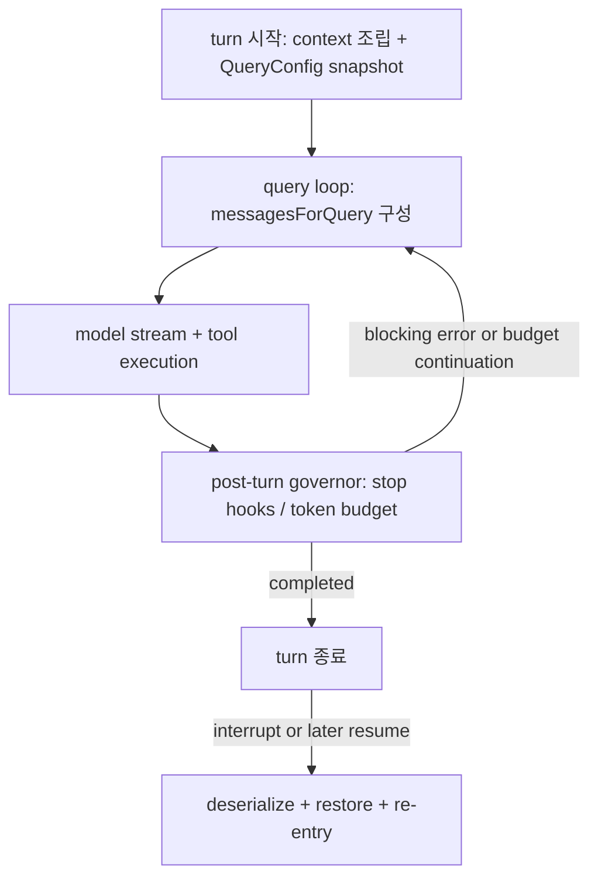

# 04. turn loop, stop hook, recovery

## 장 요약

장기 실행형 하네스에서 중요한 것은 모델을 한 번 더 호출하는 기술이 아니라, 왜 다음 turn이 이어지고 언제 멈추며 실패 후 어떻게 회복하는가를 제어하는 구조다. Claude Code의 `src/query.ts`, `src/query/stopHooks.ts`, `src/QueryEngine.ts`, `src/screens/REPL.tsx`, `src/utils/conversationRecovery.ts`를 함께 읽으면 이 시스템이 API wrapper가 아니라 상태 기계에 가까운 control plane임이 드러난다.

## 범위와 비범위

이 장이 다루는 것:

- `query()` loop의 상태와 continue 조건
- stop hook이 post-model governor로 작동하는 방식
- token budget continuation과 stop hook blocking이 turn 전이를 어떻게 바꾸는지
- REPL/SDK owner 차이와 recovery/resume의 접점

이 장이 다루지 않는 것:

- 개별 hook 스크립트의 기능 카탈로그
- remote transport와 distributed execution 세부
- background task registry 전체

이 세 주제는 [../execution/03-task-orchestration-and-long-running-execution.md](../05-execution-continuity-and-integrations/02-task-orchestration-and-long-running-execution.md), [../execution/04-human-oversight-trust-and-approval.md](../05-execution-continuity-and-integrations/03-human-oversight-trust-and-approval.md), [../17-end-to-end-scenarios.md](../07-evaluation-and-synthesis/07-claude-code-end-to-end-scenarios.md)에서 더 넓게 다룬다.

## 자료와 독서 기준

대표 발췌 출처:

- `src/query.ts`
- `src/query/stopHooks.ts`
- `src/query/config.ts`
- `src/query/tokenBudget.ts`
- `src/QueryEngine.ts`
- `src/screens/REPL.tsx`
- `src/utils/conversationRecovery.ts`
- `src/utils/sessionRestore.ts`

외부 프레이밍:

- Anthropic, [Effective harnesses for long-running agents](https://www.anthropic.com/engineering/effective-harnesses-for-long-running-agents), 2025-11-26
- Anthropic, [Harness design for long-running application development](https://www.anthropic.com/engineering/harness-design-long-running-apps), 2026-03-24
- Lee et al., [Meta-Harness: End-to-End Optimization of Model Harnesses](https://arxiv.org/abs/2603.28052), 2026-03-30

함께 읽으면 좋은 장:

- [01-context-as-an-operational-resource.md](01-context-as-an-operational-resource.md)
- [03-compaction-memory-and-handoff-artifacts.md](03-compaction-memory-and-handoff-artifacts.md)
- [../06-query-engine-and-turn-lifecycle.md](06-claude-code-query-engine-and-turn-lifecycle.md)
- [../execution/02-state-resumability-and-session-ownership.md](../05-execution-continuity-and-integrations/01-state-resumability-and-session-ownership.md)

## control loop를 상태 기계로 봐야 하는 이유

`src/query.ts`는 loop 사이를 오가는 mutable state를 명시적으로 들고 있다. 여기에는 message set, tool use context, compaction tracking, max-output-token recovery count, pending tool summary, stop hook active 여부, turn count, 직전 continuation 이유가 포함된다.

이 설계는 "모델을 부르고 결과를 처리한다"는 설명보다 훨씬 많은 것을 함의한다.

- loop는 한 번의 API call이 아니라 여러 continuation을 포함할 수 있다.
- stop hook이나 token budget은 바깥 예외 처리기가 아니라 loop transition 규칙이다.
- recovery path는 동일 loop 안에서 작동하는 경우와 resume 이후 외부에서 재진입하는 경우가 모두 있다.

## Claude Code의 네 단계 control loop



이 다이어그램의 핵심은 stop hook과 resume가 core loop 밖의 부가 기능이 아니라, 전이 규칙을 완성하는 필수 구성 요소라는 점이다.

## turn 시작: immutable snapshot과 mutable working state를 분리한다

`query()`는 진입 직후 `buildQueryConfig()`로 immutable snapshot을 고정하고, 동시에 mutable `State`를 따로 유지한다.

```ts
const config = buildQueryConfig()
...
let { toolUseContext } = state
const {
  messages,
  autoCompactTracking,
  maxOutputTokensRecoveryCount,
  hasAttemptedReactiveCompact,
  maxOutputTokensOverride,
  pendingToolUseSummary,
  stopHookActive,
  turnCount,
} = state
```

좋은 loop가 이 분리를 하는 이유는 명확하다.

- session ID나 runtime gate는 turn 안에서 바뀌면 안 된다.
- message set, compaction tracking, stop-hook 상태는 continuation마다 바뀐다.
- 둘을 섞으면 resume나 retry가 들어왔을 때 어느 값이 authoritative한지 설명하기 어렵다.

## turn 중간: working set을 바꾸면서 계속 이어 간다

loop 본문은 `messagesForQuery`를 compact boundary 뒤에서 시작해 tool-result budget, snip, microcompact, auto-compact를 거친 뒤 model sampling과 tool execution으로 보낸다.

```ts
let messagesForQuery = [...getMessagesAfterCompactBoundary(messages)]
...
messagesForQuery = await applyToolResultBudget(...)
...
const microcompactResult = await deps.microcompact(messagesForQuery, toolUseContext, querySource)
messagesForQuery = microcompactResult.messages
```

여기서 중요한 것은 "loop를 돌 때마다 같은 입력을 다시 보낸다"가 아니라, "직전 iteration의 결과를 반영한 새 working set으로 다음 sampling을 계속한다"는 점이다. 그래서 continuation은 단순 재호출이 아니라 상태 전이다.

## stop hook은 post-model governor다

tool use가 더 이상 필요 없거나 assistant 메시지가 끝난 뒤, `src/query.ts`는 `handleStopHooks()`를 호출한다.

```ts
const stopHookResult = yield* handleStopHooks(
  messagesForQuery,
  assistantMessages,
  systemPrompt,
  userContext,
  systemContext,
  toolUseContext,
  querySource,
  stopHookActive,
)
```

`handleStopHooks()`는 hook 실행만 하는 함수가 아니다. 그것은 turn 종료 직전에 다음 세 가지를 한 번에 조정한다.

1. stop hook 실행과 progress/summary 메시지 생성
2. prompt suggestion, memory extraction, autoDream 같은 background bookkeeping 시작
3. continuation을 막을지, blocking error를 loop 안으로 되돌릴지 결정

```ts
if (!isBareMode()) {
  if (!isEnvDefinedFalsy(process.env.CLAUDE_CODE_ENABLE_PROMPT_SUGGESTION)) {
    void executePromptSuggestion(stopHookContext)
  }
  if (feature('EXTRACT_MEMORIES') && !toolUseContext.agentId && isExtractModeActive()) {
    void extractMemoriesModule!.executeExtractMemories(...)
  }
  if (!toolUseContext.agentId) {
    void executeAutoDream(stopHookContext, toolUseContext.appendSystemMessage)
  }
}
```

```ts
if (result.preventContinuation) {
  preventedContinuation = true
  stopReason = result.stopReason || 'Stop hook prevented continuation'
  yield createAttachmentMessage({
    type: 'hook_stopped_continuation',
    ...
  })
}
```

즉 stop hook은 "끝나기 전에 한 번 더 돌리는 스크립트"가 아니라, turn 종료를 승인하거나 보류하는 governor다.

## blocking error와 continuation은 같은 상태 기계 안에서 처리된다

stop hook이 blocking error를 반환하면 loop는 메시지를 덧붙인 새 `State`를 만들고 다시 돈다.

```ts
if (stopHookResult.blockingErrors.length > 0) {
  const next: State = {
    messages: [
      ...messagesForQuery,
      ...assistantMessages,
      ...stopHookResult.blockingErrors,
    ],
    ...
    stopHookActive: true,
    transition: { reason: 'stop_hook_blocking' },
  }
  state = next
  continue
}
```

token budget continuation도 같은 패턴이다. `checkTokenBudget()`는 90% 미만이면 meta user message로 "계속 일하라"는 nudge를 넣고, 세 번 이상 continuation했는데 증가량이 500 tokens 미만이면 diminishing return으로 종료한다.

```ts
export function checkTokenBudget(
  tracker: BudgetTracker,
  agentId: string | undefined,
  budget: number | null,
  globalTurnTokens: number,
): TokenBudgetDecision {
  ...
  if (!isDiminishing && turnTokens < budget * COMPLETION_THRESHOLD) {
    tracker.continuationCount++
    ...
    return {
      action: 'continue',
      nudgeMessage: getBudgetContinuationMessage(pct, turnTokens, budget),
      ...
    }
  }
}
```

```ts
if (decision.action === 'continue') {
  state = {
    messages: [
      ...messagesForQuery,
      ...assistantMessages,
      createUserMessage({
        content: decision.nudgeMessage,
        isMeta: true,
      }),
    ],
    ...
    transition: { reason: 'token_budget_continuation' },
  }
  continue
}
```

이 구조가 시사하는 바는 분명하다. Claude Code의 loop는 model output을 수동으로 소비하는 것이 아니라, 종료 사유와 continuation 사유를 명시적으로 추적하는 control system이다.

## REPL과 QueryEngine은 같은 loop를 다르게 책임진다

REPL은 interactive owner이므로 UI state, spinner, transcript scrollback, proactive tick, `/resume` UX를 함께 책임진다. `onQueryImpl()`은 `query()`를 호출하기 전에 context를 조립하고, compact boundary가 오면 UI message array와 conversation ID를 다시 맞춘다.

QueryEngine은 headless owner이므로 transcript durability와 permission denial tracking을 더 강하게 책임진다.

```ts
if (persistSession && messagesFromUserInput.length > 0) {
  const transcriptPromise = recordTranscript(messages)
  if (isBareMode()) {
    void transcriptPromise
  } else {
    await transcriptPromise
    ...
  }
}
```

이 코드가 중요한 이유는, headless path에서는 사용자가 UI scrollback을 보지 않더라도 resume contract가 유지되어야 하기 때문이다. REPL이 "보이는 상태"를 책임진다면 QueryEngine은 "살아남는 상태"를 책임진다.

## recovery는 loop 바깥의 재진입 규칙이다

session이 끊겼다고 해서 raw transcript를 그대로 다시 넣는 것은 아니다. `deserializeMessagesWithInterruptDetection()`는 invalid state를 정리하고, interrupted turn이면 synthetic continuation을 붙인다.

```ts
const filteredToolUses = filterUnresolvedToolUses(migratedMessages)
const filteredThinking = filterOrphanedThinkingOnlyMessages(filteredToolUses)
...
if (internalState.kind === 'interrupted_turn') {
  filteredMessages.push(createUserMessage({
    content: 'Continue from where you left off.',
    isMeta: true,
  }))
}
```

REPL의 `/resume` path는 여기에 더해 file history, agent setting, worktree, content replacement state, session metadata까지 복구한다.

```ts
restoreSessionStateFromLog(log, setAppState)
...
restoreSessionMetadata(log)
...
restoreWorktreeForResume(log.worktreeSession)
...
contentReplacementStateRef.current =
  reconstructContentReplacementState(messages, log.contentReplacements ?? [])
```

이것이 뜻하는 것은 recovery가 단순 "다시 열기"가 아니라는 점이다. recovery는 loop가 다시 들어올 수 있도록 owner state를 재정렬하는 재진입 절차다.

## 대표 failure mode

1. loop를 API wrapper로 읽는 경우  
   continuation과 recovery 이유가 설명되지 않는다.
2. stop hook을 부가 스크립트로 보는 경우  
   실제로는 governor가 맡는 종료 승인 논리를 놓친다.
3. resume를 transcript reload로만 이해하는 경우  
   invalid state filtering, worktree restore, content replacement reconstruction을 모두 빠뜨리게 된다.

## 관찰, 원칙, 해석, 권고

관찰:

- `src/query.ts`는 continuation 사유를 `transition`으로 남기며 명시적인 state 전이를 수행한다.
- stop hook은 background bookkeeping과 종료 승인 논리를 함께 가진 post-model governor다.
- recovery는 deserialize, restore, re-entry의 세 단계로 나뉜다.

원칙:

- 장기 실행형 하네스는 turn 완료 조건과 continuation 조건을 코드 수준에서 명시해야 한다.
- post-model governor는 예외 처리기가 아니라 control loop의 일부여야 한다.
- resume 설계는 transcript reload가 아니라 semantic re-entry로 다뤄야 한다.

해석:

- Anthropic의 long-running harness 글이 말하는 structured artifact와 clean handoff는 이 코드베이스에서 turn loop와 resume path의 분리로 확인된다.
- Meta-Harness가 강조하는 harness optimization 대상에는 모델 호출뿐 아니라 이런 control loop 규칙 자체가 포함된다.

권고:

- 새 하네스를 설계할 때는 turn 상태도와 continuation 사유를 먼저 문서화하라.
- stop hook, retry, budget continuation을 별도 "예외"로 흩어 놓지 말고 같은 상태 기계 위에서 설명하라.
- resume UX가 있다면 invalid state filtering과 owner state restoration을 명시적으로 구분해 구현하라.

## benchmark 질문

1. 이 시스템은 turn 종료 사유와 continuation 사유를 명시적으로 남기는가.
2. stop hook은 pre-model 단계가 아니라 post-model governor로 설계되어 있는가.
3. token budget continuation과 blocking error retry가 같은 상태 기계 안에서 설명되는가.
4. resume path가 raw transcript reload를 넘어 semantic re-entry를 보장하는가.

## 요약

Claude Code의 turn loop는 단순한 API wrapper가 아니다. 그것은 immutable snapshot, mutable working set, post-model governor, semantic recovery를 함께 관리하는 control plane이다. 이 구조를 상태 기계로 읽어야만 why-next-turn, why-stop, how-recover라는 세 질문에 일관되게 답할 수 있다.

## 대표 근거 읽기 순서

아래 라벨은 독자가 별도 source를 열어야 한다는 뜻이 아니라, 이 장에서 이미 인용하고 설명한 코드 발췌가 어떤 구현 단면을 대표하는지 다시 묶어 주는 provenance 메모다.

1. `src/query/config.ts`
   immutable snapshot이 무엇인지 먼저 본다.
2. `src/query.ts`
   state struct와 continue 지점을 따라간다.
3. `src/query/stopHooks.ts`
   post-model governor가 어떤 결정권을 가지는지 본다.
4. `src/query/tokenBudget.ts`
   continuation과 diminishing return 규칙을 확인한다.
5. `src/QueryEngine.ts`
   headless owner가 loop 진입 전후에 무엇을 더 책임지는지 본다.
6. `src/screens/REPL.tsx`
   interactive owner가 같은 loop를 어떤 UI/state로 감싸는지 비교한다.
7. `src/utils/conversationRecovery.ts`와 `src/utils/sessionRestore.ts`
   recovery가 semantic re-entry라는 사실을 확인한다.
