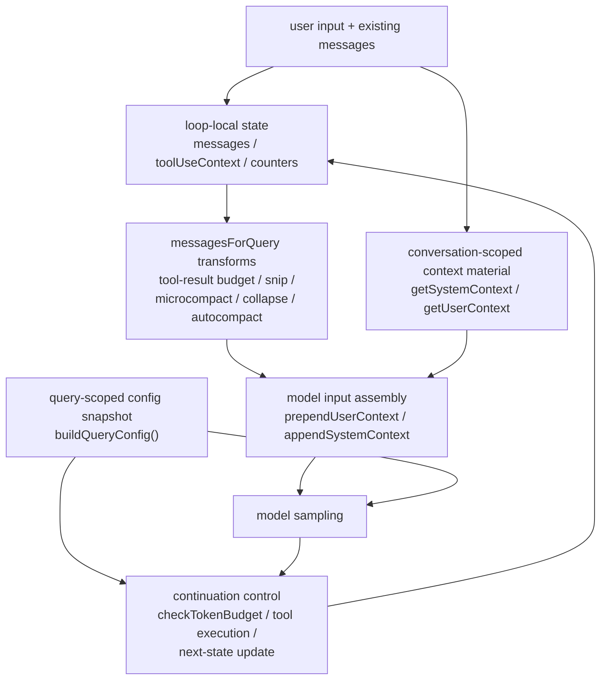

# 05. Claude Code 컨텍스트 조립과 query 파이프라인

## 장 요약

long-running harness의 query path는 단순한 `입력 -> API 호출 -> 응답` 흐름이 아니라, context를 어떤 운영 규칙 아래에서 모델 호출로 바꿀지 결정하는 파이프라인이다. 이 장은 그 문제를 Claude Code 사례에 적용한다. 핵심 질문은 두 가지다. 어떤 정보가 conversation에 upfront로 주입되는가, 그리고 그 정보는 token budget, compaction, continuation, tool execution 같은 규칙을 거치며 어떻게 실제 query로 바뀌는가.

해석: Claude Code에서 query는 프롬프트 한 장을 만드는 일이 아니다. `src/context.ts`는 system/user context를 runtime snapshot으로 조립하고, `src/query/config.ts`는 query entry 시점의 immutable config를 고정하며, `src/query.ts`는 mutable state를 들고 돌면서 budget, compaction, context collapse, tool orchestration, continuation을 관리한다. 따라서 이 장은 Claude Code의 context engineering을 "텍스트 작성 기술"이 아니라 "운영 자원 관리"로 읽는다.

## 원칙: context engineering은 prompt engineering보다 넓다

원칙: Anthropic의 [Effective context engineering for AI agents](https://www.anthropic.com/engineering/effective-context-engineering-for-ai-agents) (2025-09-29)는 context를 critical but finite resource로 다뤄야 하며, prompt engineering보다 더 넓게 "어떤 context configuration이 원하는 행동을 가장 잘 만들 것인가"를 묻는다고 설명한다. 이 글은 또한 장기 실행 agent에서는 context state 전체를 관리해야 하며, just-in-time retrieval과 compaction 같은 기법이 중요하다고 말한다.

원칙: 같은 글은 Claude Code를 just-in-time retrieval 사례로 직접 언급하고, 일부 정보는 upfront로 주입하고 나머지는 runtime에 더 불러오는 접근이 가능하다고 설명한다. `hybrid`라는 표현은 이 장의 해석이다.  
해석: 이 장은 Claude Code의 local code에서 바로 확인 가능한 범위 안에서, 적어도 upfront context 조립과 query-time resource management가 어떻게 구현되는지 추적한다.

원칙: Anthropic의 [Effective harnesses for long-running agents](https://www.anthropic.com/engineering/effective-harnesses-for-long-running-agents) (2025-11-26)는 long-running coherence가 compaction과 환경 정돈 같은 보조 구조에 의존한다고 설명한다.  
해석: 이 장은 그 관점을 context/query path에 적용해, 어떤 로컬 구조가 실제로 context pressure와 continuation을 관리하는지 읽는다. 다만 이 네 개의 로컬 모듈이 유일한 필수 집합이라고 주장하지는 않는다.

원칙: Anthropic의 prompt caching 문서는 안정적인 prompt prefix를 재사용하면 처리 시간과 비용을 줄일 수 있고, 긴 multi-turn conversation이 대표적 사용처라고 설명한다. 또한 cache write와 cache read는 서로 다른 가격 구조를 가진다.
해석: 따라서 context assembly는 품질 문제일 뿐 아니라 prefix stability와 churn distribution을 설계하는 경제 문제이기도 하다.

원칙: Pan et al.의 [Natural-Language Agent Harnesses](https://arxiv.org/abs/2603.25723) (submitted 2026-03-26)는 harness behavior가 controller 안에 묻힌 구현이 아니라 explicit runtime structure로 비교돼야 한다고 제안한다.  
해석: 이 장은 Claude Code의 context/query path를 바로 그런 runtime structure의 일부로 읽는다.

## 이 장의 직접 근거와 범위

### 직접 근거

#### 제품 사실

- `src/context.ts`
- `src/query.ts`
- `src/query/config.ts`
- `src/query/tokenBudget.ts`

#### 공개 설계 원칙

- Anthropic, [Effective context engineering for AI agents](https://www.anthropic.com/engineering/effective-context-engineering-for-ai-agents), 2025-09-29
- Anthropic, [Effective harnesses for long-running agents](https://www.anthropic.com/engineering/effective-harnesses-for-long-running-agents), 2025-11-26
- Anthropic Docs, [Prompt caching](https://docs.anthropic.com/en/docs/build-with-claude/prompt-caching), verified 2026-04-06

#### 추가 자료

- OpenAI, [Tracing](https://openai.github.io/openai-agents-python/tracing/), verified 2026-04-06
- OpenTelemetry, [Generative AI semantic conventions](https://opentelemetry.io/docs/specs/semconv/gen-ai/), verified 2026-04-06
- Pan et al., [Natural-Language Agent Harnesses](https://arxiv.org/abs/2603.25723), submitted 2026-03-26

이 장의 관찰은 2026-04-01 기준 현재 공개 사본에 한정한다.

Sources / evidence notes:
이 장의 reader-facing 외부 검증 축은 [../00-front-matter/03-references.md](../00-front-matter/03-references.md)의 `S4`, `S6`, `S22`, `S29`, `S33`을 따른다.

### 이 장의 범위

- `src/context.ts`가 어떤 정보를 system/user context로 조립하는지
- `src/query/config.ts`가 query entry 시점의 immutable config를 어떻게 고정하는지
- `src/query.ts`가 mutable loop state와 messages-for-query를 어떻게 관리하는지
- `src/query/tokenBudget.ts`가 언제 continuation과 early stop을 결정하는지

### 이 장에서 다루지 않는 것

- `src/QueryEngine.ts`의 conversation-global state ownership
- stop hook의 전체 state machine
- tool permission과 tool surface 설계
- 여러 turn에 걸친 resume semantics

이 비범위는 중요하다. `src/QueryEngine.ts`는 [06-query-engine-and-turn-lifecycle.md](06-claude-code-query-engine-and-turn-lifecycle.md)에서, tool surface는 [07-claude-code-tool-system-and-permissions.md](../04-interfaces-and-operator-surfaces/07-claude-code-tool-system-and-permissions.md)에서 더 자세히 다룬다.

## 이 장의 다섯 가지 구분

| 구분 | 이 장에서의 의미 |
| --- | --- |
| context material | 대화에 먼저 주입할 정보 |
| config snapshot | query entry 시점에 한 번만 고정되는 immutable runtime 값 |
| loop state | query loop가 iteration 사이에 들고 도는 mutable state |
| context pressure control | context를 줄이고 정렬하는 규칙 |
| continuation control | continuation, tool execution, 후속 turn 진행 여부를 결정하는 규칙 |

이 장의 핵심은 `context material`과 `loop state`를 같은 것으로 보지 않는 데 있다. `src/context.ts`는 재료를 모으고, `src/query.ts`는 그 재료를 어떤 규칙 아래에서 흘릴지 결정한다.

## context/query topology



제품 사실: Claude Code의 local code에서 context engineering은 하나의 함수나 prompt template에 들어 있지 않다. `src/context.ts`, `src/query/config.ts`, `src/query.ts`, `src/query/tokenBudget.ts`가 서로 다른 역할을 맡아 query path를 구성한다.  
해석: 이 topology는 context를 단순 문자열이 아니라, 재료와 제약이 결합된 운영 자원으로 읽게 만든다.

## 제품 사실 1: `src/context.ts`는 context를 runtime snapshot으로 조립한다

출처:

- `src/context.ts`

```ts
export const getSystemContext = memoize(
  async (): Promise<{ [k: string]: string }> => {
    ...
    const gitStatus =
      isEnvTruthy(process.env.CLAUDE_CODE_REMOTE) ||
      !shouldIncludeGitInstructions()
        ? null
        : await getGitStatus()
```

```ts
return {
  ...(gitStatus && { gitStatus }),
  ...(feature('BREAK_CACHE_COMMAND') && injection
    ? {
        cacheBreaker: `[CACHE_BREAKER: ${injection}]`,
      }
    : {}),
}
```

제품 사실: system context는 항상 같은 정적 문자열이 아니다. git instructions를 허용하는지, remote 환경인지, cache-breaker injection이 있는지에 따라 내용이 달라진다.  
해석: Claude Code의 system context는 "고정 프롬프트"보다 runtime snapshot에 가깝다.

같은 파일의 user context도 조건적이다.

```ts
const shouldDisableClaudeMd =
  isEnvTruthy(process.env.CLAUDE_CODE_DISABLE_CLAUDE_MDS) ||
  (isBareMode() && getAdditionalDirectoriesForClaudeMd().length === 0)
const claudeMd = shouldDisableClaudeMd
  ? null
  : getClaudeMds(filterInjectedMemoryFiles(await getMemoryFiles()))
```

```ts
return {
  ...(claudeMd && { claudeMd }),
  currentDate: `Today's date is ${getLocalISODate()}.`,
}
```

제품 사실: user context는 `CLAUDE.md`를 무조건 포함하지 않는다. disable flag, bare mode, additional directories 유무에 따라 달라진다. 반면 current date는 항상 주입된다.  
해석: Claude Code는 context를 "한 번 정한 prompt bundle"로 취급하지 않는다. conversation마다 어떤 context material을 고정할지조차 환경과 실행 모드에 따라 달라진다.

## 제품 사실 2: context material은 conversation 단위로 캐시되지만, query config는 query 단위로 스냅샷된다

출처:

- `src/context.ts`
- `src/query/config.ts`

```ts
/**
 * This context is prepended to each conversation, and cached for the duration of the conversation.
 */
export const getSystemContext = memoize(...)
```

```ts
// Immutable values snapshotted once at query() entry.
export function buildQueryConfig(): QueryConfig {
  return {
    sessionId: getSessionId(),
    gates: {
      streamingToolExecution: checkStatsigFeatureGate_CACHED_MAY_BE_STALE(
        'tengu_streaming_tool_execution2',
      ),
```

제품 사실: `src/context.ts`의 system/user context는 conversation 전체 동안 cache된다. 반면 `src/query/config.ts`의 `buildQueryConfig()`는 각 query entry 시점의 immutable runtime gates를 스냅샷한다.  
해석: Claude Code는 "대화 전체 동안 비교적 안정적인 context material"과 "이번 query 호출 동안만 고정하면 되는 runtime config"를 따로 다룬다.

이 구분은 중요하다. cache와 snapshot은 모두 "한 번만 계산한다"처럼 보이지만, lifetime이 다르다. 하나는 conversation-scoped이고, 다른 하나는 query-scoped다.

경제 관점에서도 이 차이는 중요하다. conversation-scoped context material은 상대적으로 안정적인 prefix 후보가 되고, query-scoped config와 mutable working set은 cache churn과 latency variance를 키우는 요소가 되기 쉽다. 즉 Claude Code의 query path를 읽을 때는 "무엇을 넣는가"와 함께 "무엇을 안정적으로 유지하는가"도 봐야 한다.

## 제품 사실 3: `src/query.ts`는 mutable loop state를 중심으로 돌며, pressure control을 먼저 적용한다

출처:

- `src/query.ts`

```ts
let state: State = {
  messages: params.messages,
  toolUseContext: params.toolUseContext,
  maxOutputTokensOverride: params.maxOutputTokensOverride,
  autoCompactTracking: undefined,
  stopHookActive: undefined,
  maxOutputTokensRecoveryCount: 0,
  hasAttemptedReactiveCompact: false,
  turnCount: 1,
  pendingToolUseSummary: undefined,
  transition: undefined,
}
const budgetTracker = feature('TOKEN_BUDGET') ? createBudgetTracker() : null
const config = buildQueryConfig()
```

제품 사실: `src/query.ts`는 mutable `State`를 들고 loop를 돌며, 같은 entry에서 budget tracker와 config snapshot을 함께 준비한다.  
해석: 이 파일은 단순한 transport wrapper보다 turn-local 조정 계층에 가깝다.

모델 호출 직전에는 context pressure control이 연속으로 적용된다.

```ts
let messagesForQuery = [...getMessagesAfterCompactBoundary(messages)]
...
messagesForQuery = await applyToolResultBudget(...)
...
const snipResult = snipModule!.snipCompactIfNeeded(messagesForQuery)
...
const microcompactResult = await deps.microcompact(...)
...
const collapseResult = await contextCollapse.applyCollapsesIfNeeded(...)
...
const { compactionResult } = await deps.autocompact(...)
```

제품 사실: `src/query.ts`는 모델 호출 전에 messages를 그대로 쓰지 않는다. compact boundary 이후의 tail만 취하고, tool result budget, snip, microcompact, context collapse, autocompact를 차례로 적용한다.  
해석: Claude Code의 query path에서 모델 호출은 시작점이 아니라, 이미 여러 차례 pressure control을 거친 뒤의 결과다.

## 제품 사실 4: token budget은 단순 limit가 아니라 continuation policy다

출처:

- `src/query/tokenBudget.ts`
- `src/query.ts`

```ts
export function checkTokenBudget(
  tracker: BudgetTracker,
  agentId: string | undefined,
  budget: number | null,
  globalTurnTokens: number,
): TokenBudgetDecision {
  if (agentId || budget === null || budget <= 0) {
    return { action: 'stop', completionEvent: null }
  }
```

```ts
if (!isDiminishing && turnTokens < budget * COMPLETION_THRESHOLD) {
  ...
  return {
    action: 'continue',
    nudgeMessage: getBudgetContinuationMessage(pct, turnTokens, budget),
```

```ts
const decision = checkTokenBudget(
  budgetTracker!,
  toolUseContext.agentId,
  getCurrentTurnTokenBudget(),
  getTurnOutputTokens(),
)
...
if (decision.action === 'continue') {
  state = {
    messages: [
      ...messagesForQuery,
      ...assistantMessages,
      createUserMessage({
        content: decision.nudgeMessage,
        isMeta: true,
      }),
```

제품 사실: token budget은 단순 hard cap이 아니다. tracker는 continuation count와 previous delta를 기억하고, `checkTokenBudget()`은 continue 또는 stop을 결정하며, continue일 때는 meta user message를 loop state에 다시 주입한다.  
해석: Claude Code는 budget을 "초과하면 종료"로 단순화하지 않고, diminishing returns를 보면서 continuation policy로 다룬다.

이 지점은 context engineering 사례로서 중요하다. budget은 context material 바깥의 외부 제약이 아니라, query loop가 스스로 다음 turn을 결정할 때 사용하는 내부 제어 규칙이다.

## 제품 사실 5: tool execution은 query pipeline 안에 깊게 들어와 있다

출처:

- `src/query.ts`

```ts
const toolUpdates = streamingToolExecutor
  ? streamingToolExecutor.getRemainingResults()
  : runTools(toolUseBlocks, assistantMessages, canUseTool, toolUseContext)

for await (const update of toolUpdates) {
  if (update.message) {
    yield update.message
    ...
    toolResults.push(
      ...normalizeMessagesForAPI(
        [update.message],
        toolUseContext.options.tools,
      ).filter(_ => _.type === 'user'),
    )
  }
```

제품 사실: tool execution은 query loop 바깥에 따로 붙는 후처리가 아니다. streaming executor 또는 `runTools()`가 loop 안에서 실행되고, 결과는 `toolResults`로 다시 loop state에 흡수된다.  
해석: Claude Code의 query pipeline은 "모델 호출 -> 도구 -> 다시 모델"이라는 agent loop를 한 파일 안에서 조정한다.

이는 context engineering과도 연결된다. tool result는 context 밖의 로그가 아니라 다음 iteration의 messages에 실제로 편입되기 때문이다.

## context engineering 관점에서 본 Claude Code

이 장의 로컬 코드만 놓고 보면 Claude Code의 context strategy는 세 층으로 나뉜다.

1. conversation-scoped context material  
   `src/context.ts`가 git status, `CLAUDE.md`, current date 같은 정보를 conversation에 주입한다.
2. query-scoped config snapshot  
   `buildQueryConfig()`가 이번 query 호출에서만 쓸 runtime gates를 고정한다.
3. context pressure and continuation control  
   `src/query.ts`와 `src/query/tokenBudget.ts`가 messages를 줄이고, continuation을 결정하고, tool 결과를 다시 context로 편입한다.

원칙: Anthropic의 context engineering 글은 context를 finite resource로 다루고, 가능한 한 informative yet tight하게 유지하라고 조언한다.  
해석: Claude Code의 local implementation은 바로 그 원칙을 `messagesForQuery`를 줄이고, compact boundary를 나누고, token budget continuation을 계산하는 코드로 실현한다.

## trace와 비용 관점의 관찰 포인트

이 장의 local code는 tracing schema를 직접 구현하지는 않지만, query path 안에서 어떤 지점이 관찰 포인트가 되는지는 꽤 분명하게 보여 준다. 여기서는 `context assembly`와 `query shaping`에 붙는 관찰 seam만 다룬다. multi-turn lifecycle, replay boundary, resume event 해석은 [06-claude-code-query-engine-and-turn-lifecycle.md](06-claude-code-query-engine-and-turn-lifecycle.md)에서 더 직접적으로 다룬다.

| 관찰 포인트 | local signal | trace/event로 읽을 수 있는 것 |
| --- | --- | --- |
| conversation seed assembly | `getSystemContext()`, `getUserContext()` | stable prefix 길이, repo-instruction load, cacheable context candidate |
| query config snapshot | `buildQueryConfig()` | turn-scoped feature gate, session binding, environment variant |
| pressure control chain | tool-result budget, snip, microcompact, collapse, autocompact | context shrink 이유, compaction 빈도 |
| token budget decision | `checkTokenBudget()` | continuation 수, diminishing return stop, turn cost escalation |
| tool-result replacement | content replacement record | transcript 대비 model-visible working set 차이 |

해석:

- OpenAI tracing 문서가 말하는 agent-run event record와 OpenTelemetry GenAI span/event 관점으로 보면, 위 지점들은 query path의 핵심 observation seam이다.
- 이 장의 범위에서는 정확한 schema를 확정하지 않지만, context assembly와 query shaping에 어떤 event 후보가 붙는지는 이 정도 수준에서 먼저 정리할 수 있다.

## 05-09를 함께 읽는 mini walkthrough

이 장 하나만 읽으면 context와 query path의 내부 규칙은 보이지만, 사용자가 실제로 무엇을 체감하는지는 아직 흐릴 수 있다. 그래서 `05`는 `07`~`09`와 함께 다음 mini walkthrough로 읽는 편이 좋다.

1. 사용자가 REPL에 prompt를 입력한다.
2. `src/screens/REPL.tsx`가 submit을 받아 `query()`를 호출할 준비를 한다. 이때 사용자가 `/resume` 같은 command를 쳤다면 [06-claude-code-command-system.md](../04-interfaces-and-operator-surfaces/06-claude-code-command-system.md)의 command surface가 먼저 작동하고, 일반 prompt라면 바로 query path로 들어간다.
3. `src/context.ts`와 `src/query/config.ts`가 conversation-scoped context와 query-scoped snapshot을 조립한다.
4. `src/query.ts`가 `messagesForQuery`를 정리하고, 필요하면 tool 호출과 continuation policy를 같은 loop 안에서 처리한다.
5. tool이 실제로 실행되려면 [07-claude-code-tool-system-and-permissions.md](../04-interfaces-and-operator-surfaces/07-claude-code-tool-system-and-permissions.md)의 capability exposure와 call-time permission이 통과되어야 한다.
6. 최종 assistant/tool/system event는 [08-claude-code-state-ui-and-terminal-interaction.md](../04-interfaces-and-operator-surfaces/08-claude-code-state-ui-and-terminal-interaction.md)의 UI state와 transcript 표면으로 다시 돌아온다.

이 walkthrough의 요점은 단순하다. `05`는 독립된 알고리즘 장이 아니라, `07`~`09` 사이에 낀 runtime core다. 따라서 처음 읽는 독자는 이 장의 topology를 "한 요청이 operator surface를 떠나 model loop로 들어갔다가 다시 UI로 돌아오는 길"로 상상하는 편이 이해에 도움이 된다.

## 검토 질문

- context를 정적 prompt bundle이 아니라 runtime snapshot으로 다루고 있는가?
- conversation-scoped cache와 query-scoped config snapshot을 구분하고 있는가?
- 모델 호출 전에 어떤 context pressure control이 messages를 바꾸는지 설명할 수 있는가?
- token budget을 hard cap이 아니라 continuation policy로 다룰 필요가 있는가?
- tool 결과가 다음 iteration의 context로 어떻게 다시 편입되는지 구조적으로 드러나 있는가?

## 마무리

이 장의 결론은 다음과 같다. Claude Code의 query path에서 context는 부록이 아니라 중심 자원이다. `src/context.ts`는 conversation에 넣을 재료를 조립하고, `src/query/config.ts`는 query entry 시점의 runtime snapshot을 고정하며, `src/query.ts`와 `src/query/tokenBudget.ts`는 그 재료를 budget, compaction, continuation, tool execution 규칙 아래에서 실제 모델 호출로 바꾼다. 따라서 이 경로는 API 호출 함수가 아니라, context engineering이 실행되는 운영 파이프라인으로 읽는 편이 맞다.

## 대표 근거 읽기 순서

아래 라벨은 독자가 별도 source를 열어야 한다는 뜻이 아니라, 이 장에서 이미 인용하고 설명한 코드 발췌가 어떤 구현 단면을 대표하는지 다시 묶어 주는 provenance 메모다.

1. `src/context.ts`
   conversation-scoped context material이 무엇인지 본다.
2. `src/query/config.ts`
   query entry 시점의 runtime snapshot이 어디서 만들어지는지 본다.
3. `src/query/tokenBudget.ts`
   budget, compaction, continuation 판단이 어떤 helper로 나뉘는지 본다.
4. `src/query.ts`
   `messagesForQuery`, tool recursion, next-state assembly를 이어서 본다.
5. 필요하면 `src/QueryEngine.ts`
   같은 pipeline이 headless conversation state에서 어떻게 재사용되는지 비교한다.
