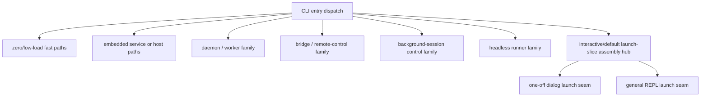

# 03. 런타임 모드와 진입점

## 장 요약

이 장의 목적은 Claude Code를 "하나의 앱이 여러 옵션을 받는 CLI"가 아니라, 서로 다른 runtime family를 한 바이너리 안에 수용한 하네스로 읽게 만드는 데 있다. 여기서 `full runtime` 또는 `full assembly`란, `src/main.tsx`로 내려와 공통 초기화와 launch branch를 거치는 두꺼운 일반 경로를 뜻한다. 이 관점에서는 질문이 바뀐다. 중요한 것은 옵션이 몇 개인가가 아니라, 어떤 경로가 그 두꺼운 일반 경로를 건너뛰고, 어떤 경로만 `src/main.tsx`의 assembly를 거치며, 어떤 경로가 REPL이 아니라 별도 supervisor, bridge, session controller, headless runner로 독립하는가다.

해석: Claude Code의 entrypoint 설계는 단순한 UX 문제가 아니다. startup latency, trust와 policy 개입, 배포 경계, long-running orchestration, session resume 같은 요구가 서로 다른 runtime family를 낳는다. 따라서 이 장은 `src/entrypoints/cli.tsx`의 early dispatch, `src/main.tsx`의 assembly hub, `src/replLauncher.tsx`와 `src/dialogLaunchers.tsx`의 launch seam을 중심으로 Claude Code의 runtime topology를 정리한다.

## 원칙: 왜 runtime family를 따로 읽어야 하는가

원칙: Anthropic의 [Effective harnesses for long-running agents](https://www.anthropic.com/engineering/effective-harnesses-for-long-running-agents) (2025-11-26)는 장기 실행 하네스가 discrete session 사이의 단절을 관리해야 하며, 새 세션이 이전 세션의 상태를 곧바로 이해하고 이어서 진행할 수 있어야 한다고 설명한다. 이 요구는 단일 request-response 루프만으로는 잘 표현되지 않는다. 세션을 어떻게 시작하고, 어떤 진입점에서 어떤 초기화만 수행할지 자체가 하네스 문제로 바뀐다.

원칙: Anthropic의 [Harness design for long-running application development](https://www.anthropic.com/engineering/harness-design-long-running-apps) (2026-03-24)는 planner, generator, evaluator 같은 구성요소를 분리해 두고, 하나씩 제거하거나 단순화하면서 어떤 요소가 실제로 load-bearing인지 점검하는 접근을 보여준다.  
해석: 이 장은 그 원칙을 runtime topology에 적용해 읽는다. 즉, 모든 경로를 가장 두꺼운 interactive stack으로 몰기보다, 어떤 family가 정말 그 경로를 필요로 하는지 구분하는 편이 낫다.

원칙: Anthropic Platform Docs의 [Agent SDK overview](https://platform.claude.com/docs/en/agent-sdk/overview) (접근 2026-04-01)는 Agent SDK가 Claude Code와 같은 agent loop, tools, context management를 라이브러리 형태로 제공한다고 설명한다. 즉, Claude Code의 runtime topology는 단일 UI 제품 구조가 아니라, interactive shell과 headless/SDK-style orchestration이 공존하는 구조로 읽을 수 있다.

해석: 좋은 runtime topology는 "어디서 실행이 시작되는가"만 보여주지 않는다. 어떤 경로가 full assembly 없이 끝나는가, 어떤 경로가 policy gate를 통과해야 하는가, 어떤 경로가 operator-facing TUI로 이어지고 어떤 경로가 worker나 runner처럼 headless로 남는가를 함께 보여줘야 한다.

## 이 장의 직접 근거와 범위

### 직접 근거

#### 제품 사실

- `src/entrypoints/cli.tsx`
- `src/main.tsx`
- `src/replLauncher.tsx`
- `src/dialogLaunchers.tsx`

#### 공개 설계 원칙

- Anthropic, [Effective harnesses for long-running agents](https://www.anthropic.com/engineering/effective-harnesses-for-long-running-agents), 2025-11-26
- Anthropic, [Harness design for long-running application development](https://www.anthropic.com/engineering/harness-design-long-running-apps), 2026-03-24

#### 추가 자료

- Anthropic Platform Docs, [Agent SDK overview](https://platform.claude.com/docs/en/agent-sdk/overview), 접근 시점 2026-04-01

이 장의 관찰은 2026-04-01 기준 현재 공개 사본에 한정한다. 커밋 해시가 없으므로 파일 경로와 재검증 가능한 코드 절단면을 근거 단위로 사용한다.

### 이 장의 범위

- `src/entrypoints/cli.tsx`가 full CLI 이전에 분기시키는 selected runtime family
- `src/main.tsx` 전체가 아니라 interactive/default launch slice에서 맡는 assembly 역할
- `src/replLauncher.tsx`와 `src/dialogLaunchers.tsx`가 만드는 launch seam
- runtime family 분리가 갖는 deployment/운영 함의

### 이 장에서 다루지 않는 것

- trust, onboarding, approval의 세부 정책
- query pipeline과 turn lifecycle의 상세 제어
- remote transport 자체의 내부 프로토콜
- background task model과 task state의 세부 동작

이 비범위는 중요하다. startup/trust 세부는 [04-session-startup-trust-and-initialization.md](./04-session-startup-trust-and-initialization.md), query와 turn lifecycle은 [05-context-assembly-and-query-pipeline.md](./05-context-assembly-and-query-pipeline.md)와 [06-query-engine-and-turn-lifecycle.md](./06-query-engine-and-turn-lifecycle.md)에서 분리해 다룬다.

## runtime family를 읽는 다섯 가지 용어

| 용어 | 이 장에서의 의미 |
| --- | --- |
| fast-path | full assembly 없이 빠르게 끝나는 실행 경로 |
| runtime family | 서로 다른 제약과 목적을 가진 실행 경로 집합 |
| assembly hub | 여러 runtime family 중 일반 interactive/default family를 조립하는 중심 파일 |
| launch seam | assembly가 실제 TUI 또는 dialog mount로 넘어가는 접점 |
| deployment implication | 같은 바이너리 안에 여러 family를 넣음으로써 생기는 운영상 함의 |

## Claude Code의 runtime topology

아래 그림은 runtime family 관점의 개략도다. 노드는 파일 이름이 아니라 실행 가족과 launch 단계의 역할을 나타낸다. 각 박스의 증거는 본문에서 `src/entrypoints/cli.tsx`, `src/main.tsx`, `src/replLauncher.tsx`, `src/dialogLaunchers.tsx`의 코드 절단면으로 뒷받침한다. 이 그림은 `src/entrypoints/cli.tsx`의 selected family와 `src/main.tsx`의 interactive/default launch slice를 중심으로 그린다. template jobs, `--worktree --tmux` fast path, 그리고 `src/main.tsx`의 broader noninteractive/client-type classification은 본문에서 별도로 범위를 제한해 언급한다.



제품 사실: `src/entrypoints/cli.tsx`는 full CLI로 내려가기 전에 여러 경로를 직접 분기한다. 이 장이 추적하는 범위에서 `src/main.tsx`는 interactive/default launch slice의 assembly hub이며, 이후 실제 UI mount는 `src/replLauncher.tsx`와 `src/dialogLaunchers.tsx`의 seam으로 내려간다.  
해석: Claude Code는 "하나의 앱 + 여러 플래그"보다 "여러 runtime family를 가진 단일 배포물"에 가깝다.

## 러닝 예시에서 이 장이 담당하는 구간

[01-project-overview.md](./01-project-overview.md)의 러닝 예시를 다시 쓰면, 이 장은 가장 앞의 두 단계만 다룬다.

1. 사용자가 `claude`를 실행한다.
2. `src/entrypoints/cli.tsx`가 이 실행을 version fast-path, daemon/worker, bridge, background-session control, headless runner, 또는 interactive/default family 중 어디로 보낼지 결정한다.

즉, 이 장의 질문은 "세션이 어떻게 한 turn을 처리하는가"가 아니라 "애초에 어떤 family가 그 세션을 맡게 되는가"다. REPL이 뜬 뒤의 일은 의도적으로 뒤 장으로 넘긴다.

## 제품 사실 1: `src/entrypoints/cli.tsx`는 entrypoint가 아니라 dispatch layer다

출처:

- `src/entrypoints/cli.tsx`
- 출처 단서: `src/entrypoints/cli.tsx`의 version/worker/background fast-path 분기

```ts
if (args.length === 1 && (args[0] === '--version' || args[0] === '-v' || args[0] === '-V')) {
  console.log(`${MACRO.VERSION} (Claude Code)`);
  return;
}
```

```ts
if (feature('DAEMON') && args[0] === '--daemon-worker') {
  const { runDaemonWorker } = await import('../daemon/workerRegistry.js');
  await runDaemonWorker(args[1]);
  return;
}
```

제품 사실: `src/entrypoints/cli.tsx`는 `--version` 같은 zero-load fast-path뿐 아니라 `--daemon-worker` 같은 internal worker path도 `src/main.tsx`보다 먼저 처리한다.  
해석: entrypoint의 첫 역할은 공통 runtime을 시작하는 것이 아니라, 어떤 family를 아예 full assembly 밖에서 끝낼지 결정하는 dispatch다.

이 지점은 long-running harness 관점에서 중요하다. worker, version, special host path까지 모두 `src/main.tsx`에 태웠다면 초기화 비용과 정책 경계가 불필요하게 두꺼워졌을 것이다.

## 제품 사실 2: `src/entrypoints/cli.tsx`는 여러 특수 family를 별도로 분리한다

출처:

- `src/entrypoints/cli.tsx`
- 출처 단서: `src/entrypoints/cli.tsx`의 특수 runtime family fan-out 구간

```ts
if (feature('BRIDGE_MODE') && (args[0] === 'remote-control' || args[0] === 'rc' || args[0] === 'remote' || args[0] === 'sync' || args[0] === 'bridge')) {
  await bridgeMain(args.slice(1));
  return;
}
```

```ts
if (feature('BG_SESSIONS') && (args[0] === 'ps' || args[0] === 'logs' || args[0] === 'attach' || args[0] === 'kill' || args.includes('--bg') || args.includes('--background'))) {
  const bg = await import('../cli/bg.js');
  ...
  return;
}
```

```ts
if (feature('BYOC_ENVIRONMENT_RUNNER') && args[0] === 'environment-runner') {
  const { environmentRunnerMain } = await import('../environment-runner/main.js');
  await environmentRunnerMain(args.slice(1));
  return;
}
```

이 세 발췌에서 중요한 것은 import target의 구현 세부가 아니라, `src/entrypoints/cli.tsx`가 어떤 family를 full assembly 바깥에서 먼저 fan-out하는지다. 따라서 `../cli/bg.js`나 `../environment-runner/main.js` 같은 문자열은 "이 snapshot에 해당 구현이 모두 포함된다"는 뜻이 아니라, entrypoint call-site에서 어떤 별도 family가 존재하는지 보여 주는 증거로 읽어야 한다.

제품 사실: bridge/remote-control, background-session registry, headless runner, native host/MCP server path 같은 family는 모두 `src/entrypoints/cli.tsx`에서 직접 빠져나간다. 같은 파일에는 template jobs와 `--worktree --tmux` fast path 같은 보조 경로도 별도로 존재한다.  
해석: Claude Code는 특수 경로를 `src/main.tsx` 안의 옵션 분기로 섞지 않고, entrypoint layer에서 family 단위로 먼저 분리한다.

deployment implication: 같은 바이너리가 interactive TUI뿐 아니라 local bridge host, daemon supervisor, session registry controller, headless runner 역할까지 맡는다는 뜻이다. 즉, 배포 단위는 하나여도 운영 모델은 하나가 아니다.

## 제품 사실 3: 이 장은 `src/main.tsx`의 interactive/default launch slice를 추적한다

출처:

- `src/main.tsx`
- 출처 단서: `src/main.tsx`의 startup initialization과 REPL/direct-connect 조립 구간

```ts
const hasPrintFlag = cliArgs.includes('-p') || cliArgs.includes('--print');
const hasInitOnlyFlag = cliArgs.includes('--init-only');
const hasSdkUrl = cliArgs.some(arg => arg.startsWith('--sdk-url'));
const isNonInteractive = hasPrintFlag || hasInitOnlyFlag || hasSdkUrl || !process.stdout.isTTY;
...
initializeEntrypoint(isNonInteractive);
```

```ts
function initializeEntrypoint(isNonInteractive: boolean): void {
  ...
  if (mcpIndex !== -1 && cliArgs[mcpIndex + 1] === 'serve') {
    process.env.CLAUDE_CODE_ENTRYPOINT = 'mcp';
    return;
  }
```

```ts
profileCheckpoint('main_tsx_entry');
startMdmRawRead();
startKeychainPrefetch();
```

```ts
if (process.env.CLAUDE_CODE_ENTRYPOINT !== 'local-agent') {
  initBuiltinPlugins();
  initBundledSkills();
}
```

제품 사실: `src/main.tsx`는 interactive launch 이전에도 noninteractive 여부와 entrypoint type을 분류한다. 동시에 startup prefetch를 먼저 시작하고, 일반 경로에서 bundled plugin/skill 초기화 같은 공통 조립을 수행한다.  
해석: 따라서 이 장은 `src/main.tsx` 전체를 하나의 interactive hub로 단순화하지 않는다. 더 정확히는, `src/main.tsx` 안의 broader initialization 중에서 interactive/default launch slice를 추적한다.

같은 파일에서 trust 전후의 sequencing도 드러난다.

```ts
const onboardingShown = await showSetupScreens(root, permissionMode, allowDangerouslySkipPermissions, commands, enableClaudeInChrome, devChannels);
```

제품 사실: interactive/default launch slice는 `showSetupScreens()`를 통과한다.  
해석: 이 장의 범위에서는 trust 세부를 다루지 않지만, 적어도 이 launch slice가 "곧바로 REPL을 mount하는 경로"가 아니라 setup과 launch 사이의 조립 구간을 가진다는 사실은 분명하다.

## 제품 사실 4: `src/main.tsx` 안에서도 launch family가 다시 갈라진다

출처:

- `src/main.tsx`
- 출처 단서: `src/main.tsx`의 launch chooser와 direct-connect handoff 구간

```ts
await launchRepl(root, {
  getFpsMetrics,
  stats,
  initialState: loaded.initialState
}, {
  ...sessionConfig,
  mainThreadAgentDefinition: loaded.restoredAgentDef ?? mainThreadAgentDefinition,
  initialMessages: loaded.messages,
```

```ts
const session = await createDirectConnectSession({
  serverUrl: _pendingConnect.url,
  authToken: _pendingConnect.authToken,
  cwd: getOriginalCwd(),
  dangerouslySkipPermissions: _pendingConnect.dangerouslySkipPermissions
});
await launchRepl(root, {
  getFpsMetrics,
  stats,
  initialState
}, {
```

```ts
await launchResumeChooser(root, {
  getFpsMetrics,
  stats,
  initialState
}, getWorktreePaths(getOriginalCwd()), {
  ...sessionConfig,
  initialSearchQuery: searchTerm,
```

제품 사실: `src/main.tsx`의 interactive/default launch slice는 단일 "launch REPL" 경로만 갖지 않는다. resume된 interactive session, direct-connect session, interactive resume chooser, 일반 fresh session이 서로 다른 branch를 거친 뒤 launch seam으로 들어간다.  
해석: 일반 interactive/default family 내부에도 하위 family가 존재한다. 즉, 이 launch slice는 하나의 REPL 진입점보다 여러 launch branch를 정리하는 분기 구간에 가깝다.

이 점은 runtime topology를 이해할 때 특히 중요하다. 사용자 눈에는 모두 "Claude Code가 켜진다"로 보일 수 있지만, 코드 수준에서는 resume, direct connect, remote session, fresh session이 서로 다른 초기 메시지와 상태를 갖는다.

## 제품 사실 5: `src/replLauncher.tsx`는 일반 REPL launch seam이다

출처:

- `src/replLauncher.tsx`
- 출처 단서: `src/replLauncher.tsx`의 REPL mount helper 구간

```ts
export async function launchRepl(root: Root, appProps: AppWrapperProps, replProps: REPLProps, renderAndRun: (root: Root, element: React.ReactNode) => Promise<void>): Promise<void> {
  const { App } = await import('./components/App.js');
  const { REPL } = await import('./screens/REPL.js');
  await renderAndRun(root, <App {...appProps}>
      <REPL {...replProps} />
    </App>);
}
```

제품 사실: REPL mount는 `src/main.tsx` 안에 인라인 JSX로 남아 있지 않고 `launchRepl()`로 추출되어 있다.  
해석: Claude Code는 interactive mainline의 화면 mount를 별도 seam으로 분리해 둔다. 이건 단순 리팩터링 미관보다 "assembly와 mount를 구분하라"는 구조 신호에 가깝다.

이 seam 덕분에 `src/main.tsx`는 어떤 initial state와 session config를 쓸지 결정하고, 실제 mount 형식은 `src/replLauncher.tsx`가 책임진다.

## 제품 사실 6: `src/dialogLaunchers.tsx`는 branch-specific launch seam을 모은다

출처:

- `src/dialogLaunchers.tsx`
- `src/main.tsx`
- 출처 단서: `src/dialogLaunchers.tsx`와 `src/main.tsx`의 보조 dialog launcher 구간

```ts
/**
 * Thin launchers for one-off dialog JSX sites in main.tsx.
 * Each launcher dynamically imports its component and wires the `done` callback
 * identically to the original inline call site. Zero behavior change.
 */
```

```ts
export async function launchResumeChooser(root: Root, appProps: {
  getFpsMetrics: () => FpsMetrics | undefined;
  stats: StatsStore;
  initialState: AppState;
}, worktreePathsPromise: Promise<string[]>, resumeProps: Omit<ResumeConversationProps, 'worktreePaths'>): Promise<void> {
  ...
  await renderAndRun(root, <App ...>
      <KeybindingSetup>
        <ResumeConversation {...resumeProps} worktreePaths={worktreePaths} />
      </KeybindingSetup>
    </App>);
}
```

제품 사실: `src/dialogLaunchers.tsx`는 snapshot update, invalid settings, assistant session chooser, install wizard, teleport resume, resume chooser 같은 one-off dialog mount를 모은다.  
해석: Claude Code의 launch topology는 `src/replLauncher.tsx` 하나로 끝나지 않는다. 일반 REPL mainline와 별개로, branch-specific interactive launch seam이 따로 존재한다.

이 구조는 왜 중요한가. runtime family가 많아질수록 `src/main.tsx` 안에 JSX call site가 과도하게 늘어나기 쉽다. `src/dialogLaunchers.tsx`는 그 비용을 줄이면서도, 어떤 branch가 "한 번 쓰고 끝나는 대화형 launch"인지 드러내는 구조 표지를 제공한다.

## runtime family 요약표

| family | 대표 trigger | full `src/main.tsx` assembly 진입 여부 | 주된 목적 | 주된 함의 |
| --- | --- | --- | --- | --- |
| zero/low-load fast path | `--version`, `--dump-system-prompt` | 대체로 진입 안 함 또는 최소화 | 즉시 출력과 종료 | startup 비용 최소화 |
| embedded host/service family | `--claude-in-chrome-mcp`, `--chrome-native-host`, `--computer-use-mcp` | 진입 안 함 | 외부 host 또는 MCP server 실행 | CLI가 도구 호스트 역할도 가짐 |
| daemon/worker family | `daemon`, `--daemon-worker` | 진입 안 함 | supervisor와 worker orchestration | interactive stack과 분리된 장기 실행 경로 |
| bridge/control family | `remote-control`, `bridge` | 진입 안 함 | local machine을 bridge 환경으로 제공 | entitlement/policy가 early dispatch에 결합 |
| bg-session control family | `ps`, `logs`, `attach`, `kill`, `--bg` | 진입 안 함 | 기존 세션 관리 | session registry 자체가 별도 운영 표면 |
| auxiliary fast-path families | `new`, `list`, `reply`, `--worktree --tmux` | 진입 안 함 | template job 실행 또는 tmux/worktree 위임 | 일반 interactive 경로로 보내지 않아도 되는 보조 운영 경로 |
| headless runner family | `environment-runner`, `self-hosted-runner` | 진입 안 함 | BYOC/worker형 headless 실행 | TUI 없는 배포 경로 제공 |
| interactive/default launch family | 일반 `claude ...` 경로 중 실제 대화형 launch로 이어지는 slice | `src/main.tsx` 안에서 진입함 | REPL, resume, direct connect, fresh session | assembly와 launch branch가 가장 두꺼움 |

해석: Claude Code는 "default interactive CLI"만 있는 제품이 아니다. 더 정확히는 interactive family가 가장 눈에 띌 뿐이고, 배포물 전체로 보면 supervisor, bridge host, background session controller, auxiliary fast-path families, headless runner까지 한 binary 아래에서 공존한다.

## 이 topology가 갖는 설계 함의

### 1. startup 비용을 모든 경로에 공평하게 부과하지 않는다

제품 사실: `src/entrypoints/cli.tsx`는 `--version`, daemon worker, runner 같은 경로를 먼저 분기한다.  
해석: full assembly가 정말 필요한 경로만 `src/main.tsx`로 보낸다.

### 2. deployment boundary가 runtime family를 만든다

제품 사실: bridge, embedded host, headless runner는 모두 TUI와 다른 목적을 가진다.  
해석: 같은 binary라도 운영되는 환경이 다르면 runtime family를 분리하는 편이 낫다.

### 3. interactive family 안에서도 launch seam을 세분화한다

제품 사실: `launchRepl()`과 `launchResumeChooser()`류는 서로 다른 mount 형식을 가진다.  
해석: "화면을 띄운다"는 하나의 행위도, 일반 REPL mainline와 branch-specific dialog path로 다시 나뉜다.

### 4. long-running harness는 entrypoint에서부터 세션 유형을 구분한다

원칙: long-running harness는 discrete session과 context reset을 감안해야 한다.  
해석: resume, direct connect, bridge/remote-control 같은 경로가 entrypoint나 launch 단계에서 이미 갈리는 것은 우연이 아니라 세션 수명과 운영 위치의 차이를 반영한 구조다.

### 5. load-bearing scaffold는 모델 세대에 따라 바뀐다

원칙: Anthropic의 2026-03-24 글은 planner, evaluator, sprint construct 같은 scaffold를 하나씩 제거해 보며 무엇이 실제로 load-bearing한지 다시 확인하는 접근을 보여 준다.
해석: entrypoint topology 역시 비슷하게 읽을 수 있다. 어떤 family 분기나 early dispatch가 지금은 중요한 비용 절감 장치일 수 있지만, 모델과 deployment shape가 바뀌면 일부 경로는 과잉 scaffold가 될 수 있다. 반대로 새 runtime family가 생기면 기존 `main()` 단일 경로 가정이 오히려 병목이 될 수도 있다.

## 새 하네스를 설계할 때 던질 벤치마크 질문

1. 모든 경로를 하나의 `main()`으로 밀어 넣고 있지는 않은가?
2. fast-path로 끝나야 할 경로와 full assembly가 필요한 경로를 구분했는가?
3. bridge, worker, runner, session controller 같은 비-TUI family를 별도 runtime family로 모델링했는가?
4. interactive family 안에서도 일반 mainline와 one-off dialog launch를 구분했는가?
5. resume, background-session attach, direct connect처럼 세션 성격이 다른 경로를 같은 launch 초기화로 처리하고 있지는 않은가?

## 마무리

이 장의 결론은 단순하다. Claude Code의 진입점은 단일 main loop가 아니라 dispatch layer다. `src/entrypoints/cli.tsx`는 여러 runtime family를 먼저 분기하고, `src/main.tsx`는 그보다 넓은 초기화와 entrypoint 분류를 수행한 뒤 interactive/default launch slice를 assembly하며, `src/replLauncher.tsx`와 `src/dialogLaunchers.tsx`는 실제 launch seam을 담당한다. 이 지도를 먼저 고정해 두어야 다음 장에서 startup/trust 세부를 읽을 때, 그 정책들이 어떤 runtime family와 어떤 launch slice에만 적용되는지 정확히 분리해서 볼 수 있다.

## 대표 근거 읽기 순서

아래 라벨은 독자가 별도 source를 열어야 한다는 뜻이 아니라, 이 장에서 이미 인용하고 설명한 코드 발췌가 어떤 구현 단면을 대표하는지 다시 묶어 주는 provenance 메모다.

1. `src/entrypoints/cli.tsx`
   fast-path, bridge, daemon, background-session control family를 먼저 찾는다.
2. `src/main.tsx`
   interactive/default launch family가 언제 진입하는지 본다.
3. `src/replLauncher.tsx`
   일반 REPL launch seam을 확인한다.
4. `src/dialogLaunchers.tsx`
   one-off dialog launch와 mainline REPL launch를 비교한다.
5. 필요하면 `cli/`
   bg-session control family나 auxiliary fast-path가 별도 helper로 빠지는지 확인한다.
