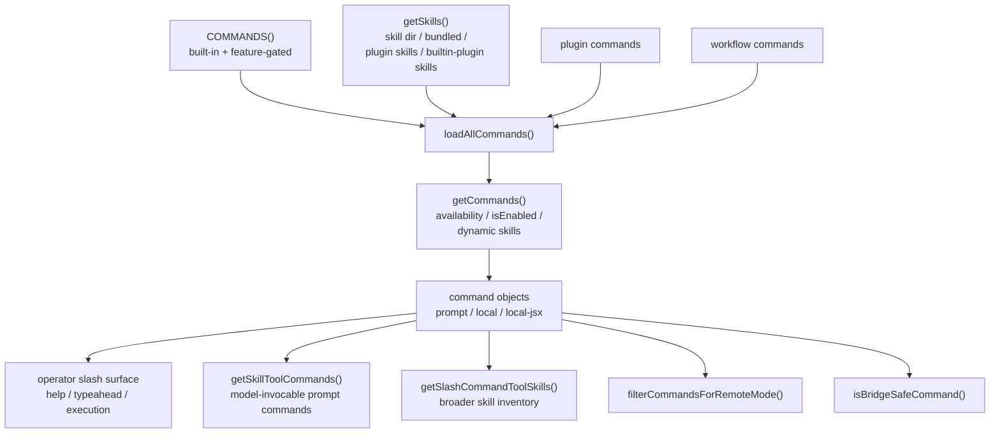

# 06. Claude Code command 시스템

## 장 요약

operator-facing command surface는 slash command 목록이 아니라 사람이 세션을 조정하는 steering layer다. 이 장은 그 문제를 Claude Code 사례에 적용한다. 이 계층은 built-in command, feature-gated command, file-based skill, workflow command, plugin command를 한 operator-facing surface로 합치고, 현재 세션의 auth 상태와 실행 맥락에 맞게 다시 잘라 낸다. 그래서 이 장의 핵심 질문은 "무슨 명령이 있나"가 아니라 "어떤 기능이 왜 command로 승격되고, 어떤 provenance와 type을 달고, 어떤 맥락에서만 노출되는가"다.

이 관점에서 command는 tool과 같은 층위가 아니다. tool이 주로 모델이 호출하는 surface라면, command는 사람이 세션을 조정하는 surface다. 다만 그 경계가 완전히 절연되어 있는 것은 아니다. 일부 prompt command는 다시 model-invocable prompt command 집합이나 broader skill inventory로 재선별되기 때문이다. 따라서 Claude Code의 command system은 인간-주도 steering layer이면서도, 일부는 모델 쪽 하위 표면으로 재사용되는 복합 계층이다.

## 왜 command surface가 하네스 문제인가

Anthropic의 [Building effective agents](https://www.anthropic.com/engineering/building-effective-agents) (2024-12-19)는 workflow와 agent를 구분하며, 시스템이 어떤 제어 단위를 사용자와 모델에게 각각 어떻게 노출할지 선택하는 일이 중요하다고 설명한다. Claude Code의 command system은 바로 사용자 쪽 제어 단위에 해당한다. `/compact`, `/review`, `/resume` 같은 명령은 모델에게 새로운 도구를 주는 것이 아니라, 사용자가 세션 흐름이나 작업 진입점을 다시 잡게 만든다.

Anthropic의 [Writing effective tools for AI agents](https://www.anthropic.com/engineering/writing-tools-for-agents) (2025-09-11)는 namespacing, clear boundaries, token-efficient responses 같은 원칙을 강조한다. 이 원칙은 tool에만 적용되는 것이 아니다. command surface 역시 provenance가 분명해야 하고, 어떤 기능이 어떤 상호작용 형식으로 드러나는지 명확해야 한다.

Anthropic Platform Docs의 [Agent SDK overview](https://platform.claude.com/docs/en/agent-sdk/overview) (접근 2026-04-01)는 tools, agent loop, context management 같은 모델 중심 표면을 설명한다. Claude Code의 command system은 그 모델 중심 표면 위에 추가된 operator-facing layer로 읽을 수 있다. 다시 말해, command system은 tool surface의 사소한 별칭이 아니라, 사람이 세션을 조작하는 별도 인터페이스다.

## 이 장의 근거와 범위

이 장의 관찰은 2026-04-01 기준 현재 공개 사본의 다음 대표 발췌 출처에 한정한다.

- `src/commands.ts`
- `commands/`
- `src/skills/loadSkillsDir.ts`

외부 프레이밍에는 다음 자료를 사용한다.

- Anthropic, [Building effective agents](https://www.anthropic.com/engineering/building-effective-agents), 2024-12-19
- Anthropic, [Writing effective tools for AI agents](https://www.anthropic.com/engineering/writing-tools-for-agents), 2025-09-11
- Anthropic Platform Docs, [Agent SDK overview](https://platform.claude.com/docs/en/agent-sdk/overview), 접근 시점 2026-04-01

Sources / evidence notes:
이 장의 reader-facing 외부 검증 축은 [../00-front-matter/03-references.md](../00-front-matter/03-references.md)의 Part 4 cluster를 따른다. command provenance, skill surface, instruction provenance, plugin/MCP adjacency는 `S3`, `S9`, `S10`, `S11`, `S12`, `S14`, `S15`, `S24`를 우선 사용하고, safety-adjacent 설명은 `S25`를 보조적으로 참조한다.

이 장은 다음을 다룬다.

- `src/commands.ts`가 command provenance를 어떻게 합치는지
- `prompt`, `local`, `local-jsx` type이 어떤 operator interaction을 뜻하는지
- file-based skill이 command 객체로 어떻게 승격되는지
- remote mode와 bridge inbound에서 command surface가 어떻게 다시 필터링되는지

반대로 이 장은 각 command 구현의 세부 로직, tool permission 모델, plugin system 전체를 다루지 않는다. tool surface와 permission은 [08-tool-system-and-permissions.md](07-claude-code-tool-system-and-permissions.md)에서 이어서 다룬다.

## command system을 읽는 다섯 가지 구분

| 구분 | 이 장에서의 의미 |
| --- | --- |
| provenance | command가 어느 source에서 왔는가 |
| type | `prompt`, `local`, `local-jsx`처럼 어떤 interaction 형식인가 |
| aggregation | 여러 source를 한 command surface로 합치는 단계 |
| downstream selector | 같은 command pool에서 다른 하위 surface를 뽑아내는 단계 |
| context-sensitive filtering | 실행 맥락에 따라 surface를 다시 제한하는 규칙 |

이 다섯 구분을 잡고 읽으면, command system이 왜 정적 배열이 아니라 조립 계층처럼 보이는지 이해하기 쉬워진다.

## aggregation and filtering topology



이 그림에서 중요한 점은 두 가지다. 첫째, `prompt / local / local-jsx`는 조립 파이프라인의 "다음 단계"가 아니라 command object의 type 속성이라는 점이다. 둘째, 최종 command pool은 한 번 만들어지고 끝나는 것이 아니라, `getCommands()` 이후에도 `getSkillToolCommands()`, `getSlashCommandToolSkills()`, `filterCommandsForRemoteMode()`, `isBridgeSafeCommand()` 같은 downstream selector를 통해 여러 하위 surface로 다시 분기된다.

## 무엇이 합쳐지는가: `src/commands.ts`의 provenance aggregation

`src/commands.ts`의 중앙 레지스트리는 built-in command를 많이 품고 있지만, 그 자체로 surface가 닫히지는 않는다.

```ts
const COMMANDS = memoize((): Command[] => [
  addDir,
  advisor,
  agents,
  branch,
  btw,
  chrome,
  clear,
  color,
  compact,
  config,
  ...
])
```

이 built-in registry 안에도 feature-gated import가 이미 섞여 있다.

```ts
const proactive =
  feature('PROACTIVE') || feature('KAIROS')
    ? require('./commands/proactive.js').default
    : null

const bridge = feature('BRIDGE_MODE')
  ? require('./commands/bridge/index.js').default
  : null
```

여기에 `src/commands.ts`는 skill, plugin, workflow source를 더 얹는다.

```ts
const [
  { skillDirCommands, pluginSkills, bundledSkills, builtinPluginSkills },
  pluginCommands,
  workflowCommands,
] = await Promise.all([
  getSkills(cwd),
  getPluginCommands(),
  getWorkflowCommands ? getWorkflowCommands(cwd) : Promise.resolve([]),
])

return [
  ...bundledSkills,
  ...builtinPluginSkills,
  ...skillDirCommands,
  ...workflowCommands,
  ...pluginCommands,
  ...pluginSkills,
  ...COMMANDS(),
]
```

핵심은 provenance가 단일하지 않다는 점이다. built-in, bundled, builtin-plugin, file-based skill, workflow, plugin command가 모두 같은 slash surface 안으로 합쳐진다. 그래서 command system은 "command implementation 디렉터리"보다 "operator surface 조립기"로 읽는 편이 자연스럽다.

## 어떻게 최종 surface가 정해지는가: `getCommands()`

aggregation 뒤에도 surface는 한 번 더 걸러진다.

```ts
export async function getCommands(cwd: string): Promise<Command[]> {
  const allCommands = await loadAllCommands(cwd)
  const dynamicSkills = getDynamicSkills()

  const baseCommands = allCommands.filter(
    _ => meetsAvailabilityRequirement(_) && isCommandEnabled(_),
  )
```

```ts
const uniqueDynamicSkills = dynamicSkills.filter(
  s =>
    !baseCommandNames.has(s.name) &&
    meetsAvailabilityRequirement(s) &&
    isCommandEnabled(s),
)
```

이 함수가 보여주는 것은 단순하다. 최종 command surface는 provenance aggregation의 결과를 그대로 노출하지 않는다. auth/provider 조건과 `isEnabled()`를 다시 적용하고, session 중 동적으로 발견된 skill도 dedupe한 뒤 중간에 삽입한다. 따라서 `/login`이나 settings 변화 뒤에 surface가 바뀌는 것은 예외가 아니라 설계 결과다.

## command type은 무엇을 뜻하는가

Claude Code의 command는 이름만이 아니라 interaction 형식으로도 나뉜다. 대표 예시는 세 가지다.

```ts
const compact = {
  type: 'local',
  name: 'compact',
  description:
    'Clear conversation history but keep a summary in context. Optional: /compact [instructions for summarization]',
```

```ts
const review: Command = {
  type: 'prompt',
  name: 'review',
  description: 'Review a pull request',
  ...
}
```

```ts
const resume: Command = {
  type: 'local-jsx',
  name: 'resume',
  description: 'Resume a previous conversation',
  aliases: ['continue'],
```

`local`은 로컬 로직을 실행하는 command이고, `prompt`는 모델에 보낼 prompt를 구성하는 command이며, `local-jsx`는 Ink UI를 띄우는 command다. 이 분류는 operator-facing surface가 하나의 interaction 형식으로 환원되지 않는다는 사실을 보여준다. 어떤 기능은 텍스트 프롬프트를 만들고, 어떤 기능은 즉시 로컬 상태를 바꾸고, 어떤 기능은 대화형 UI를 연다.

## 대표 시나리오: `/compact`와 `/resume`은 왜 다른 type인가

taxonomy만으로는 command surface의 감각이 충분히 오지 않는다. 가장 빠른 방법은 성격이 다른 명령 두 개를 나란히 보는 것이다.

`/compact`는 `local` command다.

```ts
const compact = {
  type: 'local',
  name: 'compact',
  description:
    'Clear conversation history but keep a summary in context. Optional: /compact [instructions for summarization]',
  ...
}
```

실제 구현도 곧바로 local runtime을 건드린다.

```ts
export const call: LocalCommandCall = async (args, context) => {
  const { abortController } = context
  let { messages } = context
  messages = getMessagesAfterCompactBoundary(messages)
  ...
}
```

반면 `/resume`은 `local-jsx` command다.

```ts
const resume: Command = {
  type: 'local-jsx',
  name: 'resume',
  description: 'Resume a previous conversation',
  aliases: ['continue'],
  load: () => import('./resume.js'),
}
```

실제 구현은 즉시 상태를 바꾸기보다 picker UI를 열어 사용자가 세션을 고르게 만든다.

```tsx
if (!arg) {
  return <ResumeCommand key={Date.now()} onDone={onDone} onResume={onResume} />;
}
```

이 두 명령의 차이는 command type이 단지 enum이 아니라는 사실을 보여 준다. `/compact`는 현재 세션의 local control plane에 즉시 개입하고, `/resume`은 operator에게 별도 UI step을 열어 세션 전환을 선택하게 만든다. 따라서 command system을 제대로 읽으려면 "무슨 명령이 있나"보다 "이 명령은 사용자를 어떤 interaction 형식으로 다음 상태로 보내는가"를 먼저 봐야 한다.

## skill은 어떻게 command가 되는가

`src/skills/loadSkillsDir.ts`는 file-based skill을 읽어 결국 `Command` 객체로 만든다.

```ts
export function createSkillCommand({
  skillName,
  description,
  allowedTools,
  whenToUse,
  disableModelInvocation,
  userInvocable,
  source,
  loadedFrom,
  ...
}): Command {
  return {
    type: 'prompt',
    name: skillName,
    description,
    allowedTools,
    whenToUse,
    disableModelInvocation,
    userInvocable,
```

즉, skill은 command system 바깥의 별도 형식이 아니라, provenance와 metadata를 가진 `prompt` 타입 command로 승격된다. 이때 `allowedTools`, `whenToUse`, `disableModelInvocation`, `userInvocable`, `loadedFrom` 같은 메타데이터가 함께 붙는다. 장 08의 tool/permission 분석은 여기서 더 깊게 들어가지 않겠지만, 적어도 `skill`이 command object로 구현된다는 사실은 중요하다.

skill source 자체도 하나가 아니다.

```ts
const [
  managedSkills,
  userSkills,
  projectSkillsNested,
  additionalSkillsNested,
  legacyCommands,
] = await Promise.all([
  ...,
  loadSkillsFromCommandsDir(cwd),
])
```

그리고 그 결과는 dedupe와 conditional skill 분리를 거친다. 이 흐름은 provenance가 built-in 대 plugin 정도로만 나뉘지 않는다는 점을 보여준다. policy-managed source, user source, project source, legacy command source가 모두 operator surface 안으로 들어올 수 있다.

## provenance는 사용자에게도 보인다

이 시스템은 provenance를 내부 메타데이터로만 남기지 않는다. `src/commands.ts`는 사용자-facing description에도 source annotation을 붙인다.

```ts
export function formatDescriptionWithSource(cmd: Command): string {
  if (cmd.type !== 'prompt') {
    return cmd.description
  }
  ...
  if (cmd.source === 'plugin') {
    const pluginName = cmd.pluginInfo?.pluginManifest.name
    if (pluginName) {
      return `(${pluginName}) ${cmd.description}`
    }
```

이 함수는 typeahead와 help 같은 UI에서 provenance를 operator에게 드러내기 위한 것이다. 즉, provenance는 구현 세부가 아니라 surface semantics의 일부다. 사용자는 command가 plugin에서 왔는지, bundled skill인지, workflow인지 구분해서 읽을 수 있다.

동시에 이것은 command surface가 instruction provenance와도 맞닿아 있음을 보여 준다. 같은 slash command처럼 보여도 built-in command는 제품 contract이고, local skill command는 repo or user instruction surface이며, plugin-delivered command는 bundle provenance를 가진다. command system을 읽을 때는 [09-instruction-surfaces-settings-hooks-claude-md-subagents.md](09-instruction-surfaces-settings-hooks-claude-md-subagents.md)의 instruction stack과 provenance stack을 겹쳐 봐야 한다.

## command pool에서 어떤 하위 surface가 다시 만들어지는가

여기서 중요한 구분이 하나 더 있다. `getCommands()`가 만든 전체 pool은 곧바로 하나의 표면으로만 쓰이지 않는다.

우선 `getSkillToolCommands()`는 model-invocable prompt command 집합을 만든다.

```ts
export const getSkillToolCommands = memoize(
  async (cwd: string): Promise<Command[]> => {
    const allCommands = await getCommands(cwd)
    return allCommands.filter(
      cmd =>
        cmd.type === 'prompt' &&
        !cmd.disableModelInvocation &&
        cmd.source !== 'builtin' &&
        ...
    )
  },
)
```

반면 `getSlashCommandToolSkills()`는 더 넓은 skill inventory를 만든다.

```ts
export const getSlashCommandToolSkills = memoize(
  async (cwd: string): Promise<Command[]> => {
    ...
    return allCommands.filter(
      cmd =>
        cmd.type === 'prompt' &&
        cmd.source !== 'builtin' &&
        (cmd.hasUserSpecifiedDescription || cmd.whenToUse) &&
        (cmd.loadedFrom === 'skills' ||
          cmd.loadedFrom === 'plugin' ||
          cmd.loadedFrom === 'bundled' ||
          cmd.disableModelInvocation),
```

이 둘은 같은 함수가 아니다. 전자는 모델이 실제로 호출 가능한 prompt command 집합에 가깝고, 후자는 `disableModelInvocation` 항목까지 포함하는 더 넓은 skill inventory다. 따라서 command/tool 경계를 논할 때 "prompt command 일부는 모델 쪽으로 재사용된다"는 말은 맞지만, 그 경계는 하나의 selector로 깔끔하게 떨어지지 않는다.

## remote mode와 bridge inbound safety는 다르다

command surface는 실행 맥락에 따라 다시 줄어든다. 그런데 이때도 remote mode와 bridge inbound safety는 같은 문제가 아니다.

`filterCommandsForRemoteMode()`는 remote session에서 로컬 TUI 상태만 건드려도 되는 command만 남긴다.

```ts
export const REMOTE_SAFE_COMMANDS: Set<Command> = new Set([
  session,
  exit,
  clear,
  help,
  theme,
  color,
  vim,
  cost,
  ...
])

export function filterCommandsForRemoteMode(commands: Command[]): Command[] {
  return commands.filter(cmd => REMOTE_SAFE_COMMANDS.has(cmd))
}
```

반면 `isBridgeSafeCommand()`는 bridge를 통해 들어온 slash command를 실행해도 안전한지를 따진다.

```ts
export const BRIDGE_SAFE_COMMANDS: Set<Command> = new Set(
  [
    compact,
    clear,
    cost,
    summary,
    releaseNotes,
    files,
  ].filter((c): c is Command => c !== null),
)

export function isBridgeSafeCommand(cmd: Command): boolean {
  if (cmd.type === 'local-jsx') return false
  if (cmd.type === 'prompt') return true
  return BRIDGE_SAFE_COMMANDS.has(cmd)
}
```

remote mode는 REPL이 원격 실행 맥락에서 어떤 command를 보여줄지의 문제고, bridge inbound safety는 모바일·웹 같은 inbound channel에서 어떤 slash command를 받아도 되는지의 문제다. 전자는 목록을 다시 자르는 filter이고, 후자는 개별 command가 안전한지 판정하는 predicate에 가깝다. 둘 다 command surface를 제한하지만, 적용 시점과 기준은 다르다.

release notes와 MCP 문서를 같이 보면 이 구분은 더 중요해진다. 최근 remote MCP, OAuth, transport 변화는 command surface 주변의 capability ingress를 계속 바꾸고 있다. 따라서 command chapter는 기능 목록보다 provenance와 freshness note를 함께 남기는 편이 안전하다.

## command system을 operator surface로 읽을 때 보이는 것

이 장의 로컬 코드만 놓고 보면 Claude Code의 command system은 네 층으로 정리할 수 있다.

1. provenance aggregation  
   `loadAllCommands()`가 built-in, skill, workflow, plugin source를 합친다.
2. session-specific surface selection  
   `getCommands()`가 availability, enablement, dynamic skill 삽입을 적용한다.
3. interaction typing  
   `prompt`, `local`, `local-jsx`가 operator interaction 형식을 나눈다.
4. downstream sub-surfaces  
   model-invocable prompt command 집합, broader skill inventory, remote-safe surface, bridge-safe execution 규칙이 같은 pool에서 다시 갈라진다.

여기서 command와 tool의 경계를 다시 볼 수 있다. command는 기본적으로 operator-facing surface지만, 일부 prompt command는 다시 model-adjacent sub-surface로 재사용된다. 따라서 둘의 경계는 완전한 이분법이 아니라, provenance와 selector를 통해 조정되는 긴장 관계에 가깝다.

대표 operator walkthrough를 하나로 요약하면 이렇다. 사용자가 `/resume`을 치면 command system은 UI picker로 세션 전환을 열고, `/compact`를 치면 즉시 local runtime state와 compaction path를 건드리며, `/review` 같은 `prompt` command는 다시 model-invocable 하위 surface로 재사용될 수 있다. 이 세 가지가 함께 존재하기 때문에 command system은 목록이 아니라 steering layer다.

## 점검 질문

- 이 command는 어느 provenance에서 왔는가?
- 이 command는 `prompt`, `local`, `local-jsx` 중 어떤 interaction 형식인가?
- 최종 command surface는 aggregation 뒤에 어떤 필터를 한 번 더 거치는가?
- model-invocable prompt command 집합과 broader skill inventory를 구분하고 있는가?
- remote mode와 bridge inbound safety를 같은 문제로 뭉개고 있지는 않은가?
- 같은 slash surface가 서로 다른 instruction provenance를 가진다는 점이 드러나는가?
- remote-delivered capability를 local built-in처럼 설명하고 있지 않은가?

## 마무리

이 장의 결론은 다음과 같다. Claude Code의 command system은 정적 slash command 배열이 아니다. `src/commands.ts`는 여러 provenance를 합쳐 하나의 operator-facing surface를 만들고, `getCommands()`는 그 surface를 현재 세션에 맞게 다시 선택하며, `src/skills/loadSkillsDir.ts`는 file-based skill을 command 객체로 승격시킨다. 그 뒤에도 model-invocable prompt command 집합, broader skill inventory, remote-safe surface, bridge-safe execution 규칙이 같은 pool에서 다시 갈라진다. 따라서 command system은 단순 명령어 목록이 아니라, operator steering을 가능하게 하는 조립된 control layer로 읽는 편이 맞다.

## 대표 근거 읽기 순서

아래 라벨은 독자가 별도 source를 열어야 한다는 뜻이 아니라, 이 장에서 이미 인용하고 설명한 코드 발췌가 어떤 구현 단면을 대표하는지 다시 묶어 주는 provenance 메모다.

1. `src/commands.ts`
   built-in, workflow, plugin, skill provenance가 어디서 합쳐지는지 본다.
2. `src/skills/loadSkillsDir.ts`
   file-based skill이 command 객체가 되는 경로를 확인한다.
3. `src/screens/REPL.tsx`
   slash command가 실제 operator surface에서 어떻게 소비되는지 본다.
4. 필요하면 `bridge/` 관련 command gate
   remote-safe surface와 bridge inbound safety를 같은 문제로 읽지 않기 위해 비교한다.
