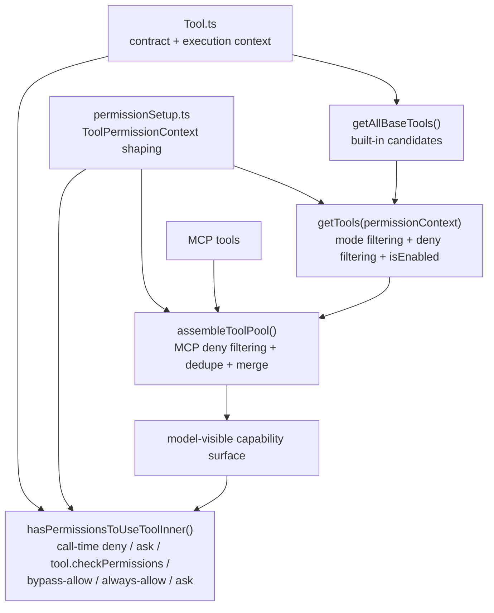

# 07. Claude Code tool 시스템과 권한 경계

## 장 요약

tool layer는 함수 집합이 아니라 모델에게 노출되는 capability surface와 그 주위를 둘러싼 permission boundary를 함께 구현하는 계층이다. 이 장은 그 문제를 Claude Code 사례에 적용한다. 일반적으로 agent tool layer는 두 질문으로 읽는 편이 좋다. 모델이 무엇을 보게 되는가, 그리고 실제 호출 직전에는 어떤 추가 경계가 작동하는가. Claude Code의 local code는 이 두 질문에 대해 각각 `src/tools.ts`와 `src/utils/permissions/`로 다른 답을 준다.

따라서 이 장은 "어떤 tool이 있나"보다 "tool이 어떤 계약을 가지고 노출되며, permission boundary가 어떤 단계에서 capability exposure를 줄이고 어떤 단계에서 호출을 다시 심사하는가"를 설명하는 데 초점을 둔다.

## 왜 tool과 permission을 함께 읽어야 하는가

Anthropic의 [Writing effective tools for AI agents](https://www.anthropic.com/engineering/writing-tools-for-agents) (2025-09-11)는 좋은 도구 설계에서 기능 경계, 이름, 설명, 반환 맥락, token 효율이 모두 중요하다고 설명한다. 이 원칙을 Claude Code에 적용하면 tool은 단순 실행 함수가 아니라, 모델이 이해하고 선택하는 계약 표면으로 읽는 편이 맞다.

Anthropic의 [Making Claude Code more secure and autonomous with sandboxing](https://www.anthropic.com/engineering/claude-code-sandboxing) (2025-10-20)는 permission prompt만으로는 충분하지 않으며, filesystem과 network 같은 boundary 안에서 더 자율적인 실행을 허용해야 한다고 설명한다. 이 글의 OS-level sandbox boundary와 아래에서 볼 로컬 tool exposure boundary는 같은 구현 층은 아니지만, 둘 다 "모델이 무엇을 할 수 있는가를 경계로 제한한다"는 점에서 유비 관계에 있다.

Anthropic Platform Docs의 [Agent SDK overview](https://platform.claude.com/docs/en/agent-sdk/overview) (접근 2026-04-01)는 model loop가 tool surface를 통해 외부 세계와 상호작용한다는 점을 전제한다. Claude Code의 tool system은 바로 그 상호작용 표면을 제품 수준에서 구현한 사례다.

## 이 장의 근거와 범위

이 장의 관찰은 2026-04-01 기준 현재 공개 사본의 다음 대표 발췌 출처에 한정한다.

- `src/Tool.ts`
- `src/tools.ts`
- `src/utils/permissions/`

외부 프레이밍에는 다음 자료를 사용한다.

- Anthropic, [Writing effective tools for AI agents](https://www.anthropic.com/engineering/writing-tools-for-agents), 2025-09-11
- Anthropic, [Making Claude Code more secure and autonomous with sandboxing](https://www.anthropic.com/engineering/claude-code-sandboxing), 2025-10-20
- Anthropic Platform Docs, [Agent SDK overview](https://platform.claude.com/docs/en/agent-sdk/overview), 접근 시점 2026-04-01

이 장은 다음을 다룬다.

- `src/Tool.ts`가 정의하는 tool contract와 execution context
- `src/utils/permissions/permissionSetup.ts`가 permission context를 어떻게 형성하는지
- `src/tools.ts`가 built-in tool pool을 어떻게 조립하고 exposure 이전에 줄이는지
- `src/utils/permissions/permissions.ts`가 call-time permission을 어떻게 다시 심사하는지
- built-in tool과 MCP tool이 어떤 규칙으로 합쳐지는지

반대로 각 tool 구현의 세부 로직과 query loop 전체는 이 장의 범위를 벗어난다.

## tool system을 읽는 다섯 가지 구분

| 구분 | 이 장에서의 의미 |
| --- | --- |
| tool contract | 모델이 보는 name, description, schema, safety metadata |
| tool execution context | tool이 실행될 때 함께 전달되는 runtime state |
| pre-exposure filtering | 모델이 보기도 전에 tool pool을 줄이는 단계 |
| call-time permission | tool 호출 직전에 적용되는 permission logic |
| pool assembly | built-in과 MCP tool을 한 surface로 합치는 단계 |

이 다섯 구분을 분리해 읽으면, tool system이 단순 registry보다 더 두꺼운 이유가 보인다.

## capability exposure topology



이 그림의 핵심은 permission이 마지막 `CALL` 단계에만 있는 것이 아니라, 그보다 앞선 `BUILTIN`과 `POOL` 단계에서 이미 tool pool을 줄인다는 점이다. 즉, Claude Code의 permission boundary는 pre-exposure filtering과 call-time permission이라는 두 층으로 나뉜다.

## tool은 어떤 계약인가

`src/Tool.ts`는 permission context와 execution context를 먼저 정의한다.

```ts
export type ToolPermissionContext = DeepImmutable<{
  mode: PermissionMode
  additionalWorkingDirectories: Map<string, AdditionalWorkingDirectory>
  alwaysAllowRules: ToolPermissionRulesBySource
  alwaysDenyRules: ToolPermissionRulesBySource
  alwaysAskRules: ToolPermissionRulesBySource
  isBypassPermissionsModeAvailable: boolean
  ...
}>
```

```ts
export type ToolUseContext = {
  options: {
    commands: Command[]
    debug: boolean
    mainLoopModel: string
    tools: Tools
    verbose: boolean
    thinkingConfig: ThinkingConfig
    mcpClients: MCPServerConnection[]
    ...
  }
  abortController: AbortController
  readFileState: FileStateCache
  getAppState(): AppState
  setAppState(f: (prev: AppState) => AppState): void
  ...
}
```

이 두 타입만 봐도 permission이 boolean 한 줄이 아니라는 점이 보인다. `mode`, allow/deny/ask rule, bypass 가능 여부, working directory, 그리고 tool 실행 시 쓰이는 app state, abort controller, read file state가 한꺼번에 묶여 있다. tool은 빈 함수 하나를 받아 실행하는 구조가 아니라, 넓은 runtime context 안에서 작동한다.

실제 contract도 풍부하다.

```ts
export type Tool<...> = {
  aliases?: string[]
  searchHint?: string
  call(...): Promise<ToolResult<Output>>
  description(...): Promise<string>
  readonly inputSchema: Input
  readonly inputJSONSchema?: ToolInputJSONSchema
  isConcurrencySafe(input: z.infer<Input>): boolean
  isEnabled(): boolean
  isReadOnly(input: z.infer<Input>): boolean
  isDestructive?(input: z.infer<Input>): boolean
  interruptBehavior?(): 'cancel' | 'block'
  ...
  maxResultSizeChars: number
  validateInput?(...)
  checkPermissions(...)
  preparePermissionMatcher?(...)
```

여기서 중요한 것은 세 가지다. 첫째, `description`, `inputSchema`, `searchHint`는 모델이 tool을 이해하는 계약 요소다. 둘째, `isReadOnly`, `isDestructive`, `interruptBehavior`, `maxResultSizeChars`는 실행과 출력 취급에 걸친 metadata다. 셋째, `validateInput`, `checkPermissions`, `preparePermissionMatcher`는 permission logic이 tool contract 바깥이 아니라 contract 내부 hook과 맞물린다는 점을 보여준다.

## built-in tool pool은 어떻게 줄어드는가

`src/tools.ts`는 우선 built-in candidate를 모은 뒤, mode와 rule을 적용해 pool을 줄인다.

```ts
/**
 * Filters out tools that are blanket-denied by the permission context.
 * ...
 */
export function filterToolsByDenyRules(...): T[] {
  return tools.filter(tool => !getDenyRuleForTool(permissionContext, tool))
}
```

```ts
export const getTools = (permissionContext: ToolPermissionContext): Tools => {
  if (isEnvTruthy(process.env.CLAUDE_CODE_SIMPLE)) {
    ...
    return filterToolsByDenyRules(simpleTools, permissionContext)
  }
  ...
  let allowedTools = filterToolsByDenyRules(tools, permissionContext)
  ...
  const isEnabled = allowedTools.map(_ => _.isEnabled())
  return allowedTools.filter((_, i) => isEnabled[i])
}
```

이 흐름은 두 가지를 보여준다. 첫째, `simple mode`나 `REPL mode` 같은 환경 조건이 capability exposure를 바꾼다. 둘째, blanket deny rule은 call-time에만 작동하지 않고, 모델이 보기도 전에 tool을 목록에서 제거한다. `isEnabled()`도 마지막에 한 번 더 적용되므로, tool pool은 "존재 가능한 것"과 "지금 노출 가능한 것"이 다르다.

## permission rule은 왜 exposure 이전에 작동하는가

`src/utils/permissions/permissions.ts`는 deny rule을 tool 이름과 MCP prefix 수준에서 매칭한다.

```ts
function toolMatchesRule(
  tool: Pick<Tool, 'name' | 'mcpInfo'>,
  rule: PermissionRule,
): boolean {
  ...
  const nameForRuleMatch = getToolNameForPermissionCheck(tool)
  ...
  // MCP server-level permission: rule "mcp__server1" matches tool "mcp__server1__tool1"
```

```ts
export function getDenyRuleForTool(
  context: ToolPermissionContext,
  tool: Pick<Tool, 'name' | 'mcpInfo'>,
): PermissionRule | null {
  return getDenyRules(context).find(rule => toolMatchesRule(tool, rule)) || null
}
```

이 규칙은 단순한 호출 승인 UI를 위한 것이 아니다. `filterToolsByDenyRules()`가 바로 이 matcher를 써서 tool pool을 미리 줄이기 때문이다. 예를 들어 `mcp__server1` 규칙은 `mcp__server1__tool1` 같은 도구를 call-time 이전에 목록에서 제거할 수 있다. 즉, permission boundary는 runtime prompt 이전 단계에서 이미 capability surface를 바꾼다.

## 호출 시점 permission은 무엇을 다시 심사하는가

pre-exposure filtering이 끝난 뒤에도 permission은 한 번 더 작동한다.

```ts
async function hasPermissionsToUseToolInner(
  tool: Tool,
  input: { [key: string]: unknown },
  context: ToolUseContext,
): Promise<PermissionDecision> {
```

```ts
const denyRule = getDenyRuleForTool(appState.toolPermissionContext, tool)
if (denyRule) {
  return {
    behavior: 'deny',
    ...
  }
}
...
const askRule = getAskRuleForTool(appState.toolPermissionContext, tool)
if (askRule) {
  ...
  return {
    behavior: 'ask',
    ...
  }
}
```

```ts
const parsedInput = tool.inputSchema.parse(input)
toolPermissionResult = await tool.checkPermissions(parsedInput, context)
...
if (shouldBypassPermissions) {
  return {
    behavior: 'allow',
    ...
  }
}
...
const alwaysAllowedRule = toolAlwaysAllowedRule(...)
if (alwaysAllowedRule) {
  return {
    behavior: 'allow',
    ...
  }
}
```

이 경로가 보여주는 것은 단순하다. call-time permission은 이미 노출된 tool에 대해 다시 한 번 `deny -> ask -> tool.checkPermissions() -> bypass mode allow / always-allow / passthrough-to-ask` 순서를 거친다. 즉, Claude Code의 permission boundary는 "목록에서 미리 제거"와 "호출 직전에 다시 심사"라는 두 층으로 이루어진다.

## permission context는 어떻게 만들어지는가

`src/utils/permissions/permissionSetup.ts`는 CLI 인자, disk rule, settings, mode gate를 합쳐 `ToolPermissionContext`를 만든다.

```ts
const rulesFromDisk = loadAllPermissionRulesFromDisk()
...
let toolPermissionContext = applyPermissionRulesToPermissionContext(
  {
    mode: permissionMode,
    additionalWorkingDirectories,
    alwaysAllowRules: { cliArg: parsedAllowedToolsCli },
    alwaysDenyRules: { cliArg: parsedDisallowedToolsCli },
    alwaysAskRules: {},
    isBypassPermissionsModeAvailable,
    ...(feature('TRANSCRIPT_CLASSIFIER')
      ? { isAutoModeAvailable: isAutoModeGateEnabled() }
      : {}),
  },
  rulesFromDisk,
)
```

```ts
const allAdditionalDirectories = [
  ...(settings.permissions?.additionalDirectories || []),
  ...addDirs,
]
```

이 흐름은 tool permission이 단일 runtime flag가 아니라는 점을 보여준다. CLI에서 추가한 allow/deny rule, disk에서 읽은 rule, settings의 additional directories, auto/bypass availability가 모두 한 permission context 안으로 합쳐진다. 결국 tool system은 `src/Tool.ts`에서 계약을 정의하고, `src/utils/permissions/permissionSetup.ts`에서 그 계약이 어떤 boundary 아래 열릴지 결정한 뒤, `src/tools.ts`에서 실제 노출 가능한 pool을 계산한다.

## 대표 permission 시나리오: 같은 tool 요청이 `deny`, `ask`, `allow`로 갈리는 방식

이 장의 구조가 실제 사용자 경험으로 어떻게 보이는지 한 번에 보려면 같은 tool 요청이 어떤 규칙에서 갈라지는지 따라가면 된다.

먼저 deny rule이 있으면 즉시 거부된다.

```ts
const denyRule = getDenyRuleForTool(appState.toolPermissionContext, tool)
if (denyRule) {
  return {
    behavior: 'deny',
    ...
  }
}
```

deny가 아니지만 ask rule이 있으면 승인 요청으로 바뀐다.

```ts
const askRule = getAskRuleForTool(appState.toolPermissionContext, tool)
if (askRule) {
  ...
  return {
    behavior: 'ask',
    ...
  }
}
```

그 다음 단계에서 tool-specific check, bypass mode, always-allow rule이 다시 개입한다.

```ts
if (shouldBypassPermissions) {
  return {
    behavior: 'allow',
    ...
  }
}

const alwaysAllowedRule = toolAlwaysAllowedRule(
  appState.toolPermissionContext,
  tool,
)
if (alwaysAllowedRule) {
  return {
    behavior: 'allow',
    ...
  }
}
```

이 시나리오가 보여 주는 것은 세 가지다.

1. 같은 tool이라도 세션 mode와 rule source에 따라 전혀 다른 사용자 경험을 만든다.
2. permission boundary는 "한 번 물어본다"가 아니라, deny/ask/allow가 여러 층에서 결정되는 state machine에 가깝다.
3. 따라서 professional reader가 이 장에서 배워야 할 것은 permission 함수 이름보다, 어떤 정책이 어느 단계에서 사용자 경험을 바꾸는가이다.

## built-in과 MCP tool은 어디서 합쳐지는가

최종 tool surface는 built-in과 MCP tool을 같은 계층에서 합치지만, 여기도 그대로 합치는 것은 아니다.

```ts
export function assembleToolPool(
  permissionContext: ToolPermissionContext,
  mcpTools: Tools,
): Tools {
  const builtInTools = getTools(permissionContext)
  const allowedMcpTools = filterToolsByDenyRules(mcpTools, permissionContext)
  ...
  return uniqBy(
    [...builtInTools].sort(byName).concat(allowedMcpTools.sort(byName)),
    'name',
  )
}
```

이 함수는 built-in tool을 먼저 `getTools()`로 줄인 뒤, MCP tool에도 같은 deny-rule filtering을 적용하고, 마지막에 name 기준 dedupe까지 수행한다. 따라서 built-in과 MCP는 "마지막에 그냥 붙는다"가 아니라, 같은 boundary 규칙을 공유한 뒤 하나의 model-visible pool로 합쳐진다.

하지만 이것이 trust path까지 같다는 뜻은 아니다. tool list에 보인다는 사실은 "호출 가능 후보"라는 뜻이지, 해당 server가 이미 승인되었거나 안전하다는 뜻이 아니다. MCP의 roots는 작업 범위 힌트일 뿐 sandbox가 아니고, remote MCP의 OAuth나 channel authorization은 별도 경계다. 따라서 capability exposure, authorization, privacy/masking을 같은 층으로 설명하면 permission model을 잘못 읽게 된다.

## Claude Code의 tool layer를 어떻게 읽어야 하는가

이 장의 로컬 코드만 놓고 보면 Claude Code의 tool layer는 다섯 층으로 정리할 수 있다.

1. contract layer  
   `src/Tool.ts`가 모델-facing description, schema, safety metadata, permission hook을 정의한다.
2. execution-context and boundary shaping layer  
   `ToolUseContext`와 `ToolPermissionContext`가 runtime state와 permission state를 함께 묶는다.
3. pre-exposure filtering layer  
   `getTools()`와 `filterToolsByDenyRules()`가 모델이 보게 될 built-in tool pool을 줄인다.
4. call-time permission layer  
   `hasPermissionsToUseToolInner()`가 deny/ask/tool-specific check/bypass/allow를 다시 심사한다.
5. pool assembly layer  
   `assembleToolPool()`이 built-in과 MCP tool을 하나의 capability surface로 합친다.

이 구조를 보면 tool system은 단순 함수 registry가 아니다. 모델이 무엇을 이해하고, 무엇을 보지 못하며, 무엇을 요청할 수 있는지까지 포함한 capability exposure layer다.

처음 읽는 독자에게는 이렇게 요약하는 편이 실용적이다. `deny`는 아예 못 쓰게 만들고, `ask`는 operator를 루프 안으로 다시 끌어들이며, `allow`는 실행을 계속 진행시킨다. Claude Code의 permission 설계는 바로 이 세 사용자 경험을 어떤 규칙 조합으로 만들 것인지에 대한 설계다.

## 점검 질문

- 이 tool contract는 name, description, schema, safety metadata를 충분히 갖고 있는가?
- permission은 call-time dialog에서만 작동하는가, 아니면 exposure 이전에도 작동하는가?
- blanket deny rule과 MCP server-prefix deny rule이 capability surface를 어떻게 바꾸는가?
- built-in과 MCP tool은 같은 boundary 규칙 아래서 합쳐지는가?
- `mode`, `rule`, `directory`, `gate`가 하나의 permission context로 조립되는 구조가 드러나는가?
- roots나 advertised scope를 security boundary처럼 읽고 있지 않은가?
- capability exposure, authorization, privacy/masking을 구분해서 설명하는가?

## 마무리

이 장의 결론은 다음과 같다. Claude Code의 tool system은 함수 목록이 아니라 계약과 경계의 결합이다. `src/Tool.ts`는 tool contract와 execution context를 정의하고, `src/utils/permissions/permissionSetup.ts`와 `src/utils/permissions/permissions.ts`는 어떤 boundary 아래서 tool을 열지 결정하며, `src/tools.ts`는 그 결과를 바탕으로 모델에게 실제로 보일 capability surface를 조립한다. 따라서 tool/permission 계층은 단순 승인 UI가 아니라, capability exposure와 boundary enforcement를 함께 구현하는 핵심 하네스 층으로 읽는 편이 맞다.

## Review scaffold

- 동일한 tool request가 built-in, local MCP, remote MCP일 때 각각 어떤 승인 경로와 trust path를 거치는지 비교해 보라.
- roots, sandbox, OAuth/authorization, masking 중 무엇이 어떤 종류의 통제인지 혼동하지 않는지 확인하라.
- operator에게 보이는 tool list가 실제 authorization 상태를 과장하지 않는지 점검하라.

## 대표 근거 읽기 순서

아래 라벨은 독자가 별도 source를 열어야 한다는 뜻이 아니라, 이 장에서 이미 인용하고 설명한 코드 발췌가 어떤 구현 단면을 대표하는지 다시 묶어 주는 provenance 메모다.

1. `src/Tool.ts`
   tool contract와 execution context의 shape를 먼저 본다.
2. `src/utils/permissions/permissionSetup.ts`
   mode와 rule source가 permission context로 어떻게 조립되는지 본다.
3. `src/utils/permissions/permissions.ts`
   deny, ask, allow의 call-time state machine을 본다.
4. `src/utils/permissions/pathValidation.ts`
   path-oriented boundary rule이 어떤 순서로 적용되는지 본다.
5. `src/tools.ts`
   built-in과 MCP tool이 최종 capability surface로 어떻게 합쳐지는지 본다.
