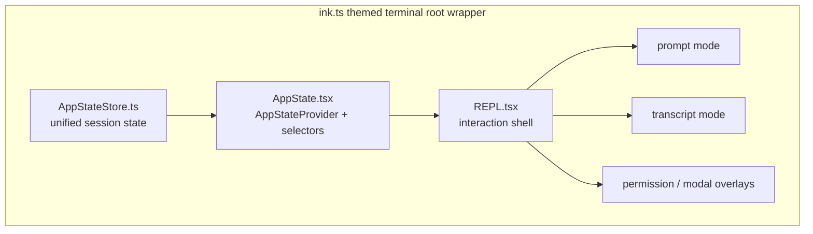

# 08. Claude Code 상태, UI, 터미널 상호작용

## 장 요약

장기 실행형 harness의 UI는 단순 렌더링 계층이 아니라, 사람이 세션 상태를 읽고 개입하고 재조정하는 operator oversight surface다. 이 장은 그 문제를 Claude Code 사례에 적용한다. 여기서 중요한 것은 두 가지다. 첫째, `src/state/AppStateStore.ts`가 담는 상태는 순수 UI state가 아니라 permission, remote session, tasks, MCP, notifications 같은 런타임 상태를 함께 품는다. 둘째, `src/screens/REPL.tsx`는 그 상태를 소비하는 화면일 뿐 아니라, prompt mode, transcript mode, permission overlay를 한곳에서 조합하는 interaction shell이다.

Claude Code의 local code를 보면 `src/state/AppState.tsx`는 단순 React context provider가 아니라 session-wide store adapter이고, `src/ink.ts`는 단순 renderer import가 아니라 themed terminal root wrapper다. 따라서 이 장은 UI를 "결과 표시 창"보다 "operator oversight가 사람에게 드러나는 층"으로 읽는다.

## 왜 UI/state를 하네스 문제로 읽어야 하는가

Anthropic의 [Effective harnesses for long-running agents](https://www.anthropic.com/engineering/effective-harnesses-for-long-running-agents) (2025-11-26)는 long-running agent가 discrete session과 recovery, resumability, oversight를 모두 다뤄야 한다고 설명한다. 이 글은 Claude Code의 local UI 설계를 직접 증명하지는 않지만, 왜 상태 가시성과 인간 개입 표면이 하네스에서 중요해지는지에 대한 배경을 준다.

Pan et al.의 [Natural-Language Agent Harnesses](https://arxiv.org/abs/2603.25723) (submitted 2026-03-26)는 harness behavior를 controller 내부의 보이지 않는 코드가 아니라 explicit runtime structure로 읽자고 제안한다. 이 장도 그 framing을 받아, Claude Code의 UI/state 층을 local runtime structure의 일부로 읽는다. 다만 아래에서 논의하는 세부 구조는 모두 로컬 코드 근거에 기반한다.

## 이 장의 근거와 범위

이 장의 관찰은 2026-04-02 기준 현재 공개 사본의 다음 대표 발췌 출처에 한정한다.

- `src/screens/REPL.tsx`
- `src/state/AppState.tsx`
- `src/state/AppStateStore.ts`
- `src/ink.ts`

외부 프레이밍에는 다음 자료를 사용한다.

- Anthropic, [Effective harnesses for long-running agents](https://www.anthropic.com/engineering/effective-harnesses-for-long-running-agents), 2025-11-26
- Pan et al., [Natural-Language Agent Harnesses](https://arxiv.org/abs/2603.25723), submitted 2026-03-26

Sources / evidence notes:
이 장의 reader-facing 외부 검증 축은 [../00-front-matter/03-references.md](../00-front-matter/03-references.md)의 Part 4 cluster를 따른다. 핵심 source ID는 `S6`, `S9`, `S22`, `S28`, `S29`이며, `P1`은 UI/state artifact 비교의 보조 프레임으로만 사용한다.

이 장은 다음을 다룬다.

- `src/state/AppStateStore.ts`가 어떤 런타임 상태를 하나의 store에 묶는지
- `src/state/AppState.tsx`가 그 상태를 React와 어떻게 연결하는지
- `src/screens/REPL.tsx`가 prompt mode, transcript mode, overlay를 어떻게 조합하는지
- `src/ink.ts`가 terminal renderer에 어떤 공통 wrapper를 씌우는지

각 hook과 component의 세부 구현, startup/trust policy, task lifecycle 자체는 이 장의 범위를 벗어난다.

## operator oversight를 읽는 다섯 가지 구분

| 구분 | 이 장에서의 의미 |
| --- | --- |
| unified state | UI와 런타임이 공유하는 세션 상태 |
| provider boundary | store를 React tree와 연결하는 경계 |
| local shell state | REPL이 자체적으로 들고 있는 message/input/screen 상태 |
| overlay and mode switch | permission prompt, transcript mode, teammate view 같은 UI 전환 |
| terminal wrapper | terminal renderer에 일관된 theme/root behavior를 씌우는 층 |

이 다섯 구분을 잡으면, 왜 이 코드베이스에서 UI가 곧 operator oversight layer인지 보인다.

## state/UI topology



이 그림은 `src/ink.ts`가 감싼 terminal root 안에서 `src/screens/REPL.tsx`가 unified state 위에 prompt mode, transcript mode, overlay를 얹는 shell로 동작한다는 점을 보여준다.

## 어떤 상태가 unified state에 들어가는가

`src/state/AppStateStore.ts`는 작은 UI flag 몇 개만 담지 않는다.

```ts
export type AppState = DeepImmutable<{
  settings: SettingsJson
  verbose: boolean
  mainLoopModel: ModelSetting
  ...
  toolPermissionContext: ToolPermissionContext
  ...
  remoteSessionUrl: string | undefined
  remoteConnectionStatus:
    | 'connecting'
    | 'connected'
    | 'reconnecting'
    | 'disconnected'
  ...
}> & {
  tasks: { [taskId: string]: TaskState }
  ...
  mcp: {
    clients: MCPServerConnection[]
    tools: Tool[]
    commands: Command[]
    resources: Record<string, ServerResource[]>
    pluginReconnectKey: number
  }
  plugins: {
    enabled: LoadedPlugin[]
    disabled: LoadedPlugin[]
    commands: Command[]
    ...
  }
  ...
  notifications: {
    current: Notification | null
    queue: Notification[]
  }
```

여기에는 settings/model/permission뿐 아니라 remote session URL, remote connection status, task registry, viewed teammate task, MCP clients/tools/commands/resources, plugin state, notifications까지 들어간다. 즉, Claude Code의 `AppState`는 "UI용 local state"라기보다 session runtime을 사람이 읽기 좋게 정리한 공용 상태 저장소에 가깝다.

`getDefaultAppState()`가 이를 어떻게 기본값으로 세팅하는지도 중요하다.

```ts
return {
  settings: getInitialSettings(),
  tasks: {},
  agentNameRegistry: new Map(),
  ...
  remoteSessionUrl: undefined,
  remoteConnectionStatus: 'connecting',
  ...
  toolPermissionContext: {
    ...getEmptyToolPermissionContext(),
    mode: initialMode,
  },
  ...
  notifications: {
    current: null,
    queue: [],
  },
```

이 초기값은 UI 화면 배치용 기본치라기보다, 세션이 어떤 상태 공간을 갖는지를 드러내는 schema에 가깝다.

## provider boundary는 무엇을 보장하는가

`src/state/AppState.tsx`는 단순 `useContext` 래퍼보다 조금 더 두꺼운 층이다.

```tsx
export function AppStateProvider(t0) {
  ...
  const hasAppStateContext = useContext(HasAppStateContext);
  if (hasAppStateContext) {
    throw new Error("AppStateProvider can not be nested within another AppStateProvider");
  }
  ...
  const [store] = useState(t1);
```

```tsx
useSettingsChange(onSettingsChange);
...
return <HasAppStateContext.Provider value={true}>
  <AppStoreContext.Provider value={store}>{t5}</AppStoreContext.Provider>
</HasAppStateContext.Provider>;
```

이 provider는 nested provider를 금지하고, 초기 state로 `createStore(...)`를 만들고, settings 변화까지 store에 반영한다. 즉, React tree는 여기서부터 "세션 전체를 보는 하나의 store"를 공유하게 된다.

구독 방식도 흥미롭다.

```tsx
export function useAppState(selector) {
  const store = useAppStore();
  ...
  return useSyncExternalStore(store.subscribe, get, get);
}
```

```tsx
export function useSetAppState() {
  return useAppStore().setState;
}
```

이 구조는 AppState를 React 로컬 state처럼 props로 흘리는 대신, selector 기반 external store로 읽게 만든다. 그래서 `src/screens/REPL.tsx`는 필요한 slice만 선택해 읽고, 동시에 같은 store를 non-React helper와도 공유할 수 있다.

## REPL은 단순 view가 아니라 interaction shell이다

`src/screens/REPL.tsx`를 보면, 이 컴포넌트는 AppState의 많은 slice를 직접 구독한다.

```tsx
const toolPermissionContext = useAppState(s => s.toolPermissionContext);
const verbose = useAppState(s => s.verbose);
const mcp = useAppState(s => s.mcp);
const plugins = useAppState(s => s.plugins);
const agentDefinitions = useAppState(s => s.agentDefinitions);
const fileHistory = useAppState(s => s.fileHistory);
...
const tasks = useAppState(s => s.tasks);
...
const viewingAgentTaskId = useAppState(s => s.viewingAgentTaskId);
const setAppState = useSetAppState();
```

이 자체가 `src/screens/REPL.tsx`가 화면 컴포넌트 하나가 아니라 shell이라는 사실을 보여준다. permission context, MCP, plugins, file history, tasks, teammate transcript view, remote callout까지 한 컴포넌트에서 묶인다.

동시에 REPL은 자신의 local shell state도 강하게 가진다.

```tsx
const [messages, rawSetMessages] = useState<MessageType[]>(initialMessages ?? []);
const messagesRef = useRef(messages);
...
const setMessages = useCallback((action: React.SetStateAction<MessageType[]>) => {
  const prev = messagesRef.current;
  const next = typeof action === 'function' ? action(messagesRef.current) : action;
  messagesRef.current = next;
```

이 패턴은 AppState와 별도로, message transcript와 render projection을 REPL 자신이 직접 관리한다는 뜻이다. 즉, unified state가 everything을 다 가지는 것이 아니라, REPL shell local state와 store state가 의도적으로 섞여 있다.

## prompt mode와 transcript mode는 같은 화면의 두 상태가 아니다

`src/screens/REPL.tsx`는 transcript mode에서 아예 early return으로 다른 shell branch를 만든다.

```tsx
if (screen === 'transcript') {
  ...
  const transcriptMessagesElement = <Messages messages={transcriptMessages} ... />;
  ...
  if (transcriptScrollRef) {
    return <AlternateScreen mouseTracking={isMouseTrackingEnabled()}>
      {transcriptReturn}
    </AlternateScreen>;
  }
  return transcriptReturn;
}
```

이 branch는 단순 CSS-like view toggle이 아니다. virtual scroll, transcript search bar, alternate screen 사용 여부, FullscreenLayout, dump mode까지 모두 바뀐다. 즉, `prompt`와 `transcript`는 같은 화면의 두 탭이 아니라, 서로 다른 상호작용 규칙을 가진 두 운영 상태에 가깝다.

이 구분은 operator oversight 관점에서 중요하다. 사람은 여기서 단순히 "스크롤을 더 보는 것"이 아니라, live prompt shell에서 transcript inspection shell로 mode를 전환한다.

## overlay는 부가 dialog가 아니라 세션 제어 일부다

REPL은 permission과 modal UI도 중앙에서 조합한다.

```tsx
const toolPermissionOverlay = focusedInputDialog === 'tool-permission'
  ? <PermissionRequest
      key={toolUseConfirmQueue[0]?.toolUseID}
      ...
      toolUseContext={getToolUseContext(messages, messages, abortController ?? createAbortController(), mainLoopModel)}
      ...
    />
  : null;
```

```tsx
const mainReturn = <KeybindingSetup>
  ...
  <FullscreenLayout
    scrollRef={scrollRef}
    overlay={toolPermissionOverlay}
    ...
    modal={centeredModal}
    ...
    scrollable={<>
      <TeammateViewHeader />
      <Messages messages={displayedMessages} ... />
```

이 구조는 overlay가 shell 밖에서 뜨는 부가 dialog가 아니라, REPL layout 안에 통합된 operator control 요소임을 보여준다. permission request, teammate transcript view, fullscreen modal, prompt placeholder, unseen divider가 모두 같은 shell 구성 안에서 조합된다.

즉, Claude Code의 UI는 "메시지 리스트 + 입력창"보다 훨씬 두껍다. operator가 어떤 상태를 보고 있는지, 어떤 modal이 떠 있는지, 지금 prompt mode인지 transcript mode인지가 모두 한 shell 안에서 관리된다.

여기에는 transcript와 trace의 구분도 숨어 있다. 화면은 transcript를 먼저 보여 주지만, 실제 세션 제어에는 background task artifact, notification, approval queue, diagnostic state가 함께 작동한다. 따라서 UI/state chapter는 run-artifact adjacency를 빼면 절반만 설명한 셈이 된다.

## terminal wrapper도 하네스 구조의 일부다

`src/ink.ts`는 Ink를 그대로 노출하지 않고 공통 wrapper를 씌운다.

```ts
function withTheme(node: ReactNode): ReactNode {
  return createElement(ThemeProvider, null, node)
}

export async function createRoot(options?: RenderOptions): Promise<Root> {
  const root = await inkCreateRoot(options)
  return {
    ...root,
    render: node => root.render(withTheme(node)),
  }
}
```

여기서 중요한 것은 terminal renderer도 일관된 theme/root behavior 아래서 감싼다는 점이다. 즉, UI shell은 `src/screens/REPL.tsx`에서만 시작되지 않고, `src/ink.ts`가 만들어 주는 themed root boundary 위에서 시작된다.

이건 사소해 보이지만 중요하다. 같은 terminal UI라도 render root를 어떻게 감싸느냐에 따라 theme, component contract, layout behavior가 세션 전체에서 일관되게 유지된다.

또한 wrapper는 masking과 redaction의 마지막 사용자 노출 지점이기도 하다. terminal transcript에 민감한 input/output을 그대로 흘릴지, operator action은 유지한 채 일부 필드만 가릴지 같은 정책이 여기서 사용자 경험으로 드러난다.

## 이 구조가 지원하는 감독 기능

이 장의 로컬 코드가 직접 보여주는 감독 기능은 다섯 가지다.

1. 상태 관찰  
   `src/state/AppStateStore.ts`의 unified state를 통해 permission, remote connection, tasks, notifications 같은 상태를 한 표면에서 읽을 수 있다.
2. transcript inspection  
   `src/screens/REPL.tsx`는 transcript mode에서 별도 branch와 alternate screen을 사용해 live prompt shell과 다른 inspection 경로를 제공한다.
3. 승인과 개입  
   `toolPermissionOverlay` 같은 overlay가 shell 내부에 통합되어, 위험한 행동을 UI 바깥이 아니라 session flow 안에서 제어한다.
4. 컨텍스트 전환  
   `viewingAgentTaskId`와 viewed task 분기가 leader view와 teammate transcript view 사이 전환을 가능하게 한다.
5. artifact-aware intervention
   notification, permission queue, transcript branch, diagnostic state가 함께 있어 resume, cancel, redact, diagnose가 같은 shell 안에서 이어진다.

이 네 기능을 함께 보면, Claude Code의 UI/state 층은 cosmetic shell이 아니라 operator oversight surface에 가깝다.

## 마무리

이 장의 결론은 다음과 같다. Claude Code의 UI는 렌더링 레이어로만 설명되지 않는다. `src/state/AppStateStore.ts`는 unified session state를 만들고, `src/state/AppState.tsx`는 그 상태를 React tree의 store boundary로 연결하며, `src/screens/REPL.tsx`는 그 위에서 prompt mode, transcript mode, overlay를 조합하는 interaction shell 역할을 한다. `src/ink.ts`는 이 subtree 전체를 themed terminal root로 감싼다. 이 구조는 적어도 네 가지 감독 기능, 즉 상태 관찰, transcript inspection, 승인과 개입, 컨텍스트 전환을 직접 뒷받침한다. 따라서 이 계층은 단순 프론트엔드라기보다 operator oversight surface로 읽는 편이 맞다.

## 대표 근거 읽기 순서

아래 라벨은 독자가 별도 source를 열어야 한다는 뜻이 아니라, 이 장에서 이미 인용하고 설명한 코드 발췌가 어떤 구현 단면을 대표하는지 다시 묶어 주는 provenance 메모다.

1. `src/state/AppStateStore.ts`
   unified session state가 무엇을 들고 있는지 본다.
2. `src/state/AppState.tsx`
   React tree와 store boundary가 어떻게 연결되는지 확인한다.
3. `src/screens/REPL.tsx`
   prompt mode, transcript mode, overlay가 어떤 branch로 나뉘는지 본다.
4. `src/ink.ts`
   terminal root와 theme wrapper가 shell 전체를 어떻게 감싸는지 확인한다.
