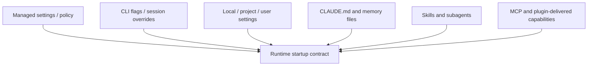

# 09. instruction surfaces, settings, hooks, CLAUDE.md, subagents

> Why this chapter exists: 장기 실행형 하네스의 실제 동작은 단일 system prompt가 아니라, layered instruction surface와 configuration surface의 합성으로 결정된다는 점을 고정한다.
> Reader level: advanced / reviewer
> Last verified: 2026-04-06
> Freshness class: volatile

## Core claim

instruction surface는 "모델에게 무슨 말을 했는가"만의 문제가 아니다. 실제 제품형 하네스에서는 settings scope, memory file, hooks, skills, subagents, CLI/system prompt flags, MCP and plugin packaging까지 합쳐서 세션의 행동 조건을 만든다. 이 층위를 capability surface나 operator surface와 분리해서 읽어야 설정 충돌, provenance confusion, policy drift, approval fatigue를 제대로 설명할 수 있다.

## What this chapter is not claiming

- Claude Code의 내부 기본 system prompt 전체를 복원할 수 있다는 주장
- 모든 instruction source가 동일한 신뢰 모델과 override semantics를 가진다는 주장
- MCP, plugin, skill을 모두 "prompt file" 하나로 환원할 수 있다는 주장

## Mental model / diagram

이 그림의 핵심은 provenance가 서로 다른 surface를 한 stack으로 읽되, 같은 층이라고 오해하지 않는 것이다. settings는 policy와 configuration을, `CLAUDE.md`는 startup-time instruction memory를, skills와 subagents는 task-specific prompt artifact를, MCP와 plugins는 capability ingress를 담당한다.

## 범위와 비범위

이 장이 다루는 것:

- settings scope와 precedence
- `CLAUDE.md`와 유사한 repo instruction file이 startup contract에서 맡는 역할
- hooks, skills, subagents가 세션 행동과 tool usage에 미치는 영향
- CLI system prompt flags가 session-scoped override로 작동하는 방식
- MCP, plugins, managed settings가 instruction stack과 capability stack에 걸치는 지점

이 장이 다루지 않는 것:

- 개별 setting key 전체 카탈로그
- 모든 hook payload와 plugin manifest 세부
- MCP transport 전체 세부와 remote auth 구현

이 장은 [03-commands-skills-plugins-and-mcp.md](03-commands-skills-plugins-and-mcp.md)와 [06-claude-code-session-startup-trust-and-initialization.md](../02-runtime-and-session-start/06-claude-code-session-startup-trust-and-initialization.md) 사이의 간극을 메운다. `03`이 capability ingress 문법을 설명한다면, 이 장은 그 위에 어떤 instruction stack과 policy stack이 얹히는지 설명한다.

## 자료와 독서 기준

대표 공식 자료:

- Anthropic, [Claude Code settings](https://docs.anthropic.com/en/docs/claude-code/settings), verified 2026-04-06
- Anthropic, [Extend Claude with skills](https://docs.anthropic.com/en/docs/claude-code/skills), verified 2026-04-06
- Anthropic, [Connect Claude Code to tools via MCP](https://docs.anthropic.com/en/docs/claude-code/mcp), verified 2026-04-06
- Anthropic, [CLI reference](https://docs.anthropic.com/en/docs/claude-code/cli-reference), verified 2026-04-06
- Anthropic, [Claude Agent SDK overview](https://docs.anthropic.com/en/docs/claude-code/sdk/sdk-overview), verified 2026-04-06
- Anthropic, [Claude Code release notes](https://docs.anthropic.com/en/release-notes/claude-code), verified 2026-04-06
- OpenAI, [Custom instructions with AGENTS.md](https://developers.openai.com/codex/guides/agents-md), verified 2026-04-06

로컬 근거:

- `src/commands.ts`
- `src/skills/loadSkillsDir.ts`
- `src/services/mcp/client.ts`
- `src/tools/ToolSearchTool/ToolSearchTool.ts`
- `src/services/mcp/MCPConnectionManager.tsx`

## settings scope는 instruction stack의 바닥을 고정한다

Anthropic의 settings 문서는 Claude Code가 managed, user, project, local scope를 구분하고, managed > command line > local > project > user 순으로 precedence를 적용한다고 설명한다. 같은 문서는 `CLAUDE.md`, subagents, MCP servers, plugins도 scope 시스템과 함께 읽어야 한다고 적고, settings file과 memory file의 역할을 분리한다.

이 점이 중요한 이유는 다음과 같다.

- user preference와 project policy는 같은 종류의 문서가 아니다.
- team-shared rule과 개인 override는 같은 provenance가 아니다.
- managed settings는 override 불가능한 policy layer일 수 있다.

즉, instruction surface를 말할 때는 "무슨 지침이 있나"보다 "어느 scope의 지침인가"를 먼저 물어야 한다.

## `CLAUDE.md`는 settings file과 다른 종류의 startup artifact다

settings 문서는 `CLAUDE.md`를 memory file로, settings.json을 configuration file로 구분한다. 또 internal system prompt는 공개하지 않지만, custom instruction을 추가하려면 `CLAUDE.md` 또는 `--append-system-prompt` flag를 사용하라고 설명한다. CLI reference는 `--system-prompt`, `--system-prompt-file`, `--append-system-prompt`, `--append-system-prompt-file`을 explicit session override로 제공한다.

여기서 핵심은 두 층위의 차이다.

- settings file은 permissions, env, plugin, hook policy 같은 runtime config를 다룬다.
- `CLAUDE.md`와 CLI prompt flag는 startup-time instruction text를 다룬다.

둘 다 행동을 바꾸지만, provenance와 lifecycle은 다르다. 이 구분이 없으면 instruction drift와 config drift를 한 문제로 뭉개게 된다.

## skill과 subagent는 task-specific instruction surface다

skills 문서는 skill이 `SKILL.md` 기반 prompt artifact이며, personal, project, plugin, enterprise 위치에서 로드될 수 있고, enterprise > personal > project 순으로 precedence를 가진다고 설명한다. plugin skill은 `plugin-name:skill-name` namespace를 써서 다른 skill과 충돌하지 않는다.

같은 문서는 skill content를 inline reference content와 forked task content로 나누고, `context: fork`를 설정하면 subagent에서 격리 실행된다고 설명한다. 또 `allowed-tools`, `hooks`, `paths`, `agent`, `effort` 같은 frontmatter가 skill의 실제 실행 contract를 바꾼다고 말한다.

해석하면 다음과 같다.

- skill은 단순 참고 문서가 아니라 invocation contract를 가진 instruction surface다.
- subagent는 별도 프로세스가 아니라 instruction isolation boundary이기도 하다.
- instruction surface는 text content뿐 아니라 execution context metadata도 포함한다.

## MCP와 plugin은 capability surface이면서 policy surface와도 맞닿아 있다

MCP 문서는 remote HTTP server, local stdio server, plugin-delivered server를 모두 지원하고, managed MCP configuration으로 exclusive control 또는 allowlist/denylist 정책을 둘 수 있다고 설명한다. 또한 remote MCP에서 OAuth metadata discovery override 같은 auth-related surface를 다루고, third-party MCP server는 신뢰 모델을 따로 가져야 한다고 경고한다.

이 점은 instruction surface와 capability surface가 완전히 분리되지 않음을 보여 준다.

- MCP는 tool과 resource를 가져오는 capability ingress다.
- 하지만 managed MCP, allowManagedMcpServersOnly, allowedMcpServers 같은 setting은 policy layer다.
- plugin은 capability bundle이면서도 configuration delivery unit이 된다.

따라서 instruction chapter와 MCP chapter는 분리하되, 서로 강하게 cross-link해야 한다.

## `AGENTS.md`는 repo-level instruction surface의 비교 기준을 제공한다

OpenAI의 `AGENTS.md` 가이드는 global scope, project scope, nested override, fallback filename, current directory까지의 hierarchical loading 규칙을 설명한다. 이 문서는 Codex 전용이지만, repo-level instruction file을 하나의 공식 surface로 다룬다는 점에서 비교 기준이 된다.

Claude Code의 `CLAUDE.md`와 Codex의 `AGENTS.md`는 제품이 다르다. 그러나 둘 다 다음 문제를 드러낸다.

- instruction은 repo root와 nested directory를 따라 축적될 수 있다.
- global default와 project rule은 다른 scope를 가진다.
- override file과 fallback filename은 instruction discovery contract의 일부다.

권고: 책 전체에서 `repo-level instruction surface`를 설명할 때는 제품 고유 파일명보다도 "scope, precedence, discovery rule"을 먼저 적어라.

## Design implications

- settings, `CLAUDE.md`, hooks, skills, subagents, plugins, MCP를 하나의 표에 provenance와 override semantics까지 함께 적어야 한다.
- startup contract 장은 session이 열리기 전 어떤 instruction source가 이미 세션에 반영됐는지를 설명해야 한다.
- command/MCP chapter는 capability ingress를 설명하고, 이 장은 instruction stack을 설명하는 식으로 책임을 나누는 편이 낫다.
- approval fatigue 문제는 tool-time permission만이 아니라, startup-time policy와 managed setting의 설계와도 연결된다.

## What to measure

- instruction source count per session
- conflicting rule frequency
- managed override hit rate
- skill/subagent invocation rate
- MCP server provenance ratio: local vs remote vs plugin-delivered

## Failure signatures

- 사용자는 같은 명령이 왜 다른 세션에서 다르게 동작하는지 설명할 수 없다.
- repo instruction, local override, CLI flag가 충돌하지만 provenance를 추적하기 어렵다.
- managed policy 때문에 막힌 동작을 product bug로 오해한다.
- remote MCP capability를 local trusted surface처럼 취급해 trust boundary를 잘못 이해한다.

## Review questions

1. 이 제품은 instruction surface와 capability surface를 분리해서 설명하고 있는가.
2. override precedence가 문서와 제품 동작에서 일치하는가.
3. repo-level instruction file과 개인 override file을 같은 것으로 설명하고 있지 않은가.
4. skill/subagent metadata가 단순 prompt text가 아니라 실행 contract라는 점이 드러나는가.
5. MCP, plugin, managed settings가 policy layer와 capability layer를 어디서 겹치는지 분명한가.

## Sources / evidence notes

- Anthropic settings docs는 scope, precedence, `CLAUDE.md`, subagent, plugin, hook configuration을 공식적으로 설명한다.
- Anthropic skills docs는 skill location, precedence, `context: fork`, frontmatter-driven execution contract를 설명한다.
- Anthropic MCP docs는 remote/local/plugin MCP와 managed MCP configuration, OAuth override, third-party trust 경고를 설명한다.
- Anthropic CLI reference는 system prompt replacement/append flags와 bare mode behavior를 설명한다.
- OpenAI `AGENTS.md` docs는 repo-level instruction discovery와 layered override semantics의 비교 기준을 제공한다.
