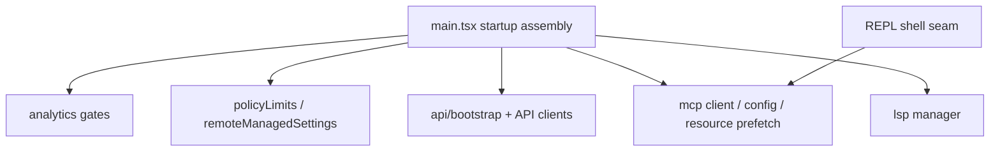

# 04. Claude Code 서비스 계층과 통합

## 장 요약

service layer는 단순 API adapter 묶음이 아니라 runtime assembly와 operator shell이 기대는 integration architecture다. 이 장은 그 문제를 Claude Code 사례에 적용한다. 일반적으로 하네스의 service layer는 다섯 질문으로 읽는 편이 좋다. 외부 I/O를 누가 담당하는가, 기능 가용성을 누가 gate하는가, 초기화 상태와 연결 상태를 누가 오래 유지하는가, background sync와 polling은 어디서 일어나는가, 그리고 어떤 seam에서 shell에 꽂히는가. 이 장은 그 질문을 Claude Code의 로컬 구조에 적용한다.

로컬 코드만 보면 `services/`는 한 성격으로 묶이지 않는다. `api/`와 `mcp/`는 외부 시스템과 직접 연결되는 adapter이면서도, `policyLimits/`와 `remoteManagedSettings/`는 runtime gating을 바꾸고, `analytics/`는 gate와 sink를, `lsp/`는 장기 상태를 가진 manager를 제공한다. 그래서 이 장은 `services/`를 "이질적인 폴더"가 아니라, runtime infra seam이 응축된 층으로 읽는다.

## 왜 integration architecture를 따로 읽어야 하는가

Anthropic의 [How we built our multi-agent research system](https://www.anthropic.com/engineering/multi-agent-research-system) (2025-06-13)는 agent system이 planner, worker, verifier 같은 reasoning structure만으로 동작하지 않고, shared tooling과 orchestration substrate 위에서 돌아간다고 설명한다. 이 글이 Claude Code의 `services/` 구조를 직접 증명하지는 않지만, 왜 runtime이 서비스 계층의 조합 방식에 크게 의존하는지에 대한 배경을 준다.

Anthropic Platform Docs의 [Agent SDK overview](https://platform.claude.com/docs/en/agent-sdk/overview) (접근 2026-04-02)는 tools, sessions, permissions, MCP 같은 runtime substrate를 library surface로 제시한다. Claude Code의 `services/`는 바로 그런 substrate를 제품 코드 안에서 구체화한 층으로 읽을 수 있다.

## 이 장의 근거와 범위

이 장의 관찰은 2026-04-02 기준 현재 공개 사본의 다음 대표 발췌 출처에 한정한다.

- `services/`
- `src/main.tsx`
- `src/screens/REPL.tsx`

외부 프레이밍에는 다음 자료를 사용한다.

- Anthropic, [How we built our multi-agent research system](https://www.anthropic.com/engineering/multi-agent-research-system), 2025-06-13
- Anthropic Platform Docs, [Agent SDK overview](https://platform.claude.com/docs/en/agent-sdk/overview), 접근 시점 2026-04-02

이 장은 다음을 다룬다.

- startup assembly에서 service가 어떤 식으로 기동되는지
- `src/services/api`, `src/services/mcp`, `src/services/analytics`, `src/services/lsp`, `src/services/policyLimits`, `src/services/remoteManagedSettings`의 역할
- service가 단순 fetch wrapper인지, 아니면 gating/polling/manager 역할까지 맡는지
- interactive shell이 어떤 integration seam을 직접 품는지

반대로 각 service family의 내부 알고리즘 전체와 remote transport의 프로토콜 세부는 이 장의 범위를 벗어난다.

## service layer를 읽는 다섯 가지 구분

| 구분 | 이 장에서의 의미 |
| --- | --- |
| external adapter | 외부 API나 서버와 직접 연결되는 service |
| policy/gating service | 기능 가용성과 운영 제한을 바꾸는 service |
| long-lived manager | 초기화 상태와 연결 상태를 오래 유지하는 service |
| background sync/polling | fail-open 또는 polling 기반으로 상태를 갱신하는 service |
| shell seam | `src/main.tsx`나 `src/screens/REPL.tsx`가 직접 끼워 넣는 integration point |

이 다섯 구분을 잡고 보면 `services/`의 이질성은 무질서가 아니라 역할의 폭으로 읽힌다.

## service composition topology



이 그림은 service layer를 "한 폴더 아래의 동등한 모듈"로 보지 않고, startup assembly와 interactive shell이 어떤 service family에 의존하는지 보여준다.

## `services/`는 어떤 family로 나뉘는가

현재 공개 사본에서 `services/` 아래 파일 수를 대략 세어 보면 `mcp`가 23개, `api`가 20개, `compact`가 11개, `analytics`가 9개, `lsp`가 7개, `remoteManagedSettings`와 `teamMemorySync`가 각각 5개 수준이다. 이 숫자는 구조의 방향을 증명하지는 않지만, `services/`가 "외부 I/O 몇 개 모음"으로 읽히기에는 이미 너무 넓다는 점을 보여 주는 orienting context로는 유용하다.

## startup assembly는 service를 어떻게 기동하는가

`src/main.tsx`는 service를 한꺼번에 부르는 것이 아니라, startup timing과 실패 성격에 따라 다르게 기동한다.

```ts
// Analytics and feature flag initialization
void initializeAnalyticsGates();
void prefetchOfficialMcpUrls();
void refreshModelCapabilities();
...
void loadRemoteManagedSettings();
void loadPolicyLimits();
...
if (feature('UPLOAD_USER_SETTINGS')) {
  void import('./services/settingsSync/index.js').then(m => m.uploadUserSettingsInBackground());
}
```

이 절단면은 세 가지를 보여준다. analytics gates, 공식 MCP URL prefetch, model capability refresh는 startup에서 빠르게 kick-off되고, remote managed settings와 policy limits는 non-blocking으로 시작되며, settings sync는 feature flag가 열릴 때만 background upload로 붙는다. 즉, service는 모두 같은 startup priority를 갖지 않는다.

조금 뒤에는 MCP config loading이 setup/trust와 겹쳐 실행된다.

```ts
const claudeaiConfigPromise = ... fetchClaudeAIMcpConfigsIfEligible() ...
...
const mcpConfigPromise = ... getClaudeCodeMcpConfigs(dynamicMcpConfig) ...
...
// NOTE: We do NOT call prefetchAllMcpResources here - that's deferred until after trust dialog
```

그리고 trust 이후에는 실제 MCP resource prefetch가 시작된다.

```ts
const localMcpPromise = isNonInteractiveSession ? Promise.resolve({
  clients: [],
  tools: [],
  commands: []
}) : prefetchAllMcpResources(regularMcpConfigs);
```

이 sequencing은 service layer가 단순 fetch wrapper가 아니라, startup contract와 trust boundary에 따라 기동 순서가 달라지는 계층임을 보여준다.

## API family는 외부 호출이면서도 policy gate를 먼저 본다

`src/services/api/bootstrap.ts`는 좋은 예다.

```ts
async function fetchBootstrapAPI(): Promise<BootstrapResponse | null> {
  if (isEssentialTrafficOnly()) {
    logForDebugging('[Bootstrap] Skipped: Nonessential traffic disabled')
    return null
  }

  if (getAPIProvider() !== 'firstParty') {
    logForDebugging('[Bootstrap] Skipped: 3P provider')
    return null
  }
```

```ts
const apiKey = getAnthropicApiKey()
const hasUsableOAuth =
  getClaudeAIOAuthTokens()?.accessToken && hasProfileScope()
if (!hasUsableOAuth && !apiKey) {
  logForDebugging('[Bootstrap] Skipped: no usable OAuth or API key')
  return null
}
```

이 service는 네트워크를 부르기 전에 privacy level, provider choice, usable auth 존재를 먼저 본다. 즉, `src/services/api/bootstrap.ts`는 request wrapper이면서도 runtime gate다. service layer를 "I/O만 한다"라고 단정할 수 없는 이유가 여기 있다.

## policy/gating service는 runtime availability를 바꾼다

`policyLimits`와 `remoteManagedSettings`는 특히 그렇다.

```ts
export async function loadPolicyLimits(): Promise<void> {
  ...
  await fetchAndLoadPolicyLimits()

  if (isPolicyLimitsEligible()) {
    startBackgroundPolling()
  }
}
```

`policyLimits`는 단순 fetch-once service가 아니다. eligibility를 보고, 초기 load를 수행하고, 이후 background polling까지 시작한다. 이는 runtime이 정책 상태를 장기적으로 계속 참고한다는 뜻이다.

`remoteManagedSettings`도 fail-open semantics를 명시한다.

```ts
 * - API fails open (non-blocking) - if fetch fails, continues without remote settings
```

```ts
export function initializeRemoteManagedSettingsLoadingPromise(): void {
  ...
  if (isRemoteManagedSettingsEligible()) {
    loadingCompletePromise = new Promise(resolve => {
      ...
      setTimeout(() => {
        if (loadingCompleteResolve) {
          logForDebugging(
            'Remote settings: Loading promise timed out, resolving anyway',
          )
          loadingCompleteResolve()
```

이 service는 managed settings를 가져오되, 로딩 약속 자체에 timeout을 넣고 실패 시에도 runtime을 멈추지 않도록 설계돼 있다. 즉, service layer는 여기서 "정책을 적용하는 통로"이면서 동시에 "정책 실패가 런타임 전체를 멈추지 않게 하는 완충 계층" 역할을 한다.

## MCP는 service layer 안의 하위 플랫폼이다

`src/services/mcp/client.ts`는 transport, auth, tool conversion, resource listing을 한곳에 모은다.

```ts
import { Client } from '@modelcontextprotocol/sdk/client/index.js'
import { SSEClientTransport } from '@modelcontextprotocol/sdk/client/sse.js'
import { StdioClientTransport } from '@modelcontextprotocol/sdk/client/stdio.js'
import { StreamableHTTPClientTransport } from '@modelcontextprotocol/sdk/client/streamableHttp.js'
...
import { MCPTool } from '../../tools/MCPTool/MCPTool.js'
import { createMcpAuthTool } from '../../tools/McpAuthTool/McpAuthTool.js'
```

그리고 실제 연결 코드도 transport별 특수성을 품고 있다.

```ts
// IMPORTANT: Always set eventSourceInit with a fetch that does NOT use the
// timeout wrapper. The EventSource connection is long-lived ...
transport = new SSEClientTransport(
  new URL(serverRef.url),
  transportOptions,
)
```

여기서 중요한 것은 MCP가 단일 "클라이언트 라이브러리 래퍼"가 아니라는 점이다. service family 안에서 이미 transport 선택, auth header 주입, proxy/TLS 처리, tool conversion이 함께 이뤄진다. 다만 이 장의 관심은 transport protocol의 세부보다, 그런 역할이 한 service family 안에서 함께 응집돼 있다는 사실에 있다.

## LSP manager는 long-lived manager service의 예다

`src/services/lsp/manager.ts`는 전형적인 singleton-style manager다.

```ts
let lspManagerInstance: LSPServerManager | undefined
let initializationState: InitializationState = 'not-started'
let initializationError: Error | undefined
let initializationPromise: Promise<void> | undefined
```

```ts
export function getInitializationStatus():
  | { status: 'not-started' }
  | { status: 'pending' }
  | { status: 'success' }
  | { status: 'failed'; error: Error } {
```

이 서비스는 데이터를 fetch해서 바로 반환하는 adapter와 다르다. initialization state, generation, error, singleton instance를 오래 유지하고, 다른 계층은 그 상태를 읽는다. 즉, `services/`에는 external adapter뿐 아니라 long-lived manager service도 함께 산다.

## interactive shell seam은 어디에 있는가

`src/screens/REPL.tsx`는 service layer를 직접 조합하는 지점이기도 하다.

```tsx
<MCPConnectionManager key={remountKey} dynamicMcpConfig={dynamicMcpConfig} isStrictMcpConfig={strictMcpConfig}>
  <FullscreenLayout scrollRef={scrollRef} overlay={toolPermissionOverlay} ... >
    <Messages messages={displayedMessages} tools={tools} commands={commands} ... />
```

이 절단면은 service layer가 `src/main.tsx`에서만 소비되는 것이 아니라, REPL shell에도 직접 seam으로 꽂힌다는 점을 보여준다. `MCPConnectionManager`는 UI shell 안에서 연결 상태와 dynamic config를 다루며, layout과 메시지 shell 위에 올라간다. 즉, service는 invisible backend만이 아니라 interactive shell의 일부이기도 하다.

## Claude Code의 service layer를 어떻게 읽어야 하는가

이 장의 로컬 코드만 놓고 보면 Claude Code의 service layer는 처음 제시한 다섯 구분으로 다시 읽을 수 있다.

1. external adapter  
   `api/`, `mcp/`, `oauth/`처럼 외부 시스템과 직접 연결되는 층
2. policy/gating service  
   `policyLimits/`, `remoteManagedSettings/`처럼 runtime availability를 바꾸는 층
3. long-lived manager  
   `lsp/`처럼 초기화 상태와 연결 상태를 오래 유지하는 층
4. background sync/polling  
   `settingsSync/`, `policyLimits/`, `remoteManagedSettings/`처럼 fail-open이나 polling으로 상태를 갱신하는 층
5. shell seam  
   `src/main.tsx`와 `src/screens/REPL.tsx`가 어떤 service를 언제, 어떤 순서로 꽂는지 보여 주는 지점

이렇게 읽으면 `services/`의 이질성은 설명된다. 같은 이름 아래에 adapter, gate, manager, polling, shell seam이 섞여 있는 것은 폴더가 대충 설계돼서만이 아니라, runtime이 기대는 공통 infra seam이 그만큼 넓기 때문이다.

## 점검 질문

- 이 service는 외부 adapter인가, policy/gating service인가, long-lived manager인가?
- startup에서 이 service는 blocking으로 기동되는가, fail-open으로 background에 붙는가?
- 이 service는 단순 데이터를 가져오는가, 아니면 runtime availability와 sequencing도 바꾸는가?
- built-in runtime과 외부 integration이 만나는 seam은 `src/main.tsx`인가, `src/screens/REPL.tsx`인가, 둘 다인가?
- 이 service family를 제거하면 단순 네트워크 기능이 빠지는가, 아니면 런타임 규칙 자체가 바뀌는가?

## 마무리

이 장의 결론은 다음과 같다. Claude Code의 service layer는 API adapter 모음으로 환원되지 않는다. 적어도 이 장의 범위 안에서 `services/`는 외부 adapter, policy/gating service, long-lived manager, background sync/polling, shell seam이 겹쳐 있는 runtime substrate로 읽힌다. `src/main.tsx`는 startup sequencing 속에서 그중 일부를 기동하고, `src/screens/REPL.tsx`는 그 일부를 interactive shell 안에 직접 끼워 넣는다. 따라서 `services/`를 읽을 때는 네트워크 호출보다, 이 service가 runtime의 어느 판단과 연결을 대신 맡고 있는지를 함께 봐야 한다.

## 대표 근거 읽기 순서

아래 라벨은 독자가 별도 source를 열어야 한다는 뜻이 아니라, 이 장에서 이미 인용하고 설명한 코드 발췌가 어떤 구현 단면을 대표하는지 다시 묶어 주는 provenance 메모다.

1. `services/` 최상위 인벤토리
   adapter, gate, manager, polling family가 어떤 폴더로 나뉘는지 먼저 본다.
2. `src/services/mcp/`, `src/services/oauth/`, `src/services/api/`
   외부 adapter family를 본다.
3. `src/services/policyLimits/`, `src/services/remoteManagedSettings/`
   runtime availability를 바꾸는 gating service를 본다.
4. `src/main.tsx`
   startup sequencing 속에서 어떤 service가 blocking인지 확인한다.
5. `src/screens/REPL.tsx`
   service가 interactive shell seam으로 직접 들어오는 지점을 본다.
