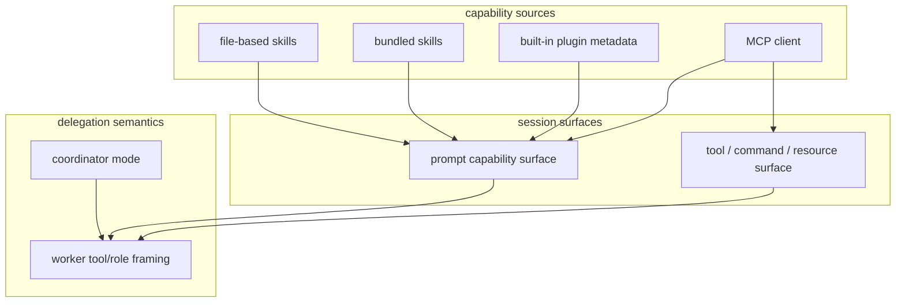

# 05. Claude Code 확장 표면과 위임 구조

## 장 요약

하네스의 확장 구조를 읽을 때는 두 질문을 먼저 분리하는 편이 좋다. 첫째, 새로운 capability는 어떤 표면을 통해 세션에 들어오는가. 둘째, 그렇게 들어온 capability를 coordinator나 worker가 어떤 의미로 사용해야 하는가는 어디서 다시 정의되는가. Claude Code는 이 두 질문을 한 메커니즘으로 처리하지 않는다.

이 장은 그 점을 사례로 정리한다. `src/skills/loadSkillsDir.ts`와 `src/skills/bundledSkills.ts`는 안내용 프롬프트 표면을 만들고, `src/plugins/builtinPlugins.ts`는 여러 capability를 묶는 번들 단위를 만들며, `src/services/mcp/client.ts`는 protocol-backed tool/command/skill/resource 표면을 세션에 주입한다. `src/coordinator/coordinatorMode.ts`는 그 위에서 worker에게 어떤 capability를 어떻게 설명하고 어떤 역할 규칙으로 위임할지를 다시 쓴다. 따라서 이 장의 핵심은 "확장"과 "위임 의미"를 분리해 읽는 데 있다.

## 왜 capability acquisition과 delegation semantics를 구분해야 하는가

Anthropic의 [How we built our multi-agent research system](https://www.anthropic.com/engineering/multi-agent-research-system) (2025-06-13)는 orchestrator-worker 구조에서 핵심이 worker 수보다도, orchestrator가 worker에게 어떤 작업 단위를 넘기고 어떤 정보를 다시 받아 종합하느냐에 있다고 설명한다. 이 글은 Claude Code의 로컬 구현을 직접 증명하지는 않지만, 왜 delegation semantics를 capability acquisition과 별도 층으로 읽어야 하는지에 대한 배경을 준다.

Anthropic의 [Writing effective tools for AI agents](https://www.anthropic.com/engineering/writing-tools-for-agents) (2025-09-11)는 capability surface가 명확한 설명과 경계, 적절한 맥락을 가져야 한다고 말한다. 이 원칙은 MCP나 skill처럼 모델이 결국 소비하게 되는 확장 표면에도 그대로 적용된다.

Anthropic Platform Docs의 [Agent SDK overview](https://platform.claude.com/docs/en/agent-sdk/overview) (접근 2026-04-02)는 tools, sessions, permissions, MCP, filesystem-based features를 모두 별도 표면으로 제시한다. Claude Code의 로컬 구조는 그 여러 표면이 한 세션 안에서 어떻게 함께 작동하는지를 보여주는 사례로 읽을 수 있다.

## 이 장의 근거와 범위

이 장의 관찰은 2026-04-02 기준 현재 공개 사본의 다음 대표 발췌 출처에 한정한다.

- `src/skills/loadSkillsDir.ts`
- `src/skills/bundledSkills.ts`
- `src/plugins/builtinPlugins.ts`
- `src/services/mcp/client.ts`
- `src/coordinator/coordinatorMode.ts`

외부 프레이밍에는 다음 자료를 사용한다.

- Anthropic, [How we built our multi-agent research system](https://www.anthropic.com/engineering/multi-agent-research-system), 2025-06-13
- Anthropic, [Writing effective tools for AI agents](https://www.anthropic.com/engineering/writing-tools-for-agents), 2025-09-11
- Anthropic Platform Docs, [Agent SDK overview](https://platform.claude.com/docs/en/agent-sdk/overview), 접근 시점 2026-04-02

Sources / evidence notes:
이 장의 reader-facing 외부 검증 축은 [../00-front-matter/03-references.md](../00-front-matter/03-references.md)의 Part 5 cluster를 따른다. coordination stack 설명에는 `S2`, `S3`, `S9`, `S10`, `S11`, `S12`, `S13`, `S15`를 우선 사용한다.

이 장은 다음을 다룬다.

- file-based skill과 bundled skill이 어떻게 prompt capability로 노출되는지
- built-in plugin이 어떤 기능 메타데이터를 묶는지
- MCP가 어떤 조건 아래 tool, command, skill, resource를 세션에 주입하는지
- coordinator mode가 worker tool 설명과 coordinator role prompt를 어떻게 바꾸는지

agent task execution 자체, plugin loader 전체, remote transport 세부는 이 장의 범위를 벗어난다.

## 이 장의 다섯 가지 구분

| 구분 | 이 장에서의 의미 |
| --- | --- |
| file-based guidance | 디스크에서 읽는 prompt capability |
| bundled guidance | 바이너리와 함께 배송되는 내장 prompt capability |
| bundle abstraction | 여러 기능 메타데이터를 한 번에 묶는 단위 |
| protocol-backed capability | 외부 프로토콜을 통해 세션에 들어오는 capability |
| delegation semantics | worker 역할과 위임 규칙을 다시 정의하는 층 |

마지막 종합에서는 앞의 두 guidance 항목을 하나의 "guidance capability"로 묶어 다시 회수하겠지만, 본문에서는 provenance 차이를 보여 주기 위해 따로 본다.

## capability와 delegation의 관계도



이 그림은 두 층을 분리해 보여준다. 왼쪽은 capability가 세션에 들어오는 확장 표면이고, 오른쪽은 coordinator가 그 capability를 worker에게 어떤 의미로 설명하는지에 대한 위임 층이다. built-in plugin이 MCP에 직접 연결된다고 말하려는 것이 아니라, plugin definition이 skill과 MCP server metadata 같은 여러 표면을 함께 가질 수 있음을 보여 주는 도식이다.

## file-based skill은 어떻게 prompt capability가 되는가

`src/skills/loadSkillsDir.ts`는 file-based skill과 MCP-loaded skill이 공유하는 frontmatter 해석 규칙을 먼저 정리한다.

```ts
export function parseSkillFrontmatterFields(
  frontmatter: FrontmatterData,
  markdownContent: string,
  resolvedName: string,
  ...
): {
  ...
  allowedTools: string[]
  whenToUse: string | undefined
  disableModelInvocation: boolean
  userInvocable: boolean
  hooks: HooksSettings | undefined
  executionContext: 'fork' | undefined
  agent: string | undefined
```

이 결과는 곧바로 command object로 승격된다.

```ts
export function createSkillCommand({...}): Command {
  return {
    type: 'prompt',
    name: skillName,
    description,
    allowedTools,
    whenToUse,
    disableModelInvocation,
    userInvocable,
    context: executionContext,
    agent,
```

이 흐름이 보여주는 것은 명확하다. file-based skill은 markdown 파일이 아니라, allowed tools, invocation mode, hooks, execution context, agent 지정 정보까지 가진 prompt capability로 변환된다.

같은 코드 안에는 신뢰 차이도 드러난다.

```ts
// Security: MCP skills are remote and untrusted — never execute inline
// shell commands (!`…` / ```! … ```) from their markdown body.
if (loadedFrom !== 'mcp') {
  finalContent = await executeShellCommandsInPrompt(...)
}
```

즉, file-based skill과 MCP-loaded skill은 같은 형식의 command로 surface될 수 있어도, trust assumption은 다르다.

## bundled skill은 같은 prompt surface를 공유하지만 provenance가 다르다

`src/skills/bundledSkills.ts`는 built-in binary와 함께 배포되는 skill registry를 별도로 가진다.

```ts
export type BundledSkillDefinition = {
  name: string
  description: string
  ...
  allowedTools?: string[]
  model?: string
  disableModelInvocation?: boolean
  userInvocable?: boolean
  ...
  files?: Record<string, string>
  getPromptForCommand: (...)
}
```

```ts
export function registerBundledSkill(definition: BundledSkillDefinition): void {
  ...
  const command: Command = {
    type: 'prompt',
    name: definition.name,
    description: definition.description,
    ...
    source: 'bundled',
    loadedFrom: 'bundled',
```

bundled skill은 최종적으로 file-based skill과 같은 `prompt` surface를 공유하지만, source와 distribution model은 다르다. 특히 reference files를 lazy extraction해서 disk-based skill과 비슷한 읽기 계약을 제공할 수 있다.

```ts
if (files && Object.keys(files).length > 0) {
  ...
  getPromptForCommand = async (args, ctx) => {
    extractionPromise ??= extractBundledSkillFiles(definition.name, files)
    const extractedDir = await extractionPromise
    ...
    return prependBaseDir(blocks, extractedDir)
  }
}
```

따라서 이 장의 첫 두 구분, 즉 file-based guidance와 bundled guidance는 surface는 가깝지만 provenance가 다르다.

## built-in plugin은 기능 메타데이터를 묶는 번들 abstraction이다

`src/plugins/builtinPlugins.ts`는 built-in plugin을 user-toggleable bundle로 다룬다.

```ts
const BUILTIN_PLUGINS: Map<string, BuiltinPluginDefinition> = new Map()

export function registerBuiltinPlugin(
  definition: BuiltinPluginDefinition,
): void {
  BUILTIN_PLUGINS.set(definition.name, definition)
}
```

```ts
export function getBuiltinPlugins(): {
  enabled: LoadedPlugin[]
  disabled: LoadedPlugin[]
} {
  ...
  const plugin: LoadedPlugin = {
    ...
    hooksConfig: definition.hooks,
    mcpServers: definition.mcpServers,
  }
```

그리고 enabled built-in plugin에서 skill command를 다시 꺼낸다.

```ts
export function getBuiltinPluginSkillCommands(): Command[] {
  const { enabled } = getBuiltinPlugins()
  ...
  for (const plugin of enabled) {
    const definition = BUILTIN_PLUGINS.get(plugin.name)
    if (!definition?.skills) continue
    for (const skill of definition.skills) {
      commands.push(skillDefinitionToCommand(skill))
    }
  }
}
```

이 코드가 직접 보여 주는 것은 여기까지다. built-in plugin은 skill, hook, MCP server metadata를 함께 가질 수 있는 번들 abstraction이고, enabled 여부는 settings와 defaultEnabled에 따라 달라진다. 이 장의 근거 범위 안에서는 "plugin definition이 MCP server metadata를 가진다"까지는 말할 수 있지만, 그 metadata가 실제로 어떤 loader를 거쳐 MCP session wiring으로 이어지는지는 여기서 더 나아가지 않는다.

## plugin metadata에서 runtime capability로 넘어가는 seam

이 지점이 이 장의 가장 중요한 경계다. reader가 실제로 알고 싶은 것은 "plugin이 capability가 되는 과정"인데, 현재 로컬 근거가 직접 보여 주는 것은 그 과정의 앞단까지만이다.

1. `src/plugins/builtinPlugins.ts`는 built-in plugin definition을 registry에 올린다.
2. `getBuiltinPlugins()`는 settings와 `defaultEnabled`를 바탕으로 enabled/disabled bundle을 계산한다.
3. `getBuiltinPluginSkillCommands()`는 enabled plugin의 skill definition만 prompt command로 다시 꺼낸다.

즉, 이 장의 근거 범위 안에서 확정할 수 있는 것은 "plugin은 기능 메타데이터 번들이고, 그중 skill 부분은 실제 command surface로 다시 투영된다"까지다. 반대로 MCP server metadata가 구체적으로 언제 session wiring으로 이어지는지는 [04-claude-code-services-and-integrations.md](04-claude-code-services-and-integrations.md)의 MCP/service 계층과 함께 읽어야 닫힌다.

이 구분을 명시해 두면 plugin 개념이 반쯤만 닫힌 듯한 인상을 줄일 수 있다. 이 장은 plugin 전체 lifecycle을 모두 설명하는 장이 아니라, capability bundle과 delegation semantics 사이에서 plugin이 어디에 위치하는지를 고정하는 장이다.

## source-free capability flow

source를 직접 열 수 없는 독자를 위해, 이 장의 근거를 end-to-end 흐름으로 다시 압축하면 다음과 같다.

| 단계 | 상태 | 설명 |
| --- | --- | --- |
| 1. registry 등록 | 관찰 | built-in plugin definition은 skill, hook, MCP server metadata를 담는 번들로 registry에 올라간다 |
| 2. enablement 계산 | 관찰 | settings와 `defaultEnabled`를 기준으로 어떤 bundle이 세션에 활성화되는지가 갈린다 |
| 3. prompt surface 투영 | 관찰 | 활성화된 plugin 안의 skill definition은 실제 prompt command surface로 다시 투영된다 |
| 4. MCP wiring | 추론 | plugin 안의 MCP metadata는 service 계층을 거쳐 tool/command/resource negotiation 후보가 된다 |
| 5. coordinator reinterpretation | 관찰 + 추론 | coordinator mode는 이렇게 노출된 capability를 worker 역할 설명과 delegation semantics로 다시 해석한다 |

이 표의 핵심은 "plugin이 capability를 직접 실행한다"가 아니라, plugin이 capability bundle의 출발점이고 세션 표면과 위임 표면은 그 뒤에서 다시 갈라진다는 점이다. 4단계는 이 장의 직접 근거만으로 완전히 닫히지 않으므로 의도적으로 `추론`으로 남긴다.

## MCP는 조건부로 여러 종류의 capability를 가져온다

`src/services/mcp/client.ts`는 client에서 여러 표면을 동시에 수집할 수 있다.

```ts
const [tools, mcpCommands, mcpSkills, resources] = await Promise.all([
  fetchToolsForClient(client),
  fetchCommandsForClient(client),
  feature('MCP_SKILLS') && supportsResources
    ? fetchMcpSkillsForClient!(client)
    : Promise.resolve([]),
  supportsResources ? fetchResourcesForClient(client) : Promise.resolve([]),
])
const commands = [...mcpCommands, ...mcpSkills]
```

또 resource-capable server에서는 resource tools도 조건부로 붙는다.

```ts
if (supportsResources && !resourceToolsAdded) {
  resourceToolsAdded = true
  resourceTools.push(ListMcpResourcesTool, ReadMcpResourceTool)
}
```

여기서 중요한 것은 두 가지다. 첫째, MCP는 tool만이 아니라 command와 skill, resource surface까지 조건적으로 끌어올 수 있다. 둘째, 이 모든 것이 항상 발생하는 것은 아니다. `MCP_SKILLS`가 켜져 있고 server가 resources를 지원할 때만 skill/resource 쪽이 활성화된다. 따라서 MCP는 protocol-backed capability 축이지만, 그 내부 동작은 feature와 server capability에 따라 달라진다.

최신 MCP 문서를 붙이면 여기서 끝나지 않는다. roots, sampling, elicitation, authorization은 capability를 "가져오는" 문제를 넘어, client와 server가 세션 책임을 어떻게 나누는지까지 정한다. 즉 coordination stack을 설명할 때는 skills/plugins/MCP/subagents가 capability acquisition만이 아니라 delegation semantics와 approval semantics를 어디서 다시 쓰는지도 함께 적어야 한다.

## coordinator mode는 capability를 추가하기보다 worker 해석을 다시 쓴다

`src/coordinator/coordinatorMode.ts`는 새 도구를 직접 추가하기보다, worker에게 어떤 도구와 역할을 설명할지를 바꾼다.

```ts
export function getCoordinatorUserContext(
  mcpClients: ReadonlyArray<{ name: string }>,
  scratchpadDir?: string,
): { [k: string]: string } {
  if (!isCoordinatorMode()) {
    return {}
  }
  ...
  let content = `Workers spawned via the ${AGENT_TOOL_NAME} tool have access to these tools: ${workerTools}`
```

```ts
if (mcpClients.length > 0) {
  const serverNames = mcpClients.map(c => c.name).join(', ')
  content += `\n\nWorkers also have access to MCP tools from connected MCP servers: ${serverNames}`
}
```

그리고 system prompt는 coordinator의 역할 자체를 재정의한다.

```ts
return `You are Claude Code, an AI assistant that orchestrates software engineering tasks across multiple workers.

## 1. Your Role

You are a **coordinator**. Your job is to:
- Help the user achieve their goal
- Direct workers to research, implement and verify code changes
...
`
```

이 장의 근거 범위 안에서 말할 수 있는 것은 이것이다. coordinator mode는 worker tool/skill 접근 설명과 coordinator role prompt를 다시 써서, 같은 capability surface를 다른 위임 규칙 아래서 사용하게 만든다. 즉, coordinator mode는 capability acquisition보다는 delegation semantics에 더 가깝다.

## 다섯 구분은 마지막에 어떻게 다시 묶이는가

여기서 처음의 다섯 구분을 다시 회수할 수 있다.

1. file-based guidance  
   디스크에서 읽어 들인 prompt capability
2. bundled guidance  
   바이너리와 함께 제공되는 prompt capability
3. bundle abstraction  
   plugin이 skill, hook, MCP server metadata를 묶는 방식
4. protocol-backed capability  
   MCP가 조건적으로 tool/command/skill/resource surface를 주입하는 방식
5. delegation semantics  
   coordinator mode가 worker 도구 설명과 역할 규칙을 다시 쓰는 방식

마지막 종합에서는 첫째와 둘째를 함께 "guidance capability"로 볼 수 있다. 하지만 provenance 차이가 실제 코드에서 중요하므로 본문에서는 둘을 분리해 읽는 편이 더 정확하다.

실무적으로는 이것을 coordination stack으로 다시 묶는 편이 좋다. skills와 bundled guidance는 instruction provenance를, plugin은 bundle provenance를, MCP는 protocol-backed capability와 auth volatility를, coordinator mode는 delegation semantics를, subagent/worker path는 context partitioning을 담당한다. 같은 "확장"이라는 말로 뭉개면 각 층의 실패 모드가 사라진다.

## 점검 질문

- 이 capability는 file-based guidance인가, bundled guidance인가, bundle abstraction인가, protocol-backed capability인가?
- 이 축은 prompt capability를 더하는가, 여러 metadata를 묶는가, 아니면 worker 위임 규칙을 바꾸는가?
- built-in plugin이 직접 capability를 주입하는가, 아니면 기능 메타데이터를 묶어 두는가?
- MCP의 tool/command/skill/resource 노출은 어떤 조건 아래서 달라지는가?
- coordinator mode는 기능을 더하는가, 아니면 같은 기능의 의미를 다시 쓰는가?

## 마무리

이 장의 결론은 다음과 같다. Claude Code의 확장 구조는 하나의 메커니즘으로 설명되지 않는다. `src/skills/loadSkillsDir.ts`와 `src/skills/bundledSkills.ts`는 서로 다른 provenance의 guidance capability를 만들고, `src/plugins/builtinPlugins.ts`는 여러 기능 메타데이터를 묶는 번들을 제공하며, `src/services/mcp/client.ts`는 조건부로 tool/command/skill/resource surface를 세션에 주입한다. `src/coordinator/coordinatorMode.ts`는 그 위에서 worker 도구 설명과 coordinator 역할 규칙을 다시 써, 같은 capability를 다른 위임 의미 아래에서 사용하게 만든다. 따라서 이 계층을 읽을 때는 "무엇이 추가되는가"만이 아니라 "그 추가가 guidance, bundle, protocol-backed capability, delegation semantics 중 어느 층위인가"를 함께 봐야 한다.

## 대표 근거 읽기 순서

아래 라벨은 독자가 별도 source를 열어야 한다는 뜻이 아니라, 이 장에서 이미 인용하고 설명한 코드 발췌가 어떤 구현 단면을 대표하는지 다시 묶어 주는 provenance 메모다.

1. `src/skills/loadSkillsDir.ts`
   file-based guidance capability가 어떻게 로드되는지 본다.
2. `src/skills/bundledSkills.ts`
   bundled guidance capability가 어떤 provenance로 들어오는지 비교한다.
3. `src/plugins/builtinPlugins.ts`
   plugin이 어떤 메타데이터 번들을 제공하는지 본다.
4. `src/services/mcp/client.ts`
   tool, command, skill, resource surface가 어떤 조건에서 주입되는지 확인한다.
5. `src/coordinator/coordinatorMode.ts`
   같은 capability가 coordinator/worker semantics 아래서 어떻게 다시 쓰이는지 본다.
