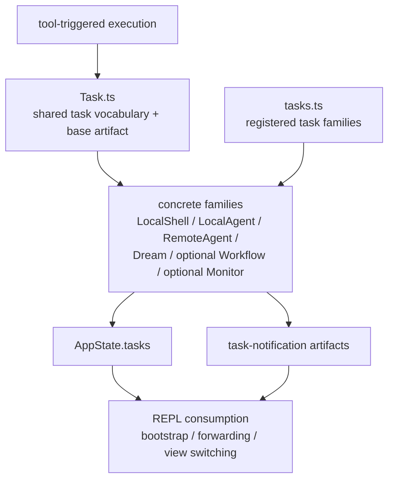

# 06. Claude Code Task 모델과 백그라운드 실행

## 장 요약

긴 실행을 하네스 안에서 다룰 때는 "실행이 시작되었다"는 사실만으로는 부족하다. 어떤 종류의 실행인지, 지금 running인지 completed인지, foreground에 붙어 있는지 background로 빠졌는지, 결과를 어디에 저장했는지, 완료 신호를 어떻게 다시 세션에 돌려줄지를 함께 추적해야 한다. 이 장은 Claude Code의 task layer를 바로 그런 long-running execution artifact 사례로 읽는다.

Claude Code에서 task는 shell process의 별칭이 아니다. `src/Task.ts`는 공통 상태 어휘를 만들고, `src/tasks.ts`는 실제로 등록되는 task family를 모으며, `LocalAgentTask`와 `LocalShellTask`는 서로 다른 실행을 task artifact로 구체화한다. `src/screens/REPL.tsx`는 그 artifact를 다시 transcript bootstrap과 notification forwarding에 사용한다. 따라서 이 장의 핵심은 "tool이 실행을 만든다"보다 "긴 실행이 어떻게 task artifact로 승격되는가"에 있다.

## 왜 long-running execution에 artifact가 필요한가

Anthropic의 [Harness design for long-running application development](https://www.anthropic.com/engineering/harness-design-long-running-apps) (2026-03-24)는 장기 실행 코딩에서 structured artifacts로 context를 handoff하고, 실행 단위를 더 tractable하게 나누는 것이 중요하다고 설명한다. 이 글은 Claude Code의 `src/Task.ts`를 직접 증명하지는 않지만, 왜 긴 실행을 추적 가능한 artifact로 만들어야 하는지에 대한 배경을 준다.

Pan et al.의 [Natural-Language Agent Harnesses](https://arxiv.org/abs/2603.25723) (submitted 2026-03-26)는 harness behavior를 explicit artifact와 runtime structure로 읽자고 제안한다. 이 장은 task를 바로 그런 artifact로 읽는다. 즉, task는 background process의 UI 장식이 아니라, 세션이 긴 실행을 표상하는 기본 단위다.

## 이 장의 근거와 범위

이 장의 관찰은 2026-04-02 기준 현재 공개 사본의 다음 대표 발췌 출처에 한정한다.

- `src/Task.ts`
- `src/tasks.ts`
- `tasks/`
- `src/screens/REPL.tsx`

외부 프레이밍에는 다음 자료를 사용한다.

- Anthropic, [Harness design for long-running application development](https://www.anthropic.com/engineering/harness-design-long-running-apps), 2026-03-24
- Pan et al., [Natural-Language Agent Harnesses](https://arxiv.org/abs/2603.25723), submitted 2026-03-26

Sources / evidence notes:
이 장의 reader-facing 외부 검증 축은 [../00-front-matter/03-references.md](../00-front-matter/03-references.md)의 Part 5 cluster를 따른다. task artifact, background execution, retention, completion signaling 설명에는 `S6`, `S8`, `S26`, `S27`을 우선 사용하고, `P1`은 task artifact 비교의 보조 프레임으로만 사용한다.

이 장은 다음을 다룬다.

- `src/Task.ts`의 공통 상태 어휘와 base artifact
- `src/tasks.ts`의 실제 registry membership
- `LocalAgentTask`와 `LocalShellTask`의 foreground/background, retention, completion signaling
- `src/screens/REPL.tsx`가 task artifact를 transcript bootstrap과 notification forwarding에 어떻게 쓰는지

각 tool이 task를 만들어내는 경로 전체, remote transport 세부, background session 전체 모델은 이 장의 범위를 벗어난다.

## task layer를 읽는 다섯 가지 구분

| 구분 | 이 장에서의 의미 |
| --- | --- |
| shared task vocabulary | 모든 task family가 공유하는 상태 어휘 |
| registry membership | 현재 세션에서 실제로 등록되는 task family |
| family-specific state | 각 task family가 추가로 갖는 상태 |
| notification artifact | 상태 변화가 다시 세션으로 돌아오는 형식 |
| REPL consumption | REPL이 task artifact를 실제로 읽고 쓰는 방식 |

이 다섯 구분을 분리해 읽으면, `src/Task.ts`의 넓은 type vocabulary와 `src/tasks.ts`의 실제 registry를 혼동하지 않게 된다.

## task artifact topology



이 그림의 요점은 task가 단순 background job이 아니라, 공통 vocabulary와 concrete family 구현, 세션 상태, notification artifact, REPL 소비 경로를 함께 가진 중간 모델이라는 점이다.

## `src/Task.ts`는 무엇을 공통으로 정의하는가

`src/Task.ts`는 먼저 공통 task type vocabulary와 status vocabulary를 정의한다.

```ts
export type TaskType =
  | 'local_bash'
  | 'local_agent'
  | 'remote_agent'
  | 'in_process_teammate'
  | 'local_workflow'
  | 'monitor_mcp'
  | 'dream'
```

```ts
export type TaskStatus =
  | 'pending'
  | 'running'
  | 'completed'
  | 'failed'
  | 'killed'

export function isTerminalTaskStatus(status: TaskStatus): boolean {
  return status === 'completed' || status === 'failed' || status === 'killed'
}
```

그리고 공통 base artifact를 만든다.

```ts
export type TaskStateBase = {
  id: string
  type: TaskType
  status: TaskStatus
  description: string
  toolUseId?: string
  startTime: number
  endTime?: number
  totalPausedMs?: number
  outputFile: string
  outputOffset: number
  notified: boolean
}
```

```ts
export function createTaskStateBase(
  id: string,
  type: TaskType,
  description: string,
  toolUseId?: string,
): TaskStateBase {
  return {
    id,
    type,
    status: 'pending',
    description,
    toolUseId,
    startTime: Date.now(),
    outputFile: getTaskOutputPath(id),
    outputOffset: 0,
    notified: false,
  }
}
```

이 base artifact가 보여주는 것은 명확하다. task는 단순히 "실행 중인가"만 기록하지 않는다. 결과가 저장될 output file, notification dedupe를 위한 `notified`, pause 누적 시간 같은 정보까지 공통 구조 안에 들어간다. 즉, task는 background process handle보다 더 풍부한 실행 artifact다.

## task type vocabulary와 registry membership은 다르다

여기서 중요한 구분이 하나 있다. `TaskType` vocabulary는 넓지만, 실제 registry membership은 더 좁다.

```ts
export function getAllTasks(): Task[] {
  const tasks: Task[] = [
    LocalShellTask,
    LocalAgentTask,
    RemoteAgentTask,
    DreamTask,
  ]
  if (LocalWorkflowTask) tasks.push(LocalWorkflowTask)
  if (MonitorMcpTask) tasks.push(MonitorMcpTask)
  return tasks
}
```

즉, `in_process_teammate` 같은 type 이름이 `src/Task.ts`의 vocabulary에 들어 있다고 해서, `src/tasks.ts`가 현재 그 family를 registry로 직접 노출한다는 뜻은 아니다. 이 장에서 실제 registry membership으로 직접 확인되는 것은 `LocalShellTask`, `LocalAgentTask`, `RemoteAgentTask`, `DreamTask`, 그리고 build-time feature gate가 열릴 때만 들어오는 workflow/monitor 계열이다.

이 구분을 명시해 두면 task layer를 더 정확하게 읽을 수 있다. `src/Task.ts`는 공통 언어를 넓게 잡고, `src/tasks.ts`는 현재 빌드와 feature gate가 허용한 family만 registry에 올린다.

## family-specific state는 어떻게 달라지는가

`LocalAgentTask`는 foreground/background, retention, disk bootstrap을 더 풍부하게 가진다.

```ts
export type LocalAgentTaskState = TaskStateBase & {
  ...
  isBackgrounded: boolean;
  pendingMessages: string[];
  retain: boolean;
  diskLoaded: boolean;
  evictAfter?: number;
};
```

그리고 foreground agent를 별도 API로 등록한다.

```ts
export function registerAgentForeground({
  agentId,
  description,
  prompt,
  selectedAgent,
  setAppState,
  autoBackgroundMs,
  toolUseId
}): {
  taskId: string;
  backgroundSignal: Promise<void>;
  cancelAutoBackground?: () => void;
} {
```

```ts
const taskState: LocalAgentTaskState = {
  ...createTaskStateBase(agentId, 'local_agent', description, toolUseId),
  type: 'local_agent',
  status: 'running',
  ...
  isBackgrounded: false,
  pendingMessages: [],
  retain: false,
  diskLoaded: false
};
```

여기서 agent task는 retain, diskLoaded, pendingMessages 같은 artifact-oriented state를 추가로 가진다. 반면 `LocalShellTask`는 조금 다른 쪽으로 특화된다.

```ts
function backgroundTask(taskId: string, getAppState: () => AppState, setAppState: SetAppState): boolean {
  ...
  if (!shellCommand.background(taskId)) {
    return false;
  }
  setAppState(prev => {
    ...
    [taskId]: {
      ...prevTask,
      isBackgrounded: true
    }
```

```ts
updateTaskState<LocalShellTaskState>(taskId, setAppState, t => {
  ...
  return {
    ...t,
    status: result.code === 0 ? 'completed' : 'failed',
    result: {
      code: result.code,
      interrupted: result.interrupted
    },
    shellCommand: null,
    unregisterCleanup: undefined,
    endTime: Date.now()
  };
});
...
void evictTaskOutput(taskId);
```

즉, shell task는 command result와 output eviction에 더 직접적으로 붙어 있고, agent task는 retain/disk bootstrap/pending message 같은 장기 상호작용 상태를 더 많이 가진다. 두 family 모두 같은 `TaskStateBase`를 공유하지만, family-specific state는 다르다.

## notification artifact는 어떻게 다시 세션으로 돌아오는가

task artifact의 핵심은 상태만 바꾸고 끝나지 않는다는 점이다. `LocalAgentTask`는 completion/failure/kill을 XML-like notification으로 다시 만든다.

```ts
const summary = status === 'completed'
  ? `Agent "${description}" completed`
  : status === 'failed'
    ? `Agent "${description}" failed: ${error || 'Unknown error'}`
    : `Agent "${description}" was stopped`;
...
const message = `<${TASK_NOTIFICATION_TAG}>
<${TASK_ID_TAG}>${taskId}</${TASK_ID_TAG}>${toolUseIdLine}
<${OUTPUT_FILE_TAG}>${outputPath}</${OUTPUT_FILE_TAG}>
<${STATUS_TAG}>${status}</${STATUS_TAG}>
<${SUMMARY_TAG}>${summary}</${SUMMARY_TAG}>...`
enqueuePendingNotification({
  value: message,
  mode: 'task-notification'
})
```

`LocalShellTask`도 같은 형태로 다시 세션에 신호를 남긴다.

```ts
const message = `<${TASK_NOTIFICATION_TAG}>
<${TASK_ID_TAG}>${taskId}</${TASK_ID_TAG}>${toolUseIdLine}
<${OUTPUT_FILE_TAG}>${outputPath}</${OUTPUT_FILE_TAG}>
<${STATUS_TAG}>${status}</${STATUS_TAG}>
<${SUMMARY_TAG}>${escapeXml(summary)}</${SUMMARY_TAG}>
</${TASK_NOTIFICATION_TAG}>`;
enqueuePendingNotification({
  value: message,
  mode: 'task-notification',
```

이 구조는 notification이 단순 UI toast가 아니라는 점을 보여준다. task completion은 summary와 output path를 포함한 structured artifact로 다시 message queue에 들어간다. 이게 REPL과 다른 runtime path에서 다시 소비될 수 있게 만든다.

따라서 cancellation과 orphan semantics도 artifact 관점으로 읽어야 한다. 어떤 task가 foreground owner를 잃었을 때 언제 background로 남고, 언제 kill 또는 eviction 후보가 되며, 그 사실이 어떤 artifact로 남는지가 명확해야 long-running execution을 다시 판단할 수 있다.

## 대표 시나리오: tool 실행이 task artifact로 바뀌어 REPL로 되돌아오는 흐름

앞 절까지의 taxonomy를 실제 동작으로 묶으면 다음과 같다.

1. 어떤 tool 또는 local action이 긴 실행을 시작한다.
2. `src/Task.ts`의 공통 vocabulary 위에서 concrete family state가 생성된다.
3. `src/tasks.ts`가 현재 build와 feature gate 아래 허용된 family를 registry에 올린다.
4. 실행이 끝나거나 상태가 바뀌면 `task-notification` artifact가 queue로 들어간다.
5. `src/screens/REPL.tsx`는 그 artifact를 받아 transcript bootstrap, view switching, notification forwarding에 다시 쓴다.

이 흐름은 `task`가 background job의 이름표가 아니라는 점을 가장 잘 보여 준다. 긴 실행은 task가 되는 순간부터 이미 세션 안에서 읽히고, 완료되면 다시 세션 artifact로 돌아온다.

실무적으로는 이렇게 이해하는 편이 가장 빠르다. `LocalShellTask`는 shell result와 output eviction 쪽이 강하고, `LocalAgentTask`는 retain, pending message, disk bootstrap 쪽이 강하다. 하지만 두 경우 모두 공통점은 같다. 실행이 길어지는 순간 Claude Code는 그것을 "잊어도 되는 process"로 두지 않고, 다시 세션으로 귀환할 수 있는 artifact로 승격시킨다.

## REPL은 task artifact를 어떻게 소비하는가

`src/screens/REPL.tsx`는 task를 단순 badge나 카운터로만 읽지 않는다. 먼저 retained local agent transcript를 bootstrap한다.

```ts
const viewedLocalAgent = viewingAgentTaskId ? tasks[viewingAgentTaskId] : undefined;
const needsBootstrap = isLocalAgentTask(viewedLocalAgent) && viewedLocalAgent.retain && !viewedLocalAgent.diskLoaded;
...
const live = t.messages ?? [];
const liveUuids = new Set(live.map(m => m.uuid));
const diskOnly = result ? result.messages.filter(m => !liveUuids.has(m.uuid)) : [];
...
messages: [...diskOnly, ...live],
diskLoaded: true
```

이건 REPL이 task artifact를 transcript view의 source로 직접 쓴다는 뜻이다. task state는 UI에 표시되는 summary가 아니라, 실제 viewed transcript의 데이터 원천이 된다.

또 background session 전환 시 task-notification queue를 직접 다룬다.

```ts
// Aborting subagents may produce task-completed notifications.
// Clear task notifications so the queue processor doesn't immediately
// start a new foreground query; forward them to the background session.
const removedNotifications = removeByFilter(cmd => cmd.mode === 'task-notification');
...
const notificationAttachments = await getQueuedCommandAttachments(removedNotifications).catch(() => []);
const notificationMessages = notificationAttachments.map(createAttachmentMessage);
```

이 절단면은 task notification이 REPL 바깥 부속 신호가 아니라, shell이 직접 forwarding하고 중복을 피해야 하는 artifact라는 점을 보여 준다. 따라서 task layer와 UI layer는 느슨하게 연결된 것이 아니라, 실제 runtime 흐름을 공유한다.

## long-running execution 사례로서의 Claude Code

이 장의 로컬 코드만 놓고 보면 Claude Code의 task layer는 다섯 기능으로 정리할 수 있다.

1. shared task vocabulary  
   `src/Task.ts`가 상태 언어와 공통 artifact shape를 만든다.
2. registry membership  
   `src/tasks.ts`가 현재 runtime에 실제로 등록되는 family를 제한한다.
3. family-specific behavior  
   `LocalAgentTask`와 `LocalShellTask`가 foreground/background, retain, output eviction을 각기 다르게 구현한다.
4. notification artifact  
   완료/실패/중단을 `task-notification` 형식으로 다시 세션에 주입한다.
5. REPL consumption  
   REPL은 task artifact를 transcript bootstrap과 notification forwarding에 직접 사용한다.

이렇게 읽으면 task는 tool과 UI 사이의 부속 레이어가 아니라, long-running execution을 세션 안에서 살아 있게 만드는 중간 artifact model에 가깝다.

여기에 scheduler/orphan/cancel semantics를 더하면 문서가 완성된다. 어떤 family는 자동 backgrounding을 하고, 어떤 family는 stall detection 뒤에 human intervention을 요구하며, 어떤 family는 remote identity만 남긴 채 poll loop로 전환된다. 이 차이를 task artifact와 연결해 적어야 long-running execution이 "계속 돌고 있다"는 말의 의미가 분명해진다.

## 점검 질문

- 이 긴 실행은 단순 tool result인가, 아니면 task artifact로 승격돼야 하는가?
- task type vocabulary와 실제 registry membership을 구분하고 있는가?
- foreground/background 전환은 family마다 같은 방식으로 구현되는가?
- 완료 신호는 단순 문자열인가, 아니면 output path와 status를 담은 artifact인가?
- REPL은 task를 표시만 하는가, 아니면 transcript/view/forwarding 경로에서 실제로 소비하는가?
- orphan cleanup과 cancellation이 어떤 artifact로 남는가?

## 마무리

이 장의 결론은 다음과 같다. Claude Code의 task layer는 긴 실행을 추적 가능한 세션 artifact로 바꾸는 구조다. `src/Task.ts`는 공통 상태 언어를 만들고, `src/tasks.ts`는 실제 registry membership을 정하며, `LocalAgentTask`와 `LocalShellTask`는 각기 다른 family-specific behavior와 notification artifact를 구현하고, `src/screens/REPL.tsx`는 그 artifact를 transcript bootstrap과 notification forwarding에 직접 사용한다. 따라서 task는 background job의 UI 표시보다 더 넓은 개념이며, long-running execution을 세션 안에서 지속 가능한 객체로 만드는 핵심 모델로 읽는 편이 맞다.

## 대표 근거 읽기 순서

아래 라벨은 독자가 별도 source를 열어야 한다는 뜻이 아니라, 이 장에서 이미 인용하고 설명한 코드 발췌가 어떤 구현 단면을 대표하는지 다시 묶어 주는 provenance 메모다.

1. `src/Task.ts`
   공통 task vocabulary와 artifact shape를 먼저 본다.
2. `src/tasks.ts`
   현재 runtime이 어떤 task family를 실제로 등록하는지 본다.
3. `src/tasks/LocalAgentTask/LocalAgentTask.tsx`
   retain, local transcript, foreground/background 전환이 어떻게 구현되는지 본다.
4. `src/tasks/LocalShellTask/LocalShellTask.tsx`
   shell task가 agent task와 어떻게 다르게 artifact를 다루는지 비교한다.
5. `src/screens/REPL.tsx`
   task artifact가 transcript bootstrap과 notification forwarding에서 실제로 어떻게 소비되는지 확인한다.
