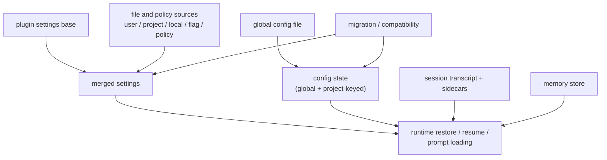

# 07. Claude Code 영속 상태, 설정, 마이그레이션

## 장 요약

장기 실행형 harness의 persistence를 읽을 때는 먼저 한 가지 오해를 버리는 편이 좋다. 디스크에 남는다고 해서 모두 같은 종류의 데이터가 아니다. 이 장은 그 문제를 Claude Code 사례에 적용한다. 이 코드베이스에서 durable artifact는 적어도 네 가족으로 나뉜다. source-merge되는 settings, global config file 안에 keyed state로 저장되는 config, resume를 위한 session transcript와 sidecar metadata, 그리고 future conversation을 위한 memory store다. 여기에 더해, 저장 계약이 바뀔 때 과거 데이터를 새 위치로 옮기는 compatibility layer로서 migration이 붙는다.

이 장의 핵심은 바로 이 구분이다. `src/utils/settings/settings.ts`는 규칙을 합치고, `src/utils/config.ts`는 현재 상태를 저장하며, `src/utils/sessionStorage.ts`는 transcript artifact를 남기고, `memdir/`는 장기 기억용 file-based store를 만든다. `migrations/`는 이 네 artifact family가 시간이 지나며 구조를 바꿀 때 그 차이를 완충한다. 따라서 이 장은 "어디에 저장되는가"보다 "무엇을 위해 남기는가"를 중심으로 persistence를 읽는다.

## 왜 durable artifact family를 나눠 읽어야 하는가

Anthropic의 [Effective context engineering for AI agents](https://www.anthropic.com/engineering/effective-context-engineering-for-ai-agents) (2025-09-29)는 context engineering이 단순 prompt 작성이 아니라, 어떤 정보가 언제 context에 들어가고 어떤 정보가 runtime 밖의 artifact로 남아야 하는지까지 포함한다고 설명한다. persistence는 이 관점에서 저장 그 자체보다 future retrieval과 reuse를 위한 구조다.

Anthropic의 [Harness design for long-running application development](https://www.anthropic.com/engineering/harness-design-long-running-apps) (2026-03-24)는 장기 실행 하네스에서 structured artifact로 session 사이를 handoff해야 한다고 설명한다. 이 글이 Claude Code의 각 파일을 직접 증명하지는 않지만, 왜 transcript, memory, config 같은 durable artifact를 구분해서 읽어야 하는지에 대한 배경을 준다.

## 이 장의 근거와 범위

이 장의 관찰은 2026-04-02 기준 현재 공개 사본의 다음 대표 발췌 출처에 한정한다.

- `src/utils/settings/settings.ts`
- `src/utils/config.ts`
- `src/utils/sessionStorage.ts`
- `memdir/`
- `migrations/`

외부 프레이밍에는 다음 자료를 사용한다.

- Anthropic, [Effective context engineering for AI agents](https://www.anthropic.com/engineering/effective-context-engineering-for-ai-agents), 2025-09-29
- Anthropic, [Harness design for long-running application development](https://www.anthropic.com/engineering/harness-design-long-running-apps), 2026-03-24

이 장은 다음을 다룬다.

- settings의 source merge와 precedence
- config가 저장하는 현재 상태
- session transcript와 sidecar metadata
- memory store의 enablement와 prompt-level recall 구조
- persistence-relevant migration 예시

startup UI, query orchestration, remote transport 세부는 이 장의 범위를 벗어난다.

## persistence를 읽는 네 가지 artifact family와 하나의 compatibility layer

| 구분 | 이 장에서의 의미 |
| --- | --- |
| merged settings | 여러 source를 합쳐 규칙을 만드는 artifact family |
| config state | 사용자/프로젝트의 현재 상태를 저장하는 artifact family |
| session transcript artifact | resume와 세션 복원을 위한 구조화된 기록 |
| memory store | future conversation을 위한 file-based knowledge store |
| migration/compatibility layer | 위 artifact family의 저장 계약이 바뀔 때 이를 이행하는 층 |

이 장의 나머지 부분은 이 다섯 항목을 순서대로 확인하는 방식으로 읽는 편이 가장 명확하다.

## persistence topology



이 그림의 요점은 persistence가 하나의 settings file tree가 아니라, 서로 다른 목적을 가진 artifact family들이 runtime으로 다시 들어오는 구조라는 점이다. migration은 이 family들과 같은 steady-state 저장소가 아니라, 그 사이의 계약 변경을 조정하는 compatibility layer로 그려야 한다.

## settings는 source-merge되는 규칙 artifact다

`src/utils/settings/settings.ts`는 managed file settings를 단일 파일 하나로만 보지 않는다.

```ts
/**
 * Load file-based managed settings: managed-settings.json + managed-settings.d/*.json.
 */
export function loadManagedFileSettings(): {
  settings: SettingsJson | null
  errors: ValidationError[]
} {
```

```ts
const { settings, errors: baseErrors } = parseSettingsFile(
  getManagedSettingsFilePath(),
)
...
for (const name of entries) {
  const { settings, errors: fileErrors } = parseSettingsFile(
    join(dropInDir, name),
  )
  ...
  merged = mergeWith(merged, settings, settingsMergeCustomizer)
}
```

그리고 전체 settings는 plugin base를 가장 낮은 우선순위로 깔고, source별 precedence에 따라 다시 merge된다.

```ts
function loadSettingsFromDisk(): SettingsWithErrors {
  ...
  const pluginSettings = getPluginSettingsBase()
  let mergedSettings: SettingsJson = {}
  if (pluginSettings) {
    mergedSettings = mergeWith(
      mergedSettings,
      pluginSettings,
      settingsMergeCustomizer,
    )
  }
```

```ts
for (const source of getEnabledSettingSources()) {
  if (source === 'policySettings') {
    ...
    // Priority: remote > HKLM/plist > managed-settings.json > HKCU
```

이 구조는 settings가 "사용자가 마지막으로 저장한 값"이 아니라, 여러 규칙 source를 precedence 아래 합친 merged rule artifact임을 보여 준다.

reader-facing 관점에서 이 층을 빠르게 다시 떠올릴 수 있도록 최소한의 지도를 붙이면 아래와 같다.

| source family | 이 장에서의 역할 | precedence 감각 | 혼동하기 쉬운 점 |
| --- | --- | --- | --- |
| plugin base | plugin이 깔아 두는 capability 기본값 | 가장 낮은 바닥값 | 사용자 설정과 같은 성격의 "마지막 저장값"이 아니다 |
| enabled setting sources | 사용자가 켜 둔 file-based settings source를 merge한 규칙 층 | plugin base 위를 덮는 일반 규칙 층 | source 하나마다 따로 읽기보다 merged artifact로 보는 편이 정확하다 |
| `policySettings` 계열 | managed/policy 성격의 상위 규칙 층 | editable source보다 더 강한 override 후보 | policy 내부에도 다시 세부 precedence가 있어 단일 파일처럼 읽으면 안 된다 |
| project/global config | trust, onboarding, 최근 세션 정보 같은 current state | settings precedence 바깥 | settings family가 아니라 같은 global config file 안의 keyed state다 |

따라서 settings를 설명할 때 중요한 것은 "정확히 몇 번째가 무엇을 이긴다"보다도, 먼저 이것이 `plugin base -> merged settings sources -> policy-capable override` 구조라는 점과, `config`는 그 밖의 다른 artifact family라는 점이다.

reader-facing 문서라면 여기에 최소한의 migration-oriented version table을 붙여 두는 편이 좋다.

| artifact family | 주된 역할 | drift가 날 때의 위험 | migration trigger 예시 |
| --- | --- | --- | --- |
| settings | 규칙과 precedence | policy override 충돌, source precedence 혼동 | source 추가, policy source 이동 |
| config state | 현재 상태와 최근 세션 | keyed path 충돌, stale project residue | field relocation, path-key schema 변경 |
| session transcript | resume-grade 기록 | replay 실패, restore 누락 | message schema 변경, sidecar 추가 |
| memory store | future recall 지식 | 오래된 기억 오염, enablement drift | memory prompt contract 변경 |

## config는 별도 파일이 아니라 global config file 안의 keyed state다

`src/utils/config.ts`는 성격이 다르다. `ProjectConfig`를 보면 trust, onboarding, last session metrics, worktree session, MCP approval residue처럼 "현재 상태"에 가까운 필드가 많다.

```ts
export type ProjectConfig = {
  allowedTools: string[]
  mcpContextUris: string[]
  mcpServers?: Record<string, McpServerConfig>
  lastAPIDuration?: number
  lastCost?: number
  lastSessionId?: string
  ...
  hasTrustDialogAccepted?: boolean
  hasCompletedProjectOnboarding?: boolean
  projectOnboardingSeenCount: number
  ...
  activeWorktreeSession?: {
```

중요한 점은 project config가 별도 파일에 따로 저장되지 않는다는 것이다. `saveGlobalConfig()`와 `saveCurrentProjectConfig()`는 같은 global config file을 쓴다.

```ts
export function saveGlobalConfig(
  updater: (currentConfig: GlobalConfig) => GlobalConfig,
): void {
  ...
  const didWrite = saveConfigWithLock(
    getGlobalClaudeFile(),
    createDefaultGlobalConfig,
```

```ts
export function saveCurrentProjectConfig(
  updater: (currentConfig: ProjectConfig) => ProjectConfig,
): void {
  ...
  const didWrite = saveConfigWithLock(
    getGlobalClaudeFile(),
    createDefaultGlobalConfig,
    current => {
      const currentProjectConfig =
        current.projects?.[absolutePath] ?? DEFAULT_PROJECT_CONFIG
```

```ts
const absolutePath = getProjectPathForConfig()
...
[absolutePath]: newProjectConfig,
```

즉, global config와 project config는 저장 경로가 다른 두 파일 family가 아니라, 같은 persisted global config file 안에서 project path key로 나뉘는 state다. 이 distinction을 정확히 잡아야 settings와 config의 차이도 또렷해진다.

## sessionStorage는 resume-grade transcript artifact를 남긴다

`src/utils/sessionStorage.ts`는 세션 파일 경로와 sidecar metadata를 함께 다룬다.

```ts
export function getTranscriptPath(): string {
  const projectDir = getSessionProjectDir() ?? getProjectDir(getOriginalCwd())
  return join(projectDir, `${getSessionId()}.jsonl`)
}
```

```ts
export type AgentMetadata = {
  agentType: string
  worktreePath?: string
  description?: string
}

export async function writeAgentMetadata(
  agentId: AgentId,
  metadata: AgentMetadata,
): Promise<void> {
  const path = getAgentMetadataPath(agentId)
  await mkdir(dirname(path), { recursive: true })
  await writeFile(path, JSON.stringify(metadata))
}
```

핵심은 `recordTranscript()`가 append-only dump보다 더 구조화된 기록을 남긴다는 점이다.

```ts
export async function recordTranscript(
  messages: Message[],
  ...
): Promise<UUID | null> {
  const cleanedMessages = cleanMessagesForLogging(messages, allMessages)
  const sessionId = getSessionId() as UUID
  const messageSet = await getSessionMessages(sessionId)
  ...
  if (newMessages.length > 0) {
    await getProject().insertMessageChain(
      newMessages,
      false,
      undefined,
      startingParentUuid,
      teamInfo,
    )
  }
```

즉, sessionStorage는 "메시지를 파일에 적는다"가 아니라, dedupe와 chain semantics를 유지한 transcript artifact를 만든다. resume가 단순 reopen이 아니라 artifact 재결합이라는 점은 `adoptResumedSessionFile()`에서도 보인다.

```ts
export function adoptResumedSessionFile(): void {
  const project = getProject()
  project.sessionFile = getTranscriptPath()
  project.reAppendSessionMetadata(true)
}
```

이 layer의 핵심은 "세션을 어떻게 다시 이어 붙일 것인가"다.

## memory store는 settings가 아니라 future recall을 위한 knowledge store다

`src/memdir/paths.ts`는 먼저 auto-memory enablement를 결정한다.

```ts
/**
 * Whether auto-memory features are enabled ...
 * Priority chain (first defined wins):
 *   1. CLAUDE_CODE_DISABLE_AUTO_MEMORY env var
 *   2. CLAUDE_CODE_SIMPLE (--bare) -> OFF
 *   3. CCR without persistent storage -> OFF
 *   4. autoMemoryEnabled in settings.json
 */
export function isAutoMemoryEnabled(): boolean {
```

즉, memory store는 settings에 의해 gate될 수 있지만 그 자체는 settings가 아니다. `src/memdir/memdir.ts`는 이 file-based store를 prompt loading contract와 함께 다룬다.

```ts
'## Memory and other forms of persistence',
'Memory is one of several persistence mechanisms available to you as you assist the user in a given conversation. ...',
'- When to use or update a plan instead of memory: ...',
'- When to use or update tasks instead of memory: ...',
```

```ts
export function buildMemoryPrompt(params: {
  displayName: string
  memoryDir: string
  extraGuidelines?: string[]
}): string {
```

```ts
export async function loadMemoryPrompt(): Promise<string | null> {
```

이 코드가 직접 보여 주는 것은 memory의 persistence architecture라기보다 usage contract다. memory는 future conversation에서 회수될 지식을 위한 file-based store이고, task나 plan처럼 current conversation execution을 추적하는 저장소와는 다르다고 prompt 안에서 직접 안내한다. 이 장에서는 그 정도까지만 읽는 것이 적절하다.

## migration은 별도 artifact family가 아니라 compatibility layer다

`migrations/` 전체가 persistence migration만으로 이루어져 있는 것은 아니다. 이 장은 그중 persistence contract를 바꾸는 예시만 선택한다. 대표적인 예가 MCP approval field migration이다.

```ts
/**
 * Migration: Move MCP server approval fields from project config to local settings
 * This migrates both enableAllProjectMcpServers and enabledMcpjsonServers to the
 * settings system for better management and consistency.
 */
export function migrateEnableAllProjectMcpServersToSettings(): void {
```

```ts
const projectConfig = getCurrentProjectConfig()
...
const existingSettings = getSettingsForSource('localSettings') || {}
...
updateSettingsForSource('localSettings', updates)
...
saveCurrentProjectConfig(current => {
  const {
    enableAllProjectMcpServers: _enableAll,
    enabledMcpjsonServers: _enabledServers,
    disabledMcpjsonServers: _disabledServers,
    ...configWithoutFields
  } = current
  return configWithoutFields
})
```

이 migration은 하나의 값을 다른 곳에 복사하는 수준이 아니다. project-keyed config state에 있던 필드를 local settings로 옮기고, 성공하면 원래 위치에서는 제거한다. 즉, migration은 다섯 번째 durable artifact family가 아니라, 앞의 artifact family 사이 계약이 바뀔 때 이를 조정하는 compatibility layer다.

이 점은 backward compatibility risk를 문서에 노출해야 한다는 뜻이기도 하다. settings precedence가 바뀌거나 config field가 다른 family로 이동하면, 제품은 계속 동작해도 독자의 mental model과 운영 스크립트는 쉽게 drift한다.

## Claude Code의 persistence를 어떻게 읽어야 하는가

이 장의 로컬 코드만 놓고 보면 Claude Code의 persistence architecture는 네 가지 durable artifact family와 하나의 compatibility layer로 정리할 수 있다.

1. merged settings  
   여러 source를 합쳐 규칙을 만드는 artifact family
2. config state  
   같은 global config file 안에 keyed state로 저장되는 artifact family
3. session transcript artifact  
   resume와 sidecar metadata를 위해 구조화된 기록을 남기는 artifact family
4. memory store  
   future conversation을 위한 file-based knowledge store
5. migration/compatibility layer  
   위 artifact family의 위치와 의미가 바뀔 때 이를 이행하는 층

이렇게 읽으면 "persistent data"가 곧 "settings"가 아니라는 점이 분명해진다.

## 점검 질문

- 이 값은 규칙을 합치기 위한 것인가, 현재 상태를 저장하기 위한 것인가, future recall을 위한 것인가?
- global config와 project config는 정말 별도 파일인가, 아니면 같은 persisted file 안의 다른 keyed state인가?
- transcript artifact는 append-only 로그인가, 아니면 resume를 위한 구조화된 기록인가?
- memory store가 task나 plan과 같은 종류의 persistence라는 인상을 주고 있지는 않은가?
- migration이 없을 때 예전 위치의 데이터가 현재 코드와 어떻게 충돌할 수 있는가?
- settings precedence가 바뀌었을 때 어떤 artifact family가 영향을 받는가?
- migration trigger와 backward compatibility risk가 문서에 남는가?

## 마무리

이 장의 결론은 다음과 같다. Claude Code의 persistence는 하나의 설정 파일 계층으로 설명되지 않는다. `src/utils/settings/settings.ts`는 규칙을 merge하고, `src/utils/config.ts`는 같은 global config file 안에 keyed state를 저장하며, `src/utils/sessionStorage.ts`는 resume-grade transcript artifact를 유지하고, `memdir/`는 future conversation을 위한 memory store를 만든다. `migrations/`는 이 네 artifact family 사이의 저장 계약이 바뀔 때 이를 이어 주는 compatibility layer다. 따라서 이 계층을 읽을 때는 "어디에 저장되는가"보다 "무엇을 위해 남기는가"를 먼저 봐야 한다.

## Review scaffold

- settings, config, transcript, memory를 같은 "persistent state"로 뭉개고 있지 않은지 먼저 점검하라.
- precedence 변경과 field relocation이 어떤 migration trigger를 만들었는지 적어 보라.
- backward compatibility risk가 없는 migration은 거의 없으므로, risk를 적지 않은 문서는 대개 설명이 덜 된 문서다.

## 대표 근거 읽기 순서

아래 라벨은 독자가 별도 source를 열어야 한다는 뜻이 아니라, 이 장에서 이미 인용하고 설명한 코드 발췌가 어떤 구현 단면을 대표하는지 다시 묶어 주는 provenance 메모다.

1. `src/utils/settings/settings.ts`
   merged settings가 어떤 source를 합치는지 본다.
2. `src/utils/config.ts`
   keyed config state가 같은 persisted file 안에서 어떻게 관리되는지 확인한다.
3. `src/utils/sessionStorage.ts`
   resume-grade transcript artifact가 어떤 구조로 남는지 본다.
4. `memdir/`
   future conversation을 위한 memory store를 settings와 분리해 본다.
5. `migrations/`
   저장 계약이 바뀔 때 compatibility layer가 어떻게 개입하는지 확인한다.
