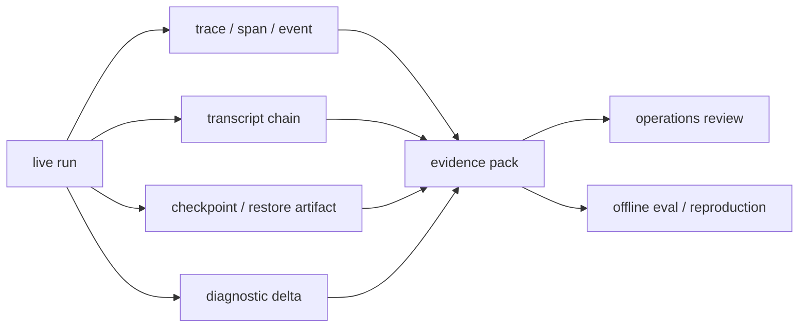

# 08. observability, traces, and run artifacts

> Why this chapter exists: transcript, trace, checkpoint, diagnostic, evidence pack을 같은 것으로 설명하면 운영과 평가가 함께 무너진다는 점을 고정한다.
> Reader level: advanced / reviewer
> Last verified: 2026-04-06
> Freshness class: volatile

## Core claim

운영형 하네스에서는 transcript 하나만 남겨서는 부족하다. trace/span/event, checkpoint, diagnostic summary, masking policy, replay artifact까지 함께 남아야 운영자가 run을 재구성하고, evaluator가 artifact를 다시 채점하고, 설계자가 어디가 병목인지 분해할 수 있다.

## What this chapter is not claiming

- 모든 하네스가 동일한 telemetry stack을 가져야 한다는 주장
- transcript를 버리고 tracing만 남기면 된다는 주장
- observability가 법적 compliance 문서를 대체한다는 주장

## Mental model / diagram

이 그림의 핵심은 artifact마다 용도가 다르다는 점이다. transcript는 sequence를, trace는 timing과 causal topology를, checkpoint는 recovery를, diagnostic delta는 failure shape를, evidence pack은 reproducibility를 담당한다.

## 범위와 비범위

이 장이 다루는 것:

- transcript, trace, checkpoint, run artifact의 차이
- observability와 replayability를 함께 설계해야 하는 이유
- trace privacy와 masking/redaction이 왜 observability 설계의 일부인지
- evidence pack이 operations와 eval을 동시에 떠받치는 방식

이 장이 다루지 않는 것:

- vendor-specific telemetry backend 전체
- 조직별 retention policy와 법무 운영 세부
- application analytics dashboard UX

## 자료와 독서 기준

대표 공식 자료:

- Anthropic, [Effective harnesses for long-running agents](https://www.anthropic.com/engineering/effective-harnesses-for-long-running-agents), verified 2026-04-06
- Anthropic, [Harness design for long-running application development](https://www.anthropic.com/engineering/harness-design-long-running-apps), verified 2026-04-06
- OpenAI, [Tracing](https://openai.github.io/openai-agents-python/tracing/), verified 2026-04-06
- LangGraph, [Persistence](https://docs.langchain.com/oss/python/langgraph/persistence), verified 2026-04-06
- LangGraph, [Interrupts](https://docs.langchain.com/oss/python/langgraph/interrupts), verified 2026-04-06
- LangGraph, [Observability](https://docs.langchain.com/oss/python/langgraph/observability), verified 2026-04-06
- LangSmith, [Prevent logging of sensitive data in traces](https://docs.langchain.com/langsmith/mask-inputs-outputs), verified 2026-04-06
- OpenTelemetry, [Semantic conventions for generative AI systems](https://opentelemetry.io/docs/specs/semconv/gen-ai/), verified 2026-04-06

로컬 근거:

- `src/hooks/useLogMessages.ts`
- `src/utils/sessionStorage.ts`
- `src/QueryEngine.ts`
- `src/utils/telemetry/sessionTracing.ts`
- `src/services/diagnosticTracking.ts`
- `src/services/toolUseSummary/toolUseSummaryGenerator.ts`

## transcript는 sequence artifact다

Anthropic의 long-running harness 글은 clean state와 progress artifact를 강조한다. local code를 보면 Claude Code는 transcript chain을 incremental하게 기록하고, compaction과 resume 이후에도 다시 읽을 수 있게 남긴다. transcript는 "무슨 순서로 일이 벌어졌는가"를 가장 충실하게 보여 주는 artifact다.

하지만 transcript만으로는 다음을 알기 어렵다.

- 어디서 느려졌는가
- 어떤 tool call이 blocked on user였는가
- 어떤 recovery point에서 다시 붙었는가

즉 transcript는 필요하지만 충분하지 않다.

## trace는 timing topology를 준다

OpenAI tracing 문서와 OpenTelemetry GenAI semantic conventions는 interaction, agent span, tool span, model request span 같은 trace vocabulary가 필요하다고 설명한다. 이 vocabulary가 있어야 transcript가 말해 주지 못하는 timing topology를 분해할 수 있다.

권고: transcript가 sequence artifact라면 trace는 topology artifact로 설명하라.

- transcript는 사건의 순서를 준다.
- trace는 사건의 parent/child 구조와 duration을 준다.
- 둘을 같이 남겨야 slow run과 wrong run을 구분할 수 있다.

## checkpoint와 restore artifact는 observability의 일부다

LangGraph persistence와 interrupts 문서는 long-running graph에서 checkpoint와 resume point를 first-class artifact로 다룬다. 이 관점은 coding harness에도 그대로 유효하다. run을 다시 붙잡을 수 없다면, production incident를 replay하거나 evaluator에게 동일한 artifact bundle을 넘길 수 없다.

따라서 checkpoint는 단순 state management가 아니라 observability의 일부다.

- 무엇을 저장했는가
- 무엇을 저장하지 않았는가
- 어떤 restore path를 통해 다시 live state로 돌아오는가

이 세 질문이 answerable해야 한다.

## masking과 redaction은 observability 후처리가 아니라 설계 조건이다

LangSmith의 masking 문서는 trace privacy를 나중에 대충 지우는 후처리 문제로 다루지 않는다. 설계 시점에 어떤 field를 남길지, 어떤 input/output을 마스킹할지, 어떤 surface는 아예 수집하지 않을지를 먼저 결정해야 한다고 본다.

이 점이 중요한 이유는 observability와 privacy가 같은 layer에서 충돌하기 때문이다.

- trace를 많이 남길수록 디버깅은 쉬워진다.
- 민감한 tool input/output을 많이 남길수록 privacy risk는 커진다.

좋은 harness 문서는 이 trade-off를 explicit하게 적어야 한다.

## evidence pack은 operations와 eval을 잇는 최소 bundle이다

production trace 장과 eval 장이 서로 멀리 떨어져 있으면, 운영 artifact와 채점 artifact가 다른 세계처럼 읽힌다. 하지만 실제로는 둘이 많이 겹친다. 최소 evidence pack은 대개 아래처럼 생긴다.

- transcript chain
- trace/span/event
- checkpoint or restore metadata
- diagnostics summary
- cost and usage summary
- config or policy snapshot

이 bundle이 있어야 disagreement case를 다시 보고, evaluator misjudgment를 분석하고, flaky dependency와 infrastructure noise를 분리할 수 있다.

## Design implications

- transcript, trace, checkpoint, diagnostics를 하나의 표에서 구분해 설명하라.
- observability chapter는 privacy/masking 규칙을 반드시 포함하라.
- operations artifact와 eval artifact의 겹침을 문서 구조에서 명시하라.
- summary label과 grader를 같은 것으로 설명하지 말고, triage layer와 judgment layer를 나눠라.

## What to measure

- trace coverage per run
- replayable run ratio
- checkpoint restore success rate
- masked field ratio
- time-to-diagnose after failure

## Failure signatures

- run은 실패했는데 transcript만 보고는 병목 지점을 설명할 수 없다.
- trace는 많지만 replay artifact가 없어 재현할 수 없다.
- privacy 때문에 중요한 field를 전부 지워 원인 분석이 불가능하다.
- summary label은 남았는데 원 transcript나 trace를 찾을 수 없다.

## Review questions

1. transcript와 trace를 서로 다른 artifact로 설명하고 있는가.
2. checkpoint와 restore metadata가 observability의 일부로 취급되는가.
3. masking/redaction이 장의 부록이 아니라 본문 설계 문제로 들어가 있는가.
4. evidence pack이 operations와 eval을 함께 지탱하는 최소 bundle로 설명되는가.

## Sources / evidence notes

- Anthropic의 long-running harness 문서는 clean state와 durable artifact를 운영 구조의 일부로 설명한다.
- OpenAI tracing과 OTel semconv는 trace vocabulary와 span topology의 비교 기준을 제공한다.
- LangGraph persistence/interrupts는 checkpoint와 resume artifact의 비교 모델을 제공한다.
- LangGraph observability와 LangSmith masking 문서는 trace privacy를 observability 설계와 함께 읽게 만든다.
