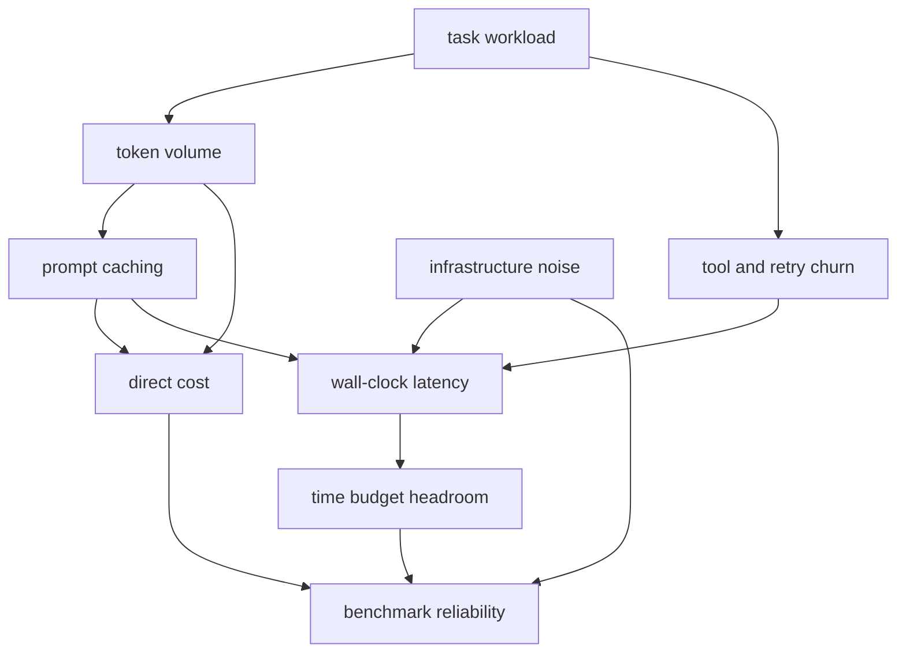

# 09. cost, latency, headroom, and prompt caching

> Why this chapter exists: 장기 실행형 하네스는 정답률만으로 설명되지 않고, 비용과 지연, cache hit, retry churn, infrastructure noise에 의해 실제 가치가 크게 달라진다는 점을 고정한다.
> Reader level: advanced / reviewer
> Last verified: 2026-04-06
> Freshness class: volatile

## Core claim

좋은 long-running harness는 단순히 더 맞는 답을 내는 시스템이 아니다. cost budget, wall-clock latency, prompt caching, headroom, infrastructure noise를 함께 관리하는 시스템이다. 이 축이 빠지면 benchmark 결과도, production 운영도, optimization 우선순위도 왜곡된다.

## What this chapter is not claiming

- 가장 싼 시스템이 가장 좋은 시스템이라는 주장
- prompt caching 하나로 economics 문제가 해결된다는 주장
- infrastructure noise가 품질 문제를 전부 설명한다는 주장

## Mental model / diagram

이 그림의 요점은 cost와 latency가 분리된 축이 아니라는 점이다. cache hit는 둘 다 바꾸고, retry churn은 둘 다 늘리고, infrastructure noise는 latency와 benchmark reliability를 동시에 흔든다.

## 범위와 비범위

이 장이 다루는 것:

- token cost, wall-clock latency, cache hit, retry churn
- headroom과 budget cap이 benchmark와 production에 미치는 영향
- prompt caching과 infrastructure noise를 harness quality 문제와 함께 읽는 법

이 장이 다루지 않는 것:

- vendor pricing table 전체
- 조직의 billing policy
- low-level infra tuning과 deployment capacity planning 전부

## 자료와 독서 기준

대표 공식 자료:

- Anthropic, [Effective harnesses for long-running agents](https://www.anthropic.com/engineering/effective-harnesses-for-long-running-agents), verified 2026-04-06
- Anthropic, [Harness design for long-running application development](https://www.anthropic.com/engineering/harness-design-long-running-apps), verified 2026-04-06
- Anthropic, [Quantifying infrastructure noise in agentic coding evals](https://www.anthropic.com/engineering/infrastructure-noise), verified 2026-04-06
- Anthropic, [Prompt caching](https://docs.anthropic.com/en/docs/build-with-claude/prompt-caching), verified 2026-04-06

로컬 근거:

- `src/cost-tracker.ts`
- `src/services/api/logging.ts`
- `src/QueryEngine.ts`

## 정답률만 보는 benchmark는 harness benchmark로 충분하지 않다

Anthropic의 long-running harness 글과 application harness 글은 모두 scaffolding, handoff, evaluator structure가 성능에 큰 영향을 준다고 말한다. infrastructure noise 글은 여기에 한 층을 더 얹는다. benchmark score는 model/harness 품질뿐 아니라 flaky dependency, external service jitter, queue delay, measurement variance의 영향도 받는다.

따라서 harness benchmark는 다음을 함께 봐야 한다.

- task success
- time budget
- cost budget
- retry count
- dependency noise

## prompt caching은 context economics의 핵심 기어다

Anthropic의 prompt caching 문서는 prefix reuse가 token cost와 latency를 동시에 줄일 수 있다고 설명한다. long-running harness에서 이 점이 중요한 이유는 context assembly가 길고 반복적이기 때문이다.

cache를 설계할 때는 다음 질문을 같이 던져야 한다.

- 어떤 prefix가 세션 간에 안정적인가
- compaction이나 tool summary가 cache hit를 해치지 않는가
- cache miss가 latency spike를 만드는가

권고: caching은 optimization detail이 아니라 context engineering 장과 cost 장을 잇는 설계 축으로 적어라.

## headroom은 운영형 harness의 안전 마진이다

headroom은 단순 여유 시간이 아니다. remaining token budget, remaining wall-clock budget, remaining approval budget, remaining infra stability margin의 합성이다. 이 마진이 없으면 long-running harness는 작은 외부 흔들림에도 갑자기 품질이 무너진다.

headroom이 중요한 이유:

- 마지막 단계에서 evaluator가 shallow해지기 쉽다.
- retry가 누적되면 잘 돌아가던 plan이 time budget을 넘길 수 있다.
- approval wait가 길어지면 session continuity가 끊길 수 있다.

## infrastructure noise를 품질과 분리해서 읽어야 한다

Anthropic의 infrastructure noise 글은 benchmark score가 실제 시스템 차이보다 infra variability 때문에 흔들릴 수 있음을 설명한다. 이 관점은 production에서도 중요하다.

- slow run이 bad prompt 때문인가
- dependency timeout 때문인가
- queue congestion 때문인가

이 셋은 서로 다른 개선 행동을 요구한다. 따라서 문서에는 "model/harness fault"와 "measurement/infra noise"를 분리하는 표가 필요하다.

## Design implications

- cost summary와 latency summary는 transcript 밖의 별도 artifact로 남겨라.
- benchmark 문서는 반드시 budget cap과 headroom assumptions를 적어라.
- cache hit와 retry churn을 success rate와 함께 측정하라.
- infra noise를 설명하지 않은 benchmark score는 과신하지 말라.

## What to measure

- total cost per successful run
- median and p95 wall-clock latency
- cache hit ratio
- retry count per run
- infra-noise-adjusted variance
- budget-exceeded termination count

## Failure signatures

- 같은 품질인데 cost가 예측 불가능하게 출렁인다.
- success rate는 높지만 p95 latency가 운영 불가능한 수준이다.
- cache hit가 낮아 long context run이 갑자기 비싸진다.
- flaky dependency 때문에 harness regression처럼 보이는 false alarm이 반복된다.

## Review questions

1. 이 benchmark는 cost와 latency를 score 밖으로 밀어내고 있지 않은가.
2. cache hit와 retry churn을 함께 측정하고 있는가.
3. headroom 가정이 문서에 명시돼 있는가.
4. infrastructure noise를 품질 신호와 구분하는가.

## Sources / evidence notes

- Anthropic의 long-running harness/application harness 글은 scaffold와 feedback loop를 운영 구조로 설명한다.
- prompt caching 문서는 prefix reuse를 cost/latency 설계와 연결한다.
- infrastructure noise 글은 benchmark 해석에서 noise와 품질을 분리해야 함을 보여 준다.
