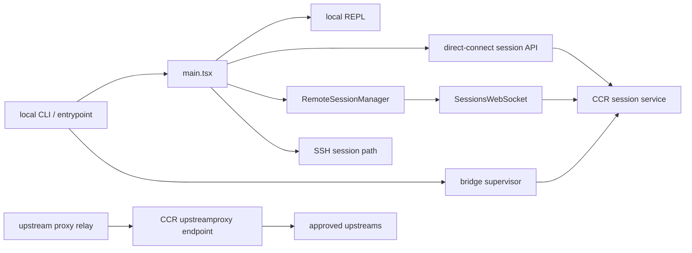

# 05. Claude Code remote, bridge, direct connect, upstream proxy

## 장 요약

장기 실행형 agent harness를 원격 환경에 배치할 때는 "원격 지원"이라는 단일 기능보다 어떤 boundary adapter를 두고 있는지가 더 중요하다. 같은 harness라도 어떤 경로는 session bootstrap artifact를 넘기고, 어떤 경로는 session-scoped client를 붙이고, 어떤 경로는 여러 세션을 감독하는 supervisor를 두며, 어떤 경로는 network tunnel만 중계한다. 이 장은 이 네 가지 adapter 유형, 즉 bootstrapper, session client, supervisor, relay를 먼저 구분한 뒤 Claude Code 공개 사본을 그 taxonomy 위에 올려 읽는다.

Claude Code의 원격 경로를 읽을 때 가장 먼저 버려야 할 오해도 여기서 나온다. `remote/`, `bridge/`, `server/`, `upstreamproxy/`가 모두 하나의 "remote mode"를 구현한다고 보는 관점이다. 공개 사본이 실제로 보여 주는 것은 단일 원격 모드가 아니라, 서로 다른 deployment boundary를 다루는 여러 transport와 orchestration 표면이다. 어떤 경로는 local REPL을 유지한 채 remote session stream만 붙이고, 어떤 경로는 `/sessions` API로 세션을 생성하며, 어떤 경로는 remote-control supervisor처럼 여러 세션을 운영하고, 어떤 경로는 TCP CONNECT를 WebSocket tunnel로 바꾸는 relay 역할을 맡는다.

Anthropic의 [Beyond permission prompts: making Claude Code more secure and autonomous](https://www.anthropic.com/engineering/claude-code-sandboxing) (2025-10-20)는 filesystem isolation과 network isolation을 함께 설계해야 안전한 자율성이 성립한다고 설명한다. Claude Platform Docs의 [Agent SDK overview](https://platform.claude.com/docs/en/agent-sdk/overview) (접근 2026-04-02)는 Claude Code의 agent loop, tools, context management를 library surface로 재사용할 수 있다고 말한다. 추가 자료인 Pan et al., [Natural-Language Agent Harnesses](https://arxiv.org/abs/2603.25723) (2026-03-26, under review)는 harness behavior를 explicit contracts, durable artifacts, lightweight adapters를 통해 runtime으로 옮길 수 있다고 주장한다. 이 장은 이 자료들을 Claude Code 사실을 "증명하는 증거"가 아니라, 공개 코드에서 보이는 deployment adapter 차이를 읽기 위한 해석 프레임으로만 사용한다.

## 왜 deployment boundary를 먼저 봐야 하는가

원격 세션은 단지 transport의 문제가 아니다. 어느 경로에서 filesystem boundary가 열리고, 어느 지점에서 network egress가 proxy를 통과하며, 누가 session-scoped state owner가 되는지에 따라 operator가 통제할 수 있는 표면이 달라진다. 같은 REPL을 쓰더라도 direct connect는 원격 서버가 session config를 발급하는 경로이고, assistant viewer는 CCR session stream에 붙는 경로이며, teleport는 resume와 checkout을 동반하는 인접 entry family로 동작하고, bridge는 여러 세션을 운영하는 supervisor다.

따라서 이 장은 "어떤 폴더가 원격 기능을 담는가"보다 "어떤 boundary를 어떤 adapter가 넘는가"를 묻는다. 이 질문이 잡혀 있어야 뒤에서 safety benchmark와 end-to-end scenario를 읽을 때 local, remote, bridge, proxy, SSH가 왜 서로 다른 trade-off를 갖는지 설명할 수 있다.

여기에는 freshness note도 붙는다. remote MCP transport, OAuth, streamable HTTP 계열은 공식 문서와 release notes에서 계속 바뀌는 영역이므로, 배포 family 설명은 transport 이름보다 auth/authz boundary와 session contract의 역할을 먼저 적는 편이 안정적이다.

## 이 장의 근거와 범위

이 장의 관찰은 2026-04-02 기준 현재 공개 사본의 다음 대표 발췌 출처에 한정한다.

- `src/entrypoints/cli.tsx`
- `src/main.tsx`
- `src/remote/RemoteSessionManager.ts`
- `src/remote/SessionsWebSocket.ts`
- `src/bridge/bridgeMain.ts`
- `src/server/createDirectConnectSession.ts`
- `src/upstreamproxy/relay.ts`
- `src/screens/REPL.tsx`

외부 프레이밍에는 다음 자료를 사용한다.

- Anthropic, [Beyond permission prompts: making Claude Code more secure and autonomous](https://www.anthropic.com/engineering/claude-code-sandboxing), 2025-10-20
- Anthropic Platform Docs, [Agent SDK overview](https://platform.claude.com/docs/en/agent-sdk/overview), 접근 2026-04-02
- Pan et al., [Natural-Language Agent Harnesses](https://arxiv.org/abs/2603.25723), 2026-03-26, under review

`src/screens/REPL.tsx`는 remote, direct connect, SSH가 실제로 같은 local operator surface에 붙는다는 사실을 보여 주는 attach-point 근거로만 제한적으로 사용한다.

이 장은 다음을 다룬다.

- bridge, remote session, direct connect, upstream proxy의 역할 구분
- local UI와 remote execution 사이의 boundary crossing
- bootstrapper, session client, supervisor, relay라는 네 가지 adapter family
- `src/entrypoints/cli.tsx`와 `src/main.tsx`가 여러 deployment family를 어떻게 분기하거나 REPL로 합류시키는지

서버 내부 구현, CCR backend의 세부 정책, 실제 cloud topology 전체는 공개 사본 범위를 벗어나므로 확정하지 않는다.

## boundary adapter taxonomy

| adapter 유형 | 핵심 질문 | 대표 artifact |
| --- | --- | --- |
| bootstrapper | 세션은 어디서 생성되고 어떤 config가 돌아오는가 | session config, auth token, workDir |
| session client | 이미 존재하는 세션 stream과 permission loop를 누가 붙드는가 | session id, ws connection, interrupt/permission channel |
| supervisor | 여러 세션과 work item을 누가 운영하는가 | active session map, heartbeat token, work queue |
| relay | lower-level network egress를 누가 매개하는가 | tunnel auth, CONNECT header, WS chunks |

이 taxonomy를 먼저 세우면 Claude Code 사례를 product-first로 소비하는 대신, 같은 harness가 boundary에 따라 어떻게 다르게 조립되는지 비교할 수 있다.

## deployment family를 읽는 네 가지 질문

| 질문 | 이 장에서의 의미 |
| --- | --- |
| 누가 session을 생성하는가 | CLI가 만들지, remote service가 발급할지, bridge가 재배치할지 |
| 누가 stream을 유지하는가 | REPL이 local stream을 직접 소비하는지, supervisor가 polling/heartbeat를 담당하는지 |
| 어느 boundary를 넘는가 | filesystem, network, auth, transport 중 어디서 policy가 걸리는지 |
| operator surface가 어디에 있는가 | local REPL, assistant viewer, bridge CLI, proxy relay 중 어디가 사람의 제어점인지 |

이 네 질문으로 보면 `remote/`, `bridge/`, `server/`, `upstreamproxy/`는 같은 기능군이 아니라 다른 adapter family다.

이 차이를 빠르게 다시 참조할 때는 아래 matrix가 유용하다.

| family | adapter 유형 | state owner / lifecycle owner | operator surface | approval contract | recovery에서 먼저 볼 것 |
| --- | --- | --- | --- | --- | --- |
| bridge | supervisor | `bridgeMain`이 active session fleet와 work item을 운영 | CLI fast-path의 별도 supervisor surface | fleet/session viewer 계열 semantics가 먼저 온다 | heartbeat, reconnect, token refresh, work requeue |
| remote session attach | session client | session-scoped `RemoteSessionManager` | local REPL에 붙는 attached client | remote request를 local operator approval 흐름과 연결 | reconnect budget, auth rejection, session-not-found 처리 |
| direct connect | bootstrapper + attached client | `/sessions` bootstrap 뒤 local REPL이 이어받음 | local REPL | bootstrap에서 받은 contract 위에 remote permission relay가 붙는다 | session config 취득 실패, attach 이후 relay 회복 |
| upstream proxy | relay | lower-level transport adapter | proxy/relay boundary 자체 | tool approval보다 network egress mediation이 핵심 | tunnel/auth/header relay failure |

이 표의 요점은 "원격 기능이 네 개 있다"가 아니다. 같은 REPL 아래 붙더라도 어떤 경로는 session을 만들고, 어떤 경로는 이미 있는 session을 붙잡고, 어떤 경로는 여러 session을 감독하고, 어떤 경로는 network tunnel만 중계한다는 점을 구분해야 operator control과 safety boundary를 같은 언어로 설명할 수 있다.

## deployment topology



이 그림의 요점은 모든 원격 경로가 같은 operator surface에 붙는 것이 아니라는 점이다. `RemoteSessionManager`, direct connect, SSH는 local REPL로 합류하지만, `bridgeMain`은 CLI fast-path에서 별도 supervisor로 분기한다. `RemoteSessionManager`는 session-scoped client이고, `createDirectConnectSession()`은 session bootstrapper이며, `bridgeMain`은 supervisor이고, `src/upstreamproxy/relay.ts`는 tunnel relay다. 같은 "원격"이라는 이름으로 묶으면 이 차이를 잃는다.

## 제품 사실 1: bridge는 CLI fast path에서 별도 supervisor로 분기한다

`src/entrypoints/cli.tsx`는 bridge 계열을 일반 interactive main path에 섞지 않고 빠르게 분기한다.

```ts
if (
  feature('BRIDGE_MODE') &&
  (args[0] === 'remote-control' ||
    args[0] === 'rc' ||
    args[0] === 'remote' ||
    args[0] === 'sync' ||
    args[0] === 'bridge')
) {
  ...
  const { bridgeMain } = await import('../bridge/bridgeMain.js')
  ...
  await bridgeMain(args.slice(1))
  return
}
```

관찰:

- bridge는 REPL 내부 옵션이 아니라 entrypoint 단계에서 분리되는 mode다.
- auth와 policy check가 `bridgeMain()` 호출 전에 선행된다.

해석:

- bridge는 "remote session 하나에 붙는 client"가 아니라, 별도 운영 정책을 가진 supervisor surface다.
- 이 경로를 ordinary session transport와 같은 층으로 읽으면 `bridge`가 맡는 orchestration 책임을 놓치게 된다.

## 제품 사실 2: `bridgeMain`은 session 하나가 아니라 session fleet를 운영한다

`src/bridge/bridgeMain.ts`의 `runBridgeLoop()`는 active session map, heartbeat, reconnect, token refresh, worktree cleanup을 함께 든다.

```ts
const activeSessions = new Map<string, SessionHandle>()
const sessionStartTimes = new Map<string, number>()
const sessionWorkIds = new Map<string, string>()
const sessionIngressTokens = new Map<string, string>()
...
async function heartbeatActiveWorkItems(): Promise<
  'ok' | 'auth_failed' | 'fatal' | 'failed'
> {
  ...
  await api.heartbeatWork(environmentId, workId, ingressToken)
}
```

관찰:

- bridge는 single-session transport가 아니라 active session fleet와 work item을 관리한다.
- heartbeat 실패 시 `reconnectSession()`으로 재큐잉하는 recovery path가 이미 supervisor 안에 있다.

해석:

- bridge는 remote shell이 아니라 long-running remote-control harness에 가깝다.
- 이 경로는 session stream보다 운영 제어면에 더 가깝기 때문에, deployment boundary 중에서도 "control plane boundary"를 담당한다.

## 제품 사실 3: direct connect는 `/sessions` bootstrap을 REPL 앞단으로 끌어온다

`src/server/createDirectConnectSession.ts`는 remote session stream에 바로 붙지 않고 먼저 session config를 받아 온다.

```ts
export async function createDirectConnectSession({
  serverUrl,
  authToken,
  cwd,
  dangerouslySkipPermissions,
}: {
  ...
}): Promise<{
  config: DirectConnectConfig
  workDir?: string
}> {
  ...
  resp = await fetch(`${serverUrl}/sessions`, {
    method: 'POST',
    headers,
    body: jsonStringify({
      cwd,
      ...(dangerouslySkipPermissions && {
        dangerously_skip_permissions: true,
      }),
    }),
  })
  ...
  return {
    config: {
      serverUrl,
      sessionId: data.session_id,
      wsUrl: data.ws_url,
      authToken,
    },
    workDir: data.work_dir,
  }
}
```

그리고 `src/main.tsx`는 그 config를 그대로 REPL launch에 넘긴다.

```ts
const session = await createDirectConnectSession({
  serverUrl: _pendingConnect.url,
  authToken: _pendingConnect.authToken,
  cwd: getOriginalCwd(),
  dangerouslySkipPermissions: _pendingConnect.dangerouslySkipPermissions
})
...
await launchRepl(root, ..., {
  ...
  directConnectConfig,
  thinkingConfig
}, renderAndRun)
```

관찰:

- direct connect의 핵심 artifact는 "이미 열린 stream"이 아니라 `sessionId`, `wsUrl`, `workDir`가 포함된 session config다.
- local REPL은 remote server가 발급한 session config를 받아 runtime을 이어 붙인다.

해석:

- direct connect는 remote client path보다 bootstrap boundary에 가깝다.
- NLAH 논문의 표현을 빌린 해석 프레임으로 보면, 이 경로는 runtime adapter가 소비할 explicit contract를 먼저 발급하는 구조다.

## 제품 사실 4: `RemoteSessionManager`는 stream 수신, POST 송신, permission flow를 한 session client에 묶는다

`src/remote/RemoteSessionManager.ts`의 클래스 주석은 역할을 노골적으로 적는다.

```ts
/**
 * Manages a remote CCR session.
 *
 * Coordinates:
 * - WebSocket subscription for receiving messages from CCR
 * - HTTP POST for sending user messages to CCR
 * - Permission request/response flow
 */
export class RemoteSessionManager {
```

실제 연결도 `SessionsWebSocket`과 callback wiring을 통해 session-scoped client로 조립된다.

```ts
this.websocket = new SessionsWebSocket(
  this.config.sessionId,
  this.config.orgUuid,
  this.config.getAccessToken,
  wsCallbacks,
)

void this.websocket.connect()
```

관찰:

- remote session manager는 단순 WebSocket wrapper가 아니다.
- receive path, send path, permission control branch가 모두 하나의 session client abstraction에 모인다.

해석:

- `remote/`는 "transport primitive"보다 "session-scoped client layer"에 가깝다.
- 이것이 bridge와 다른 이유는 bridge가 fleet supervisor인 반면, `RemoteSessionManager`는 특정 session의 interaction loop를 local REPL에 매단다는 점이다.

## 제품 사실 5: `SessionsWebSocket`은 raw socket보다 session lifecycle adapter다

`src/remote/SessionsWebSocket.ts`는 subscribe URL, auth header, reconnect policy, ping loop를 한 클래스로 캡슐화한다.

```ts
const baseUrl = getOauthConfig().BASE_API_URL.replace('https://', 'wss://')
const url = `${baseUrl}/v1/sessions/ws/${this.sessionId}/subscribe?organization_uuid=${this.orgUuid}`

const accessToken = this.getAccessToken()
const headers = {
  Authorization: `Bearer ${accessToken}`,
  'anthropic-version': '2023-06-01',
}
```

특히 close code `4001`을 transient compaction window로 다루는 부분은 이 클래스가 network socket보다 session continuity에 더 민감하다는 사실을 보여 준다.

```ts
// 4001 (session not found) can be transient during compaction: the
// server may briefly consider the session stale while the CLI worker
// is busy with the compaction API call and not emitting events.
if (closeCode === 4001) {
  this.sessionNotFoundRetries++
  ...
}
```

관찰:

- 이 클래스는 WebSocket URL 조립과 auth header 준비를 session-scoped contract의 일부로 다룬다.
- reconnect semantics도 단순 "네트워크가 끊겼다" 수준이 아니라 session lifecycle과 compaction 이벤트를 의식한다.

해석:

- 이 계층은 transport adapter이면서 동시에 session survivability adapter다.
- long-running harness에서 boundary는 단순 연결 경계가 아니라 recovery semantics가 붙는 운영 경계라는 점을 보여 준다.

## 제품 사실 6: upstream proxy는 agent loop가 아니라 tunnel relay다

`src/upstreamproxy/relay.ts`의 파일 주석은 이 모듈을 가장 정확하게 설명한다.

```ts
/**
 * CONNECT-over-WebSocket relay for CCR upstreamproxy.
 *
 * Listens on localhost TCP, accepts HTTP CONNECT from curl/gh/kubectl/etc,
 * and tunnels bytes over WebSocket to the CCR upstreamproxy endpoint.
 * The CCR server-side terminates the tunnel, MITMs TLS, injects org-configured
 * credentials (e.g. DD-API-KEY), and forwards to the real upstream.
 */
```

실제 start 함수도 session id와 token으로 별도 relay를 띄운다.

```ts
export async function startUpstreamProxyRelay(opts: {
  wsUrl: string
  sessionId: string
  token: string
}): Promise<UpstreamProxyRelay> {
  const authHeader =
    'Basic ' + Buffer.from(`${opts.sessionId}:${opts.token}`).toString('base64')
  ...
}
```

연결 phase도 둘로 나뉜다.

```ts
function handleData(
  sock: ClientSocket,
  st: ConnState,
  data: Buffer,
  wsUrl: string,
  authHeader: string,
  wsAuthHeader: string,
): void {
  // Phase 1: accumulate until we've seen the full CONNECT request
  ...
  // Phase 2: WS exists. If it isn't OPEN yet, buffer; ws.onopen will flush.
}
```

관찰:

- upstream proxy는 REPL도 아니고 session client도 아니다.
- localhost TCP를 WebSocket tunnel로 바꾸는 lower-level relay이며, upgrade auth와 tunneled proxy semantics를 직접 다룬다.

해석:

- 이 모듈은 remote execution family 안에서도 가장 낮은 transport boundary에 해당한다.
- CONNECT parser와 WS opener가 분리되어 있다는 점은 이 경로가 "session attach"보다 "transport mediation"에 가깝다는 사실을 보여 준다.
- Anthropic의 sandboxing 글이 network isolation을 별도 boundary로 강조하는 이유가 여기서 실감난다. tool execution이 허용되더라도 outbound path를 어떤 relay와 policy surface가 감싸는지가 안전성과 자율성을 크게 바꾼다.

## 제품 사실 7: `src/main.tsx`는 서로 다른 deployment family를 같은 REPL surface로 합류시킨다

`src/main.tsx`는 direct connect, SSH, assistant viewer, remote/teleport를 각각 다른 config object로 `launchRepl()`에 연결한다.

```ts
await launchRepl(root, ..., {
  ...
  directConnectConfig,
  thinkingConfig
}, renderAndRun)
```

```ts
await launchRepl(root, ..., {
  ...
  sshSession,
  thinkingConfig
}, renderAndRun)
```

```ts
const remoteSessionConfig = createRemoteSessionConfig(
  targetSessionId,
  getAccessToken,
  apiCreds.orgUUID,
  false,
  true,
)
...
await launchRepl(root, ..., {
  ...
  remoteSessionConfig,
  thinkingConfig
}, renderAndRun)
```

관찰:

- operator surface는 계속 REPL이지만, 아래에 매다는 session adapter는 mode별로 다르다.
- 즉, Claude Code는 UI consistency를 유지하면서 deployment boundary만 교체하는 식으로 runtime을 확장한다.
- 제품 문자열에서는 `remote-control`이 넓게 쓰이더라도, architecture 관점에서는 bridge가 CLI fast-path supervisor이고 REPL remote path는 attached session client 계열이라는 구분을 유지해야 혼동이 줄어든다.

`src/screens/REPL.tsx`도 이 구조를 노출한다. 같은 화면 아래에서 `useRemoteSession`, `useDirectConnect`, `useSSHSession`이 각각 다른 transport를 매단다.

```ts
const remoteSession = useRemoteSession({
  config: remoteSessionConfig,
  ...
})

const directConnect = useDirectConnect({
  config: directConnectConfig,
  ...
})

const sshRemote = useSSHSession({
  session: sshSession,
  ...
})
```

해석:

- Agent SDK overview가 말하는 "same tools, agent loop, and context management"가 공개 코드에서는 이런 식으로 실현된다. core harness는 유사하게 유지하고, boundary adapter만 바꾸는 것이다.

## deployment boundary 사례로서의 Claude Code

이 장을 다 읽고 나면 Claude Code의 원격 계층을 "여러 원격 기능이 덕지덕지 붙은 구조"로 보기보다, entrypoint/supervisor adapter와 REPL-attached adapter가 함께 존재하는 구조로 읽는 편이 맞다. bridge는 fleet supervisor로 CLI fast-path에서 분기하고, direct connect는 session bootstrapper이며, `RemoteSessionManager`는 session-scoped client, `upstreamproxy`는 lower-level relay다. SSH와 assistant viewer는 local REPL에 붙는 adapter지만, teleport는 resume와 checkout flow를 동반하는 인접 entry family로 읽는 편이 더 정확하다.

이 점이 중요한 이유는 safety와 autonomy가 바로 이 경계 설계 위에서 달라지기 때문이다. sandboxing 글이 말하듯 boundary engineering의 핵심은 허용 범위를 어디서 잘라 내느냐이고, Agent SDK overview가 시사하듯 동일한 loop와 tool surface도 다른 runtime boundary에 배치될 수 있다. NLAH 역시 아직 under-review preprint이지만, adapter와 explicit artifact를 중심으로 harness를 기술 대상으로 삼는다는 점에서 유용한 비교 렌즈를 제공한다. Claude Code의 원격 구조는 이 논점을 공개 제품 코드에서 해석적으로 읽을 수 있게 해 준다.

## 새 하네스를 설계할 때 던질 benchmark 질문

1. 이 경로는 bootstrapper, session client, supervisor, relay 중 어디에 속하는가.
2. local UI는 유지하고 execution만 옮길 것인가, 아니면 session bootstrap 자체를 서버로 넘길 것인가.
3. reconnect와 recovery semantics는 socket 수준에 머무는가, 아니면 session lifecycle을 의식하는가.
4. network boundary는 agent loop 바깥의 relay/proxy가 담당하는가, 아니면 tool 실행기 내부에 흩어져 있는가.
5. boundary를 넘을 때 어떤 explicit artifact가 건너가는가. 예를 들어 session config, auth token, ws URL, work item 중 무엇이 계약의 핵심인가.
6. 같은 operator surface 아래 여러 deployment family를 붙일 때, config contract와 lifecycle owner가 명시적으로 분리되어 있는가.

## 대표 근거 읽기 순서

아래 라벨은 독자가 별도 source를 열어야 한다는 뜻이 아니라, 이 장에서 이미 인용하고 설명한 코드 발췌가 어떤 구현 단면을 대표하는지 다시 묶어 주는 provenance 메모다.

1. `src/entrypoints/cli.tsx`
2. `src/bridge/bridgeMain.ts`
3. `src/server/createDirectConnectSession.ts`
4. `src/remote/RemoteSessionManager.ts`
5. `src/remote/SessionsWebSocket.ts`
6. `src/upstreamproxy/relay.ts`
7. `src/main.tsx`

## 요약

Claude Code의 원격 계층은 하나의 remote mode가 아니라 여러 deployment boundary adapter의 조합이다. bridge는 supervisor이고, direct connect는 bootstrapper이며, remote session manager는 session client이고, upstream proxy는 relay다. 이 구분을 잡아야만 safety boundary, operator control, long-running recovery를 같은 설계 언어로 읽을 수 있다.
