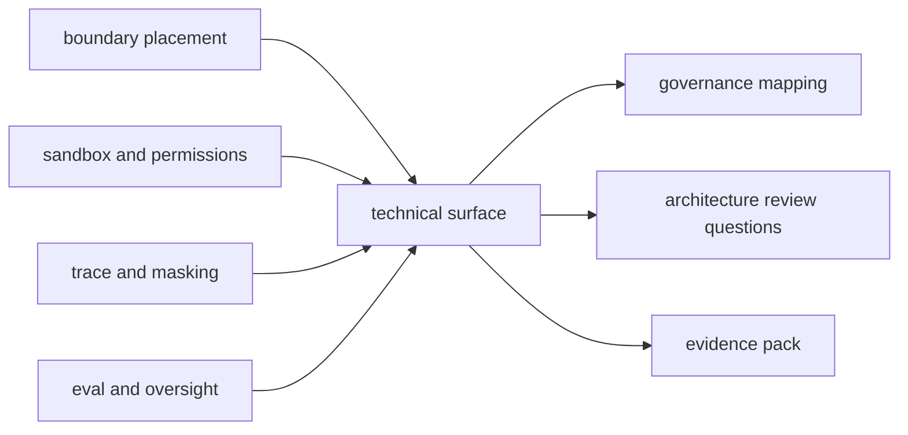

# 07. governance, risk, and compliance mapping

> Why this chapter exists: boundary engineering과 safety design이 architecture review language, governance language, compliance language로 어떻게 번역되는지 고정한다.
> Reader level: reviewer
> Last verified: 2026-04-06
> Freshness class: medium

## Core claim

좋은 하네스 설계 원리는 그 자체로 충분하지 않다. architecture reviewer, security owner, platform owner, risk owner가 같은 구조를 다른 언어로 읽을 수 있어야 한다. boundary, sandbox, approval, trace, eval, evidence pack을 governance/risk/compliance 관점으로 다시 매핑하는 계층이 필요하다.

## What this chapter is not claiming

- NIST나 조직 프레임워크가 기술 설계를 대체할 수 있다는 주장
- compliance checklist만 채우면 좋은 harness가 된다는 주장
- governance가 안전 장치보다 더 중요한 층이라는 주장

## Mental model / diagram

이 그림의 핵심은 governance가 별도 시스템이라는 뜻이 아니라, 기술 surface를 reviewable language로 다시 쓰는 번역 계층이라는 점이다.

## 범위와 비범위

이 장이 다루는 것:

- boundary engineering을 governance question으로 번역하는 법
- sandbox, permissions, trace, eval을 risk evidence로 읽는 법
- architecture review에서 자주 쓰는 질문과 기술 artifact의 연결

이 장이 다루지 않는 것:

- 조직별 policy manual
- 법무 해석과 규정 준수 절차 세부
- formal audit program 전체

## 자료와 독서 기준

대표 공식 자료:

- NIST, [AI RMF Generative AI Profile](https://www.nist.gov/publications/artificial-intelligence-risk-management-framework-generative-artificial-intelligence), verified 2026-04-06
- NIST, [AI RMF Playbook](https://airc.nist.gov/airmf-resources/playbook/), verified 2026-04-06
- Anthropic, [Making Claude Code more secure and autonomous with sandboxing](https://www.anthropic.com/engineering/claude-code-sandboxing), verified 2026-04-06

함께 읽으면 좋은 장:

- [01-boundary-engineering-and-autonomy.md](01-boundary-engineering-and-autonomy.md)
- [02-sandboxing-permissions-and-policy-surfaces.md](02-sandboxing-permissions-and-policy-surfaces.md)
- [04-safety-autonomy-benchmark.md](04-safety-autonomy-benchmark.md)
- [09-eval-hygiene-dataset-versioning-and-contamination.md](../07-evaluation-and-synthesis/09-eval-hygiene-dataset-versioning-and-contamination.md)
- [../08-reference/07-artifact-taxonomy-and-retention-matrix.md](../08-reference/07-artifact-taxonomy-and-retention-matrix.md)

## governance는 기술 내용을 다시 묻는 방식이다

NIST AI RMF Generative AI Profile과 Playbook은 위험을 직접 없애 주지 않는다. 대신 다음 질문을 강제한다.

- 어떤 위험 surface를 알고 있는가
- 그 위험을 줄이는 control은 무엇인가
- 그 control이 실제로 작동했다는 evidence는 무엇인가

하네스 문서에 이 층이 없으면 기술 내용은 풍부해도 review-ready document가 되기 어렵다.

## boundary placement는 trust question으로 번역돼야 한다

boundary engineering 장에서 다루는 local/remote/bridge/direct-connect 구분은 governance 언어로 바꾸면 다음 질문이 된다.

- 어떤 data path가 boundary를 넘는가
- boundary를 넘을 때 누가 trust를 부여하는가
- operator override가 가능한가
- audit trail이 남는가

기술 설명이 이 질문에 답하지 못하면, architecture review에서는 "복잡한 구현"만 보이고 "왜 안전한가"는 보이지 않는다.

## sandbox와 permissions는 control evidence다

Anthropic의 sandboxing 글은 filesystem isolation과 network isolation을 함께 써야 한다고 설명한다. 이 말은 governance language로 바꾸면 "control objective가 단일 prompt approval이 아니라 multi-layer containment"라는 뜻이다.

좋은 review 문서는 다음을 같이 적어야 한다.

- prompt approval이 무엇을 막는가
- sandbox가 무엇을 막는가
- bypass-immune rule이 무엇을 막는가
- managed settings나 policy surface가 무엇을 막는가

즉 control은 하나가 아니라 layered evidence로 읽어야 한다.

## observability와 eval도 governance evidence다

trace, masking, evidence pack, dataset versioning, contamination guardrail은 흔히 eval 장에서만 읽히지만, governance language로는 다음과 같이 번역된다.

- 재현 가능한가
- 설명 가능한가
- 민감정보를 노출하지 않는가
- drift와 contamination을 탐지할 수 있는가

이 질문은 모두 architecture review에서 직접 쓰인다.

## Design implications

- safety chapter 끝에는 기술 control을 governance question으로 다시 쓰는 작은 표가 있으면 좋다.
- benchmark와 eval chapter는 evidence pack과 dataset provenance를 reviewable artifact로 설명해야 한다.
- remote path와 MCP path는 trust boundary와 authorization boundary를 함께 설명해야 한다.

## What to measure

- unsafe completion rate
- approval burden
- bypass-immune control hit rate
- masked trace coverage
- reproducible evidence-pack ratio

## Failure signatures

- 기술 설명은 풍부한데 review 질문에 답하는 표가 없다.
- boundary는 설명했지만 누가 trust를 부여하는지 적지 않았다.
- trace는 남기지만 privacy evidence가 없다.
- eval은 돌리지만 dataset provenance나 contamination guardrail이 없다.

## Review questions

1. 이 설계는 trust boundary와 authorization boundary를 구분해서 설명하는가.
2. layered controls가 실제 evidence artifact와 연결되는가.
3. replayability, masking, dataset provenance를 governance evidence로 읽을 수 있는가.
4. architecture reviewer가 기술 문서를 바로 review checklist로 바꿀 수 있는가.

## Sources / evidence notes

- NIST GenAI Profile과 Playbook은 기술 내용을 governance question으로 번역하는 기준을 제공한다.
- Anthropic sandboxing 글은 layered control과 containment를 설명하는 concrete example을 제공한다.
