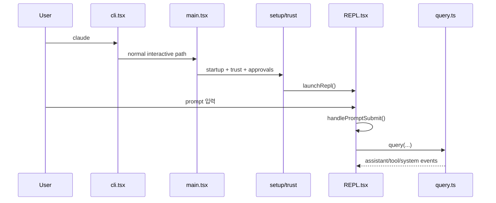

# 07. Claude Code end-to-end scenario와 state-owner handoff

## 장 요약

앞선 장들은 실행 모드, startup, query, remote, permissions, persistence를 각각 따로 분석했다. 이 장은 그 축들을 다시 시간 순서로 결합한다. 핵심 질문은 단순히 "무슨 일이 일어나는가"가 아니다. 더 중요한 질문은 "누가 지금 state owner인가", "어떤 artifact가 다음 단계로 넘겨지는가", "policy gate는 어느 시점에 개입하는가"다.

Anthropic의 [Effective harnesses for long-running agents](https://www.anthropic.com/engineering/effective-harnesses-for-long-running-agents) (2025-11-26)는 장기 작업이 discrete session 사이를 오가므로 clean state와 structured artifact가 중요하다고 설명한다. Anthropic의 [Harness design for long-running application development](https://www.anthropic.com/engineering/harness-design-long-running-apps) (2026-03-24)는 planner, generator, evaluator 같은 분리뿐 아니라, 세션 간 feedback loop와 handoff artifact 설계가 성능을 좌우한다고 말한다. Pan et al., [Natural-Language Agent Harnesses](https://arxiv.org/abs/2603.25723) (2026-03-26, under review)는 harness behavior를 explicit contracts, durable artifacts, lightweight adapters로 설명한다. 이 장은 이 프레임을 Claude Code 공개 사본에 대입해, 각 scenario를 "owner shift + artifact handoff + boundary crossing"으로 읽는다.

## 왜 scenario synthesis가 필요한가

개별 장만 읽으면 각 subsystem의 책임은 보인다. 하지만 실제 사용자가 prompt를 입력하거나, remote session에 붙거나, 기존 세션을 다시 열 때는 그 subsystem들이 한꺼번에 움직인다. 이때 가장 중요한 것은 파일 목록이 아니라 ownership 변화다.

- CLI와 `src/main.tsx`는 mode fan-out과 runtime assembly의 owner다.
- `src/screens/REPL.tsx`는 interactive shell의 owner다.
- `src/query.ts`는 turn-local orchestration의 owner다.
- `RemoteSessionManager`와 `SessionsWebSocket`은 remote session attach의 owner다.
- `src/utils/conversationRecovery.ts`와 `src/utils/sessionRestore.ts`는 resume control plane의 owner다.

따라서 이 장은 "전체 구조를 다시 요약"하는 대신, 네 개의 end-to-end scenario를 ownership handoff 중심으로 다시 쓴다.

## 이 장의 근거와 범위

이 장의 관찰은 2026-04-02 기준 현재 공개 사본의 다음 대표 발췌 출처에 한정한다.

- `src/entrypoints/cli.tsx`
- `src/main.tsx`
- `src/setup.ts`
- `src/interactiveHelpers.tsx`
- `src/screens/REPL.tsx`
- `src/query.ts`
- `src/QueryEngine.ts`
- `src/utils/permissions/permissions.ts`
- `src/remote/RemoteSessionManager.ts`
- `src/remote/SessionsWebSocket.ts`
- `src/server/createDirectConnectSession.ts`
- `src/utils/conversationRecovery.ts`
- `src/utils/sessionRestore.ts`

외부 프레이밍에는 다음 자료를 사용한다.

- Anthropic, [Effective harnesses for long-running agents](https://www.anthropic.com/engineering/effective-harnesses-for-long-running-agents), 2025-11-26
- Anthropic, [Harness design for long-running application development](https://www.anthropic.com/engineering/harness-design-long-running-apps), 2026-03-24
- Pan et al., [Natural-Language Agent Harnesses](https://arxiv.org/abs/2603.25723), 2026-03-26, under review

이 장은 다음을 다룬다.

- local interactive prompt 1턴
- tool-rich recursive turn
- remote attach families
- resume/continue flow
- control-surface intervention

각 서브시스템의 완전한 구현 설명과 모든 edge case는 이 장의 범위를 벗어난다.

## 다섯 가지 scenario와 handoff artifact

| scenario | 초기 owner | 중간 owner | 핵심 handoff artifact |
| --- | --- | --- | --- |
| local interactive turn | `src/entrypoints/cli.tsx` / `src/main.tsx` | `src/screens/REPL.tsx` -> `src/query.ts` | prompt, rendered system prompt, toolUseContext |
| tool-rich recursive turn | `src/screens/REPL.tsx` | `src/query.ts` | assistant tool_use blocks, tool results, next turn state |
| remote attach | CLI or `src/main.tsx` | `RemoteSessionManager` or direct-connect adapter | session config, session id, websocket stream (뒤에서 supervisor / bootstrap / client 세 가족으로 분리) |
| resume/continue | `src/utils/conversationRecovery.ts` | `src/utils/sessionRestore.ts` -> `src/main.tsx` / `src/screens/REPL.tsx` | transcript chain, restored metadata, initial state |
| control-surface intervention | `src/query.ts` or remote session client | permission layer / remote control branch | approval request, denial reason, interrupt/reconnect signal |

이 표는 scenario를 "기능"이 아니라 "owner와 artifact의 조합"으로 읽게 해 준다. `src/QueryEngine.ts`는 별도 scenario라기보다 local/tool-rich scenario와 비교하기 위한 ownership contrast 지점으로 읽으면 된다.

## 시나리오 1: local interactive prompt 1턴

### 흐름

1. `src/entrypoints/cli.tsx`가 일반 interactive path를 선택한다.
2. `src/main.tsx`, `src/setup.ts`, `src/interactiveHelpers.tsx`가 startup, trust, approval gate를 통과시킨다.
3. `launchRepl()`이 interactive shell을 붙인다.
4. 사용자가 prompt를 입력하면 `src/screens/REPL.tsx`가 submit preprocessing을 수행한다.
5. `src/screens/REPL.tsx`가 `handlePromptSubmit()`와 `query()`를 통해 turn-local owner를 `src/query.ts`로 넘긴다.
6. assistant/tool/system event stream이 다시 REPL로 돌아와 UI와 transcript에 반영된다.

### ownership diagram



### 코드 근거

`src/screens/REPL.tsx`는 local prompt를 remote path와 구분한 뒤 local path에서 `handlePromptSubmit()`를 호출한다.

```tsx
// Ensure SessionStart hook context is available before the first API call.
await awaitPendingHooks();
await handlePromptSubmit({
  input,
  helpers,
  queryGuard,
  isExternalLoading,
  ...
  onBeforeQuery,
  canUseTool,
  ...
});
```

관찰:

- 이 스냅샷에서 interactive turn의 직접적인 submit owner는 `src/screens/REPL.tsx`다.
- 실행 entrypoint는 CLI와 `src/main.tsx`이지만, turn ownership handoff는 REPL에서 일어난다.

해석:

- local interactive scenario의 핵심 artifact는 prompt 그 자체보다 REPL이 조립한 `toolUseContext`, system/user context, hook state다.
- 즉, local path를 읽을 때는 실행 진입과 turn 진입을 구분해야 한다.

## 시나리오 2: tool-rich recursive turn

### 흐름

1. REPL이 `query()`를 시작한다.
2. `src/query.ts`가 assistant tool_use block을 수집한다.
3. `StreamingToolExecutor` 또는 `runTools()`가 tool 실행을 수행한다.
4. tool result가 같은 turn lifecycle 안으로 다시 들어온다.
5. `src/query.ts`는 `messages + assistantMessages + toolResults`로 다음 state를 만들어 재귀적으로 다음 turn을 이어 간다.

### 코드 근거

tool execution은 query loop 바깥으로 빠져나가지 않는다.

```ts
const toolUpdates = streamingToolExecutor
  ? streamingToolExecutor.getRemainingResults()
  : runTools(toolUseBlocks, assistantMessages, canUseTool, toolUseContext)
```

```ts
const next: State = {
  messages: [...messagesForQuery, ...assistantMessages, ...toolResults],
  toolUseContext: toolUseContextWithQueryTracking,
  ...
}
```

관찰:

- tool call은 별도 batch job이 아니라 turn-local recursion 안에서 처리된다.
- 따라서 tool-rich turn의 owner는 REPL이 아니라 `src/query.ts`다.

해석:

- 이 시나리오에서 중요한 handoff artifact는 assistant text가 아니라 tool_use block과 tool_result block이다.
- long-running harness를 읽을 때 "tool을 썼다"보다 "tool 결과가 어떤 state object로 다음 turn에 흡수되는가"를 보는 편이 더 중요하다.

## compare box: same core loop, different owner

`src/QueryEngine.ts`는 `query()`를 그대로 재사용하지만 ownership model은 다르다.

```ts
for await (const message of query({
  messages,
  systemPrompt,
  userContext,
  systemContext,
  canUseTool: wrappedCanUseTool,
  toolUseContext: processUserInputContext,
  querySource: 'sdk',
  maxTurns,
  taskBudget,
})) {
```

이 비교가 중요한 이유는 하나다. Claude Code의 end-to-end scenario는 "항상 다른 loop"의 문제라기보다, 같은 core loop를 누가 감싸고 누가 persistence를 맡는가의 문제라는 점을 보여 주기 때문이다.

## 시나리오 3: remote attach family

이 시나리오는 하나로 뭉뚱그리기보다 세 가족으로 나누는 편이 정확하다.

### 3.1 bridge fast-path supervisor

- 초기 owner: `src/entrypoints/cli.tsx`
- 핵심 특징: REPL attach 이전에 `bridgeMain()`으로 분기
- 핵심 질문: session 하나에 붙는가, fleet supervisor인가

### 3.2 direct-connect contract attach

- 초기 owner: `src/main.tsx`
- handoff artifact: `sessionId`, `wsUrl`, `workDir`가 들어 있는 direct-connect config
- 핵심 질문: 누가 session bootstrap contract를 발급하는가

### 3.3 remote session client attach

- 초기 owner: `src/main.tsx`
- 중간 owner: `RemoteSessionManager` / `SessionsWebSocket`
- 핵심 질문: local REPL은 session stream을 어떻게 붙드는가

### 코드 근거

assistant viewer attach는 `src/main.tsx`에서 remote session config를 만들고 REPL에 넘긴다.

```ts
const remoteSessionConfig = createRemoteSessionConfig(
  targetSessionId,
  getAccessToken,
  apiCreds.orgUUID,
  false,
  true,
)
...
await launchRepl(root, ..., {
  ...
  remoteSessionConfig,
  thinkingConfig
}, renderAndRun);
```

direct connect는 session config를 먼저 만들고 REPL에 붙인다.

```ts
const session = await createDirectConnectSession({
  serverUrl: _pendingConnect.url,
  authToken: _pendingConnect.authToken,
  cwd: getOriginalCwd(),
  dangerouslySkipPermissions: _pendingConnect.dangerouslySkipPermissions
});
```

그리고 remote session client는 session stream과 permission control request를 직접 다룬다.

```ts
if (inner.subtype === 'can_use_tool') {
  this.pendingPermissionRequests.set(request_id, inner)
  this.callbacks.onPermissionRequest(inner, request_id)
}
```

관찰:

- remote attach family는 모두 "원격"이지만 같은 ownership model을 쓰지 않는다.
- bridge는 supervisor이고, direct connect는 bootstrap contract attach이며, remote session attach는 session-scoped client다.

해석:

- NLAH가 말하는 explicit contract와 lightweight adapter라는 렌즈를 쓰면, remote scenario는 transport one-liner가 아니라 adapter family의 차이로 읽히기 시작한다.
- 이 차이를 잡지 못하면 `bridge`, `remote`, `direct connect`를 같은 추상화로 오독하게 된다.

## 시나리오 4: resume/continue flow

### 흐름

1. `src/utils/conversationRecovery.ts`가 transcript source를 선택하고 resume chain을 읽는다.
2. `src/utils/sessionRestore.ts`가 session switching, metadata restore, cost restore를 수행한다.
3. `src/main.tsx`가 restored initial state와 messages를 `launchRepl()`로 넘긴다.
4. 필요한 경우 `src/screens/REPL.tsx`가 file history, read-file state, agent context 같은 UI-adjacent state를 추가로 복원한다.

### 코드 근거

conversation loader는 centralized entry를 가진다.

```ts
export async function loadConversationForResume(
  source: string | LogOption | undefined,
  sourceJsonlFile: string | undefined,
): Promise<... | null> {
```

restore control plane은 session id와 cost state를 되살린다.

```ts
if (!opts.forkSession) {
  const sid = opts.sessionIdOverride ?? result.sessionId
  if (sid) {
    switchSession(
      asSessionId(sid),
      opts.transcriptPath ? dirname(opts.transcriptPath) : null,
    )
    ...
    restoreCostStateForSession(sid)
  }
}
```

그리고 `src/main.tsx`는 restored state를 REPL에 주입한다.

```ts
const loaded = await processResumedConversation(result, {
  forkSession: !!options.forkSession,
  includeAttribution: true,
  transcriptPath: result.fullPath
}, resumeContext);
...
await launchRepl(root, ..., {
  ...
  initialMessages: loaded.messages,
  initialFileHistorySnapshots: loaded.fileHistorySnapshots,
  ...
}, renderAndRun);
```

관찰:

- resume는 단순 transcript reload가 아니라 recovery loader, restore control plane, REPL state injection의 3단 구조다.
- 이 시나리오의 handoff artifact는 prompt 하나가 아니라 transcript chain, restored metadata, initial state bundle이다.

해석:

- long-running harness에서 session continuity는 "이전 대화를 보여 준다"는 문제보다 "새 owner가 작업을 이어받을 수 있게 상태를 다시 조립한다"는 문제에 가깝다.
- 따라서 resume scenario는 별도 scenario로 읽어야 한다. interactive turn의 부록 정도로 취급하면 restore coupling을 놓치게 된다.

## 시나리오 5: control-surface intervention

앞의 네 시나리오는 비교적 happy path에 가깝다. 하지만 하네스 엔지니어링 교육서라면 "어디서 멈추고, 묻고, 재시도하고, 거부하는가"도 보여 줘야 한다. Claude Code에서 그 지점은 local permission layer와 remote control request branch에 드러난다.

### 흐름

1. `src/query.ts` 또는 remote session이 tool/action을 진행하려 한다.
2. local path에서는 `hasPermissionsToUseToolInner()`가 `deny`, `ask`, `allow` 중 하나를 결정한다.
3. remote path에서는 `RemoteSessionManager`가 control request를 받아 local operator에게 permission queue를 연다.
4. 승인/거부/재연결 결과에 따라 owner가 같은 turn을 계속 진행하거나, operator surface로 되돌아오거나, recovery path를 탄다.

### 코드 근거

local call-time permission은 바로 세 갈래로 나뉜다.

```ts
const denyRule = getDenyRuleForTool(appState.toolPermissionContext, tool)
if (denyRule) {
  return {
    behavior: 'deny',
    ...
  }
}
...
const askRule = getAskRuleForTool(appState.toolPermissionContext, tool)
if (askRule) {
  ...
  return {
    behavior: 'ask',
    ...
  }
}
```

remote session path에서는 control request가 별도 branch로 들어온다.

```ts
if (inner.subtype === 'can_use_tool') {
  this.pendingPermissionRequests.set(request_id, inner)
  this.callbacks.onPermissionRequest(inner, request_id)
}
```

관찰:

- local path의 control-surface intervention은 permission decision으로 나타난다.
- remote path의 intervention은 control request message로 들어와 operator를 다시 loop 안으로 부른다.

해석:

- 하네스에서 중요한 것은 happy path ownership만이 아니다. 어떤 지점에서 operator가 다시 owner가 되는가도 equally important하다.
- 따라서 permission denial, approval request, reconnect 같은 사건은 부수적 edge case가 아니라 control-surface scenario의 일부로 읽어야 한다.

## 이 장에서 가져가야 할 질문

1. 이 scenario의 현재 owner는 누구인가.
2. 다음 owner에게 넘어갈 때 어떤 artifact가 handoff되는가.
3. policy gate는 startup 전에 걸리는가, REPL 안에서 걸리는가, remote control request로 들어오는가.
4. 같은 core loop를 쓰더라도 ownership model이 다르면 어떤 행동이 달라지는가.
5. 이 scenario는 local shell, remote client, supervisor, restore control plane 중 어느 family에 더 가까운가.

## 대표 근거 읽기 순서

아래 라벨은 독자가 별도 source를 열어야 한다는 뜻이 아니라, 이 장에서 이미 인용하고 설명한 코드 발췌가 어떤 구현 단면을 대표하는지 다시 묶어 주는 provenance 메모다.

1. `src/entrypoints/cli.tsx`
2. `src/main.tsx`
3. `src/screens/REPL.tsx`
4. `src/query.ts`
5. `src/QueryEngine.ts`
6. `src/server/createDirectConnectSession.ts`
7. `src/remote/RemoteSessionManager.ts`
8. `src/utils/conversationRecovery.ts`
9. `src/utils/sessionRestore.ts`

## 요약

이 장의 핵심은 end-to-end 흐름을 기능 목록이 아니라 owner handoff로 읽는 것이다. local interactive turn은 REPL에서 query로 ownership이 넘어가고, tool-rich turn은 query 안에서 재귀적으로 이어지며, remote attach는 supervisor/bootstrap/client family로 갈라지고, resume는 recovery와 restore control plane을 거쳐 다시 REPL로 돌아온다. 이 관점이 잡히면 Claude Code는 거대한 단일 프로그램이 아니라, ownership을 계속 넘겨 가는 harness로 보이기 시작한다.
