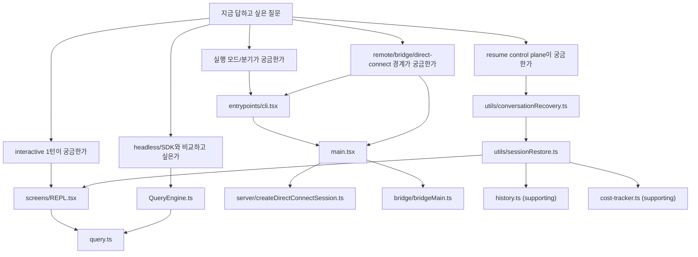

# 08. benchmark-oriented 코드 독해 가이드

> Why this chapter exists: giant codebase를 읽는 일을 benchmark question, provenance, evidence bundle 언어로 다시 바꾼다.
> Reader path tags: `source-first` / `reviewer`
> Last verified: 2026-04-06
> Freshness class: medium
> Source tier focus: Tier 2 eval framing, Tier 6 observed runtime cuts, Tier 5 provisional comparison papers

## 장 요약

큰 agent harness 코드를 읽을 때의 일반 원칙은 두 가지다. 먼저 질문 유형을 고르고, 그다음 지금 열려는 파일이 source of truth인지 integration seam인지 판별한다. 이 원칙이 없으면 독자는 giant file의 표면을 훑다가도 정작 어떤 계약, 어떤 state owner, 어떤 artifact를 확인해야 하는지 놓치기 쉽다.

Claude Code 같은 사례에서는 "어느 폴더에 무엇이 있는가"보다 "내가 지금 어떤 설계 질문을 검증하려는가"를 먼저 정해야 한다. interactive turn의 state owner를 알고 싶은지, remote boundary의 adapter를 보고 싶은지, headless path가 어디서 interactive path와 갈라지는지, resume control plane이 어디에 있는지에 따라 첫 파일이 달라진다.

이 장의 목적은 바로 그 질문-선택 규칙을 주는 것이다. Anthropic의 [Demystifying evals for AI agents](https://www.anthropic.com/engineering/demystifying-evals-for-ai-agents) (2026-01-09)는 task, trial, transcript, outcome, evaluation harness를 분리해서 생각해야 한다고 설명한다. Anthropic의 [Harness design for long-running application development](https://www.anthropic.com/engineering/harness-design-long-running-apps) (2026-03-24)는 long-running harness 성능이 clean state, handoff artifact, evaluator feedback 같은 scaffold 선택에 크게 좌우된다고 말한다. Lee et al., [Meta-Harness](https://arxiv.org/abs/2603.28052) (2026-03-30)은 harness 자체가 source code, scores, execution traces를 대상으로 최적화될 수 있는 객체라고 본다. 이 세 관점을 합치면, 코드 독해는 단순한 구조 탐색이 아니라 "어떤 benchmark 질문을 어느 artifact와 state owner를 통해 답할 것인가"를 정하는 작업이 된다. 그래서 이 장은 본문 마지막에 있지만 실질적으로는 `source-first`와 `reviewer` 경로의 guide로 읽는 편이 맞다.

## Reader path and evidence focus

- 이 장은 `source-first` 경로의 입구다. 먼저 질문을 고르고, 그다음 provenance label과 appendix를 따라간다.
- `first-pass` 독자는 전체를 다 읽을 필요가 없다. reading-route map과 source-free fallback map만 먼저 봐도 충분하다.
- reviewer는 source hop만 적지 말고 transcript, trace, config/policy snapshot까지 어떤 evidence bundle이 필요한지 함께 적어야 한다.

## 왜 benchmark-oriented reading guide가 필요한가

이 코드베이스의 큰 파일들은 모두 중요한 이유 때문에 크다. `src/main.tsx`는 runtime assembly가 몰려 있고, `src/screens/REPL.tsx`는 interactive shell의 composition root이며, `src/query.ts`는 turn loop 자체를 갖고 있고, `src/QueryEngine.ts`는 같은 core loop를 headless/SDK 쪽에서 다른 ownership model로 감싼다. 따라서 파일 크기만 보고 읽으면 곧바로 길을 잃는다.

더 좋은 방법은 benchmark question을 먼저 고정하는 것이다.

- interactive 1턴이 실제로 어디서 시작되는가
- tool execution은 query loop 안에 있는가
- headless path는 interactive path와 무엇을 공유하고 무엇을 따로 소유하는가
- remote session attach는 bootstrap인가, client attach인가, supervisor path인가
- resume와 persistence는 어느 control plane과 restore artifact에 기대는가

이 장은 이런 질문마다 첫 파일, 두 번째 파일, 멈춰야 할 지점을 지정한다. 즉, 전체를 다 읽는 법보다 "지금 필요한 비교를 가장 적은 hop으로 닫는 법"을 가르친다.

## Source posture and scope

이 장의 관찰은 2026-04-02 기준 현재 공개 사본의 다음 대표 발췌 출처에 한정한다.

- `08-reference/02-key-file-index.md`
- `src/entrypoints/cli.tsx`
- `src/main.tsx`
- `src/screens/REPL.tsx`
- `src/query.ts`
- `src/QueryEngine.ts`
- `src/utils/conversationRecovery.ts`
- `src/utils/sessionRestore.ts`

필요한 비교 지점으로 다음 파일을 보조적으로 참조한다.

- `src/bridge/bridgeMain.ts`
- `src/server/createDirectConnectSession.ts`
- `src/history.ts`
- `src/cost-tracker.ts`

외부 프레이밍에는 다음 자료를 사용한다.

- Anthropic, [Demystifying evals for AI agents](https://www.anthropic.com/engineering/demystifying-evals-for-ai-agents), 2026-01-09
- Anthropic, [Harness design for long-running application development](https://www.anthropic.com/engineering/harness-design-long-running-apps), 2026-03-24
- Lee et al., [Meta-Harness: End-to-End Optimization of Model Harnesses](https://arxiv.org/abs/2603.28052), 2026-03-30

이 장은 다음을 다룬다.

- benchmark question별 첫 진입 파일
- source of truth와 integration seam의 구분
- giant file을 절단면 단위로 읽는 방법
- interactive, headless, remote, resume path를 비교하는 독해 루트

각 서브시스템의 구현 세부나 버그 원인 분석은 이 장의 범위를 벗어난다.

## Sources / evidence notes

- 이 장의 reader-facing 외부 검증 축은 [../00-front-matter/03-references.md](../00-front-matter/03-references.md)의 Part 7 cluster를 따른다.
- benchmark-oriented reading과 evidence triage에는 `S7`, `S21`, `S22`, `S23`, `S28`, `S29`, `S32`를 우선 사용했다.
- `P2`는 provisional comparison framing으로만 사용하며 canonical `S*` verification을 대체하지 않는다.

## 코드 독해를 benchmark 작업으로 바꾸는 다섯 가지 렌즈

| 렌즈 | 먼저 물어야 할 질문 | 대표 근거 라벨 |
| --- | --- | --- |
| entrypoint lens | 이 흐름은 어디서 분기되는가 | `src/entrypoints/cli.tsx`, `src/main.tsx` |
| ownership lens | 누가 state와 transcript를 소유하는가 | `src/screens/REPL.tsx`, `src/QueryEngine.ts` |
| transport artifact lens | 무엇이 boundary를 건너는 명시적 계약인가 | `src/server/createDirectConnectSession.ts` |
| persistence artifact lens | 어떤 loader와 restore path가 저장 artifact를 다시 runtime에 넣는가 | `src/utils/conversationRecovery.ts`, `src/utils/sessionRestore.ts`, `src/history.ts`, `src/cost-tracker.ts` |
| loop lens | 실제 turn loop와 tool recursion은 어디에 있는가 | `src/query.ts` |

이 다섯 렌즈는 eval 기사에서 말하는 task, transcript, outcome, harness 구분을 코드 읽기로 옮긴 것이다. `transport artifact`는 cross-boundary contract를, `persistence artifact`는 saved state reload path를 뜻한다. task를 보고 싶으면 turn loop와 entrypoint를, transcript와 restore를 보고 싶으면 ownership과 persistence artifact를, harness를 보고 싶으면 분기와 adapter를 잡아야 한다.

이 장을 통해 얻어야 할 산출물은 "어디부터 읽을까"뿐 아니라 "어떤 evidence bundle이 있어야 비교 질문을 닫을 수 있는가"다. source hop만 적고 transcript/trace/config snapshot을 안 적으면 benchmark-oriented reading guide라고 부르기 어렵다.

## evaluator-heavy harness를 읽을 때는 contract와 criteria부터 고정하라

Anthropic의 2026-03-24 글 같은 evaluator-heavy harness를 읽을 때는 giant file의 위치보다 먼저 질문을 바꾸는 편이 낫다.

- grading input이 무엇인가
- grading rule과 threshold가 어디에 적히는가
- generator와 evaluator가 같은 persona인가
- contract가 build 이전에 정의되는가, 사후 QA로만 남는가

현재 공개 Claude Code 스냅샷에는 generic evaluator module이 first-class로 드러나지 않는다. 따라서 이 경우에는 source file hop보다 reader-facing 문서의 비교 프레임이 더 중요해진다. 먼저 [02-tasks-trials-transcripts-and-graders.md](02-tasks-trials-transcripts-and-graders.md), [05-evaluator-driven-harness-design.md](../01-foundations/05-evaluator-driven-harness-design.md), [06-contract-based-qa-and-skeptical-evaluators.md](06-contract-based-qa-and-skeptical-evaluators.md)를 읽고, 그 다음 local artifact가 어디까지 있는지 확인하는 편이 효율적이다.

## reading-route map



이 그림의 핵심은 `src/main.tsx`나 `src/screens/REPL.tsx`를 무조건 처음부터 읽으라는 뜻이 아니라, 질문에 따라 다른 절단면으로 들어가라는 뜻이다. giant file을 읽을 때는 전체 파일이 아니라 질문에 대응하는 seam만 찾는 편이 훨씬 낫다.

## source-free fallback map

원본 source를 열 수 없는 독자라면, 위 경로도를 file hop 지시로 읽지 말고 아래 fallback map으로 읽으면 된다. 각 질문마다 "어느 장을 읽으면 되는가"와 "최소한 무엇을 이해해야 하는가"를 함께 적는다.

| benchmark 질문 | source 없이 볼 장 | 최소 이해 포인트 |
| --- | --- | --- |
| interactive 1턴은 누가 소유하는가 | [03-claude-code-project-overview.md](../02-runtime-and-session-start/03-claude-code-project-overview.md), [06-claude-code-query-engine-and-turn-lifecycle.md](../03-context-and-control/06-claude-code-query-engine-and-turn-lifecycle.md), [07-claude-code-end-to-end-scenarios.md](07-claude-code-end-to-end-scenarios.md) | interactive turn의 owner는 REPL 계열이고, 실제 turn loop는 별도 query layer에서 돈다 |
| headless path는 interactive path와 무엇을 공유하는가 | [04-claude-code-architecture-map.md](../02-runtime-and-session-start/04-claude-code-architecture-map.md), [06-claude-code-query-engine-and-turn-lifecycle.md](../03-context-and-control/06-claude-code-query-engine-and-turn-lifecycle.md) | core query loop는 공유되지만 state ownership과 reporting surface는 다르다 |
| remote/direct-connect/bridge는 어떻게 갈라지는가 | [05-claude-code-runtime-modes-and-entrypoints.md](../02-runtime-and-session-start/05-claude-code-runtime-modes-and-entrypoints.md), [05-claude-code-remote-bridge-server-and-upstream-proxy.md](../06-boundaries-deployment-and-safety/05-claude-code-remote-bridge-server-and-upstream-proxy.md), [07-claude-code-end-to-end-scenarios.md](07-claude-code-end-to-end-scenarios.md) | remote family는 entrypoint fan-out에서 먼저 갈라지고, direct-connect와 bridge는 서로 다른 배포/제어 계약을 가진다 |
| resume와 persistence는 무엇을 복원하는가 | [06-claude-code-query-engine-and-turn-lifecycle.md](../03-context-and-control/06-claude-code-query-engine-and-turn-lifecycle.md), [07-claude-code-persistence-config-and-migrations.md](../05-execution-continuity-and-integrations/07-claude-code-persistence-config-and-migrations.md), [07-claude-code-end-to-end-scenarios.md](07-claude-code-end-to-end-scenarios.md) | 저장된 transcript와 session metadata가 restore control plane을 통해 live state로 다시 주입된다 |
| task, transcript, eval artifact는 어디서 만나는가 | [06-claude-code-task-model-and-background-execution.md](../05-execution-continuity-and-integrations/06-claude-code-task-model-and-background-execution.md), [01-model-evals-vs-harness-evals.md](01-model-evals-vs-harness-evals.md), [04-production-traces-feedback-loops-and-optimization.md](04-production-traces-feedback-loops-and-optimization.md) | 작업 단위, transcript, usage/logging artifact가 함께 있어야 harness eval이 가능하다 |

## source of truth와 integration seam를 먼저 구분하라

이 코드베이스를 빨리 읽으려면 파일을 두 종류로 나눠 보는 편이 좋다.

### source of truth

핵심 상태 전이, 계약, 루프가 실제로 정의되는 파일이다.

판별 규칙은 단순하다. "이 파일이 없어지면 그 규칙 자체를 다시 정의해야 하는가"가 `yes`면 source of truth이고, "이 파일은 다른 규칙을 연결하거나 노출하는가"가 `yes`면 seam에 가깝다.

- `src/query.ts`
  turn loop, tool execution, recursion, overflow recovery가 여기에 있다.
- `src/utils/conversationRecovery.ts`
  transcript에서 resume chain을 읽어 오는 centralized loader가 여기에 있다.
- `src/utils/sessionRestore.ts`
  resume/continue path에서 session switching, metadata restore, cost restore를 조합하는 control plane이 여기에 있다.

### integration seam

다른 source of truth를 조합하고 route하는 파일이다.

- `src/entrypoints/cli.tsx`
  빠른 분기와 모드 fan-out
- `src/main.tsx`
  common assembly와 REPL attach
- `src/screens/REPL.tsx`
  interactive shell에서 query, task, remote, permission, UI state를 접합하는 composition root
- `src/QueryEngine.ts`
  same core `query()` loop를 headless/SDK ownership model 아래 감쌈
- `src/server/createDirectConnectSession.ts`
  direct-connect boundary에서 session config contract를 발급하는 contract adapter
- `src/history.ts`, `src/cost-tracker.ts`
  resume 자체의 control plane은 아니지만 supporting artifact를 제공하는 보조 저장 계층

이 구분이 중요한 이유는 giant file을 읽을 때 integration seam에서 모든 진실을 찾으려 하면 곧바로 overload가 오기 때문이다. 먼저 seam에서 route를 잡고, 실제 규칙은 source of truth로 내려가서 확인하는 편이 낫다.

## 제품 사실 1: 이 스냅샷에서 interactive turn 독해의 핵심 composition root는 `src/screens/REPL.tsx`다

`src/screens/REPL.tsx`는 UI를 그리는 컴포넌트이면서 동시에 query loop를 붙드는 interactive shell이다.

```tsx
for await (const event of query({
  messages: messagesIncludingNewMessages,
  systemPrompt,
  userContext,
  systemContext,
  canUseTool,
  toolUseContext,
  querySource: getQuerySourceForREPL()
})) {
  onQueryEvent(event);
}
```

관찰:

- process entrypoint는 `src/entrypoints/cli.tsx`와 `src/main.tsx`이지만, interactive turn ownership을 추적하려면 `src/query.ts`보다 먼저 `src/screens/REPL.tsx`를 보는 편이 낫다.
- REPL이 어떤 context와 handler를 붙여 `query()`를 호출하는지 알아야 interactive ownership model이 보인다.

해석:

- "interactive path를 읽는다"는 것은 실행 entrypoint를 다시 찾는 일이 아니라, interactive shell의 composition root를 찾는 일이다.

## 제품 사실 2: same core loop를 headless/SDK가 다른 ownership model로 재사용한다

`src/QueryEngine.ts`는 `query()`를 새로 구현하지 않고 재사용한다.

```ts
for await (const message of query({
  messages,
  systemPrompt,
  userContext,
  systemContext,
  canUseTool: wrappedCanUseTool,
  toolUseContext: processUserInputContext,
  fallbackModel,
  querySource: 'sdk',
  maxTurns,
  taskBudget,
})) {
```

관찰:

- interactive path와 headless path는 core turn engine을 공유한다.
- 차이는 loop 구현보다 ownership model, persistence, result reporting 위치에 있다.

해석:

- giant file 독해에서 `src/QueryEngine.ts`를 `src/query.ts`의 상위 진실로 오해하면 안 된다.
- 오히려 `src/QueryEngine.ts`는 benchmark-oriented reading에서 "same loop, different owner"를 보여 주는 비교 지점으로 읽는 편이 낫다.

## 제품 사실 3: remote reading은 `src/main.tsx`만 보면 반만 보인다

`src/main.tsx`는 여러 원격 family를 `launchRepl()`로 연결하지만, 초기 fan-out 일부는 그보다 앞선 `src/entrypoints/cli.tsx`에 있다.

```ts
if (feature('BRIDGE_MODE') && ...) {
  ...
  const { bridgeMain } = await import('../bridge/bridgeMain.js')
  ...
  await bridgeMain(args.slice(1))
  return
}
```

```ts
const session = await createDirectConnectSession({
  serverUrl: _pendingConnect.url,
  authToken: _pendingConnect.authToken,
  cwd: getOriginalCwd(),
  dangerouslySkipPermissions: _pendingConnect.dangerouslySkipPermissions
})
...
await launchRepl(root, ..., {
  ...
  directConnectConfig,
  thinkingConfig
}, renderAndRun)
```

관찰:

- bridge는 CLI fast-path supervisor이고, direct connect는 `src/main.tsx`에서 session config를 발급받아 REPL에 붙는다.
- 따라서 remote path를 읽는다고 해서 `src/main.tsx` 한 파일만 보면 충분하지 않다.

해석:

- remote/bridge 비교는 "어느 mode가 어디서 분기되는가"와 "어떤 artifact가 REPL로 넘겨지는가"를 함께 봐야 닫힌다.

## 제품 사실 4: 이 스냅샷에서 resume control plane은 `src/history.ts`가 아니라 recovery/restore 경로에 있다

resume는 input history를 다시 읽는 경로가 아니다. `src/utils/conversationRecovery.ts`가 transcript와 session metadata를 불러오고, `src/utils/sessionRestore.ts`가 그 결과를 현재 세션 state로 복원하며, `src/screens/REPL.tsx`가 UI state를 실제로 다시 세운다.

startup `--resume/--continue`는 대체로 `conversationRecovery.ts -> sessionRestore.ts -> main.tsx` 초기 상태 주입 경로를 따르고, in-session 복원은 `src/screens/REPL.tsx`의 UI state restore가 더 직접적인 비중을 가진다.

```ts
export async function loadConversationForResume(
  source: string | LogOption | undefined,
  sourceJsonlFile: string | undefined,
): Promise<... | null> {
```

```ts
export async function processResumedConversation(
  result: ResumeLoadResult,
  opts: { ... },
  context: { ... },
): Promise<ProcessedResume> {
  ...
  restoreCostStateForSession(sid)
}
```

```ts
restoreSessionStateFromLog(log, setAppState);
...
const targetSessionCosts = getStoredSessionCosts(sessionId);
```

관찰:

- 이 스냅샷에서 resume의 source of truth는 `src/history.ts`가 아니라 conversation recovery와 session restore control plane이다.
- `src/history.ts`와 `src/cost-tracker.ts`는 supporting artifact다. 하나는 input history를, 다른 하나는 usage/cost restore를 맡는다.

해석:

- "resume를 읽는다"는 것은 persistence artifact 목록을 보는 일이 아니라, 어떤 loader와 restore path가 그 artifact들을 다시 runtime에 넣는지 확인하는 일이다.

## giant file을 자르는 대표 앵커

### `src/main.tsx`

전체를 읽지 말고 아래 앵커가 어떤 책임 절단면을 가리키는지만 붙들면 된다.

- `launchRepl`
- `createDirectConnectSession`
- `assistant`
- `teleport`
- `processResumedConversation`

이 파일에서 찾고 싶은 것은 구현 세부보다 "어느 가족이 어디서 REPL에 붙는가"다.

이 장에서는 이 앵커들이 `runtime family attach`, `direct-connect handoff`, `resume reinjection`을 구분하는 provenance label로 쓰인다.

### `src/screens/REPL.tsx`

먼저 아래 앵커가 각각 어떤 분기점을 뜻하는지 읽는다.

- `for await (const event of query`
- `handlePromptSubmit`
- `activeRemote.sendMessage`

이 세 지점만 잡아도 local interactive turn, submit preprocessing, remote-attached path가 어디서 갈라지는지 보인다.

이 장에서는 이 세 앵커를 각각 `interactive turn owner`, `submit preprocessing`, `remote-attached path`의 대표 단면으로 사용한다.

### `src/query.ts`

먼저 아래 앵커를 찾는다.

- `export async function* query`
- `StreamingToolExecutor`
- `runTools(`
- `messages: [...messagesForQuery, ...assistantMessages, ...toolResults]`

이렇게 읽으면 tool execution이 loop 바깥 helper인지, 아니면 turn lifecycle 안쪽 recursion인지 빨리 판단할 수 있다.

### `src/bridge/bridgeMain.ts`

bridge는 giant supervisor 파일이므로 아래 앵커로만 접근하는 편이 좋다.

- `runBridgeLoop`
- `runBridgeHeadless`
- `heartbeatActiveWorkItems`

이 장의 목적상 bridge는 "모든 세부를 읽는 대상"이 아니라 "session fleet를 운영하는 별도 control plane"인지 확인하는 대상으로만 쓰면 충분하다.

## benchmark question별 추천 루트

| 답하고 싶은 질문 | 첫 파일 | 두 번째 파일 | 여기서 멈춰도 되는 기준 |
| --- | --- | --- | --- |
| interactive 1턴의 composition root는 어디인가 | `src/screens/REPL.tsx` | `src/query.ts` | `handlePromptSubmit`와 `query()` 호출 seam을 찾았을 때 |
| headless path는 interactive path와 무엇을 공유하는가 | `src/QueryEngine.ts` | `src/query.ts` | same core loop reuse, 즉 UI 없이 같은 turn engine을 쓰는 구조를 확인했을 때 |
| remote family는 어디서 갈라지는가 | `src/entrypoints/cli.tsx` | `src/main.tsx` | bridge fast-path와 REPL-attached path를 구분했을 때 |
| direct connect가 넘기는 계약은 무엇인가 | `src/server/createDirectConnectSession.ts` | `src/main.tsx` | session config artifact를 확인했을 때 |
| resume와 persistence는 어떤 control plane이 artifact를 복원하는가 | `src/utils/conversationRecovery.ts` | `src/utils/sessionRestore.ts` | transcript loader, session switch, restore hook, 즉 저장된 대화가 live session state로 바뀌는 경계를 확인했을 때 |

이 표는 `08-reference/02-key-file-index.md`를 대체하지 않는다. appendix가 빠른 색인이라면, 이 장은 "어떤 benchmark 질문에 어떤 색인을 써야 하는가"를 정하는 메타 가이드다.

## 독자 유형별 최소 루트

### 신규 독자

1. [00-how-to-read-this-book.md](../00-front-matter/01-how-to-read-this-book.md)
2. [03-claude-code-project-overview.md](../02-runtime-and-session-start/03-claude-code-project-overview.md)
3. [04-claude-code-architecture-map.md](../02-runtime-and-session-start/04-claude-code-architecture-map.md)
4. 이 장

### interactive harness 설계자

1. [05-claude-code-runtime-modes-and-entrypoints.md](../02-runtime-and-session-start/05-claude-code-runtime-modes-and-entrypoints.md)
2. [05-context-assembly-and-query-pipeline.md](../03-context-and-control/05-claude-code-context-assembly-and-query-pipeline.md)
3. [06-claude-code-query-engine-and-turn-lifecycle.md](../03-context-and-control/06-claude-code-query-engine-and-turn-lifecycle.md)
4. 이 장

### remote/deployment 비교 독자

1. [05-claude-code-remote-bridge-server-and-upstream-proxy.md](../06-boundaries-deployment-and-safety/05-claude-code-remote-bridge-server-and-upstream-proxy.md)
2. 이 장
3. [07-claude-code-end-to-end-scenarios.md](07-claude-code-end-to-end-scenarios.md)

## 이 장에서 가져가야 할 질문

1. 지금 내 질문은 entrypoint, ownership, transport artifact, persistence artifact, loop 중 어느 렌즈에 속하는가.
2. 내가 열려는 파일은 source of truth인가, integration seam인가.
3. giant file 전체를 읽어야 하는가, 아니면 검색 앵커 하나면 충분한가.
4. 이 코드 경로는 interactive, headless, remote, resume 중 어느 benchmark scenario를 대표하는가.

## 요약

이 장의 핵심은 질문을 파일보다 먼저 고르는 것이다. Claude Code 같은 하네스 코드를 읽을 때는 디렉터리 순회보다 benchmark question별 진입이 훨씬 효율적이다. `src/entrypoints/cli.tsx`와 `src/main.tsx`는 분기와 조립을, `src/screens/REPL.tsx`와 `src/QueryEngine.ts`는 ownership model과 composition root를, `src/query.ts`는 core loop를, `src/utils/conversationRecovery.ts`와 `src/utils/sessionRestore.ts`는 resume control plane을 보여 준다. `src/history.ts`와 `src/cost-tracker.ts`는 supporting artifact로 읽는 편이 더 정확하다. 이 구분만 잡아도 giant file을 모두 읽지 않고도 설계 비교를 시작할 수 있다.

## 대표 근거 읽기 순서

아래 라벨은 독자가 별도 source를 열어야 한다는 뜻이 아니라, 이 장에서 이미 인용하고 설명한 코드 발췌가 어떤 구현 단면을 대표하는지 다시 묶어 주는 provenance 메모다.

1. `src/entrypoints/cli.tsx`
   mode fan-out과 fast-path가 어디서 생기는지 본다.
2. `src/main.tsx`
   runtime assembly와 trust gate를 본다.
3. `src/screens/REPL.tsx` 또는 `src/QueryEngine.ts`
   interactive path와 headless path 중 현재 질문에 맞는 state owner를 고른다.
4. `src/query.ts`
   core loop와 tool recursion을 본다.
5. `src/utils/conversationRecovery.ts`, `src/utils/sessionRestore.ts`
   resume와 artifact restoration 질문일 때만 이어서 본다.
