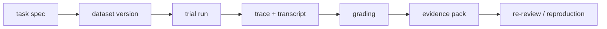

# 09. eval hygiene, dataset versioning, contamination, and evidence packs

> Why this chapter exists: 좋은 grader와 benchmark가 있어도 dataset versioning, contamination guardrails, evidence pack discipline이 없으면 eval은 쉽게 drift하고 과신된다는 점을 고정한다.
> Reader level: advanced / reviewer
> Last verified: 2026-04-06
> Freshness class: volatile
> Reader path tags: `builder` / `reviewer` / `volatile re-check`
> Source tier focus: Tier 1 official eval guidance, Tier 2 Anthropic framing, Tier 6 retained evidence artifacts

## Core claim

eval quality는 grader quality만으로 결정되지 않는다. dataset versioning, task clarity, reference solution, contamination guardrail, trace grading, evidence pack retention이 함께 있어야 reproducible eval이 된다.

## What this chapter is not claiming

- contamination을 완전히 없앨 수 있다는 주장
- dataset만 버전화하면 eval이 자동으로 신뢰할 수 있게 된다는 주장
- human review가 필요 없다는 주장

## Mental model / diagram

이 그림의 핵심은 dataset, trace, grader, evidence pack이 분리된 artifact라는 점이다. 하나라도 빠지면 나중에 "왜 이 score가 나왔는가"를 다시 설명하기 어려워진다.

## 범위와 비범위

이 장이 다루는 것:

- dataset versioning과 task clarity
- contamination과 leakage risk
- trace grading과 transcript grading의 차이
- evidence pack과 reproducibility bundle

이 장이 다루지 않는 것:

- every possible statistical contamination test
- external evaluation platform product tutorial
- labeling operations의 조직 관리 세부

## 자료와 독서 기준

대표 공식 자료:

- Anthropic, [Demystifying evals for AI agents](https://www.anthropic.com/engineering/demystifying-evals-for-ai-agents), verified 2026-04-06
- OpenAI, [Evaluation best practices](https://developers.openai.com/api/docs/guides/evaluation-best-practices), verified 2026-04-06
- OpenAI, [Agent evals](https://developers.openai.com/api/docs/guides/agent-evals), verified 2026-04-06

함께 읽으면 좋은 장:

- [01-model-evals-vs-harness-evals.md](01-model-evals-vs-harness-evals.md)
- [02-tasks-trials-transcripts-and-graders.md](02-tasks-trials-transcripts-and-graders.md)
- [04-production-traces-feedback-loops-and-optimization.md](04-production-traces-feedback-loops-and-optimization.md)
- [08-observability-traces-and-run-artifacts.md](../05-execution-continuity-and-integrations/08-observability-traces-and-run-artifacts.md)
- [../08-reference/07-artifact-taxonomy-and-retention-matrix.md](../08-reference/07-artifact-taxonomy-and-retention-matrix.md)

## task clarity가 먼저다

Anthropic의 evals 글은 task가 애매하면 agent가 아니라 eval이 깨질 수 있다고 설명한다. 특히 task description에 grader가 기대하는 전제가 빠져 있으면 0% score는 agent incapability가 아니라 broken task일 수 있다. 같은 글은 reference solution을 만들어 task와 grader가 실제로 solvable한지 확인하라고 권한다.

이 점이 중요한 이유는 dataset hygiene의 첫 단계가 dataset versioning이 아니라 task clarity이기 때문이다.

## dataset versioning은 재현성의 최소 조건이다

OpenAI agent eval docs는 reproducible evaluations와 datasets를 함께 권한다. 같은 task set을 돌리더라도 dataset version이 바뀌면 score 비교는 의미가 크게 달라진다. 따라서 benchmark 문서에는 최소한 다음이 필요하다.

- dataset identifier
- changed task count
- added/removed scenario type
- grading rule version

버전이 없는 dataset은 memory가 없는 benchmark와 비슷하다.

## contamination은 artifact provenance 문제다

contamination은 단순히 "모델이 이 문제를 봤을지 모른다"에서 끝나지 않는다. 실제 운영에서는 다음이 모두 leakage surface가 된다.

- benchmark prompt가 product prompt에 직접 섞인다
- evaluation transcript가 training-like retrieval corpus에 들어간다
- reference solution이나 threshold가 generator prompt에 노출된다
- post-hoc failure examples가 다음 run prompt에 무심코 편입된다

권고: contamination은 model-only risk가 아니라 harness artifact provenance risk로 적어라.

## trace grading은 transcript grading을 대체하지 않지만 확장한다

OpenAI agent eval docs는 workflow-level error를 찾을 때 trace grading을 권한다. transcript만 보면 보이지 않는 정보가 있기 때문이다.

- 어떤 tool이 호출됐는가
- 어떤 approval wait가 있었는가
- 어떤 branch에서 실패했는가

따라서 eval 문서에는 transcript grading과 trace grading의 경계를 같이 적는 편이 좋다.

## evidence pack은 score를 설명하는 최소 bundle이다

score만 남으면 나중에 할 수 있는 일은 거의 없다. 최소 evidence pack에는 보통 아래가 포함된다.

- task spec
- dataset version
- grader version
- transcript
- trace
- config/policy snapshot
- failure logs or diagnostics

이 bundle이 있어야 disagreement case를 다시 열고, contamination suspicion을 검토하고, grader retirement 여부를 결정할 수 있다.

## Minimum reproducibility bundle

Part 7에서 말하는 reproducibility bundle의 중심은 결국 아래 minimum bundle이다.

- task spec와 dataset identifier
- dataset version과 grader version
- transcript와 trace
- config/policy snapshot
- failure logs, retry context, flaky dependency notes

이 장은 evidence pack을 "있으면 좋은 부록"이 아니라, score와 판단을 다시
열기 위한 load-bearing artifact로 다룬다. [00-front-matter/03-references.md](../00-front-matter/03-references.md)의 evidence-pack practice와 함께 읽으면 maintenance loop가 닫힌다.

## Design implications

- eval 문서에는 dataset version과 grader version을 항상 함께 적어라.
- transcript grading과 trace grading의 쓰임을 분리해서 적어라.
- benchmark score는 evidence pack 없이 단독으로 제시하지 말라.
- contamination guardrail을 model risk가 아니라 artifact provenance risk로 설명하라.

## What to measure

- dataset version drift frequency
- ambiguous task rate
- reference-solution coverage
- trace-graded failure count
- evidence-pack completeness rate

## Failure signatures

- score regression이 났는데 dataset change인지 실제 성능 하락인지 설명할 수 없다.
- task가 애매해 grader와 human reviewer가 서로 다른 전제를 쓴다.
- transcript는 남았지만 trace가 없어 workflow-level failure를 복원하지 못한다.
- contamination suspicion이 생겼는데 어떤 artifact가 섞였는지 추적하지 못한다.

## Review questions

1. task spec와 reference solution이 grading 전제와 맞물려 있는가.
2. dataset version과 grader version이 문서에 남는가.
3. transcript grading과 trace grading의 경계를 설명하는가.
4. evidence pack 없이 score만 남기는 관행을 허용하고 있지 않은가.

## Sources / evidence notes

- Anthropic의 evals 글은 task clarity, reference solution, balanced problem sets를 강조한다.
- OpenAI eval docs는 reproducible evals, datasets, trace grading을 공식적으로 연결한다.
- 이 장의 external verification 축은 [../00-front-matter/03-references.md](../00-front-matter/03-references.md)의 `S7`, `S21`, `S22`, `S23`을 우선 사용한다.
