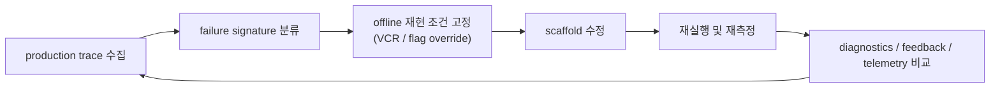

# 04. production trace, feedback loop, optimization

## 장 요약

하네스를 개선하려면 실행 흔적이 남아야 한다. 하지만 production trace는 transcript 한 종류로 끝나지 않는다. Claude Code를 보면 transcript chain, result packet, API logging, OpenTelemetry span, diagnostics summary, explicit user feedback가 서로 다른 층으로 남는다. 이 장은 그 trace stack을 하나의 optimization loop로 읽고, 어떤 흔적이 어떤 개선 행동으로 이어지는지 정리한다.

## 범위와 비범위

이 장이 다루는 것:

- Claude Code가 production trace를 어떤 층으로 남기는지
- trace와 feedback가 harness optimization에 어떻게 연결되는지
- offline control surface와 online production signal을 어떻게 같이 읽어야 하는지

이 장이 다루지 않는 것:

- 조직의 telemetry storage architecture 전부
- privacy/compliance policy의 법적 세부
- product analytics dashboard의 UX 설계

이 장은 [01-model-evals-vs-harness-evals.md](./01-model-evals-vs-harness-evals.md), [02-tasks-trials-transcripts-and-graders.md](./02-tasks-trials-transcripts-and-graders.md), [03-benchmarking-coding-harnesses.md](./03-benchmarking-coding-harnesses.md)를 잇는 synthesis 장이다.

## 자료와 독서 기준

대표 발췌 출처:

- `src/hooks/useLogMessages.ts`
- `src/utils/sessionStorage.ts`
- `src/QueryEngine.ts`
- `src/cost-tracker.ts`
- `src/services/api/logging.ts`
- `src/utils/telemetry/sessionTracing.ts`
- `src/services/diagnosticTracking.ts`
- `src/services/toolUseSummary/toolUseSummaryGenerator.ts`
- `src/screens/REPL.tsx`

외부 프레이밍:

- Anthropic, [Demystifying evals for AI agents](https://www.anthropic.com/engineering/demystifying-evals-for-ai-agents), 2026-01-09
- Anthropic, [Effective harnesses for long-running agents](https://www.anthropic.com/engineering/effective-harnesses-for-long-running-agents), 2025-11-26
- Lee et al., [Meta-Harness: End-to-End Optimization of Model Harnesses](https://arxiv.org/abs/2603.28052), 2026-03-30

함께 읽으면 좋은 장:

- [02-tasks-trials-transcripts-and-graders.md](./02-tasks-trials-transcripts-and-graders.md)
- [05-claude-code-benchmark-framework.md](./05-claude-code-benchmark-framework.md)
- [../16-risks-debt-and-observations.md](../16-risks-debt-and-observations.md)
- [../appendix/references.md](../appendix/references.md)

## Claude Code의 trace stack

| 층 | 대표 구조 | 무엇을 알려 주는가 |
| --- | --- | --- |
| transcript chain | `useLogMessages()`, `recordTranscript()` | 실제 interaction 순서와 recovery evidence |
| run outcome | QueryEngine result packet | turn 수, 비용, denial, stop reason |
| API logging | `src/services/api/logging.ts` | token, cache, duration, query source, permission mode |
| tracing span | `src/utils/telemetry/sessionTracing.ts` | interaction, llm_request, tool, hook 수준 timing |
| diagnostics | `DiagnosticTrackingService` | edit 이후 새로 생긴 문제와 summary |
| human feedback | REPL survey, transcript prompt, issue flow | 사람 입장에서의 만족도와 pain signal |
| summarization layer | tool use summary | run을 빠르게 훑기 위한 label |

이 표는 "trace가 많다"는 사실보다 더 중요하다. 각 층이 다른 질문에 답한다는 점을 보여 주기 때문이다.

- transcript는 무슨 일이 있었는가를 말한다.
- API logging과 tracing span은 얼마나 비싸고 느렸는가를 말한다.
- diagnostics와 feedback는 무엇이 잘못됐는가를 말한다.
- tool summary는 사람이 많은 run을 빠르게 triage할 수 있게 돕는다.

## transcript는 optimization의 원본 증거다

`useLogMessages()`는 conversation 배열을 incremental하게 transcript chain으로 옮긴다. 이 설계는 UI 편의를 넘어서, 장기 세션에서도 trace write cost를 통제하면서 evaluation evidence를 보존하려는 선택이다.

```ts
// messages is append-only between compactions, so track where we left off
// and only pass the new tail to recordTranscript.
void recordTranscript(
  slice,
  ...,
  parentHint,
  messages,
)
```

이 transcript가 중요한 이유는 production issue를 나중에 재구성할 수 있기 때문이다. compaction, rewind, resume, tombstone이 모두 transcript chain에 반영되므로, trace는 단순 debug print보다 훨씬 풍부한 구조가 된다.

## run outcome과 API logging이 economics를 붙인다

QueryEngine result packet은 whole-run outcome을 남기고, API logging은 request-attempt 단위 economics를 붙인다.

```ts
yield {
  type: 'result',
  subtype: 'success',
  duration_ms: Date.now() - startTime,
  total_cost_usd: getTotalCost(),
  usage: this.totalUsage,
  permission_denials: this.permissionDenials,
  ...
}
```

```ts
{
  inputTokens: usage.input_tokens,
  outputTokens: usage.output_tokens,
  cachedInputTokens: usage.cache_read_input_tokens ?? 0,
  uncachedInputTokens: usage.cache_creation_input_tokens ?? 0,
  durationMs,
  costUSD,
  querySource,
  permissionMode,
  ...
}
```

이 두 층을 합치면 optimization 질문이 훨씬 구체적이 된다.

- prompt change가 총 turn 수를 줄였는가
- cache hit 구조가 cost를 낮췄는가
- permission friction 때문에 time-to-completion이 늘었는가

cost와 usage가 따로 남지 않으면 이런 질문은 전부 추정에 머문다.

## tracing span은 "어디서 느려졌는가"를 분해한다

`src/utils/telemetry/sessionTracing.ts`는 OpenTelemetry 기반의 root interaction span과 하위 operation span을 관리한다.

```ts
/**
 * Each user interaction creates a root interaction span,
 * which contains operation spans (LLM requests, tool calls, etc.).
 */
```

`SpanType`는 최소한 `interaction`, `llm_request`, `tool`, `tool.blocked_on_user`, `tool.execution`, `hook`으로 나뉜다. 이 구조는 optimization loop에 중요한 분해능을 제공한다.

- 느린 run이 모델 때문인지 tool 때문인지
- hook이 병목인지 blocked-on-user가 병목인지
- interaction-level latency와 request-level latency가 어떻게 다른지

즉 tracing span은 transcript가 주지 못하는 timing topology를 준다.

## diagnostics와 human feedback는 "왜 불편했는가"를 붙인다

`DiagnosticTrackingService`는 query 시작 시 IDE client를 찾아 baseline을 잡고, 이후 diagnostic delta를 요약 문자열로 만든다.

```ts
async handleQueryStart(clients: MCPServerConnection[]): Promise<void> {
  if (!this.initialized) {
    const connectedIdeClient = getConnectedIdeClient(clients)
    if (connectedIdeClient) {
      this.initialize(connectedIdeClient)
    }
  } else {
    this.reset()
  }
}
```

REPL은 explicit feedback surface도 갖는다.

```ts
const feedbackSurveyOriginal = useFeedbackSurvey(messages, isLoading, submitCount, 'session', hasActivePrompt)
const postCompactSurvey = usePostCompactSurvey(messages, isLoading, hasActivePrompt, ...)
const memorySurvey = useMemorySurvey(messages, isLoading, hasActivePrompt, ...)
```

이 조합은 중요하다. diagnostics만 보면 syntactic correctness는 보이지만 UX pain은 안 보이고, feedback만 보면 감정은 보이지만 structural cause는 안 보인다. 둘을 함께 봐야 scaffold change가 실제로 무엇을 개선했는지 설명할 수 있다.

## tool summary와 prompt suggestion은 triage 속도를 높인다

모든 production trace를 사람이 처음부터 끝까지 읽는 것은 비효율적이다. `src/services/toolUseSummary/toolUseSummaryGenerator.ts`는 tool batch를 짧은 label로 요약하고, prompt suggestion은 세션 안에서 개선 후보를 다시 노출한다.

```ts
const TOOL_USE_SUMMARY_SYSTEM_PROMPT = `Write a short summary label describing what these tool calls accomplished...`
```

이런 압축층은 grading의 대체물이 아니지만, 대량의 run을 triage할 때 매우 중요하다. publication-grade benchmark 설명에서는 이런 secondary labeler를 "판정기"와 혼동하지 않으면서도, human review throughput을 높이는 surface로 분리해 적어야 한다.

## optimization loop는 offline control과 online signal을 모두 가져야 한다



offline control이 없으면 같은 현상을 재현하기 어렵고, online signal이 없으면 실제 사용자 pain이 줄었는지 알 수 없다. 좋은 optimization loop는 둘 중 하나를 버리지 않는다.

## 관찰, 원칙, 해석, 권고

관찰:

- Claude Code는 transcript, economics, spans, diagnostics, feedback를 서로 다른 층으로 남긴다.
- trace는 단순 로그가 아니라 recovery와 optimization을 위한 structured artifact다.
- feedback surface는 compact/memory/session 전체에 걸쳐 분리되어 있다.

원칙:

- trace stack은 한 층으로 충분하지 않다.
- offline reproducibility control과 online production signal을 함께 가져야 optimization이 안정된다.
- diagnostics와 human feedback는 서로 대체 관계가 아니라 보완 관계다.

해석:

- Anthropic의 eval framing은 Claude Code에서 transcript-first artifact와 span/economics layer가 결합된 optimization loop로 읽힌다.
- Meta-Harness의 "harness 자체 최적화"는 바로 이런 trace stack 없이는 수행하기 어렵다.

권고:

- 새 harness를 만들 때 transcript, outcome, timing, economics, feedback 중 세 층 이상을 동시에 설계하라.
- production trace를 모은 뒤에는 반드시 offline control surface도 함께 마련해 재현 가능성을 확보하라.
- run triage용 summary label과 최종 grading rule을 별도 층으로 문서화하라.

## benchmark 질문

1. 이 시스템은 transcript 밖의 trace 층을 충분히 남기는가.
2. 어디서 느려졌는지와 왜 불편했는지를 다른 signal로 분리해 볼 수 있는가.
3. production trace에서 본 현상을 offline에서 재현할 control surface가 있는가.
4. feedback와 diagnostics를 같은 optimization loop 안에서 읽을 수 있는가.

## 요약

production trace는 운영 로그가 아니라 harness optimization의 재료다. Claude Code는 transcript, result packet, API logging, spans, diagnostics, surveys, summary label을 통해 multi-layer trace stack을 만든다. 이 stack이 있어야 개선이 감이 아니라 evidence에 의해 움직인다.

## 대표 근거 읽기 순서

아래 라벨은 독자가 별도 source를 열어야 한다는 뜻이 아니라, 이 장에서 이미 인용하고 설명한 코드 발췌가 어떤 구현 단면을 대표하는지 다시 묶어 주는 provenance 메모다.

1. `src/hooks/useLogMessages.ts`
   transcript의 incremental persistence를 본다.
2. `src/QueryEngine.ts`
   run outcome packet을 확인한다.
3. `src/services/api/logging.ts`
   request-level economics를 본다.
4. `src/utils/telemetry/sessionTracing.ts`
   interaction/tool/hook span 구조를 확인한다.
5. `src/services/diagnosticTracking.ts`
   diagnostics feedback loop를 본다.
6. `src/screens/REPL.tsx`
   explicit human feedback surface를 확인한다.
7. `src/services/toolUseSummary/toolUseSummaryGenerator.ts`
   triage용 summary layer를 본다.
